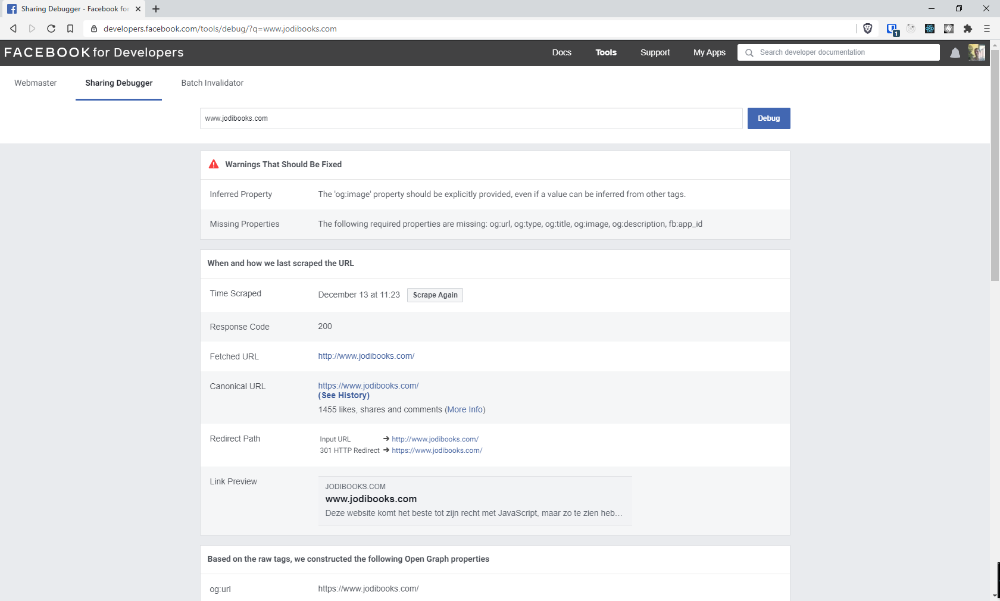
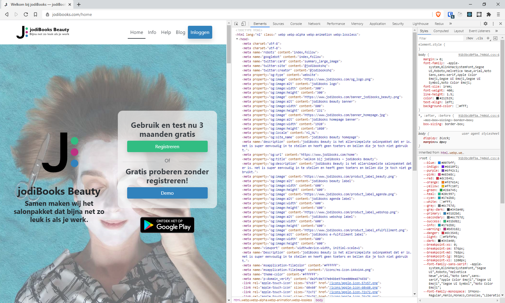
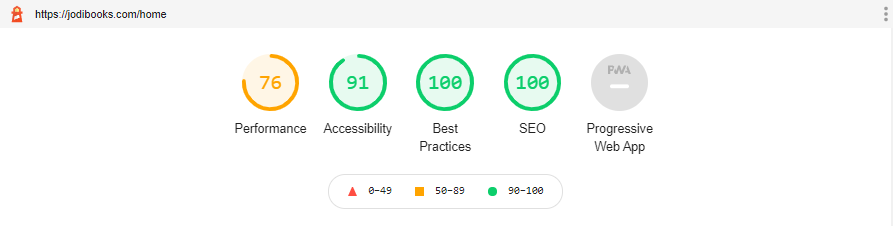
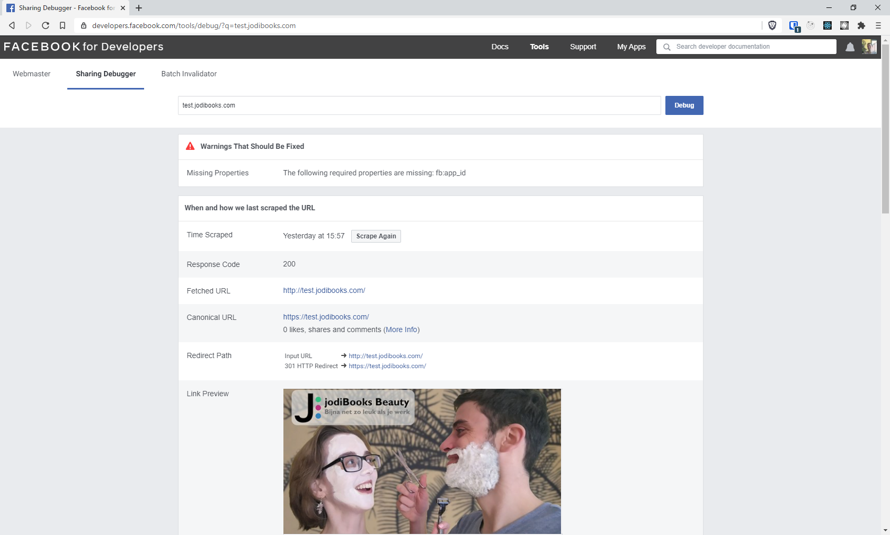
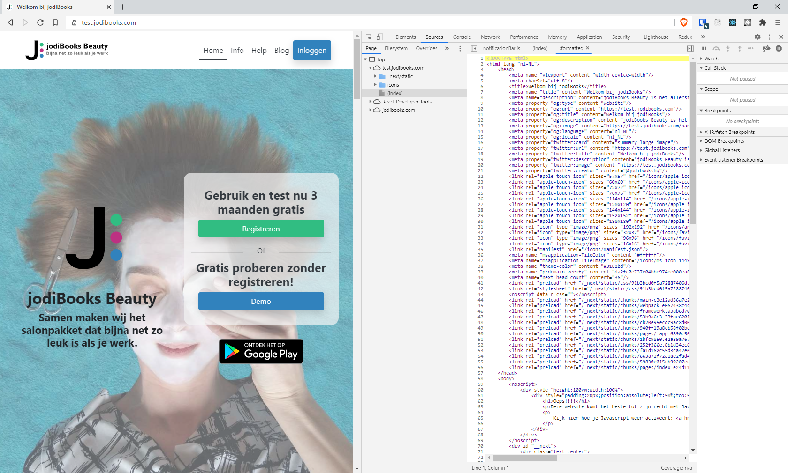

## What is SEO

When making a website, be it a homepage, portfolio or blog, you want to make sure search engines can find you and understand what your website is about. There are several things you can do to improve your visibility on the internet. First you add a [sitemap](https://en.wikipedia.org/wiki/Sitemaps) and [robots file](https://en.wikipedia.org/wiki/Robots_exclusion_standard) to make it easier for a search robot (crawler) to interpret your site. Second you make sure every page (and blogpost) can be easily and nicely shared on social media. You can go much farther, but this is the basis of SEO or [search engine optimization](https://en.wikipedia.org/wiki/Search_engine_optimization).

If you use a framework to build your site, chances are there already is a plugin (or manual) to make SEO a breeze. For WordPress there is the amazing [Yoast plugin](https://wordpress.org/plugins/wordpress-seo/). Also check out [their blog](https://yoast.com/seo-blog/) if you want to learn more about SEO.

In Gatsby you can use `react-seo-component` combined with `react-helmet`. The `<SEO>` component will do all the work for you, just like the Yoast plugin on WordPress and it will use `react-helmet` to place all the necessary tags in the `<head>` of the html of your page. That's the method I use on this website and my [blog](https://blog.joeplaa.com).

If you prefer Next.js over Gatsby.js, the default option would be to use the `next-seo` plugin. But you can also use the "Gatsby" method explained with above (and the other way around: `gatsby-plugin-next-seo`).

## The problem

I made the [jodiBooks homepage](https://jodibooks.com) with Next.js and the `next-seo` plugin. I hadn't actually checked it for a while, but when I wanted to share our update homepage with our new brand images, Facebook wouldn't fetch an image. The first thing you do when that happens, is open the [Facebook Sharing Debugger](https://developers.facebook.com/tools/debug) and debug the link you want to share. It told me that "The 'og:image' property should be explicitly provided, even if a value can be inferred from other tags." and "The following required properties are missing: og:url, og:type, og:title, og:image, og:description, fb:app_id".



That was strange. During development all the meta tags are visible. Also when I checked in my browsers debug tab, all of the "missing" Open Graph (og) data were there on the deployed website.



It got stranger when I looked at what data Facebook actually received. When you scroll down on the Debugger page, there are a few links and when I opened the (raw) Scraped URL data no `og:*` tags where there. Actually almost nothing that I added was there. You can also check this in the "Sources" tab of your browsers' debug screen. Click the html page file which is `(index)` in my case.

```html
<!DOCTYPE html>
<html lang="nl">
<head>
<meta http-equiv="content-type" content="text/html; charset=utf-8">
<meta charset="utf-8">
<meta charset="utf-8">
<meta name="viewport" content="width=device-width">
<meta name="next-head-count" content="2">
<link rel="preload" href="/_next/static/css/91b3bcd0f5a72887406d.css" as="style">
<link rel="stylesheet" href="/_next/static/css/91b3bcd0f5a72887406d.css" data-n-g="">
<link rel="preload" href="/_next/static/chunks/main-f136237cd5b8e1160309.js" as="script">
<link rel="preload" href="/_next/static/chunks/webpack-e067438c4cf4ef2ef178.js" as="script">
<link rel="preload" href="/_next/static/chunks/framework.a3ab6d70963b928e4674.js" as="script">
<link rel="preload" href="/_next/static/chunks/53b9a6c3.bc7564fa166f0d34b14f.js" as="script">
<link rel="preload" href="/_next/static/chunks/a055dceba6dd92f1e8db820d053953d2aa73d170.63a414e8d63f6574af5b.js" as="script">
<link rel="preload" href="/_next/static/chunks/6ed52eac8bc958cb539988e59e65407ea0a6437c.788571202d4b0788822e.js" as="script">
<link rel="preload" href="/_next/static/chunks/6c4a610fc633afe0c25adb91daf4da1258d255ef.99a665712989ebf55548.js" as="script">
<link rel="preload" href="/_next/static/chunks/283b1a7e8d78cb1c370da0dbd1a33d77726cc8f3.714d7eecb4e7800d462f.js" as="script">
<link rel="preload" href="/_next/static/chunks/pages/_app-53117c775269a9953ab9.js" as="script">
<link rel="preload" href="/_next/static/chunks/pages/index-eed5f1232a6f1d994b66.js" as="script">
</head>
<body>
<noscript data-n-css=""></noscript>
<noscript><div style="height:100vw;width:100%"><div style="padding:20px;position:absolute;left:50%;top:50%;transform:translate(-50%, -50%)">
<h1>Oeps!!!!</h1>
<p>Deze website komt het beste tot zijn recht met JavaScript, maar zo te zien heb je JavaScript gedeactiveerd in je browser.</p>
<p>Kijk hier hoe je Javascript weer activeert: <a href="https://www.enable-javascript.com/nl/">Hoe activeer ik Javascript in mijn web browser?</a></p>
</div></div></noscript>
<div id="__next"><div class="text-center"><div role="status" class="spinner-border text-dark"><span class="sr-only">Loading...</span></div></div></div>
<script id="__NEXT_DATA__" type="application/json">{"props":{"pageProps":{}},"page":"/","query":{},"buildId":"aZ83JaFeGRK8Q2aaJPdmd","nextExport":true,"autoExport":true,"isFallback":false}</script><script nomodule="" src="/_next/static/chunks/polyfills-e69cc13a7e89296a69e4.js"></script><script src="/_next/static/chunks/main-f136237cd5b8e1160309.js" async=""></script><script src="/_next/static/chunks/webpack-e067438c4cf4ef2ef178.js" async=""></script><script src="/_next/static/chunks/framework.a3ab6d70963b928e4674.js" async=""></script><script src="/_next/static/chunks/53b9a6c3.bc7564fa166f0d34b14f.js" async=""></script><script src="/_next/static/chunks/a055dceba6dd92f1e8db820d053953d2aa73d170.63a414e8d63f6574af5b.js" async=""></script><script src="/_next/static/chunks/6ed52eac8bc958cb539988e59e65407ea0a6437c.788571202d4b0788822e.js" async=""></script><script src="/_next/static/chunks/6c4a610fc633afe0c25adb91daf4da1258d255ef.99a665712989ebf55548.js" async=""></script><script src="/_next/static/chunks/283b1a7e8d78cb1c370da0dbd1a33d77726cc8f3.714d7eecb4e7800d462f.js" async=""></script><script src="/_next/static/chunks/pages/_app-53117c775269a9953ab9.js" async=""></script><script src="/_next/static/chunks/pages/index-eed5f1232a6f1d994b66.js" async=""></script><script src="/_next/static/aZ83JaFeGRK8Q2aaJPdmd/_buildManifest.js" async=""></script><script src="/_next/static/aZ83JaFeGRK8Q2aaJPdmd/_ssgManifest.js" async=""></script>
</body>
</html>
```

## The cause

I first thought it might be the `next-seo` plugin, so I switched to the "Gatsby" method, but that didn't work either. I tried to use the plugin components on multiple pages, in my `layout` component and Nexts' custom `Document` (`_document`), but it still didn't work. I couldn't figure it out, but luckily I live with a [trained software engineer](https://telodelic.com) who helped me find the core issue.

Apparently Next.js uses JavaScript to render all the meta information. So the plain HTML file that Facebook fetches does not contain the data it needs. I'm not sure if this is a new "feature" or "bug" in Next, but I hadn't noticed it before and I did upgrade to v10. Well, I knew Gatsby.js does pre-render all this data and places it in the head of your HTML directly, so it should be possible.

:::tip
Google's crawler is more sophisticated and can interpret JavaScript. So when testing you site with Google Lighthouse, you get a perfect SEO score.


:::

## The solution

Next.js "expose\[s\] a built-in component for appending elements to the head of the page": [`next/head`](https://nextjs.org/docs/api-reference/). Everything you want to appear in the `<head>` of the HTML page, you put as children in the component. Again, I don't know if it's a "feature" or "bug", but still all my meta data was rendered through JavaScript.

After some hours of piddling, Google'ing and cursing, I found this issue: <https://github.com/vercel/next.js/issues/9154>. Although it didn't provide a definitive answer, this comment _"I could make it work on dev and production when I removed a component that was as wrapper in the _app.js, when I removed it all started to work fine, thank for all the help"_ did made me have a new thought. Instead of using `next/head` in the page or component, let's use it all the way up (or down) as the first thing Next renders. So I added it inside `_app.js` outside of my `redux-persist` wrapper, like this:

```javascript
import React from 'react';
import PropTypes from 'prop-types';
import { useStore } from 'react-redux';
import { PersistGate } from 'redux-persist/integration/react';
import { wrapper } from '../src/store/store';
import SpinnerComp from '../src/components/spinnerComp';
import '../src/styles/site.scss';
import Head from 'next/head';

function MyApp ({ Component, pageProps }) {
    const store = useStore((state) => state);
    return (
        <>
            <Head>
                {/* Open Graph / Facebook */}
                <meta property="og:type" content="website" />
                <meta property="og:url" content={settings.SEO.siteURL} />
                <meta property="og:title" content={settings.SEO.siteTitle} />
                <meta property="og:description" content={settings.SEO.siteDescription} />
                <meta property="og:image" content={`${settings.SEO.siteURL}${settings.SEO.siteImage}`} />
                <meta property="og:language" content={settings.SEO.siteLanguange} />
                <meta property="og:locale" content={settings.SEO.siteLocale} />
            </Head>
            <PersistGate persistor={store.__persistor} loading={<SpinnerComp />}>
                <Component {...pageProps} />
            </PersistGate>
        </>
    );
}

export default wrapper.withRedux(MyApp);

MyApp.propTypes = {
    Component: PropTypes.func,
    pageProps: PropTypes.any
};
```

Low and behold, it works!



When we now look at the (raw) scraped URL data in the Facebook debugger we can see it receives all the OpenGraph tags it wants. Again you can also check this in the "Sources" tab of your browsers' debug screen. Click the html page file which is `(index)` in my case.



## Conlusion

With that the issue is fixed for now. We can share our page in Facebook with a description and image. I do still have some questions:

1. Which of the meta data needs to be added in plain HTML and which can be added through JavaScript?
2. Why does the `next/head` component work in `_app.js` and not in a component? Can we put it deeper into the app? How deep?
3. Is this a feature, works as designed, or is it a bug? Will it still work like this in the next Next version?

Hopefully I can share those answers in a future article.

:::note Sources
* <https://scottspence.com/2020/05/04/react-seo-component/>
* <https://www.gatsbyjs.com/docs/add-seo-component/>
* <https://www.gatsbyjs.com/docs/how-to/adding-common-features/seo/>
:::