## Introduction

What [started as a project](https://blog.joeplaa.com/building-a-proxmox-cluster/) to run "some crypto applications" grew into something much bigger, but also more useful. I learned a tremendous amount about virtual machines, lxc containers and Proxmox. And although I'm just scratching the surface and I don't actually understand it, I know how to do some things. I'll write them down here, partly for myself, but also for you in hopes it will save one of us a lot of time and frustration.

## Configuration

Proxmox has a lot of configuration options. Obviously many of them are dependent on what you want to achieve. In [How to install and configure Proxmox](/how-to-install-and-configure-proxmox) I described the most basic configuration options. Here I'll list some more specific ones.

* [Users, groups](#add-users-and-groups)
* [Basic security](#basic-security)
    * [Two factor authentication](#two-factor-authentication)
* [Storage](#storage)
    * [(Re)naming storage](#renaming-storage)
    * [NFS storage](#nfs-storage)
    * [iSCSI storage](#iscsi-storage)
* [Backups](#backups)
    * [Rsync cronjob](#rsync-cronjob)

<Alert type='warning'>
    Proxmox config is very delicate. Almost all settings can be configured through the GUI, but sometimes you might have to dig into config files with the CLI. <strong>ALWAYS make a backup before doing so!</strong> I learned the hard way that messing up only one file (especially related to the cluster) can mean a full reinstall of that cluster!
</Alert>

## Add users and groups

1. Go to "Datacenter" -> "Permissions" -> "Groups" and create group `Admins`

    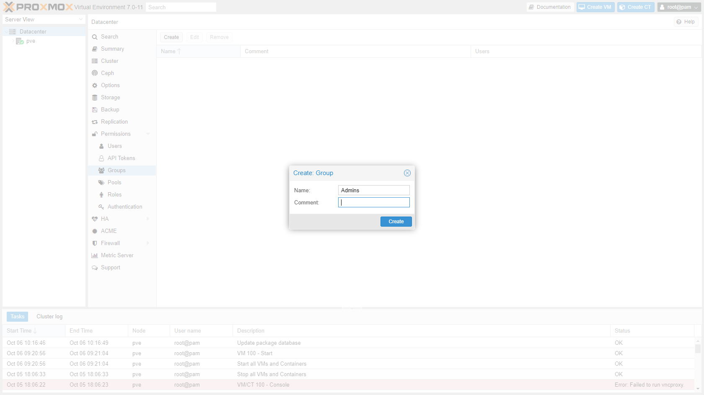

2. Go to "Datacenter" -> "Permissions" -> "Users" and create user.

    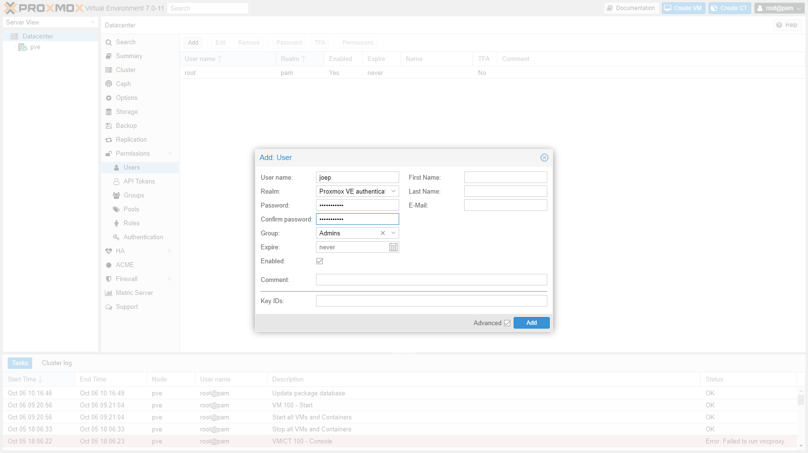

3. Go to "Datacenter" -> "Permissions" click Add -> Group Permissions.

    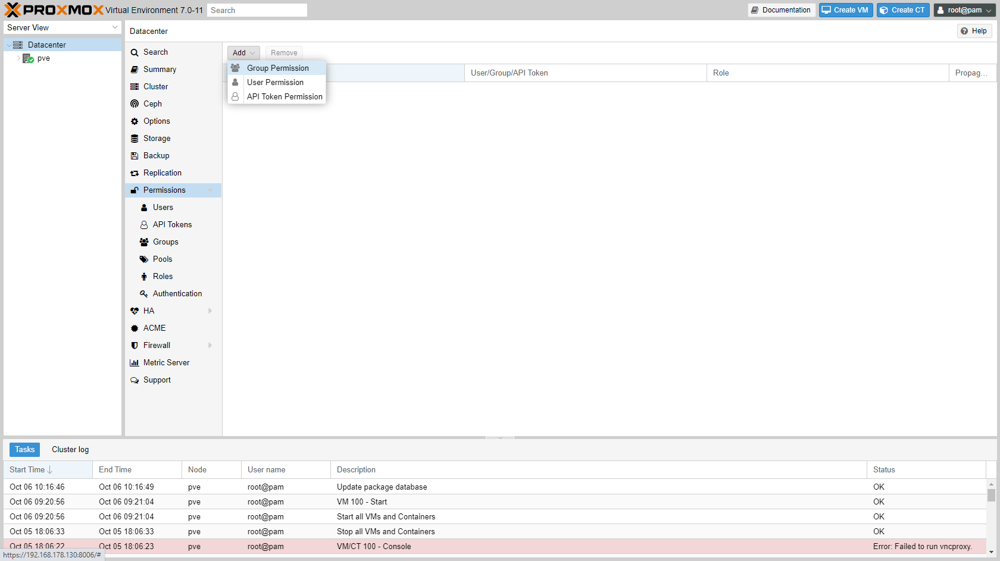

3. Enter Path `\`, Group `Admins` and Role `Administrator`.

    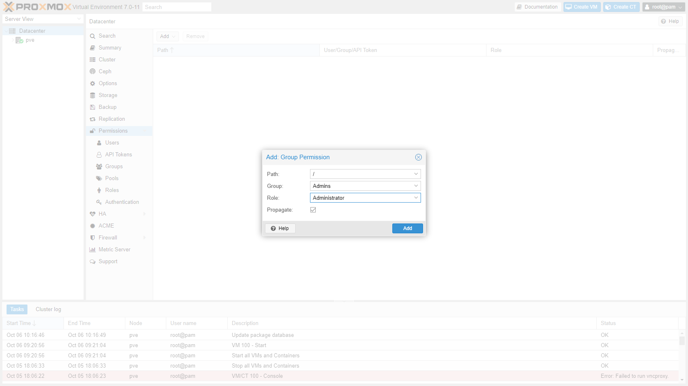

4. Open a private browser window and login with your newly created user. Check if you have sufficient permissions (everything should be visible). Logout and close the private browser.

5. Optional: In your "normal" browser screen logout the root user and login with your own user name. Go to "Datacenter" -> "Permissions" -> "Users" and disable the root user. 

    This is optional, because some tasks can only be done by the root user. Although this is safer, you have to re-enable the root user each time you need to do one of these restricted/root tasks. I would suggest you disable the root user when you're confident everything is running smoothly.

## Basic security

### Two Factor Authentication

1. Go to "Datacenter" -> "Permissions" -> "Users", select the root user and click "TFA". Scan the QR code with your authenticator app.

    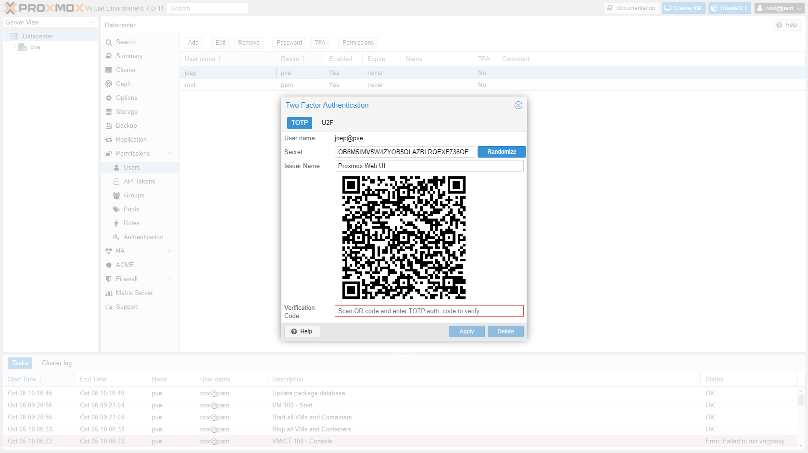

2. Repeat for all users, obviously with their own authenticator.
3. Go to "Datacenter" -> "Permissions" -> "Authentication" and enable TFA for both Realms.

    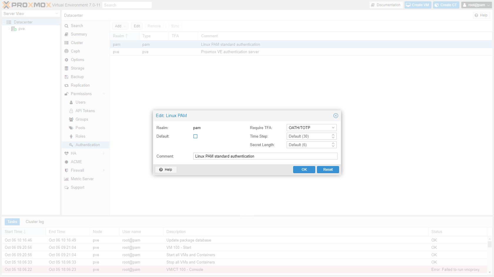

### Private key console login

1. Open a shell to the master node.

    * Get the private key:

        ```shell
        cat ~/.ssh/authorized_keys
        ```

    * Copy the key to your machine: `C:\users\<username>\.ssh\<hostname>`, without file extension.
    * Open this file with PuTTYgen and save as `C:\users\<username>\.ssh\<hostname>.ppk`. The key can now be used with PuTTY.
    * Store this key somewhere safe.

2. Disable user-password login (this needs to be done on each machine):

    * Open sshd_config:

        ```shell
        nano /etc/ssh/sshd_config
        ```

    * Find and edit lines below:

        ```ini
        [...]
        PasswordAuthentication no
        [...]
        UsePAM no
        [...]
        ```

    * Restart ssh service

        ```shell
        systemctl restart ssh
        ```

## Storage

### (Re)naming storage

The default file storage location in Proxmox is called `local`. VM storage is called `local-zfs` when using ZFS or `local-lvm` when using LVM. This is fine if you have a single node, but becomes confusing when multiple nodes in a cluster have storage that has the same name. Therefor I renamed it.

1. Open a shell to the Proxmox node.
2. Open file `/etc/pve/storage.cfg` and change the names. You cannot rename `local`!!! To change, create a new directory storage and disable `local`.

    ```shell
    nano /etc/pve/storage.cfg
    ```

    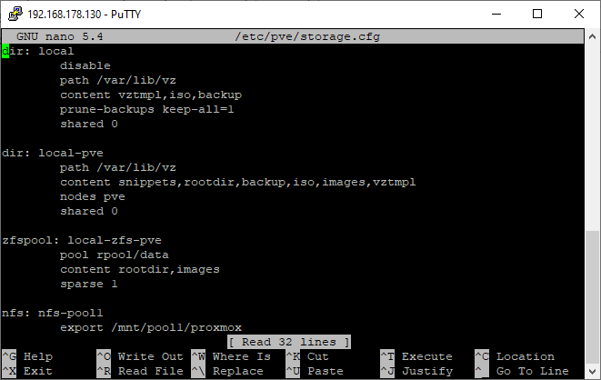

3. If you already have VM's that use this storage (links to ISO on `local` and virtual disk on `local-zfs`) you have to change them manually.

    ```shell
    nano /etc/pve/qemu-server/<vmid>.conf
    ```

    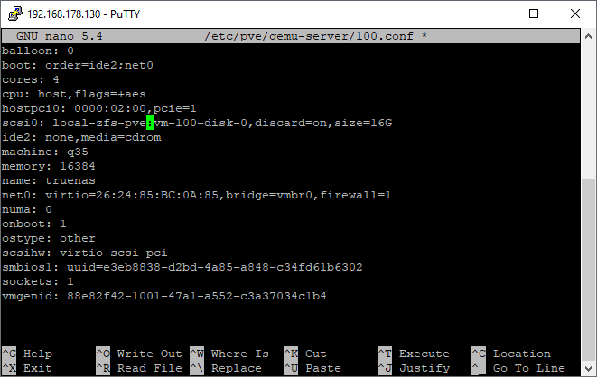

### NFS storage

If you have a NAS than it's almost a must to store VM backups on it. After enabling NFS on the NAS ([TrueNas example](/how-to-do-basic-truenas-configuration/#configure-nfs-sharing)), you can add the share in Proxmox.

1. Go to "Datacenter" -> "Storage" and add NFS storage.

    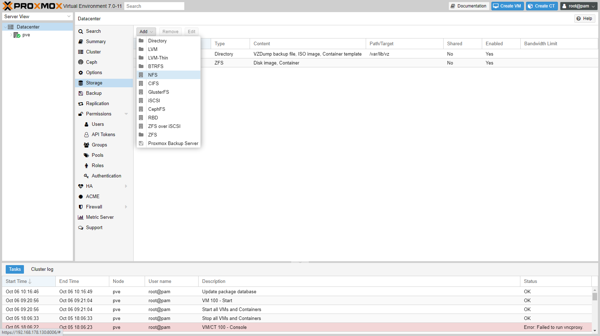

2. Enter details of storage:
    * ID: `nfs-<poolname>`
    * Server: `<ip address of NAS>`
    * Export: `/mnt/pool1/proxmox` (this list will show automatically after you enter the server address is entered)
    * Content: `ISO image, Container template, VZDump backup file, Snippets`

    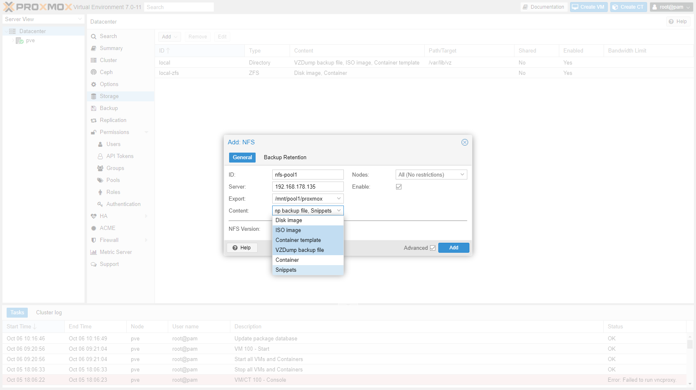

3. The NFS store/pool is now available to Proxmox.

    

### iSCSI storage

After creating an iSCSI target on your NAS/SAN ([TrueNas example](/how-to-do-basic-truenas-configuration/#configure-an-iscsi-disk)), you can add the target in Proxmox.

1. Go to "Datacenter" -> "Storage" and add iSCSI storage.

    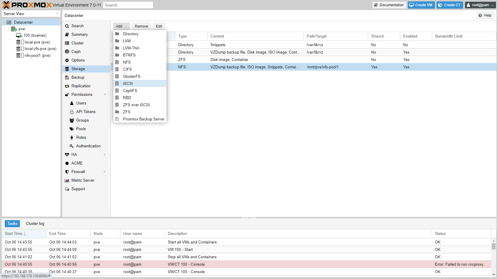

2. Enter details of iSCSI target:
    * ID: `iscsi-<poolname>`
    * Portal: `<ip address of NAS>:3260`
    * Target: `iqn.2005-10.org.freenas.ctl:iscsi-pve1` (this list will show automatically after you enter the server address is entered)
    * Uncheck "Use LUNs directly"

    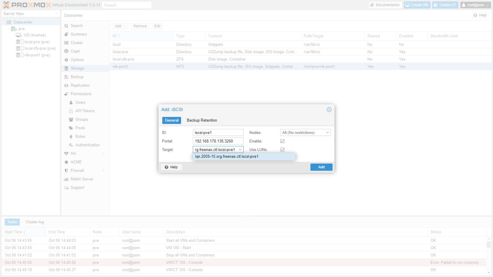

3. The iSCSI target is now available to Proxmox. Click "Add" and choose "LVM".

    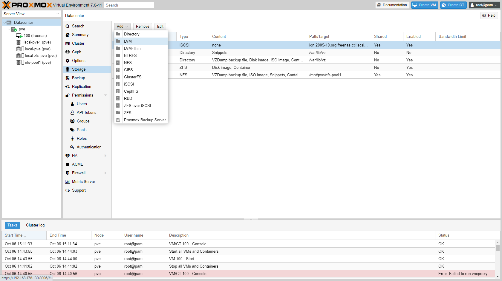

4. Enter details of LVM storage:
    * ID: `iscsi-<poolname>-lvm`
    * Base storage: `<poolname> (iSCSI)`
    * Base volume: `CH 00 ID 0 LUN 0` (in my case)
    * Volume group: `iscsi-<poolname>-lvm`
    * Content: `Disk image, container`

    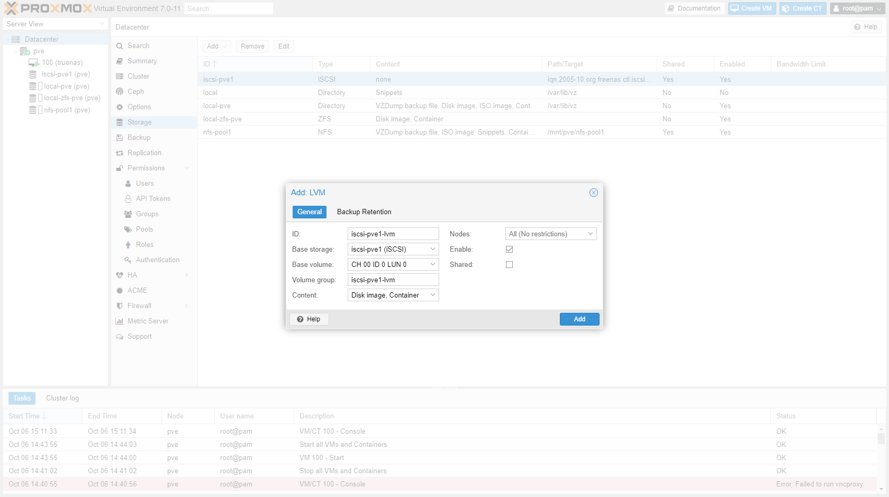

5. You can now add a VM or LXC disk on iSCSI.

    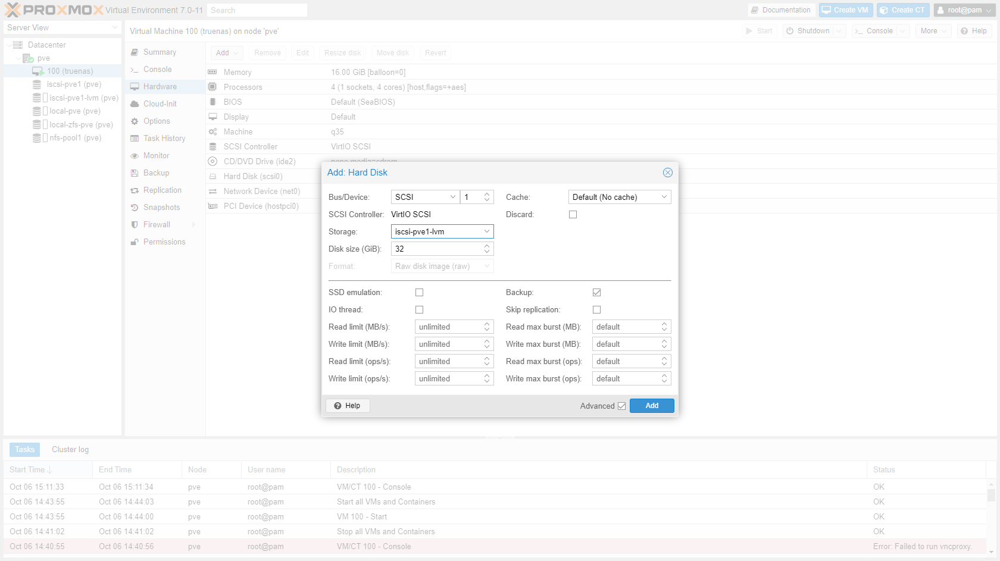

## Backups

1. Go to "Datacenter" -> "Backup" and add a weekly backup job

    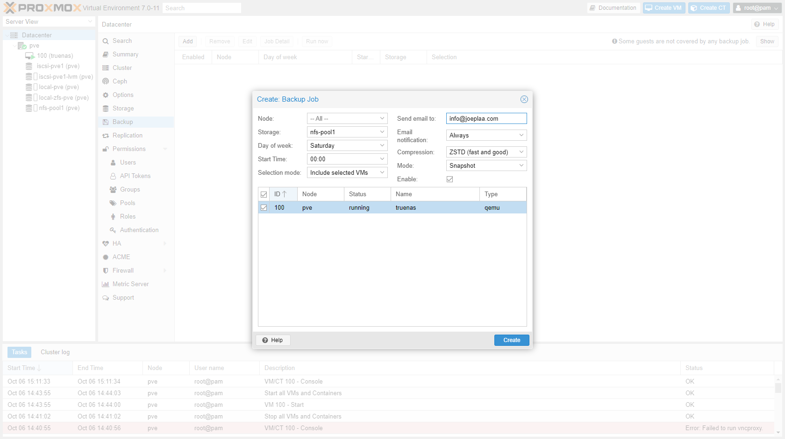

2. If you want to make a backup of TrueNas than you can't store it on a TrueNas network drive. So you have to create a separate backup job for the TrueNas VM that store the backup locally.

    

### Rsync cronjob

This local backup can then be transfered to either another node in the cluster or to the NAS. This can be automated with an rsync cronjob.

1. Open a shell session to the Proxmox node.
2. Open crontab:

    ```shell
    crontab -e
    ```

3. Add lines:

    ```ini
    # Every saturday at 0:25 UTC: Copy local backup of TrueNas machine to NAS
    25 0 * * 6 rsync -avh /var/lib/vz/dump/vzdump-qemu-100* root@192.168.178.135:/mnt/pve/nfs-pool1/dump
    ```

    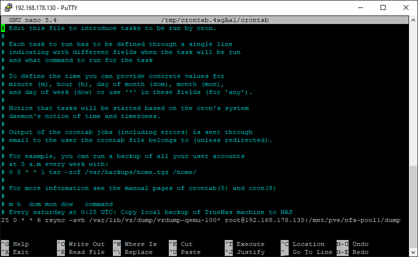

***

<Alert type='info'>
    <h3 class='mt-1'>Sources:</h3>

* <https://technologyplusblog.com/2013/networking/setting-up-automatic-remote-backups-with-rsync/>

</Alert>