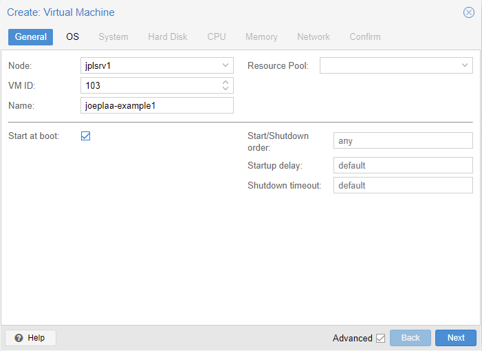
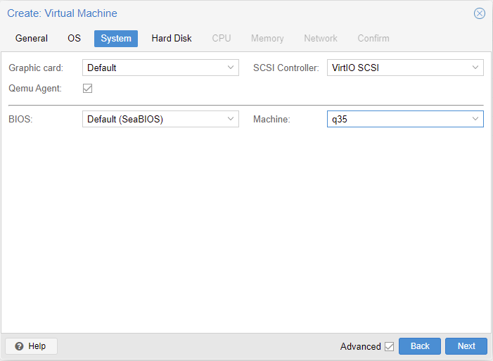
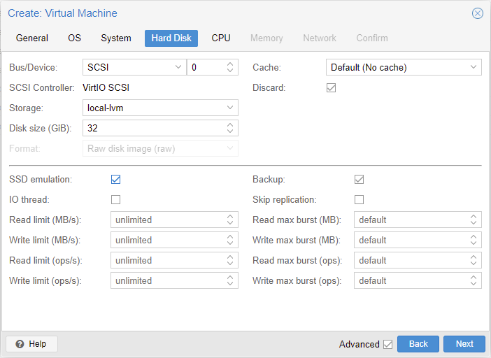
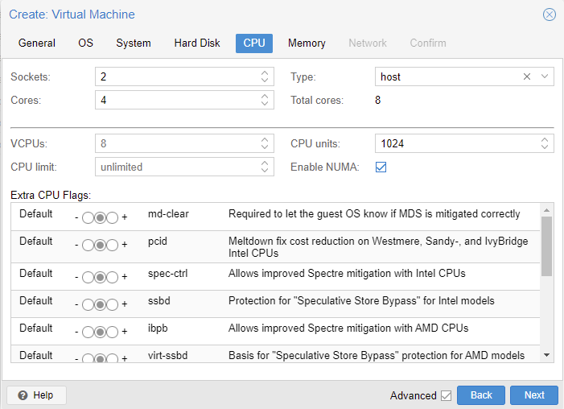
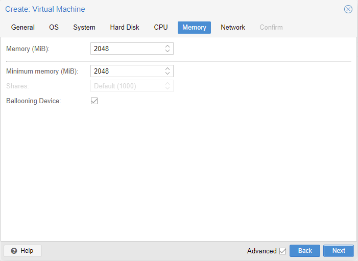
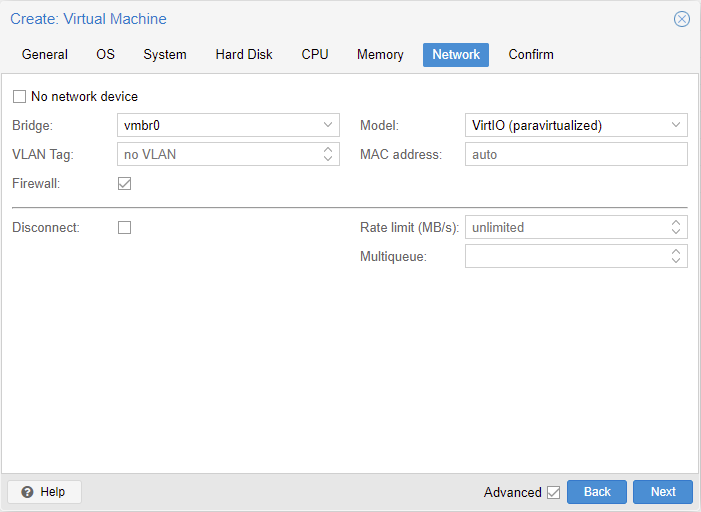
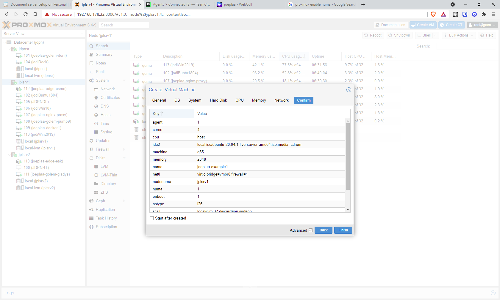

## Introduction

What [started as a project](https://blog.joeplaa.com/building-a-proxmox-cluster/) to run "some crypto applications" grew into something much bigger, but also more useful. I learned a tremendous amount about virtual machines, lxc containers and Proxmox. And although I'm just scratching the surface and I don't actually understand it, I know how to do some things. I'll write them down here, partly for myself, but also for you in hopes it will save one of us a lot of time and frustration.

## Qemu guests

Qemu guest are full virtual machines. You have to (can) specify a lot of details about the hardware and the OS will run as if it is a full machine.

### Create a guest

When creating a guest (VM) some basic settings are:

1. Select "Start at boot" and set "Start/Shutdown order"

    

2. Set the correct "Guest OS". Proxmox will select the best defaults and lower level settings. Especially important when installing a Windows guest.

    

3. Select "Qemu Agent" and set "Machine" to `q35`. (setting "Graphic card" to `VirtIO-GPU` might solve some graphics related issues)

    

4. Select "Discard" and "SSD emulation" and set a proper "Disk size". The discard option will free up disk space on the host when files are deleted in the guest.

    

5. First set the number of "Sockets", "Cores" and "VCPUs". The number of vCPU's = Sockets x Cores. Only use multiple sockets if the host has multiple too. Set "Type" to `host`. Lastly select "Enable NUMA" if the host machine has multiple sockets.

    

6. Set the amount of RAM. Use a ballooning device if you know the machine doesn't always use all of the RAM.

    

7. Select the network bridge that should be used by the guest

    

8. Confirm and finish

    

### Guest client

First thing to after installing a guest OS is installing the Qemu guest client to allow Proxmox to properly shutdown, snapshot and control the guest. It also gives you the guests network address in the Proxmox web interface.

1. Windows
    * Upload `virtio-win-0.1.185.iso` to local storage on the host. Download: <https://pve.proxmox.com/wiki/Qemu-guest-agent>
    * Attach the ISO to your windows VM
    * In Windows open explorer and install:
        * `virtio-win-gt-x64.msi`
        * `virtio-win-guest-tools.exe`
    * Reboot guest

2. Linux
    * Install agent

        ```shell
        sudo apt update
        sudo apt install qemu-guest-agent
        ```

    * Reboot guest

### Resizing Qemu disk (ZFS)

1. Prepare your VM disk for shrinking (defrag, clean files, shrink file system) and shut it down
2. Open a shell to the Proxmox node and set the new zfs pool size

    ```shell
    zfs set volsize=<new size>G rpool/data/vm-<vm id>-disk-<disk number>
    ```

3. Open vm config

    ```shell
    nano /etc/pve/local/qemu-server/<vm id>.conf
    ```

    ```ini
    scsi0: local-zfs:vm-<vm id>-disk-<disk number>,size=<new size>G
    ```

4. Back in the Proxmox GUI change the cache mode to something else and then revert back, this should update the config

    

## LXC containers

LXC containers are light-weight alternatives to Qemu guests. They can be used to run a single application for example. See ... and ... and ... for examples.

### Resizing LXC disk

1. Open a shell session to the host.

2. List the containers:

    ```shell
    pct list
    ```

3. Stop the particular container you want to resize:

    ```shell
    pct stop 999
    ```

4. Find out it's path on the node:

    ```shell
    lvdisplay | grep "LV Path\|LV Size"
    ```

5. For good measure one can run a file system check:

    ```shell
    e2fsck -fy /dev/pve/vm-999-disk-0
    ```

6. Resize the file system:

    ```shell
    resize2fs /dev/pve/vm-999-disk-0 10G
    ```

7. Resize the local volume

    ```shell
    lvreduce -L 10G /dev/pve/vm-999-disk-0
    ```

8. Edit the container's conf, look for the rootfs line and change accordingly:

    ```shell
    nano /etc/pve/lxc/999.conf
    ```

    ```ini
    rootfs: local-lvm:vm-999-disk-0,size=32G >> rootfs: local-lvm:vm-999-disk-0,size=10G
    ```

9. Start it:

    ```shell
    pct start 999
    ```

***

<Alert type='info'>
    <h3 class='mt-1'>Sources:</h3>

#### NFS in LXC container

* <https://theorangeone.net/posts/mount-nfs-inside-lxc/>

#### Resizing VM / LXC disk

* <https://forum.proxmox.com/threads/shrink-zfs-disk.45835/>
* <https://forum.proxmox.com/threads/resize-lxc-disk-on-proxmox.68901/>

</Alert>