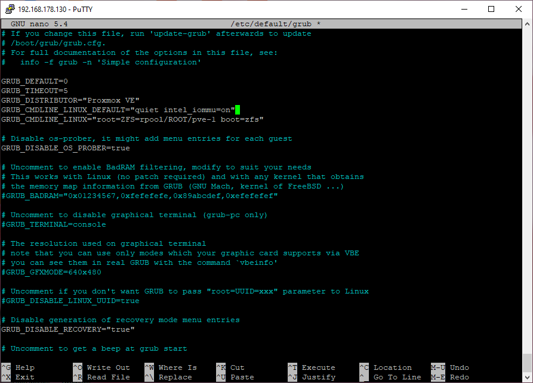
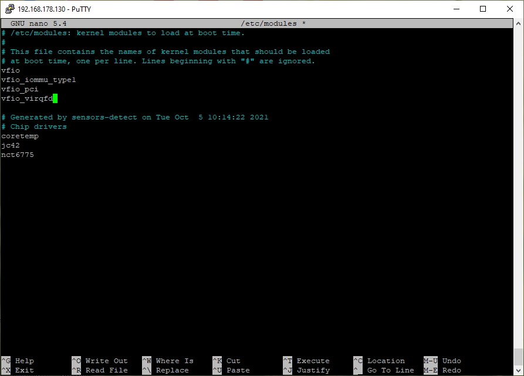
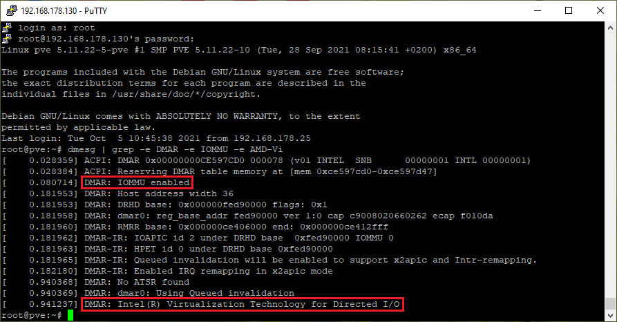
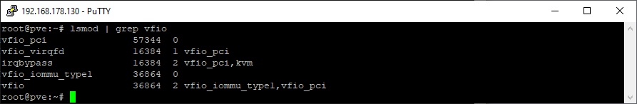
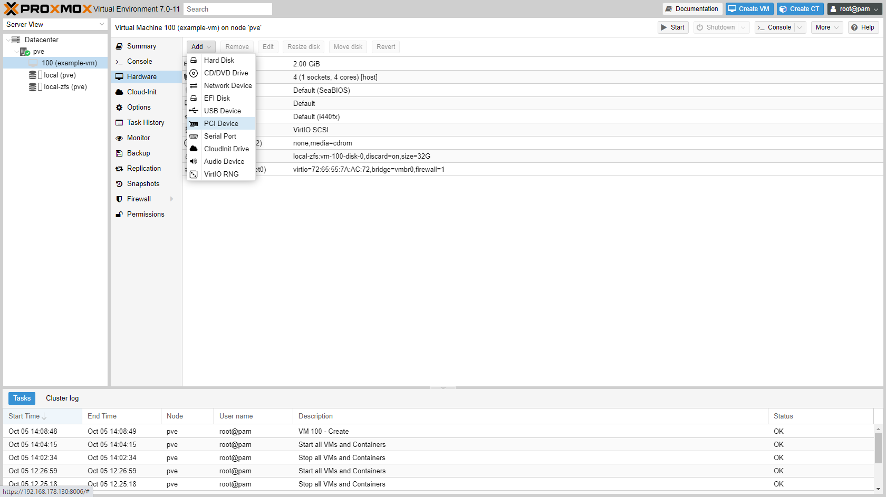
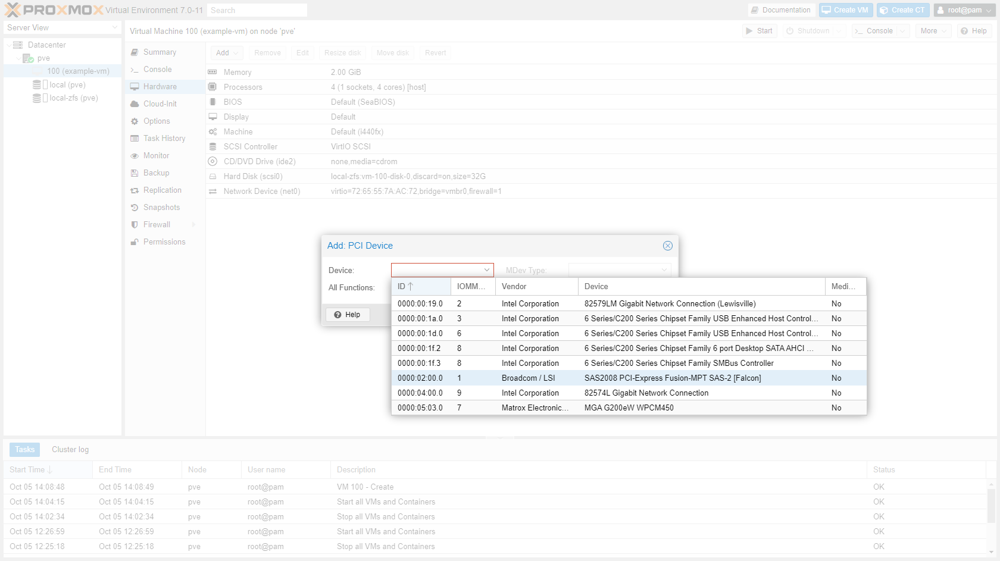
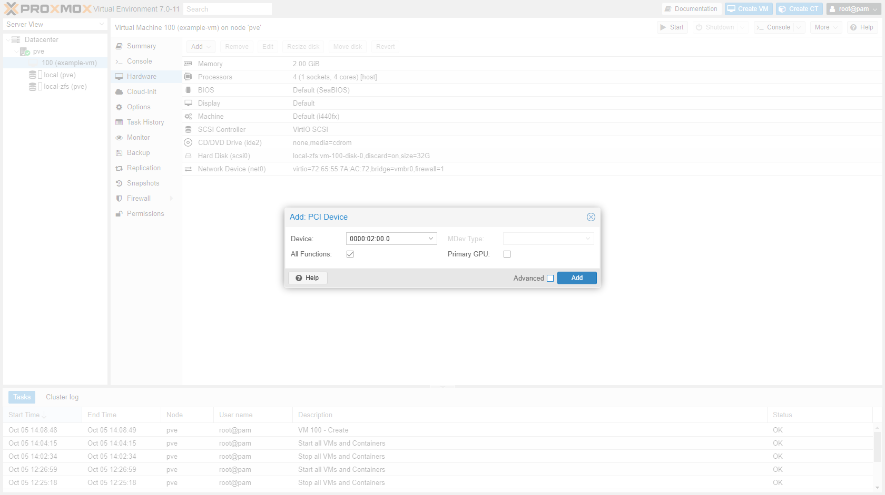
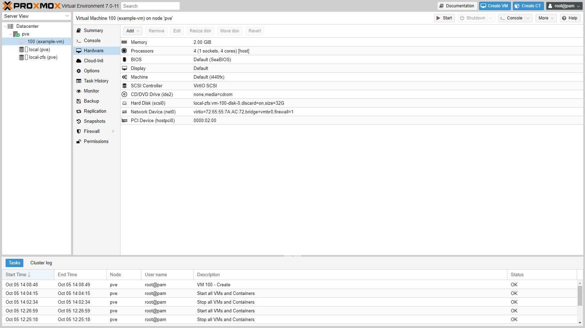

## Introduction

What [started as a project](https://blog.joeplaa.com/building-a-proxmox-cluster/) to run "some crypto applications" grew into something much bigger, but also more useful. I learned a tremendous amount about virtual machines, lxc containers and Proxmox. And although I'm just scratching the surface and I don't actually understand it, I know how to do some things. I'll write them down here, partly for myself, but also for you in hopes it will save one of us a lot of time and frustration.

## Why PCIe passthrough

Most of the time the use of virtualized hardware is sufficient for applications to run in a virtual machine. Sometimes, however, the application needs more control over the physical hardware. For example a rendering VM that needs a GPU, a router that needs direct access to the NIC or a NAS that works better with direct access to the hard drives. In those cases you pass the hardware "directly" to the VM. The advantage of this is that latencies are reduced and security increased, but at the cost of exclusive use of that particular piece of hardware by the VM. No more sharing the hardware between VM's.

In my particular cases I pass a 4 port gigabit NIC to pfSense to create my private networks and a HBA to TrueNas to control the storage hard disks. To enable PCIe passthrough, first your motherboard should support it. Check and enable `VT-d` and `IOMMU` in the BIOS. If this is done, you have to enable it in the Linux kernel.

## Enabling PCIe passthrough

1. Grub Configuration

    1. Add parameter `GRUB_CMDLINE_LINUX_DEFAULT="quiet intel_iommu=on"` to GRUB:

        ```shellsession
        nano /etc/default/grub
        ```

        

    2. Update GRUB

        ```shellsession
        update-grub
        ```

2. Add kernel modules:

    ```shellsession
    nano /etc/modules
    ```

    ```conf
    vfio
    vfio_iommu_type1
    vfio_pci
    vfio_virqfd
    ```

    

3. Update initramfs:

    ```shellsession
    update-initramfs -u -k all
    ```

4. Reboot

5. Check function:

    ```shellsession
    dmesg | grep -e DMAR -e IOMMU -e AMD-Vi
    lsmod | grep vfio
    ```

    

    

6. Add PCIe device to the VM in the GUI

    

    

    

    

<Alert type='info'>
    Sources:

* <https://www.thomas-krenn.com/en/wiki/Enable_Proxmox_PCIe_Passthrough>

</Alert>