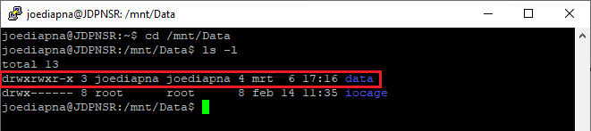
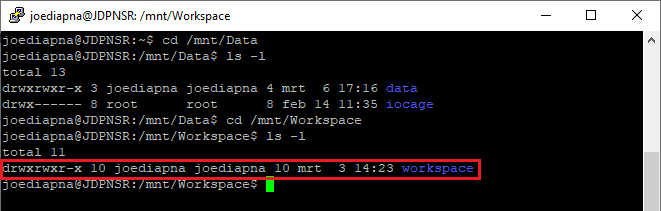
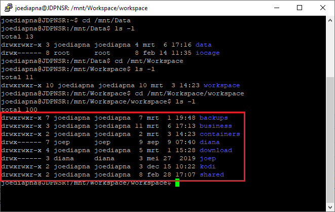

In Windows it's easy to get file sharing to work. At least I can make it work all the time. Part of it is the graphical interface, but file sharing in Linux, in my case Ubuntu has it's peculiarities. Even if you use the [Ubuntu GUI tools](https://www.linuxbabe.com/ubuntu/system-config-samba-ubuntu-16-04), it doesn't always work. It has cost me countless hours over the years and every time I have to reconfigure Samba I'm in hell. So this is my guide on how to enable Samba sharing in Ubuntu.

In this example we have the server user `joediapna`, two actual people `diana` and `joep` and a shared (somewhat public) computer account in the living room `discobal`.

## 1. Prepare

1. List the folders or volumes you want to share. I want to share two volumes, or to be more precise a single folder in each volume. The `Workspace` volume is where for example software installers are shared and it has private folders for the "real" users. The second volume `Data` is used to share data between all computers. I want the server to be the owner of all volumes/data, except the private folders.

    One more thing: the sharename cannot have the same name as the folder it represents! It is however case-sensitive so `Data` is not the same as `data`.

<div class='col-md-10 col-lg-8 mx-auto'>
    <table class="table table-striped table-responsive">
        <thead>
            <tr>
                <th scope="col">Folder / volume</th>
                <th scope="col">Sharename</th>
                <th scope="col">Owner</th>
            </tr>
        </thead>
        <tbody>
            <tr>
                <td><code>/mnt/Data/data</code></td>
                <td><code>Data</code></td>
                <td><code>joediapna</code></td>
            </tr>
            <tr>
                <td><code>/mnt/Workspace/workspace</code></td>
                <td><code>Workspace</code></td>
                <td><code>joediapna</code></td>
            </tr>
            <tr>
                <td><code>/mnt/Workspace/workspace/Diana</code></td>
                <td><code>-</code></td>
                <td><code>diana</code></td>
            </tr>
            <tr>
                <td><code>/mnt/Workspace/workspace/Joep</code></td>
                <td><code>-</code></td>
                <td><code>joep</code></td>
            </tr>
        </tbody>
    </table>
</div>

2. List groups and permissions. To make life easier, I'll group users together in two groups. The first group `joediapna` can read and write anywhere (except the private folders). The `sambashare` group can only read anywhere (except the private folders). We need the `x` to build the tree of subfolders.

<div class='col-md-10 col-lg-8 mx-auto'>
    <table class="table table-striped table-responsive">
        <thead>
            <tr>
                <th scope="col">Group</th>
                <th scope="col">Sharename</th>
                <th scope="col">Owner</th>
            </tr>
        </thead>
        <tbody>
            <tr>
                <td><code>/mnt/Data/data</code></td>
                <td><code>Permissions<br/>Data</code></td>
                <td><code>Permissions<br/>Workspace</code></td>
            </tr>
            <tr>
                <td><code>joediapna</code></td>
                <td><code>rwx</code> / <code>7</code></td>
                <td><code>rwx</code> / <code>7</code></td>
            </tr>
            <tr>
                <td><code>sambashare</code></td>
                <td><code>r-x</code> / <code>5</code></td>
                <td><code>r-x</code> / <code>5</code></td>
            </tr>
            <tr>
                <td><code>other users</code></td>
                <td><code>r-x</code> / <code>5</code></td>
                <td><code>r-x</code> / <code>5</code></td>
            </tr>
        </tbody>
    </table>
</div>

3. List the users. We have 4 users split into 2 groups.

<div class='col-md-10 col-lg-8 mx-auto'>
    <table class="table table-striped table-responsive">
        <thead>
            <tr>
                <th scope="col">User</th>
                <th scope="col">Type</th>
                <th scope="col">Group</th>
            </tr>
        </thead>
        <tbody>
            <tr>
                <td><code>diana</code></td>
                <td><code>Admin</code></td>
                <td><code>joediapna</code>, <code>sambashare</code></td>
            </tr>
            <tr>
                <td><code>discobal</code></td>
                <td><code>User</code></td>
                <td><code>sambashare</code></td>
            </tr>
            <tr>
                <td><code>joediapna</code></td>
                <td><code>Owner</code></td>
                <td><code>joediapna</code>, <code>sambashare</code></td>
            </tr>
            <tr>
                <td><code>joep</code></td>
                <td><code>Admin</code></td>
                <td><code>joediapna</code>, <code>sambashare</code></td>
            </tr>
        </tbody>
    </table>
</div>

## 2. Permissions

1. Mount the volumes you want to share. To mount volumes you should make mount points (folders) and mount the volume to that folder. I have ZFS volumes which should mount automatically after every reboot. If you are mounting other types of volumes (NFS), you have to add them to `/etc/fstab`. Please Google for that (guide from me is coming some day too).

    As said, I'm mounting two ZFS volumes: `Data` and `Workspace`. So I create two mount directories: `/mnt/Data` and `/mnt/Workspace` to which I mount the ZFS volumes.

    ```shellsession
    sudo mkdir /mnt/Data
    sudo mount Data /mnt/Data

    sudo mkdir /mnt/Workspace
    sudo mount Workspace /mnt/Workspace
    ```

2. Check if everything is mounted. It should show the two mounted volumes.

    ```shellsession
    df -h
    ```

3. Check with `ls -l` for current owner and permissions.

    ```shellsession
    cd /mnt/Data
    ls -l
    ```

    1. `Data`: The owner should be `joediapna:joediapna` and the permissions should be `drwxrwxr-x` (`775`). With these permissions the owner (user `joediapna`) can do everything, the group `joediapna` can do everything. All other users can only read. We are going to apply these permissions on all the files and folders.

    ```shellsession
    sudo chown -R joediapna:joediapna /mnt/Data/data
    sudo chmod -R 775 /mnt/Data/data
    ```

    

    2. `Workspace`: The owner should again be `joediapna:joediapna` and the permissions should also be `drwxrwxr-x` (`775`). We are not going to apply these permissions on all the files and folders. We'll start with the main folder only

    ```shellsession
    cd /mnt/Workspace
    ls -l
    sudo chown joediapna:joediapna /mnt/Workspace/workspace
    sudo chmod 775 /mnt/Workspace/workspace
    ```

    

    3. Now go in one level deeper and check for each folder what the permissions should be. Apply them for each folder recursively.

    ```shellsession
    cd /mnt/Workspace/workspace
    ls -l
    sudo chown -R joediapna:sambashare /mnt/Workspace/workspace/download
    sudo chmod -R 775 /mnt/Workspace/workspace/download

    sudo chown -R joep:joep /mnt/Workspace/workspace/joep
    sudo chmod -R 700 /mnt/Workspace/workspace/joep
    ```

    

## 3. Users and groups

1. Create groups. The `joediapna` group already exist as it was made with the initial user during setup of Ubuntu. We only have to make the sambashare group.

    ```shellsession
    sudo groupadd sambashare
    ```

2. Create users and add them to the groups. We do have to create 3 users: `diana`, `discobal` and `joep`. This is the example for the first.

    ```shellsession
    sudo useradd -m diana -p <PASSWORD>
    sudo usermod -L diana
    sudo usermod -a -G joediapna diana
    sudo usermod -a -G sambashare diana
    ```

## 4. Install and configure Samba

1. Install Samba:

    ```shellsession
    sudo apt update
    sudo apt install samba
    ```

2. Open the file Samba configuration file:

    ```shellsession
    sudo nano /etc/samba/smb.conf
    ```

3. Change the workgroup to your Windows workgroup if you have one. I have called it `BALZAAL`.

    ```ini
    # Change this to the workgroup/NT-domain name your Samba server will part of
            workgroup = balzaal
    ```

4. Scroll all the way to the bottom and add the shares.

    ```ini
    [Data]
            path = /mnt/Data/data
            browseable = yes
            writeable = yes
            create mask = 0775
            directory mask = 0775
            guest ok = no

    [Workspace]
            path = /mnt/Workspace/workspace
            browseable = yes
            writeable = yes
            create mask = 0775
            directory mask = 0775
            guest ok = no
    ```

5. Save and close by pressing `Ctrl-O` to save and `Ctrl-X` to close. Now restart Samba.

    ```shellsession
    sudo service smbd restart
    ```

6. Add a rule in the firewall to allow Samba traffic.

    ```shellsession
    sudo ufw allow samba
    ```

## 5. Now the peculiar part

* The Samba user passwords aren't the same as the system users we just created. I always forget that. We have to add that password to Samba too. So for each user we enter the command below. This command will ask to enter the password for that user.

    ```shellsession
    sudo smbpasswd -a diana
    ```

## 6. Check installation

1. If everything went right, which it never does in my experience, you should now be able to browse these shares. From a Unix machine (Mac or Linux) type `smb://xxx.xxx.xxx.xxx/Data` or from Windows: `\\xxx.xxx.xxx.xxx\Data`.

2. If it doesn't work... First check if Samba is installed and running:

    ```shellsession
    smbd --version
    systemctl status smbd
    systemctl status nmbd
    ```

3. If yes, try to restart the Samba service:

    ```shellsession
    sudo systemctl restart smbd
    sudo systemctl restart nmbd
    ```

4. Then install a small Samba GUI. It's a GUI, so you can only [run it through VNC](/how-to-enable-screen-sharing-between-ubuntu-and-realvnc/). See if you see anything strange there.

    ```shellsession
    sudo apt install system-config-samba
    sudo system-config-samba
    sudo touch /etc/libuser.conf
    ```
