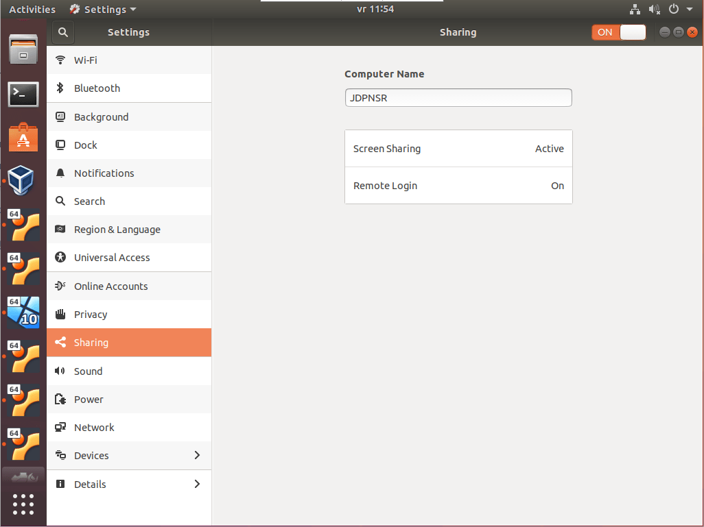
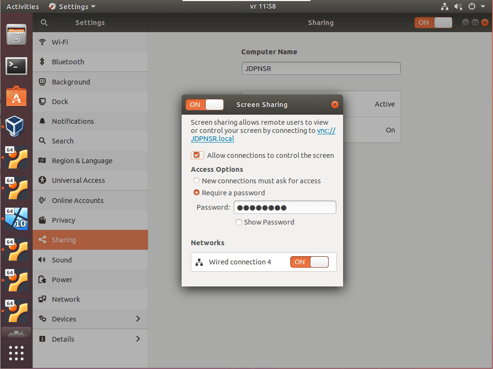
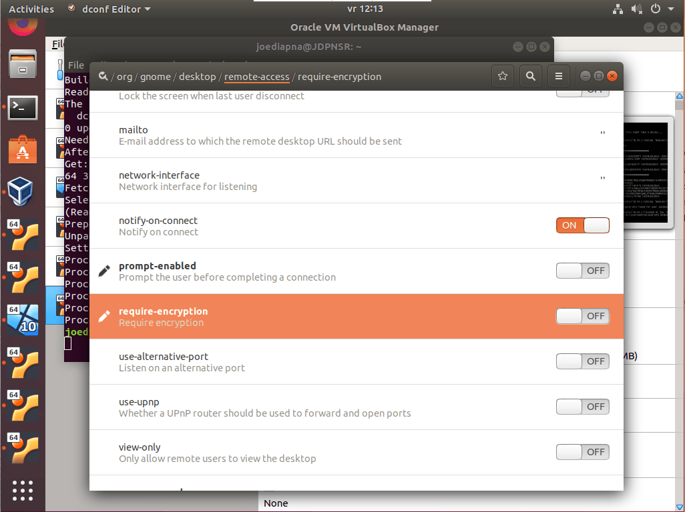
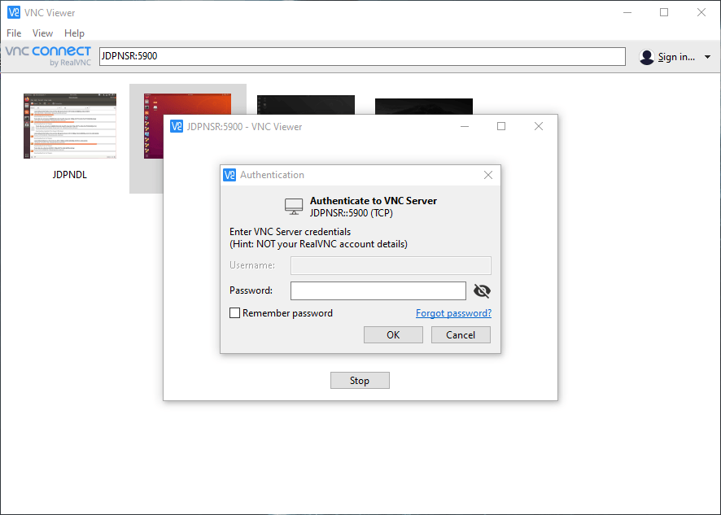
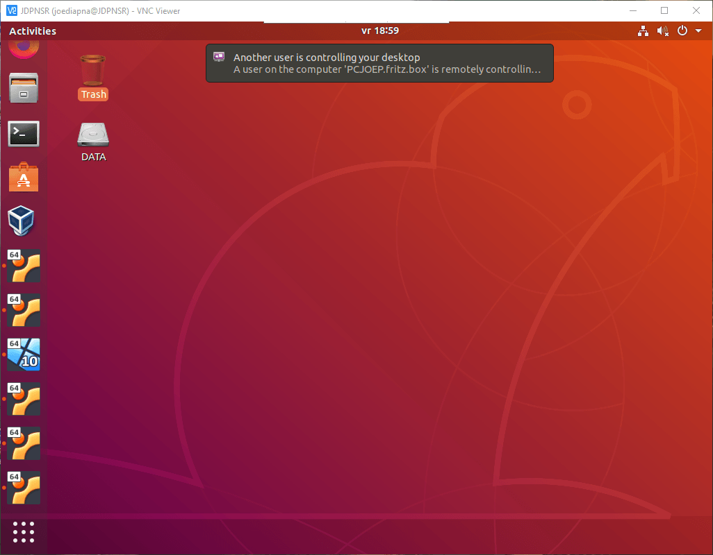

I'm a GUI guy, so I need to "see" what I'm doing. I don't dislike or hate the command line (CLI), it's just that I can't remember every setting and file location. I have to see it. Now that's a problem with Linux as most is done through the command line in a terminal.

Now with Ubuntu, the GUI is pretty good. Well, good enough. But now we run in to another issue: a server normally doesn't have a monitor attached. So how can you see that GUI? In Windows this is done through the Remote Desktop app and the RDP protocol. This protocol isn't available by default on Ubuntu, but can be added through [Xrdp](https://linuxize.com/post/how-to-install-xrdp-on-ubuntu-18-04/).

But I think there is an easier way to view the Ubuntu GUI. The current default Ubuntu GUI has an option for screen sharing. This is done through the VNC protocol and works pretty good. In this guide I'll show you how to enable screen sharing between Ubuntu and [RealVNC](https://www.realvnc.com/en/connect/download/viewer/) (on Windows, Mac or another Linux computer).

## Enable screen sharing in Ubuntu

1. On the server check if `Vino` is installed and do install if not. You can run the next command to do either one.

    ```shellsession
    sudo apt install vino
    ```

2. When installing Ubuntu on the server I temporarily had a screen attached. This allowed me to do the installation and find the setting to enable screen sharing. Go to the **Settings** app and go to **Sharing**. Set Sharing to **On** (top right corner of the screen).

    

3. Now click on **Screen Sharing** and set it this to **On** too. Select **Allow connections to control screen** and **Require a password**. The password can be only 8 characters long.

    

    Don't forget to select a network. If no networks are selectable try this:

    ```shellsession
    sudo touch /etc/NetworkManager/conf.d/10-globally-managed-devices.conf
    ```

4. To connect to the server, I use the [RealVNC viewer](https://www.realvnc.com/en/connect/download/viewer/). It looks good and modern and you can save multiple connections ([up to 5 for free](https://www.realvnc.com/en/connect/home/)). One problem with RealVNC is that it doesn't work with encrypted connections from Windows to Ubuntu.

    As Ubuntu requires encryption by default, we have to specifically allow unencrypted connections. Open a terminal to the Ubuntu server or on the server and enter the following command.

    ```shellsession
    gsettings set org.gnome.Vino require-encryption false
    ```

    Alternatively you can install the dconf-editor and disable this visually.

    ```shellsession
    sudo apt-get install dconf-editor
    dconf-editor
    ```

    Browse to **org / gnome / desktop / remote-access** or search for `require-encryption` and set to **OFF**.

    

5. Open RealVNC viewer on your laptop or computer and connect to the IP-address or servername of the server followed by the port number; 5900. In my case: `JDPNSR:5900`. When the connection is made, the server will ask for the password set in step 3.

    

    
