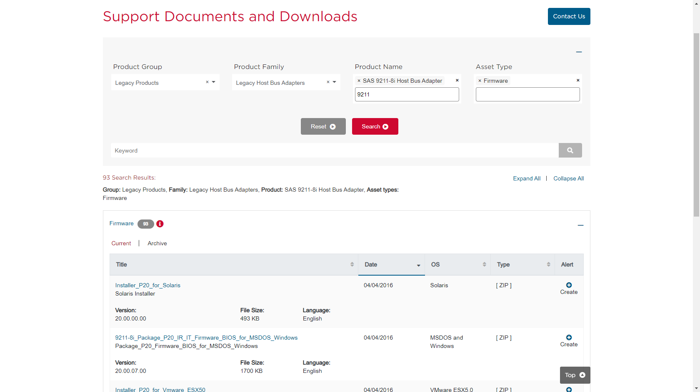
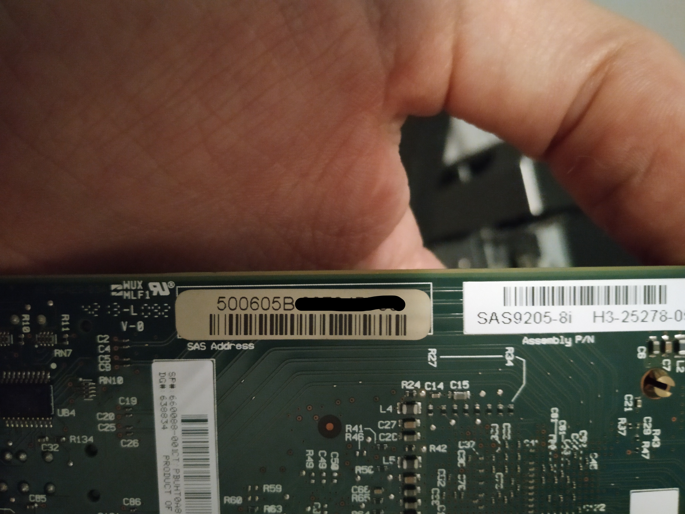
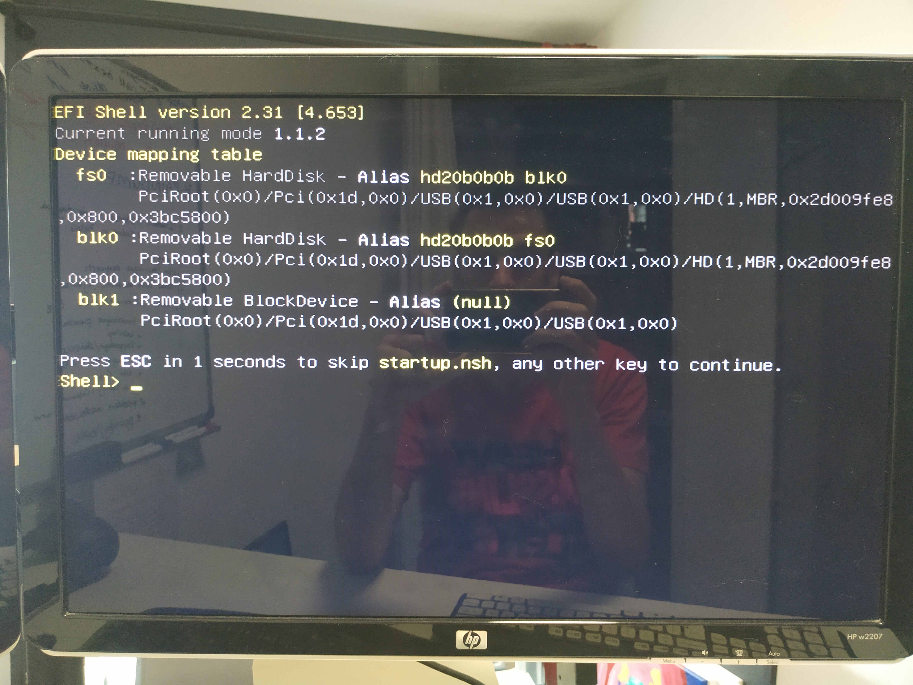

## Introduction

What [started as a project](https://blog.joeplaa.com/building-a-proxmox-cluster/) to run "some crypto applications" grew into something much bigger, but also more useful. I learned a tremendous amount about virtual machines, lxc containers and Proxmox. And although I'm just scratching the surface and I don't actually understand it, I know how to do some things. I'll write them down here, partly for myself, but also for you in hopes it will save one of us a lot of time and frustration.

Different cards. Point to blog.

Most HBA cards you can buy are configured with **IR** firmware by default. In this mode the card will take care of the RAID functionality. I don't want that, so I have to (cross)flash the card to **IT** mode. I've done this with a Dell Perc H310 in my Dell server and with the earlier mentioned IBM M1115. The process is basically the same for all cards.

<Alert type='info'>
    Rebranded cards:

* HP H220 = LSI 9207-8i
* Dell Perc H310 = LSI 9205-8i
* IBM M1015 = LSI 9220-8i
* IBM M1115 = LSI 9211-8i

</Alert>

## Flashing the HBA

<Alert type='warning'>
I also have an HP server. HP, now HPE, is notorious for being very picky about the hardware you install. If it is not HP labeled/branded, the server doesn't recognize the sensor data and assumes the worst. This results in very high fan speeds and thus an unbearable amount of noise.

So in that server I had to install an HP branded HBA: the HP H220. The one I got was flashed with firmware version 15 (the latest). However, it made my fans "idle" at 30%. [After flashing down to version 13](https://www.reddit.com/r/homelab/comments/evg5in/howto_fix_loud_hp_server_fans_with_an_hp_h220_hba/) the fans are back at 8% idle, which is basically silent.
</Alert>

This guide is a compilation of multiple guides that are available. If you search for `crossflash lsi it <your card here>` you will probably find the perfect one for you. At the end of this part I have listed the ones that helped me most.

1. Prepare a DOS bootable USB stick. I use [Rufus](https://rufus.ie/) for that.

    

    * Download the [flash tools](https://cdn.joeplaa.com/hba-flash/flash-tools.7z) or [full archive](https://cdn.joeplaa.com/hba-flash/LSI-9211-8i.7z).
    * Extract and copy the flash tools to the USB drive.
    * Download the latest firmware from the ~~LSI~~ ~~Avago~~ [Broadcom](https://www.broadcom.com/support/download-search) website.

        

    * Extract and copy `Firmware\HBA_9211_8i_IT\2118it.bin`, `sasbios_rel\mptsas2.rom` and `sas2flash_dos_rel\sas2flsh.exe` to the USB drive.

2. Find the SAS address of your card. **This is very important!!**

    * Copy it from the label on the card. It should be something like "500605B0xxxxxxxx".

        

    * Or find it during the flashing procedure.

3. When booting in BIOS mode:

    * Boot the server from USB. You should now see a DOS command line.

        ```command
        C:\>_
        ```

    * Type and run the following command to find the SAS number if you haven't done so in step 2.

        ```command
        sas2flsh.exe -listall
        ```

        If you get `"ERROR: Failed to initialize PAL. Exiting program."`, your motherboard is set to use UEFI and you have to flash using the EFI shell: see step 4.

        Find the number of the card (0 if only one is installed) and use that number in the next command.

        ```command
        sas2flsh.exe -c 0 -list
        ```

        Now write down the SAS address. **This is very important!!**

    * Run the next commands one by one to wipe the existing firmware:

        ```command
        megarec -writesbr 0 sbrempty.bin
        megarec -cleanflash 0
        ```

    * Reboot back to USB and flash the new firmware and BIOS.

        ```command
        sas2flsh -o -f 2118it.bin -b mptsas2.rom 
        ```

    * Enter the SAS number (change to the number -without spaces and dashes- you wrote down in step 2):

        ```command
        sas2flsh -o -sasadd 500605B0xxxxxxxx
        ```

    * You are done. Reboot.

4. When booting in UEFI mode:

    * Copy `bootx64.efi` from the [full archive](https://cdn.joeplaa.com/hba-flash/LSI-9211-8i.7z) to the USB stick.

    * Boot the server to EFI shell. This should be a setting in the BIOS of your motherboard.

        

    * Select the USB drive by typing, in my case, `fs0:`. Type `map -b` to get a list of devices if you don't see them.

    * Type and run the following command to find the SAS number if you haven't done so in step 2.

        ```shell
        sas2flash.efi -listall
        ```

        Find the number of the card (0 if only one is installed) and use that number in the next command.

        ```shell
        sas2flash.efi -c 0 -list
        ```

        Now write down the SAS address. **This is very important!!**

    * Reboot to DOS and run the next commands one by one to wipe the existing firmware:

        ```command
        megarec -writesbr 0 sbrempty.bin
        megarec -cleanflash 0
        ```

    * Reboot back to EFI shell and flash the temporary firmware:

        ```shell
        sas2flash.efi -o -f 6GBPSAS.FW
        ```

    * Reboot again back to EFI shell and flash the new firmware:

        ```shell
        sas2flash.efi -o -f 2118it.bin
        ```

    * Enter the SAS number (change to the number -without spaces and dashes- you wrote down in step 2):

        ```shell
        sas2flash.efi -o -sasadd 500605B0xxxxxxxx
        ```

    * You are done. Reboot.

<Alert type='info'>
Sources:

* M1015: <https://www.servethehome.com/ibm-serveraid-m1015-part-4/>
* M1115: <https://blog.gimpe.com/2014/04/flashing-ibm-m1115-sas-9223-with-lsi-sas-9211-8i-firmware-to-use-with-esxi-5-freenas-guest-wrdm/>
* M1115: <https://www.syxin.com/2014/03/crossflashing-an-ibm-m1115-raid-controller-to-lsi-firmware/>
* Dell H310: <https://tylermade.net/2017/06/27/how-to-crossflash-perc-h310-to-it-mode-lsi-9211-8i-firmware-hba-for-freenas-unraid/>
* Dell H310: <https://techmattr.wordpress.com/2016/04/11/updated-sas-hba-crossflashing-or-flashing-to-it-mode-dell-perc-h200-and-h310/>
* Dell H310: <https://techmattr.wordpress.com/2014/06/13/revert-your-perc-h310-back-to-its-dell-firmware>

</Alert>