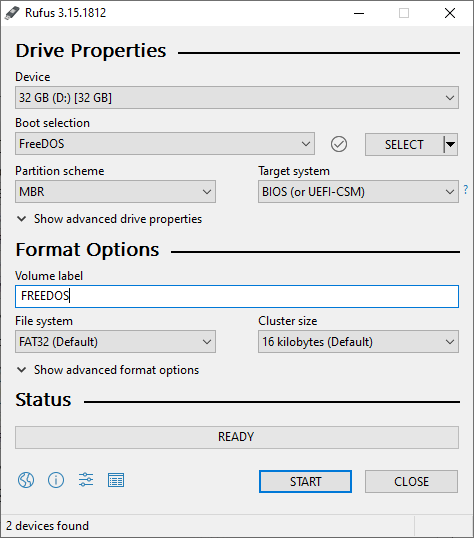
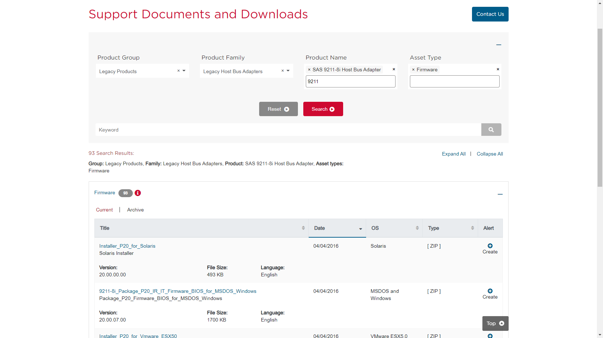
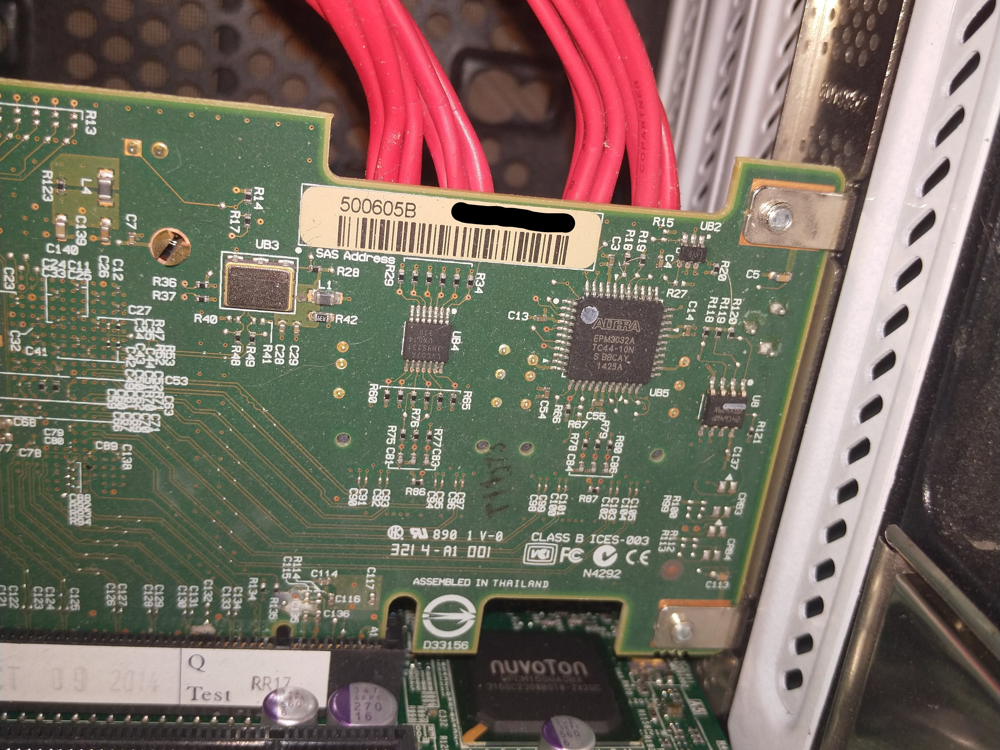
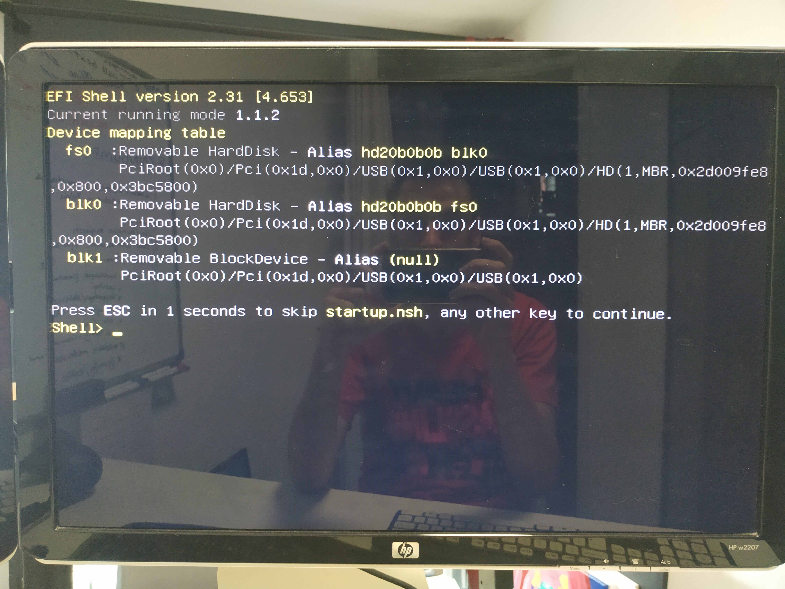

## Introduction

What [started as a project](https://blog.joeplaa.com/building-a-proxmox-cluster/) to run "some crypto applications" grew into something much bigger, but also more useful. I learned a tremendous amount about virtual machines, lxc containers and Proxmox. And although I'm just scratching the surface and I don't actually understand it, I know how to do some things. I'll write them down here, partly for myself, but also for you in hopes it will save one of us a lot of time and frustration.

If you want to use a software RAID solution for your storage or pass it to a VM, you (probably) need a HBA card. Sometimes they come with the server, but mostly you have (or want) to buy and add them yourself. In my VM server (HP) I added a HP H220 to combine 6 SSD's into a ZFS RAID-Z2 array for the OS and VM disks. In my storage server (Dell) I pass the Dell Perc H310, that came with it, straight to the TrueNas VM that takes care of my storage disks.

When I started doing this -working with ZFS and FreeNas- popular ones were the IBM M1015 or M1115, because you could buy used ones cheaply on Ebay. You still can, but technology has evolved, SSD's are cheaper and SATA/SAS3 has become mainstream. Servethehome.com has written an excellent guide [Top Picks for FreeNAS HBAs](https://www.servethehome.com/buyers-guides/top-hardware-components-freenas-nas-servers/top-picks-freenas-hbas/) to help you find the best HBA for your application.

## Why crossflashing a HBA?

Most HBA cards you can buy are configured with **IR** firmware by default. In this mode the card will take care of the RAID functionality. If you want to use software RAID (or ZFS) you don't want that. You want your OS to take care of that. Therefor you have to (cross)flash most cards to **IT** mode (some have native IT mode capability, like the earlier mentioned HP H220). I've done this with the [Dell Perc H310](/how-to-flash-a-dell-perc-h310-hba-to-it-mode) in my Dell server and with the earlier mentioned IBM M1115. The process is basically the same for all cards. I also flashed my [HP H220](/how-to-flash-an-hp-h220-hba), but for different reasons as mentioned in the warning below.

<Alert type='warning'>
HP, now HPE, is notorious for being very picky about the hardware you install. If it is not HP labeled/branded, the server doesn't recognize the sensor data and assumes the worst. This results in very high fan speeds and thus an unbearable amount of noise.

So in that server I had to install an HP branded HBA: the HP H220. The one I got was flashed with firmware version 15 (the latest). However, it made my fans "idle" at 30%. [After flashing down to version 13](https://www.reddit.com/r/homelab/comments/evg5in/howto_fix_loud_hp_server_fans_with_an_hp_h220_hba/) the fans are back at 8% idle, which is basically silent.
</Alert>

## Crossflashing the HBA

This guide is a compilation of multiple guides that are available online. If you search for `crossflash lsi it <your card here>` you will probably find the perfect one for you. At the end of this guide I have listed the ones that helped me most.

1. Prepare a DOS bootable USB stick. I use [Rufus](https://rufus.ie/) for that.

    

    * Download the [flash tools](https://cdn.joeplaa.com/hba-flash/flash-tools.7z) or [full archive](https://cdn.joeplaa.com/hba-flash/LSI-9211-8i.7z).
    * Extract and copy the flash tools to the USB drive.
    * Download the latest firmware from the ~~LSI~~ ~~Avago~~ [Broadcom](https://www.broadcom.com/support/download-search) website.

        

        <Alert type='info'>
        Rebranded cards:
            <ul>
                <li>Dell Perc H310 = LSI 9205-8i</li>
                <li>HP H220 = LSI 9205-8i</li>
                <li>IBM M1015 = LSI 9220-8i</li>
                <li>IBM M1115 = LSI 9211-8i</li>
            </ul>
        </Alert>

    * Extract and copy `Firmware\HBA_9211_8i_IT\2118it.bin`, `sasbios_rel\mptsas2.rom` and `sas2flash_dos_rel\sas2flsh.exe` to the USB drive.

2. Find the SAS address of your card. **This is very important!!**

    * Copy it from the label on the card. It should be something like "500605B0xxxxxxxx".

        

    * Or find it during the flashing procedure.

3. When booting in BIOS mode:

    * Boot the server from USB. You should now see a DOS command line.

        ```command
        C:\>_
        ```

    * Type and run the following command to find the SAS number if you haven't done so in step 2.

        ```command
        sas2flsh.exe -listall
        ```

        <Alert type='info'>
            If you get <code>"ERROR: Failed to initialize PAL. Exiting program."</code>, your motherboard is set to use UEFI and you have to flash using the EFI shell: see step 4.
        </Alert>

        Find the number of the card (0 if only one is installed) and use that number in the next command.

        ```command
        sas2flsh.exe -c 0 -list
        ```

        Now write down the SAS address. **This is very important!!**

    * Run the next commands one by one to wipe the existing firmware:

        ```command
        megarec.exe -writesbr 0 sbrempty.bin
        megarec.exe -cleanflash 0
        ```

    * Reboot back to USB and flash the new firmware and BIOS.

        ```command
        sas2flsh.exe -o -f 2118it.bin -b mptsas2.rom 
        ```

    * Enter the SAS number (change to the number -without spaces and dashes- you wrote down in step 2):

        ```command
        sas2flsh.exe -o -sasadd 500605B0xxxxxxxx
        ```

    * You are done. Reboot.

4. When booting in UEFI mode:

    * Copy `bootx64.efi` from the [full archive](https://cdn.joeplaa.com/hba-flash/LSI-9211-8i.7z) to the USB stick.

    * Boot the server to EFI shell. This should be a setting in the BIOS of your motherboard.

        

    * Select the USB drive by typing, in my case, `fs0:`. Type `map -b` to get a list of devices if you don't see them.

    * Type and run the following command to find the SAS number if you haven't done so in step 2.

        ```shell
        sas2flash.efi -listall
        ```

        Find the number of the card (0 if only one is installed) and use that number in the next command.

        ```shell
        sas2flash.efi -c 0 -list
        ```

        Now write down the SAS address. **This is very important!!**

    * Reboot to DOS and run the next commands one by one to wipe the existing firmware:

        ```command
        megarec.exe -writesbr 0 sbrempty.bin
        megarec.exe -cleanflash 0
        ```

    * Reboot back to EFI shell and flash the temporary firmware:

        ```shell
        sas2flash.efi -o -f 6GBPSAS.FW
        ```

    * Reboot again back to EFI shell and flash the new firmware:

        ```shell
        sas2flash.efi -o -f 2118it.bin
        ```

    * Enter the SAS number (change to the number -without spaces and dashes- you wrote down in step 2):

        ```shell
        sas2flash.efi -o -sasadd 500605B0xxxxxxxx
        ```

    * You are done. Reboot.

<Alert type='info'>
Sources:

* M1015: <https://www.servethehome.com/ibm-serveraid-m1015-part-4/>
* M1115: <https://blog.gimpe.com/2014/04/flashing-ibm-m1115-sas-9223-with-lsi-sas-9211-8i-firmware-to-use-with-esxi-5-freenas-guest-wrdm/>
* M1115: <https://www.syxin.com/2014/03/crossflashing-an-ibm-m1115-raid-controller-to-lsi-firmware/>
* [Broadcom downloads](https://www.broadcom.com/support/download-search)
* [LSI SAS 2008 RAID Controller/ HBA Information](https://www.servethehome.com/lsi-sas-2008-raid-controller-hba-information/)

</Alert>