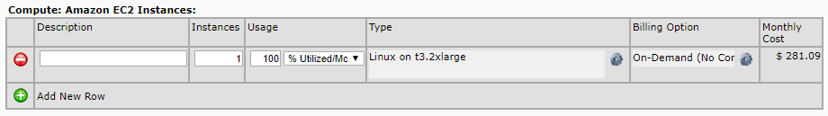

Aaah, Amazon pricing, what a joy. Although the basics are pretty self explanatory, it gets complicated really quickly. How do I determine how many GET requests my bucket will get? Or how many DNS-queries are realistically to be expected? How many emails are you going to send?

Because AWS pricing is (mostly) done on a per-use basis, for everything, it can get complicated pretty quickly. You pay tiny amounts for a lot of things. To make it even more complicated you can also use savings plans or save money by making service reservations.

Ow, and AWS has a [free tier](https://aws.amazon.com/free/). That means that you can use some service for free for the first 12 months, but not all. Some services actually have a certain free limit indefinitely.

## Calculators

AWS knows their pricing model is complex, so they build the ["Simple" Monthly Calculator](https://calculator.s3.amazonaws.com/index.html). Which is also complex... damn. But they know that too, so they build the [Pricing Calculator](https://calculator.aws/#/). Which in _Quick estimate_ mode is quick good. So we'll use that one to calculate the costs for our setup.

## Pay-as-you-go

AWS has a pay-as-you-go pricing model. Meaning you pay for the resources you use per second/minute/hour or per request/query/action. When you know what you need, you can save money by reserving capacity.

[https://aws.amazon.com/pricing/](https://aws.amazon.com/pricing/?)

## Examples

### EC2

The thing I wanted to know, but took me a long time to find: what does Amazon mean with "Usage". Do you use you EC2 when it's running, but CPU idle? Do you pay 20% if your average CPU usage is 20%? Or are you using it when it is stopped or are you only not using it when it's terminated?

> Pricing is per instance-hour consumed for each instance, from the time an instance is launched until it is terminated or stopped. Each partial instance-hour consumed will be billed per-second for Linux Instances and as a full hour for all other instance types.
> 
> [https://aws.amazon.com/ec2/pricing/on-demand/](https://aws.amazon.com/ec2/pricing/on-demand/)

After a few months of using it and with this quote, I now know it has nothing to do with CPU utilization. If you run your instance 24/7 every day of the month, that's 100% utilization. If you stop your instance, those hours don't count. You do however pay for the EBS volumes. So only when you terminate an instance and delete the associated volumes, you stop paying.

#### Example

Let's look at our 2 instances. We have a Linux t3.micro with 8 GB EBS and a Windows t3.small with 50 + 4 GB EBS. I have bought standard reserved instances for a year for both.

    <table class="table table-striped">
        <thead>
            <tr>
                <th scope="col">Calculation</th>
                <th scope="col">Amount/month</th>
                <th scope="col">Amount upfront</th>
            </tr>
        </thead>
        <tbody>
            <tr>
                <td><NewTabLink href='https://calculator.s3.amazonaws.com/index.html#r=FRA&s=EC2&key=files/calc-49511952b7f4aeea9161b234d5f4eabe88849546&v=ver20200219tB'>Simple Monthly Calculator</NewTabLink></td>
                <td>$ 23.18</td>
                <td>$ 189</td>
            </tr>
            <tr>
                <td><NewTabLink href='https://calculator.aws/#/estimate?id=7ca4c8f8e24df3f979eeb2d9d266e42640694a1a'>Pricing Calculator</NewTabLink></td>
                <td>$ 23.07</td>
                <td>$ 189</td>
            </tr>
            <tr>
                <td>Bill February 2020</td>
                <td>$ 25.28</td>
                <td>$ 189</td>
            </tr>
        </tbody>
    </table>

## Current Bill

In total we currently spent roughly $45 per month. That is including CloudWatch, Data Transfer, Route 53, S3

* * *

### RDS

We don't use RDS for our database yet and for "good" reason. It's quite expensive for a small database. However, we do want to start using it when we are able to migrate our MSSQL database to MySQL. More on that in [appendix E](../hosting-asp-net-apps-on-aws-appendix-e-improved-architectures/).

#### Example

Let's see what an MSSQL, MySQL and Aurora (AWS MySQL) database instance costs. We'll take a t3.small instance (smallest MSSQL and Aurora) and compare the on-demand pricing with a standard 1 year reservation.

    <table class="table table-striped">
        <thead>
            <tr>
                <th scope="col">Engine</th>
                <th scope="col">Pricing</th>
                <th scope="col">Amount/month</th>
                <th scope="col">Amount upfront</th>
            </tr>
        </thead>
        <tbody>
            <tr>
                <td><NewTabLink href='https://calculator.s3.amazonaws.com/index.html#r=FRA&s=RDS&key=files/calc-31595d720a1c435e8f11bee28f0cd4572f2251ef&v=ver20200219tB'>MSSQL</NewTabLink></td>
                <td>On-demand</td>
                <td>$ 39.34</td>
                <td>$ 0</td>
            </tr>
            <tr>
                <td>MSSQL</td>
                <td>Reserved</td>
                <td>$ 13.69</td>
                <td>$ 131</td>
            </tr>
            <tr>
                <td><NewTabLink href='https://calculator.aws/#/estimate?id=2f153c975cdc5184894f5ad166cafabf17bbdcaa'>MySQL</NewTabLink></td>
                <td>On-demand</td>
                <td>$ 31.94</td>
                <td>$ 0</td>
            </tr>
            <tr>
                <td>MySQL</td>
                <td>Reserved</td>
                <td>$ 12.67</td>
                <td>$ 119</td>
            </tr>
            <tr>
                <td><NewTabLink href='https://calculator.aws/#/estimate?id=2f153c975cdc5184894f5ad166cafabf17bbdcaa'>Aurora</NewTabLink></td>
                <td>On-demand</td>
                <td>$ 37.42</td>
                <td>$ 0</td>
            </tr>
            <tr>
                <td>MySQL</td>
                <td>Reserved</td>
                <td>$ 13.33</td>
                <td>$ 135</td>
            </tr>
        </tbody>
    </table>

### ELB

We want to use load balancer in our improved architecture. The numbers it needs for the calculation are totally unknown though.

[https://calculator.aws/#/estimate?id=0499ef3ad1b5faec26169d6963777bfdbe56b5b1](https://calculator.aws/#/estimate?id=0499ef3ad1b5faec26169d6963777bfdbe56b5b1)

* * *

## Cost optimization

If you want to know how much you can save when using reserved EC2 instances, check out these pages:

- [ec2instances.info](https://www.ec2instances.info/)
- [rdsinstances.info](http://rdsinstances.info/)
- [Part I: EC2 - The Ultimate Guide to Saving Money with AWS Reserved "Anything"](https://www.concurrencylabs.com/blog/guide-to-ec2-reserved/)
- [Part II: RDS - The Ultimate Guide to Saving Money with AWS Reserved "Anything"](https://www.concurrencylabs.com/blog/guide-to-rds-reserved/)
