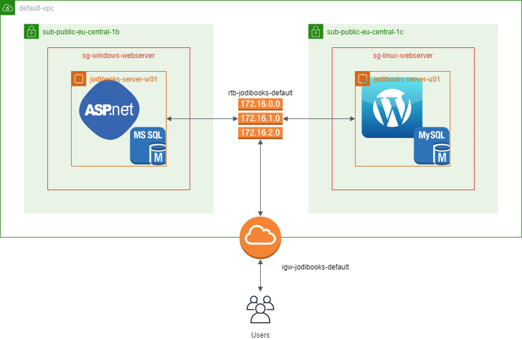
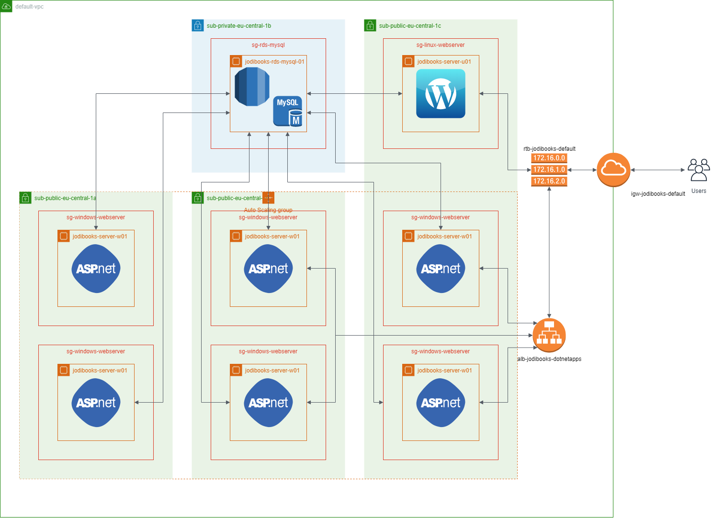

Currently we run one instance of each "machine". Every instance has a "maximum" number of users and visitors it can serve, before the average CPU usage gets [bigger than the baseline](../hosting-asp-net-apps-on-aws-appendix-d-ec2-instance-type-selection/). When we get more users than one instance can support, their experience will suffer, by longer load times or increased latencies.

## Improvement 1: Dedicated database instance

Before we get into increasing computational power, we have to move the databases to a separate instance. The SQL server database on the Windows machine is struggling with the amount of memory and by having the databases inside of the instances, they're not stateless.

This database instance can be a self-managed EC2 instance or a managed [RDS](https://aws.amazon.com/rds/) instance. The latter is preferred obviously. However, SQL server RDS instances are [pricey](../hosting-asp-net-apps-aws-appendix-b-aws-pricing/), so we also want to migrate the application database to MySQL. With that we can move both databases (application and WordPress) to the [MySQL RDS instance](https://aws.amazon.com/rds/mysql/).

This RDS instance will be placed in a private subnet, preventing external entrance. The databases can only be accessed through the applications, not directly. The `sg-rds-mysql` security group will only allow the IP-addresses of our servers.

")

## Improvement 2: Load balancing and auto scaling

One way of dealing with the increased processing needs is to change the instance type to a bigger more powerful one. But we probably don't need that much CPU power all the time. We don't want to have a big, expensive server idling at night.

This is were the elasticity of the cloud is super-awesome. By creating an auto scaling group, AWS will create additional identical (hence the stateless requirement) instances when needed (scale out) and terminates them when they are unnecessary (scale in). A load balancer will divide the traffic (users) between these instances.

Another advantage of this latest setup is you can have instances created in multiple availability zones. If one zone goes down, the scaling group will launch replacement instances in the other zones.

## Improvement 3:

### 3a. Multi-AZ database and read replicas

Everything after that is "far" in the future. So I didn't bother sketching it. However, the database availability can be improved by having a Multi-AZ (availibility zone) setup. In that case a second instance, in a different AZ, will be standby and ready when a failure of the first occurs.

You can also add a read-replica in another AZ. This will offload reading from the master instance, increasing overall performance.

### 3b. Aurora MySQL

Preferably though, I would want to use [Aurora](https://aws.amazon.com/rds/aurora/) by that stage. The Aurora engine has even better duplication.

- [https://jayendrapatil.com/aws-rds-aurora/](https://jayendrapatil.com/aws-rds-aurora/)
- [https://www.slideshare.net/AmazonWebServices/amazon-rds-deep-dive-61807570](https://www.slideshare.net/AmazonWebServices/amazon-rds-deep-dive-61807570)
- [https://pagely.com/blog/benchmarked-amazons-new-aurora-database-use-wordpress-results-within/](https://pagely.com/blog/benchmarked-amazons-new-aurora-database-use-wordpress-results-within/)

### 3c. Move to containers with ECS

We need to [refactor our monolith](https://blog.jodibooks.com/2019/10/architectuur-deel-2-de-jodibooks-architectuur/) first.
