## 1. Install applications and tools

### 1.1 IIS

To run our web applications we need IIS (Internet Information Services). This software comes standard with Windows, but you need to install it manually.

1. Log into the remote desktop of your Windows instance and open _Server Manager_. Now click **2 Add roles and features**.

    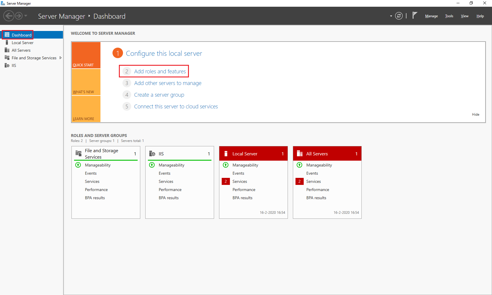

2. Select **Role-based or feature-based installation** and click next.

    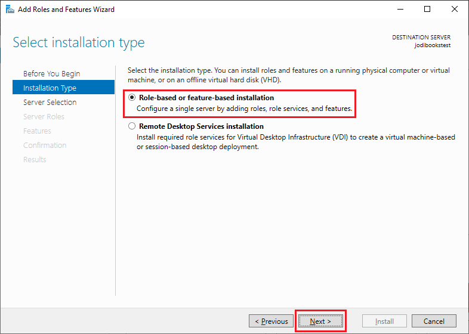

3. Choose **Select a server from the server pool**, select the `jodibooks-W01` server and click **Next**.

    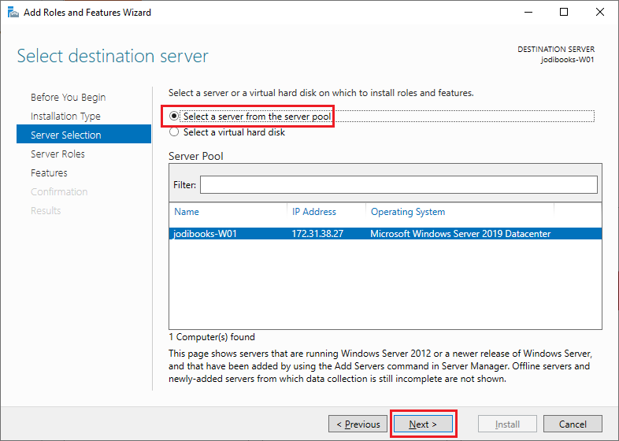

4. Scroll down to **Web Server (IIS)** and expand the option. Select the following options:

- Web Server

    - Common HTTP Features
        - **Default Document**
        - **Directory Browsing**
        - **HTTP Errors**
        - **Static Content**
    - Health and Diagnostics
        - **HTTP Logging**
    - Performance
        - **Static Content**
        - **Dynamic Content**
    - Application Development
        - **.NET Extensibility 4.7**
        - **Application Initialization**
        - **ASP.NET 4.7**
        - **ISAPI Extensions**
        - **ISAPI Filters**

- Management Tools
    - **IIS Management Console**
    - **IIS Management Service**

    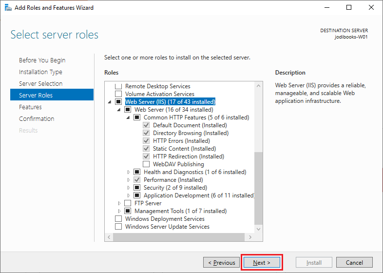

5. In the _Features_ screen expand **.NET Framework 4.7 Features** and make sure that **.NET Framework 4.7** and **ASP.NET 4.7** are selected or installed. Click **Next** again.

    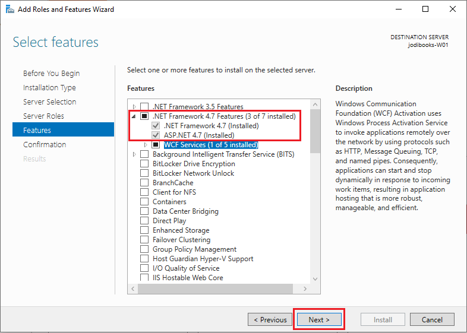

6. Press **Install** to start adding the selected features.

    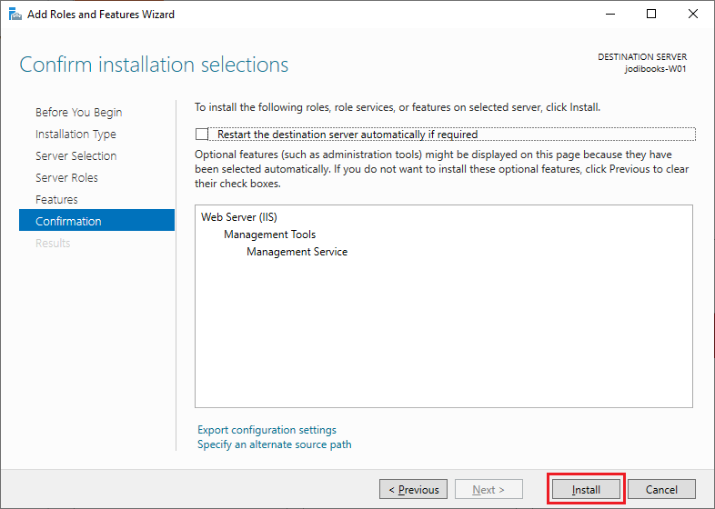

* * *

### 1.2 Web Platform Installer (WebPI)

To add additional tools to IIS, Microsoft uses a stand-alone installer. It integrates into IIS, but needs to be installed separately.

1. Download the installer from: <https://www.microsoft.com/web/downloads/platform.aspx>
2. Run the installer. All defaults are fine.
3. Restart IIS (close and re-open).
4. When you click on the server, the icon for WebPI is the last one in the list.

    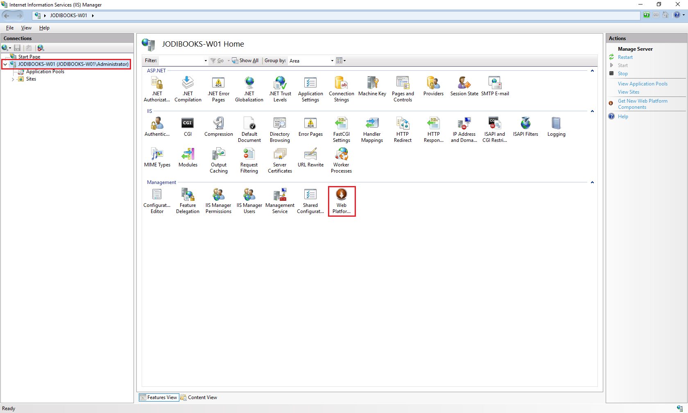

5. Open it, select the _Applications_ tab and search for `URL Rewrite`. The search results should find _URL Rewrite 2.1_. Install it by clicking **Install** in the application row and then **Install** at the bottom.

* * *

## 2. Deploy our ASP.NET applications

On the D-drive we're going to create some folders for our applications. This is our folder structure just as an example:

- `apps`
    - `api`
        - `sub api 1`
        - `sub api 2`
        - `sub api 3`
    - `beauty`
    - `management`
    - `payments`
    - `www`
- `databases`
- `download`
- `jobs`
- `logs`
- `scripts`

Not surprisingly `apps` are our published ASP.NET applications. `databases` is used as a temp folder for database exports and backups. `download` to upload new files to, like a new application release or installer. Exports from the Task Scheduler ([Part 15](../hosting-asp-net-apps-aws-part-15-backup-scripting/)) are put in `jobs` and `scripts` contains the scripts (also [Part 15](../hosting-asp-net-apps-aws-part-15-backup-scripting/)) to backup the database and log files. The script logs are stored in `logs`.

I assume you have published your application(s) and are ready to go, so let's do this.

1. Zip your application files and upload it to the download folder. Uploading a single file goes much faster than numerous small files.
2. Unzip the applications to their folders. Preferably you have one folder per application.
3. Go to the `apps` folder and **Right-click** it. Click **Properties** and in the new windows select the tab **Security**. Now click **Edit** and add the user `IIS_IUSR`. Make sure this user has `Read & execute`, `List folder contents` and `Read` permissions.

    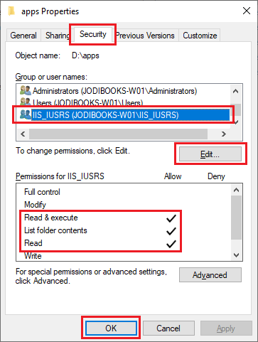

4. Open the _IIS Manager_. Delete the default website under **Sites**. Click **Application Pools** and **Add Application Pool...**

    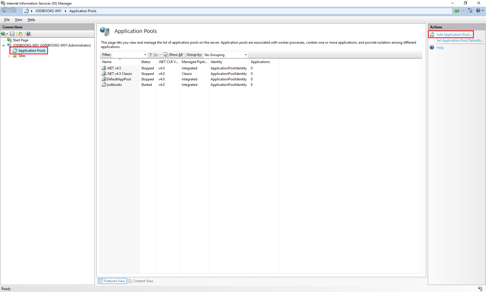

5. Give the application pool a name: `jodibooks-main` or `jodibooks-apps` or just `jodibooks`.

    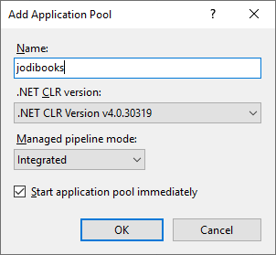
    
    You can create one app pool per application or run multiple applications in the same pool. In the former case you have more granular control over the timeouts of each application (always on, suspend, terminate and time). The latter can be more memory efficient. We ended up putting all the applications in a single pool, but it's up to you to test and experiment with your own applications.

    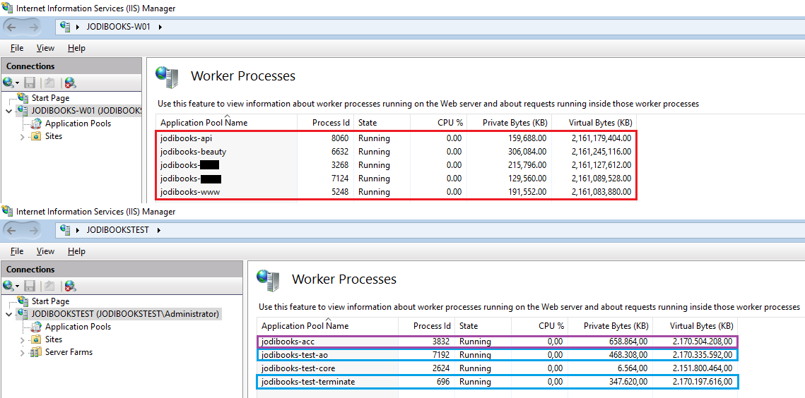

    In red (top) our 5 always on applications in 5 separate app pools (image from production server). In blue (bottom) our 8 applications split in two app pools: ao (always on) and terminate. In purple (also bottom) all 8 applications in a single app pool (image from test server).

6. Click the server name and open **Authentication**.

    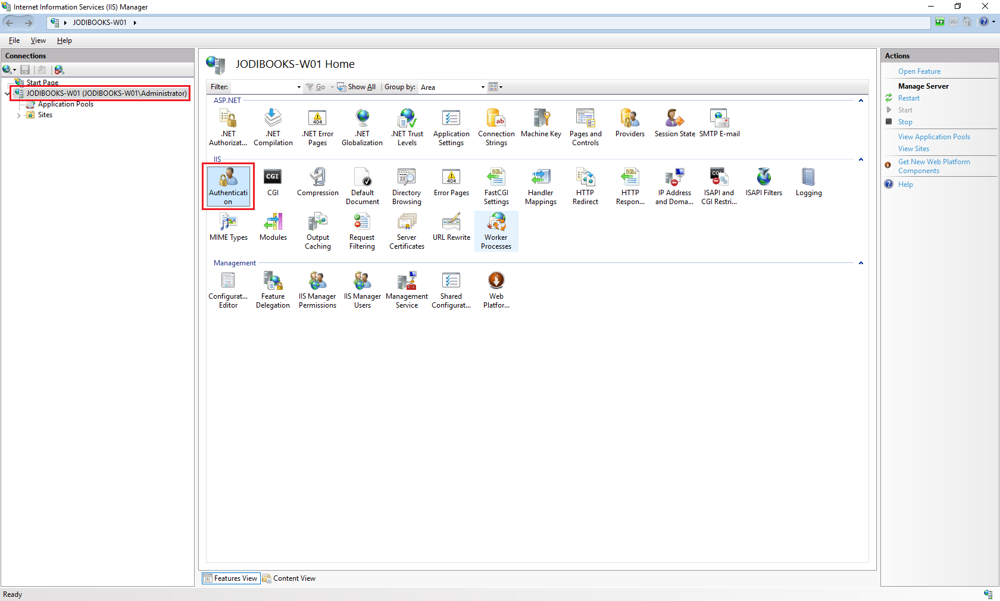

7. Select **Anonymous Authentication** and click **Edit** in the top right corner. Now make sure **Application pool identity** is selected.

    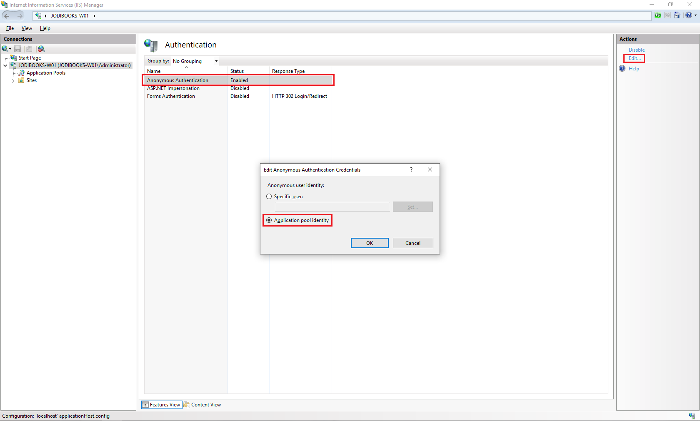

8. **Right-click** the _Sites_ icon on the left and click **Add Website**. Give the site a name, I'd suggest using the folder name: `www`. Choose the app pool you want this application to run in, **browse** to the folder and set the _Binding_ as _type:_ `http`, _IP address:_`All Unassigned`, _port:_ `80` and _Host name:_ `jodibooks.com` (we're flattered, but obviously you change this to your domain).

    

9. Repeat for all applications that you want to give their own domain. Subapplications that you want to reach as a folder, for example a separate payments API (`api.jodibooks.com/payments`), have to be added as applications. **Right-click** the website `api` and click **Add Application.**

    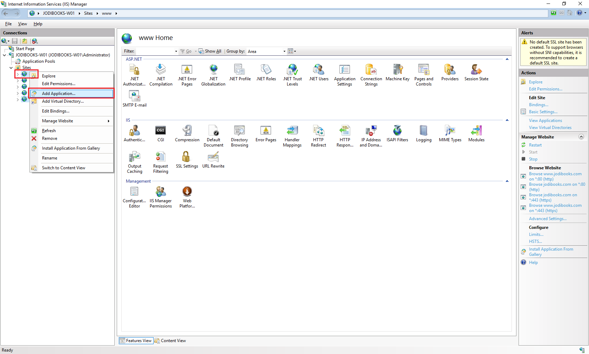

10. Give the application an _Alias:_ `payments` and change the _Application pool_ if you want. **Browse** to the folder for the application and click **OK**.

    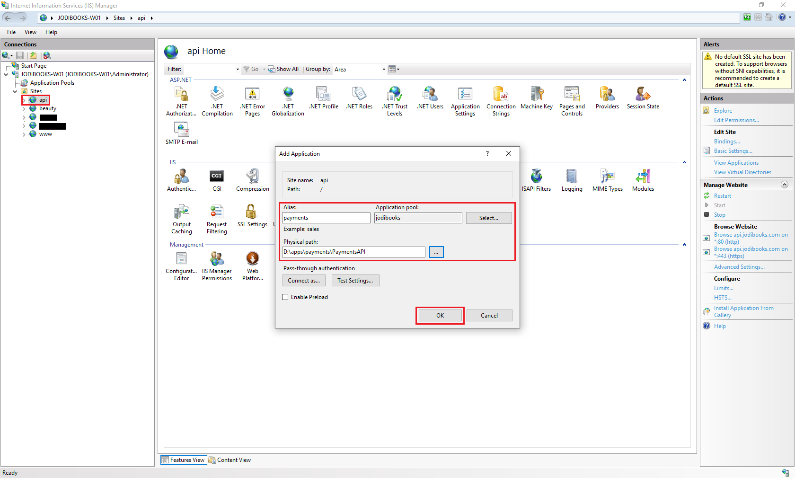

11. This step is a bonus. If you want to shield your application from public access, but you want to reach it through your domain, for example a management dashboard or invoicing service, you can change the port from the standard port `80` to something else like `8080`. Now you have to open this port in the Windows firewall (only allowing your IP) and add a `management` security group with a `Custom TCP Rule` port to `My IP`.

    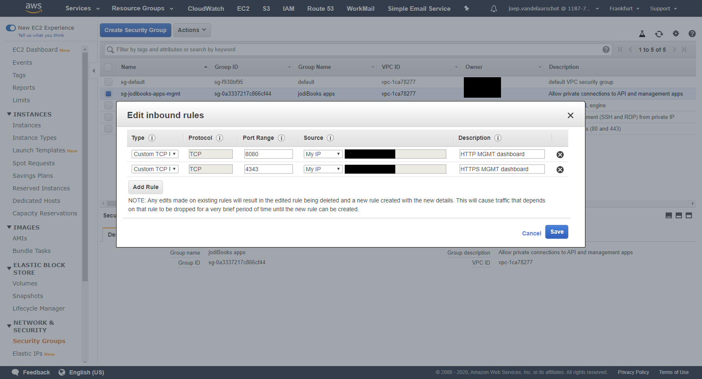

## 3. Optimize IIS settings

There are a lot of settings in IIS that affect the speed of your website. I went through this excellent guide to optimize the settings. It tells you how to configure caching, time-outs, application initialization, compression among others.

> https://port135.com/2019/05/17/recommendations-improve-iis-performance-fine-tuning/

## 4. IAM policy

One of our applications puts files in an S3 bucket. To be able to do that, it needs access credentials and a policy that allows using S3. The credentials are generated by creating a user in _IAM_. Remember that a user can be a person or a computer.

1. So we go to the IAM console and create a user `jodiBooks.Fileserver` with _Access type_ **Programmatic access**.

    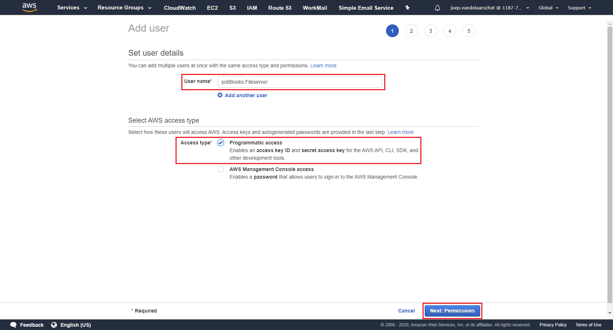

2. Select **Attach existing policies directly** and click **Create policy**.

    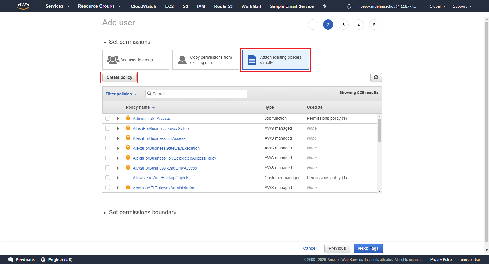

3. In the next screen choose `S3` as _Service_. Now select the actions you need. We need to create (`PutObject`), retrieve (`GetObject`) and delete (`DeleteObject`) files, so we needed the actions listed below. We also need to know which files there are, so we also add the `ListBucket` action.

    > Note: we needed to add `PutObjectTagging`, `GetObjectTagging` and `DeleteObjectTagging` to get our application working. Unfortunately the reason why got lost.

    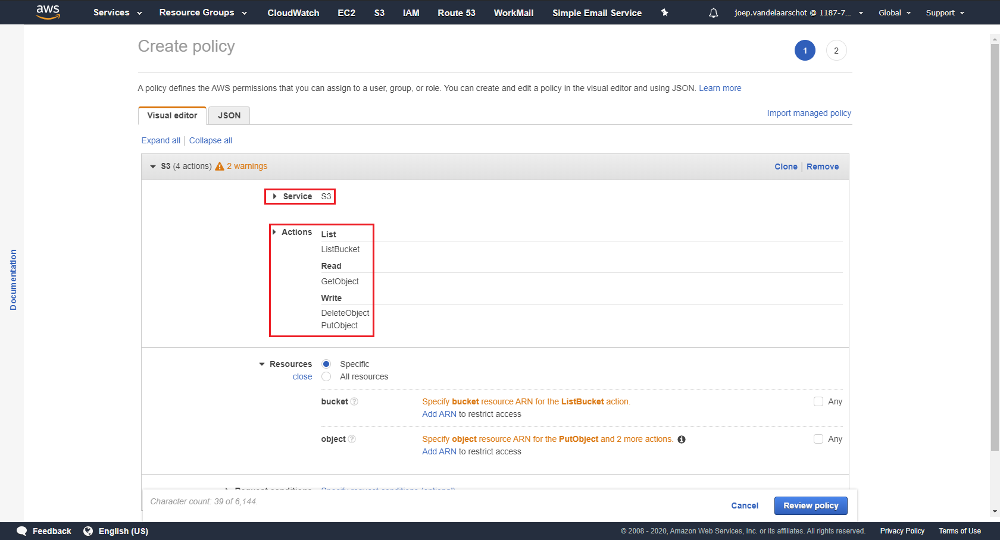

4. Specify resources. We want to limit the access to a specific bucket. We can do that by adding the _bucket ARN_ by copying it from S3 or by entering the _bucket name_.

    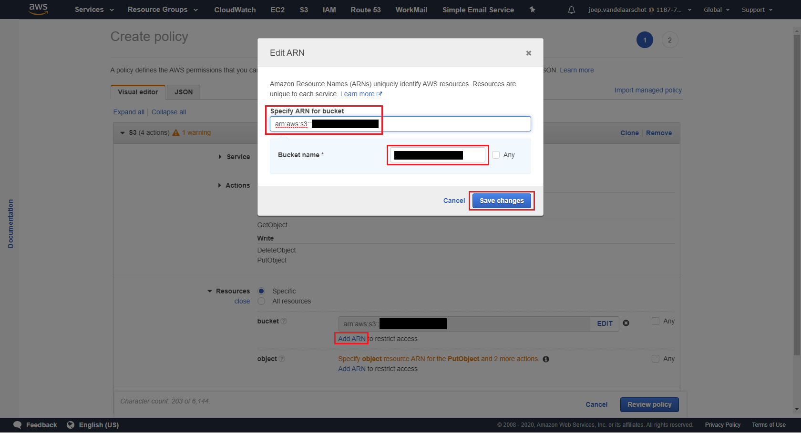

5. And we specify that all objects (select _Object name:_ **Any**) can be modified in that specific bucket (enter the _bucket name_ again).

    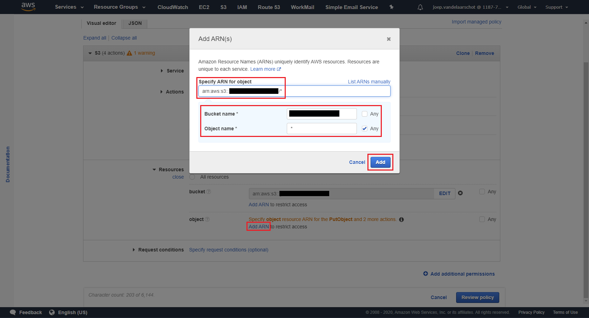

6. Now click **Review policy** and give it a name `jodiBooks.Fileserver.PROD.S3.Objects` and description `Allow our fileserver to put, get and delete objects from jodibooks-eu-central-1 bucket`.

    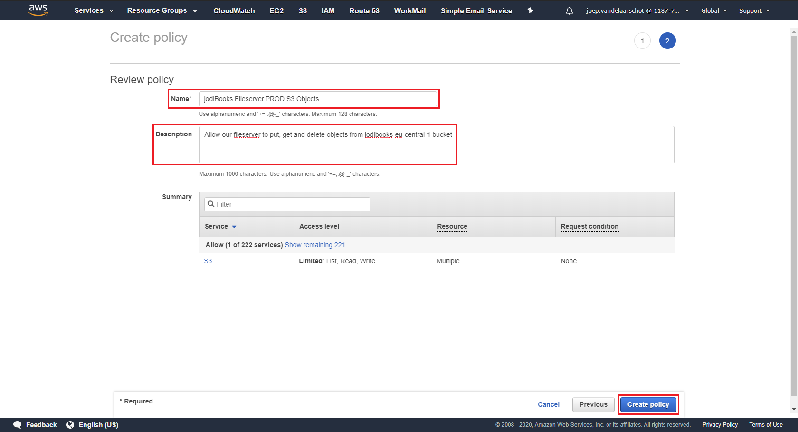

7. Go back to the _Add user_ screen, click the _Refresh button_ and add the newly created policy. You can _search_ for `jodiBooks.Fileserver.PROD.S3.Objects` or _Filter policies_ on **Customer managed** and select the policy.

    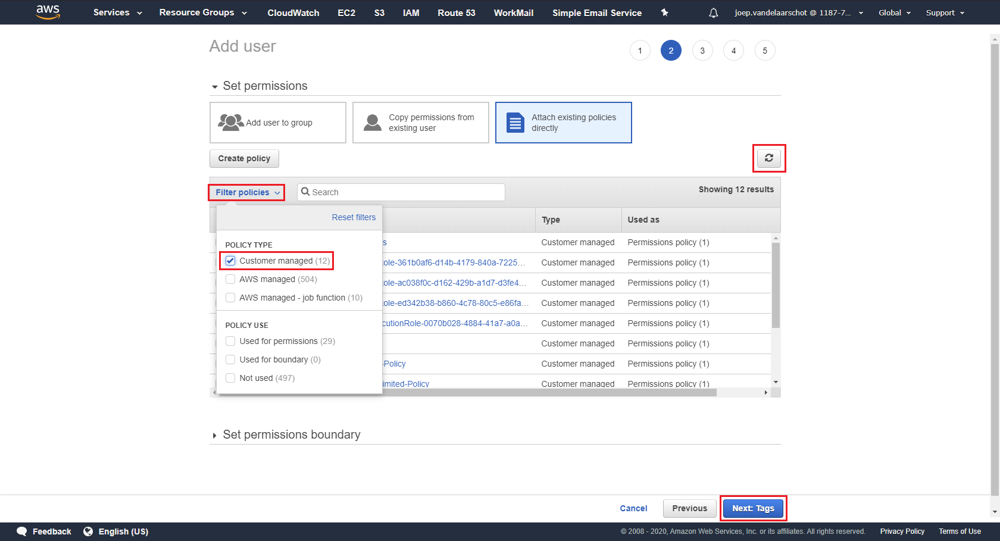

8. Tags are optional, so we skip them. Now **Create** the user and store the credentials. You can now use these credentials in your application.

## 5. Next: MS SQL

That's it for the applications. With the configuration of Route 53 in [part 7](../hosting-asp-net-apps-aws-part-7-domains-and-dns-with-route-53/), they should be reachable over an unencrypted HTTP connection. Before we add the SSL certificate, we need to [configure our database first](../hosting-asp-net-apps-aws-part-11-database-in-ms-sql/).
