## 1. The stack

To run WordPress we're going to need a hosting stack. In this case we're going to use the [LEMP](https://www.digitalocean.com/community/tutorials/how-to-install-linux-nginx-mysql-php-lemp-stack-ubuntu-18-04) stack, which stands for Linux, Nginx (pronounced engine-x, hence the E), MySQL and PHP. Next to that, we're also adding some additional tools to improve speed and security.

- **Ubuntu 18.04** - linux
- **MySQL 8** - database
- **Nginx** - webserver
- **PHP 7.3** - language engine
- **Redis** - object cache
- **Nginx FastCGI Cache** - http accelerator
- **Fail2ban** - security
- **Letsencrypt** - SSL

I based my complete installation on an excellent post by [Dave Hilditch](https://www.wpintense.com/author/davehilditch/). If you need or want to know more details on the choice of software and what it does exactly, please go to his original post (link below). He did a lot of testing and actually has the in-depth knowledge I lack.

> <https://www.wpintense.com/2018/10/20/installing-the-fastest-wordpress-stack-ubuntu-18-mysql-8/>

I did however modified some parameters because my server has less memory. For more information on those settings go to [Ashley Rich](https://ashleyrich.com/)' tutorial on SpinupWP:

> <https://spinupwp.com/hosting-wordpress-yourself-nginx-php-mysql/>

## 2. Install stack

1. Login to the Ubuntu EC2 instance with PuTTY as described in [part 6](../hosting-asp-net-apps-aws-part-6-servers-in-ec2-part-2/).
2. Run the following commands one by one to install **MySQL**. Copy a single line and right-click in PuTTY to paste.

    **NOTE**: Do not choose the default for the authentication mechanism when installing MySQL, use the `LEGACY` authentication mechanism to remain WordPress compatible.

    ```shellsession
    sudo apt update && sudo apt upgrade 
    sudo wget -c https://dev.mysql.com/get/mysql-apt-config_0.8.14-1_all.deb
    sudo dpkg -i mysql-apt-config_0.8.14-1_all.deb
    sudo apt install software-properties-common
    sudo add-apt-repository ppa:ondrej/php
    sudo apt update && sudo apt upgrade
    sudo apt install mysql-server -y # accept all defaults
    ```

3. Run the following commands one by one to install **Nginx**, **PHP** and **Redis**.

    ```shellsession
    sudo apt -y install php7.3
    sudo apt purge apache2 -y
    sudo apt install -y nginx tmux curl php7.3-fpm php7.3-cli php7.3-curl php7.3-gd php7.3-intl php7.3-mysql php7.3-mbstring php7.3-zip php7.3-xml unzip php7.3-soap php7.3-redis redis
    ```

4. Install **Fail2ban**.

    ```shellsession
    sudo apt install fail2ban
    ```

5. Install Letsencrypt

    ```shellsession
    sudo apt update
    sudo apt install software-properties-common
    sudo add-apt-repository universe
    sudo add-apt-repository ppa:certbot/certbot
    sudo apt update
    sudo apt install python-certbot-nginx
    ```

## 3. Configure

### 3.1 Redis

1. Edit /etc/redis/redis.conf to prevent it from writing to disk. We are only interested in using it as an object cache in memory.

    ```shellsession
    sudo nano /etc/redis/redis.conf
    ```

2. Press `ctrl+w` to search and search for `maxmemory`. Now set it to `100mb`.

    ```ini
    # limit for maxmemory so that there is some free RAM on the system for slave
    # output buffers (but this is not needed if the policy is 'noeviction').
    #
    maxmemory 100mb
    ```

3. Now search for `maxmemory-policy` and set it to `allkeys-lru` to delete old keys using first-in-first-out principle.

    ```ini
    # The default is:
    #
    maxmemory-policy allkeys-lru
    ```

4. Search for `save 900` and comment out the 3 lines that start with `save`.

    ```ini
    #   like in the following example:
    #
    #   save ""

    #save 900 1
    #save 300 10
    #save 60 10000
    ```

5. Now press `ctrl+x`, `y` and `enter` to save and close.
6. Restart redis with this command:

    ```shellsession
    sudo service redis-server restart
    ```

### 3.2 Nginx

1. Go to Route 53 and add a _Type_ `A` record with name `blog` to the Ubuntu instance: _Value_ `<instance public IP>`.

    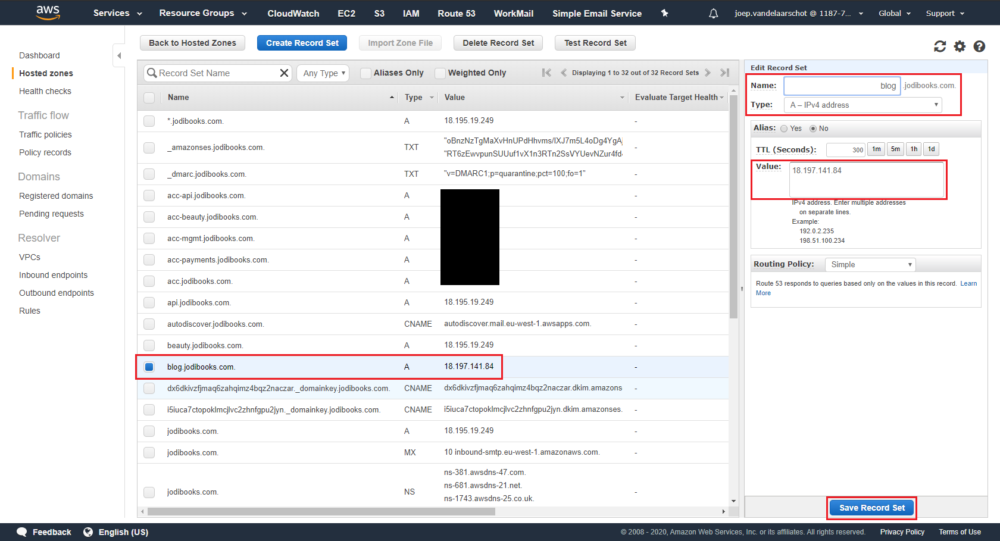

2. We are lazy so we're not going to figure out all the settings. Luckily Dave has done all the tedious work and is kind enough to [share his efforts](https://github.com/dhilditch/wpintense-rocket-stack-ubuntu18-wordpress). Let's download it:

    ```shellsession
    cd ~
    git clone https://github.com/dhilditch/wpintense-rocket-stack-ubuntu18-wordpress
    sudo cp wpintense-rocket-stack-ubuntu18-wordpress/nginx/* /etc/nginx/ -R
    sudo ln -s /etc/nginx/sites-available/jodibooks.conf /etc/nginx/sites-enabled/
    sudo rm /etc/nginx/sites-enabled/default
    ```

3. His files use the `nginx_fastcgi_cache` library, and for that to work we need to create a cache folder.

    ```shellsession
    sudo mkdir /var/www/cache
    sudo mkdir /var/www/cache/jodibooks
    sudo chown www-data:www-data /var/www/cache/ -R
    ```

4. Open the jodibooks.conf file and update the cache folder.

    ```shellsession
    sudo nano /etc/nginx/sites-available/jodibooks.conf
    ```

    Change the top of the file to:

    ```nginx
    # This config file uses nginx fastcgi-cache
    fastcgi_cache_path /var/www/cache/jodibooks levels=1:2 keys_zone=jodibooks:100m inactive=60m;
    ```

5. Now we're going to enter our own domain name `server_name` and change the website folder to our own `/var/www/jodibooks`. We also change the log files to our name: `jodibooks_access.log` and `jodibooks_error.log`.

    ```nginx
    server {
        listen 80;
        listen [::]:80;
        server_name blog.jodibooks.com;

    root /var/www/jodibooks;

    index index.php index.htm index.html;

    access_log /var/log/nginx/jodibooks_access.log;
    error_log /var/log/nginx/jodibooks_error.log;
    ```

6. Now press `ctrl+x`, `y` and `enter` to save and close. Check if you made no errors and restart Nginx:

    ```shellsession
    sudo ln -s /etc/nginx/sites-available/jodibooks.conf /etc/nginx/sites-enabled/
    sudo nginx -t
    sudo service nginx restart
    ```

7. When you go to your website `blog.jodibooks.com` you should get a 404 error.

    

8. Because our server has limited memory, we're going to change some additional settings. Search for each one of them and change the values to the ones listed below.

    ```shellsession
    sudo nano /etc/nginx/nginx.conf
    ```

    - Set 1 worker per vCPU `worker_processes 2;` and max number of connections per worker `worker_connections 1024;`. This gives us a maximum of 2048 connections.
    - Set `multi_accept on;` to accept all new connections at a time, opposed to accepting one new connection at a time.

    ```nginx
    user www-data;
    worker_processes 2;
    pid /run/nginx.pid;
    include /etc/nginx/modules-enabled/*.conf;

    events {
            worker_connections 1024;
            multi_accept on;
    }
    ```

    - In the **http** section under **Basic Settings** change the timeout from 65 to 30 seconds: `keepalive_timeout 30;`
    - Uncomment and set to off: `server_tokens off;`. This will disable emitting the Nginx version number in error messages and response headers.
    - Below the previous add line `client_max_body_size 64m;`. This is the maximum upload size for media library files.

    ```nginx
    http {

        ##
        # Basic Settings
        ##

        sendfile on;
        tcp_nopush on;
        tcp_nodelay on;
        keepalive_timeout 30;
        types_hash_max_size 2048;
        server_tokens off;
        client_max_body_size 64m;
    ```

    - Further down you'll find a **Gzip Settings** section. Uncomment and set to any `gzip_proxied any;`
    - Set a gzip compression level (1-9), higher is better compression, but also higher CPU usage. `gzip_comp_level 2;`
    - Uncomment the `gzip_types ...;`

    ```nginx
    ##
    # Gzip Settings
    ##

    gzip on;

    # gzip_vary on;
    gzip_proxied any;
    gzip_comp_level 2;
    # gzip_buffers 16 8k;
    # gzip_http_version 1.1;
    gzip_types text/plain text/css application/json application/javascript text/xml application/xml application/xml+rss text/javascript;
    ```

9. Press `ctrl+x`, `y` and `enter` to save and close. Check if you made no errors:

    ```shellsession
    sudo nginx -t
    ```

10. Open and edit the `fastcgi_params` file.

    ```shellsession
    sudo nano /etc/nginx/fastcgi_params
    ```

11. Check if the line below exists. If not, add it.

    ```nginx
    fastcgi_param  SCRIPT_FILENAME    $document_root$fastcgi_script_name;
    ```

12. Save and close, check if you didn't make an error and restart Nginx.

    ```shellsession
    sudo nginx -t
    sudo service nginx restart
    ```

### 3.3 MySQL

1. WordPress uses a MySQL database which we have to create first. Log in to MySQL. The first time you have to enter a password. Generate a strong password and save it somewhere.

    ```shellsession
    sudo mysql -u root -p
    ```

2. Create the database by running the following SQL one line at a time, including the ";". Again choose a strong password, this time for the WordPress database. I.e. WordPress only has access to this database, not to other MySQL databases on this instance. For now that doesn't matter as we only run the WP database, but it might come in handy in the future: [Appendix E](../hosting-asp-net-apps-aws-appendix-e-improved-architectures/).

    - Database: `wordpress`
    - Database User: `jodibooksWP`
    - Database Password: _CHOOSEASTRONGPASSWORD_

    ```sql
    CREATE DATABASE jodibooksWP;
    CREATE USER 'wordpress'@'localhost' IDENTIFIED WITH mysql_native_password BY 'CHOOSEASTRONGPASSWORD';
    GRANT ALL PRIVILEGES ON jodibooksWP.* TO'wordpress'@'localhost';
    EXIT;
    ```

3. Now that we have a database, we can tune and tweak the settings. Open `mysqld.cnf` to edit and add the lines below to the end of the file.

    ```shellsession
    sudo nano /etc/mysql/mysql.conf.d/mysqld.cnf
    ```

    ```ini
    innodb_buffer_pool_size = 200M
    innodb_log_file_size = 100M
    innodb_buffer_pool_instances = 8
    innodb_io_capacity = 5000
    max_binlog_size = 100M
    expire_logs_days = 3
    max_connections = 50
    ```

    > I based mine on these two posts, the first uses a server with 4 GB the second 2 GB, where we have 1 GB:
    > 1. <https://www.wpintense.com/2018/10/20/installing-the-fastest-wordpress-stack-ubuntu-18-mysql-8/>
    > 2. <https://www.lisenet.com/2015/optimise-mysql-configuration-for-wordpress/>

4. Now press `ctrl+x`, `y` and `enter` to save and close.
5. Restart MySQL:

    ```shellsession
    sudo service mysql restart
    ```

6. Now we're going to create a hidden file with our credentials, so we don't have to enter them every time (<https://easyengine.io/tutorials/mysql/mycnf-preference/>). Open the file in the nano editor.

    ```shellsession
    sudo nano ~/.my.cnf
    ```

    It should in the end look something like this:

    ```ini
    [client]
    socket=/var/run/mysqld/mysqld.sock
    user=wordpress
    password=<CHOOSEASTRONGPASSWORD>
    ```

6. Press `ctrl+x`, `y` and `enter` to save and close. And

    ```shellsession
    sudo chmod 0600 ~/.my.cnf
    ```

7. After the blog is up and running for a few weeks (and regularly after that), run a tuning script to check for possible optimizations to the settings in `mysqld.cnf` (step 3).

    ```shellsession
    cd ~
    git clone https://github.com/BMDan/tuning-primer.sh
    cd tuning-primer.sh
    sudo ./tuning-primer.sh
    ```

     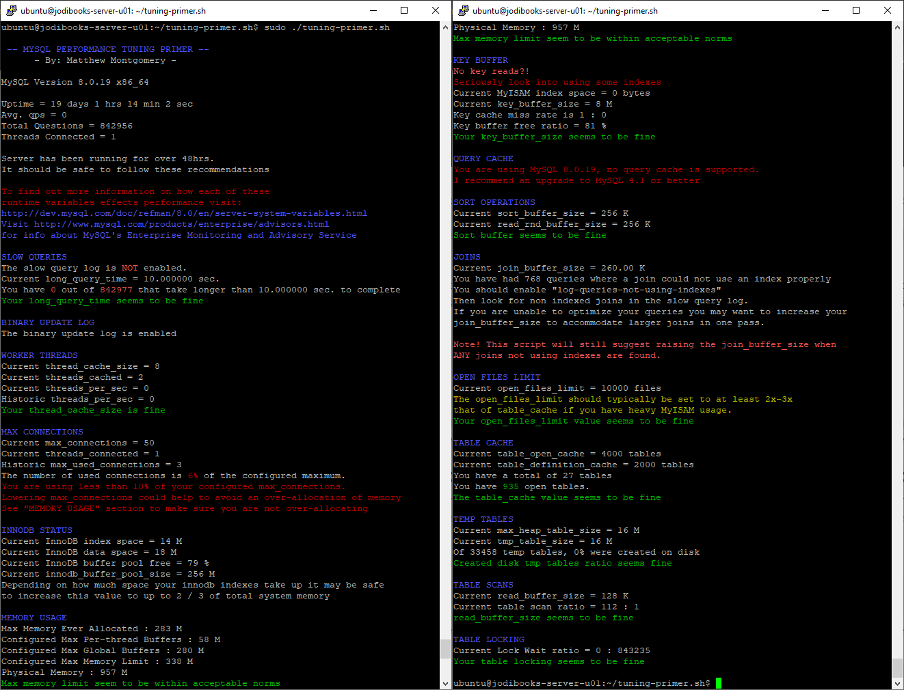

### 3.4 PHP

1. Open `php.ini` file to edit.

    ```shellsession
    sudo nano /etc/php/7.3/fpm/php.ini
    ```

2. Now search (`ctrl+w`) for `max_execution_time`, `memory_limit`, `upload_max_filesize`and `post_max_size`. Set them to the values below (max sizes should be the same as entered in the Nginx config file earlier).

    ```ini
    max_execution_time = 6000
    memory_limit = 256M
    upload_max_filesize = 64M
    post_max_size = 64M
    ```

3. Search for and uncomment `;max_input_vars = 1000` and change value to `5000`.

    ```ini
    max_input_vars = 5000
    ```

4. Search for opcache and uncomment the next lines and change values if needed:

    ```ini
    opcache.enable=1
    opcache.memory_consumption=128
    opcache.interned_strings_buffer=8
    opcache.max_accelerated_files=50000
    opcache.revalidate_freq=60
    ```

5. Press `ctrl+x`, `y` and `enter` to save and close. Check for correct syntax:

    ```shellsession
    sudo php-fpm7.3 -t
    ```

6. Now open the `www.conf` file for editing.

    ```shellsession
    sudo nano /etc/php/7.3/fpm/pool.d/www.conf
    ```

7. Search for `pm =` and set it to `static`. "_The default is pm = dynamic. If you set pm = static, you can then set pm.max\_children to control how many simultaneous PHP processes will be running the entire time your server is running._"

    ```ini
    ; Note: This value is mandatory.
    pm = static

    ; The number of child processes to be created when pm is set to 'static' and the
    ; maximum number of child processes when pm is set to 'dynamic' or 'ondemand'.
    ; This value sets the limit on the number of simultaneous requests that will be
    ; served. Equivalent to the ApacheMaxClients directive with mpm_prefork.
    ; Equivalent to the PHP_FCGI_CHILDREN environment variable in the original PHP
    ; CGI. The below defaults are based on a server without much resources. Don't
    ; forget to tweak pm.* to fit your needs.
    ; Note: Used when pm is set to 'static', 'dynamic' or 'ondemand'
    ; Note: This value is mandatory.
    pm.max_children = 2
    ```

8. Save and close the file, check for correct syntax and restart php.

    ```shellsession
    sudo php-fpm7.3 -t
    sudo service php7.3-fpm restart
    ```

9. Let's check if we indeed have 2 child processes running. Type `top` in the console and press `shift+M` to sort on memory usage. You can also press e to switch to show the memory in megabytes. We should see a few occurrences of both nginx and php-fpm. Both will have one instance running under the root user (this is main process that spawns each worker) and the remainder (2) should be running under the username you specified.

     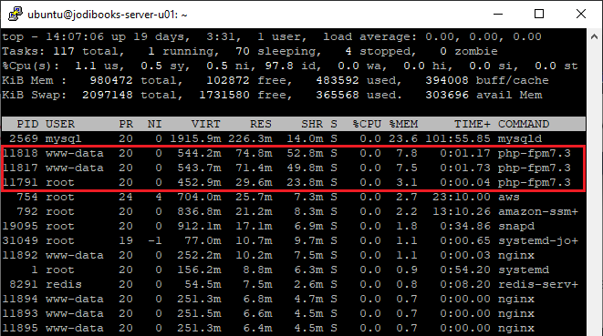

### 3.5 Fail2ban

To quote Dave Hilditch: "_The basic install, if you’ve followed the installation above, automatically includes SSH/putty attacks and blocks those attacks based on IP addresses. I will write a separate article about configuring fail2ban as it can be complicated, but if you wish to get this set up, you should install the [WP fail2ban plugin](https://wordpress.org/plugins/wp-fail2ban/) and follow their guide for adding their ‘jails’ and ‘filters’. Basically, fail2ban uses filter config files to spot dodgy traffic and then uses the jail config files to decide how long to ban them._"

I could not find that article and haven't bothered since. So please share if you have a decent tutorial on fail2ban.

## 4. WordPress

We already had a WordPress blog running, so we wanted to migrate the files and database to this new EC2 instance. That was in the end pretty easy, but there some things you need to know. I'll explain in the "Import existing site" section. Installing a brand new site however is much easier, so let's start with that.

### 4.1 Install new site

1. Download and install WordPress by running the following commands one line at a time.

    ```shellsession
    sudo wget https://wordpress.org/latest.zip -P /var/www/
    sudo unzip /var/www/latest.zip -d /var/www/
    sudo mv /var/www/wordpress /var/www/jodibooks
    sudo chown www-data:www-data /var/www/jodibooks -R
    sudo rm /var/www/latest.zip
    ```

2. Enter your (sub)domain name and you should see the WordPress installation screen. In the installation screen, you’ll be asked for the _database name_, the _database username_ and the _database password_, so enter those from when you created the MySQL database:

    - Database: `wordpress`
    - Database User: `jodibooksWP`
    - Database Password: _CHOOSEASTRONGPASSWORD_

    You should obviously change ‘_CHOOSEASTRONGPASSWORD_’, although with this config, and because we ran the secure mysql scripts, remote login to your MySQL server will be disallowed.

    "_For some weird reason, the WordPress installer fails miserably if your site starts out HTTPS. So, you have to install over HTTP and then convert to HTTPS._" As I haven't done a new install, I'll advise you to head over to the original post here: <https://www.wpintense.com/2018/10/20/installing-the-fastest-wordpress-stack-ubuntu-18-mysql-8/> and browse to the "Changing your site to use SSL" section.

### 4.2 Import existing site

Again this is nothing new. I found an excellent guide here:

> <https://www.wpbeginner.com/wp-tutorials/how-to-move-wordpress-to-a-new-host-or-server-with-no-downtime/>

My migration was a little bit different though, so I'll summarize to only show the parts of the guide I used and what I needed to change.

1. On your existing WordPress install and activate the **Duplicator** plugin.

     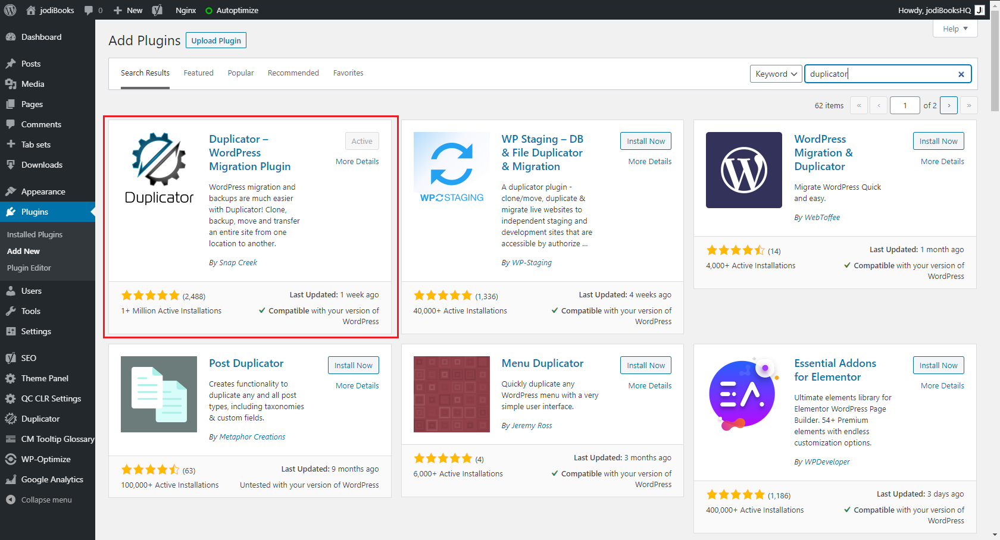

2. Go to the plugin page and click **Create New**.

     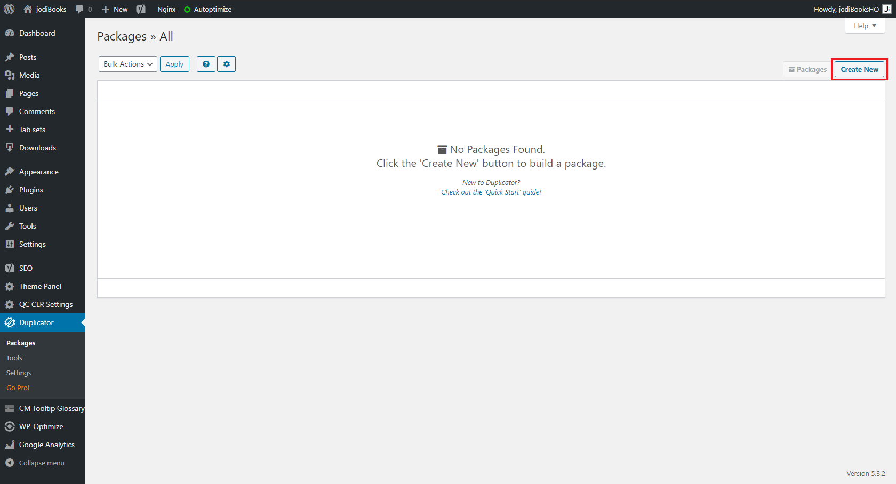

3. Give the package a _name_ `20200219_jodibooks` and click **Next**.

     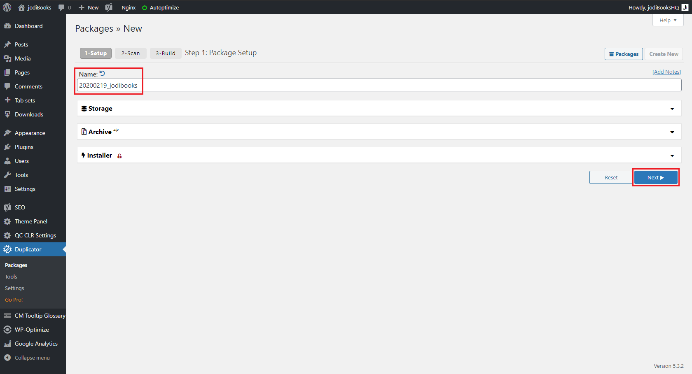

4. After scanning we find a notice on big files. Nothing much to do about it, so we mark the checkbox and press **Build**.

     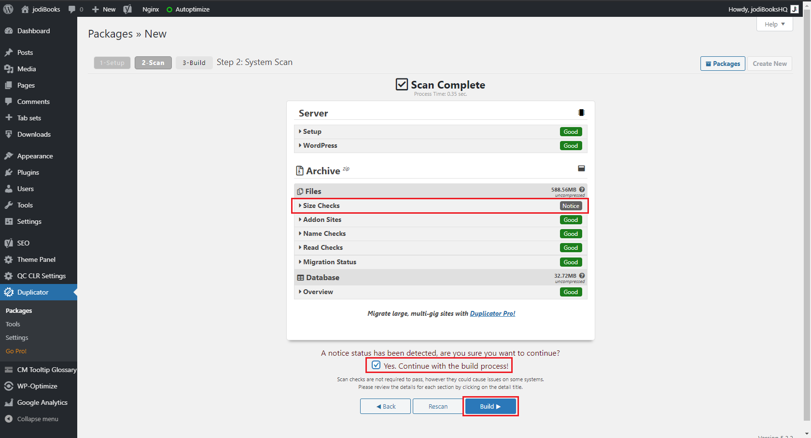

5. Give it some time. When the build is done, download both files to your local computer.

     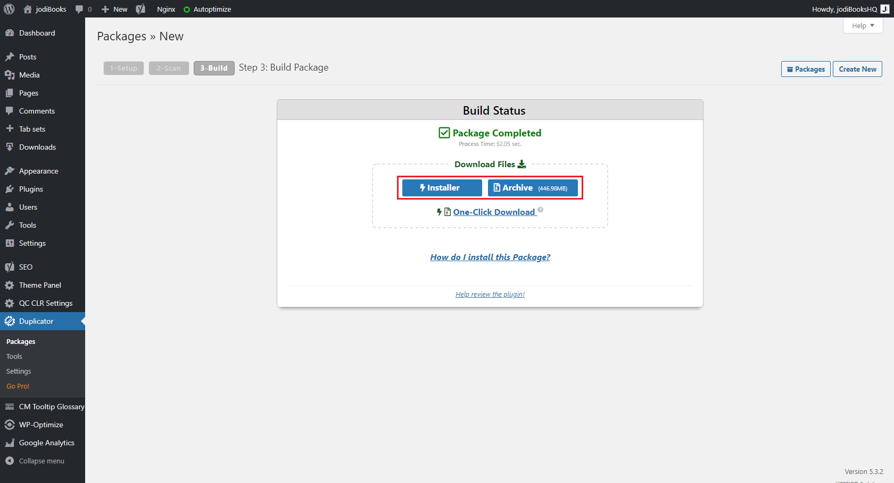

6. Now we need to upload these files to our Ubuntu instance. To do that we first need to make a folder in our home directory on the instance. So in a PuTTY SSH session to the Ubuntu instance type:

    ```shellsession
    cd ~
    mkdir downloads
    ```

7. Now we will copy the files to that folder using the SSH connection with a program called [PSCP](https://www.ssh.com/ssh/putty/putty-manuals/0.68/Chapter5.html). It comes standard with the PuTTY Windows installer.

     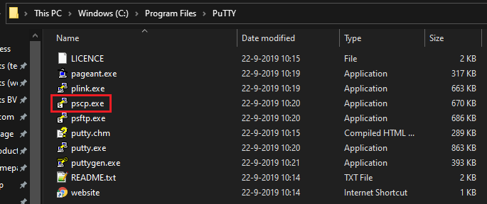

8. Open a command shell in Windows and check if the %PATH% to the executable exists. Enter `pscp` and the result should be something like this.

    ```shellsession
    PuTTY Secure Copy client
    Release 0.73
    Usage: pscp [options] [user@]host:source target
        pscp [options] source [source...] [user@]host:target
        pscp [options] -ls [user@]host:filespec
    Options:
    -V        print version information and exit
    -pgpfp    print PGP key fingerprints and exit
    -p        preserve file attributes
    -q        quiet, don't show statistics
    -r        copy directories recursively
    -v        show verbose messages
    -load sessname  Load settings from saved session
    -P port   connect to specified port
    -l user   connect with specified username
    -pw passw login with specified password
    -1 -2     force use of particular SSH protocol version
    -4 -6     force use of IPv4 or IPv6
    -C        enable compression
    -i key    private key file for user authentication
    -noagent  disable use of Pageant
    -agent    enable use of Pageant
    -hostkey aa:bb:cc:...
                manually specify a host key (may be repeated)
    -batch    disable all interactive prompts
    -no-sanitise-stderr  don't strip control chars from standard error
    -proxycmd command
                use 'command' as local proxy
    -unsafe   allow server-side wildcards (DANGEROUS)
    -sftp     force use of SFTP protocol
    -scp      force use of SCP protocol
    -sshlog file
    -sshrawlog file
                log protocol details to a file
    ```

9. If not add it temporarily and browse to the download folder:

    ```shellsession
    set PATH="C:\Program Files\PuTTY";%PATH%
    cd onedrive\downloads
    ```

10. Now we have to copy the files to our instance. The syntax is like this:

    ```shellsession
    pscp -i <private key> <source> <destination>
    ```

    - Private key: `C:\Users\Joepje\Documents\jodibooks-ubuntu-server-01.ppk`
    - Source: `20200219_jodibooks_8285e0759081a6fb1247_20200219151251_archive.zip` and `installer.php`
    - Destination: `ubuntu@blog.jodibooks.com:downloads/`

    Note: remember to use quotes **" "** when there is a space in the path or filename somewhere.

    ```shellsession
    pscp -i C:\Users\Joepje\Documents\jodibooks-ubuntu-server-01.ppk installer.php ubuntu@blog.jodibooks.com:downloads/
    pscp -i C:\Users\Joepje\Documents\jodibooks-ubuntu-server-01.ppk 20200219_jodibooks_8285e0759081a6fb1247_20200219151251_archive.zip ubuntu@blog.jodibooks.com:downloads/
    ```

    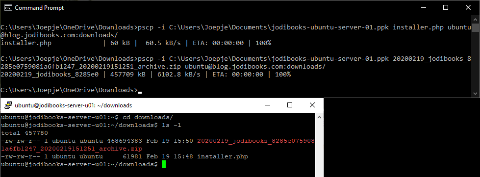

11. We can close the command terminal in Windows and focus on the PuTTY terminal. The files we just uploaded need to be moved to the web folder we configured in Nginx: `/var/www/jodibooks`.

    ```shellsession
    sudo mv -v ~/downloads/* /var/www/jodibooks/
    ```

12. Now we can open the installer by going to `blog.jodibooks.com/installer.php` in our browser.

     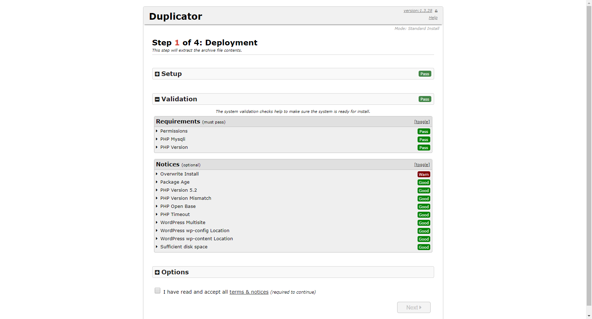

13. I can't continue any further, because I don't want to overwrite my existing installation. On the next page you have to enter your MySQL host, database name, user and password. The host is `localhost`. After that it is all pretty straight forward. If in doubt check [step 6 here](https://www.wpbeginner.com/wp-tutorials/how-to-move-wordpress-to-a-new-host-or-server-with-no-downtime/#runduplicatorscript).
14. When done, the plugin will cleanup all temp files. Login to your WordPress install and go to the Duplicator plugin. Delete the package and remove the plugin.
15. Go to the settings page in WordPress and change the WordPress Address and Site Address to `https://<your domain>` and **Save changes**.

### 4.3 Let's Encrypt

1. We've already installed all the components, so we just need to run the script. It will scan the Nginx config file for the domain to get SSL certificates for. We already entered it, so the script will do most of the configuring automatically. We only need to enter some contact details, which will be need to create the certificate.  
    The script will also add all the necessary changes and additions to the Nginx config files, nice!

    ```shellsession
    sudo certbot --nginx
    ```

2. The certificate needs to be renewed every 90 days. To do that we create a cronjob.

    ```shellsession
    sudo crontab -e
    ```

    Add line:

    ```shellsession
    0 0 1 * * certbot renew
    ```

3. Save and close: `ctrl+x`, `y`, `enter`.

4. Go to your blog through both http and https and check if both work. The former should be rerouted to the latter automatically. And you should be able to login.

### 4.4 Plugins

With your blog running, we need to install some plugins to make the most out of all the things we configured so far.

1. First install the [Nginx cache](https://wordpress.org/plugins/nginx-cache/) and [Redis Object Cache](https://wordpress.org/plugins/redis-cache/) plugins. You can use them to clear the cache if needed.
2. Optionally you can install [Autoptimize](https://wordpress.org/plugins/autoptimize/). This plugin will help you minimize CSS and JS to serve your page even quicker.
3. Also optional: [WP-Optimize](https://wordpress.org/plugins/wp-optimize/). This plugin has a cleaning tool for your database, to keep it as small as possible. And it has an image compression function, making them faster to download.
4. Lastly we'll install [WP Offload Media Lite](https://wordpress.org/plugins/amazon-s3-and-cloudfront/). This plugin offloads our images to S3, thus not clogging up our EBS instance drive.
5. To get this plugin working, we need to give it credentials. We have to make a policy in IAM and attach it to the `EC2-jodibooks-WordPress` Role. Open the role in IAM.

    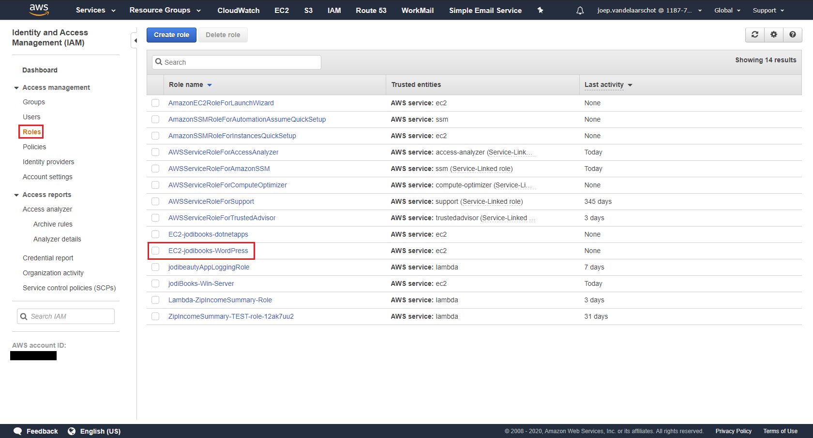

6. Now **Attach policies** and **Create policy**.

    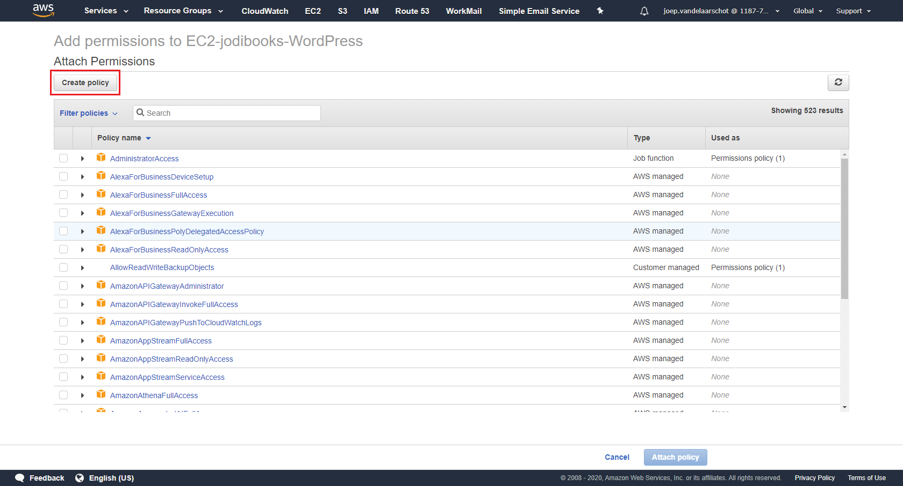

7. In the newly opened tab click **JSON** and paste the code below. Change the _Resource_ to your own bucket. <https://deliciousbrains.com/wp-offload-media/doc/custom-iam-policy-for-amazon-s3/>

    ```json
    {
        "Version": "2012-10-17",
        "Statement": [
            {
                "Sid": "VisualEditor0",
                "Effect": "Allow",
                "Action": [
                    "s3:Put*",
                    "s3:Get*",
                    "s3:CreateBucket",
                    "s3:List*",
                    "s3:DeleteObject"
                ],
                "Resource": [
                    "arn:aws:s3:::jodibooks-public-cdn",
                    "arn:aws:s3:::jodibooks-public-cdn/*"
                ]
            }
        ]
    }
    ```

    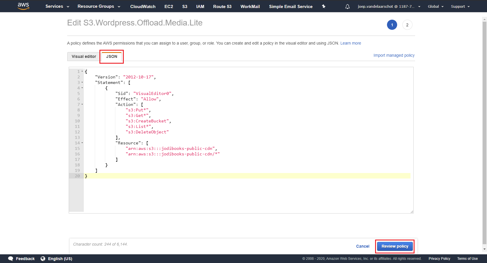

8. Enter a _name_ `S3.Wordpress.Offload.Media.Lite` for the policy and a _description_ `Allow offload plugin to use S3 as file storage`.
9. Create the policy.
10. Go back to the `EC2-jodibooks-WordPress` role and add the policy.

    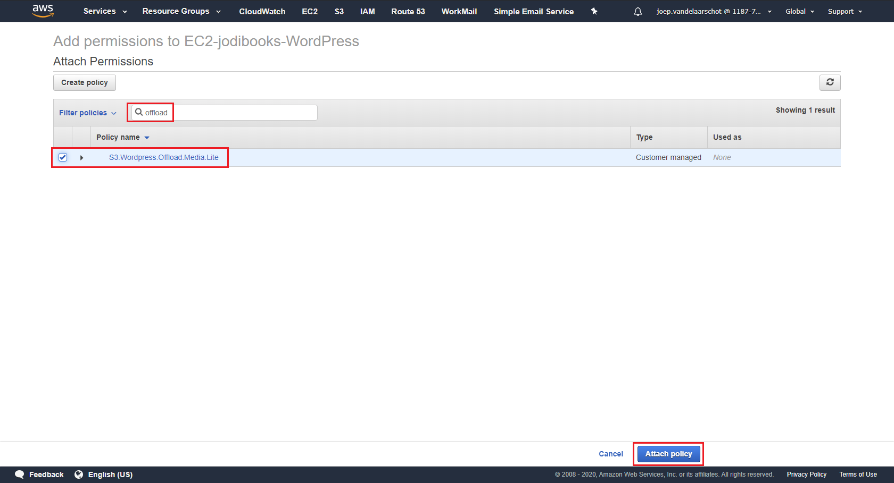

11. Open the plugin and select **S3** as the storage provider. Select to use **IAM Roles**.

    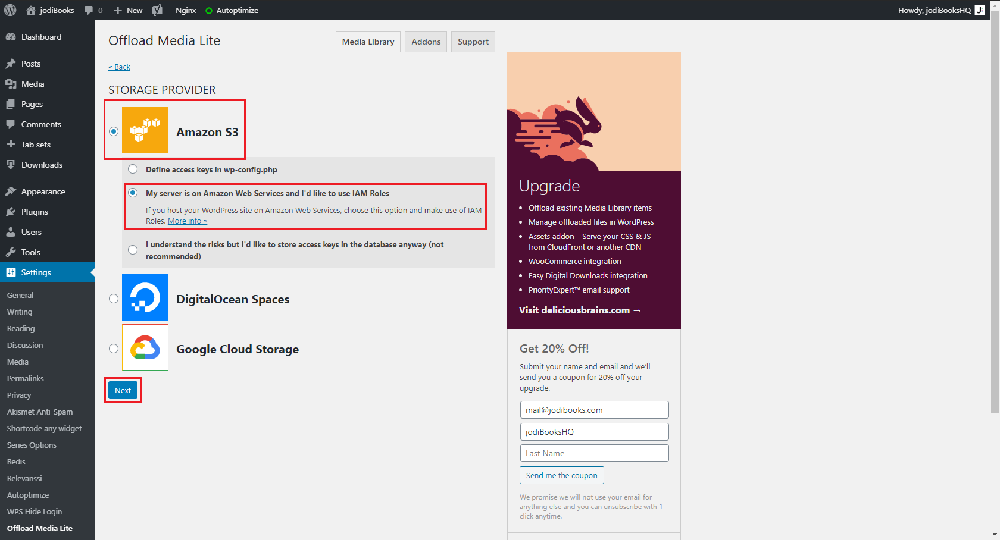

12. Click **Browse existing buckets** and select the bucket `jodibooks-public-cdn`.

    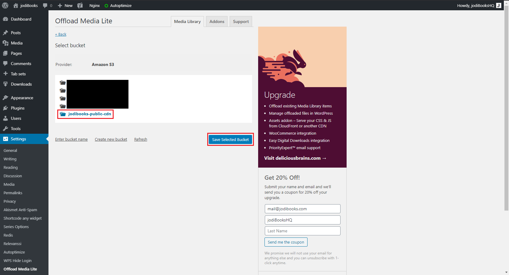

13. Set the following settings to **ON**:

    - Copy Files to Bucket
    - Path: `blog/wp-content/uploads/`
    - Year/Month
    - Object Versioning
    - Rewrite Media URLs
    - Force HTTPS

## 5. End of installation part

With that we have a fully working environment. What we still need to do is make sure everything will be backed up and monitored. That will be the topic of the [next parts](../hosting-asp-net-apps-aws-part-14-monitoring-with-cloudwatch/).
