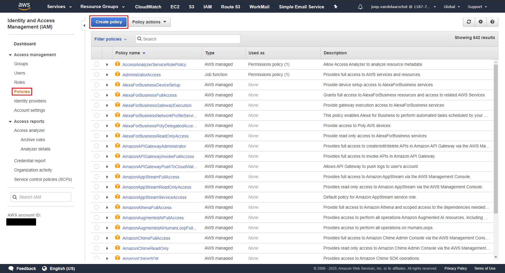
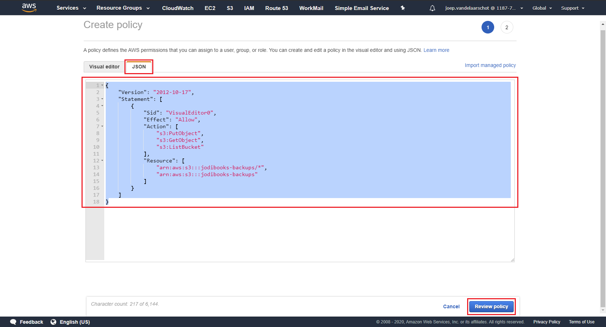
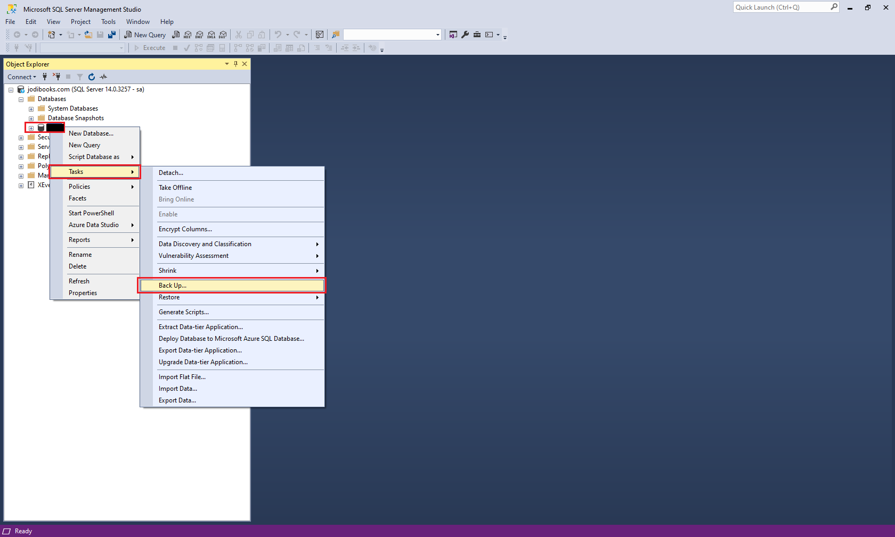
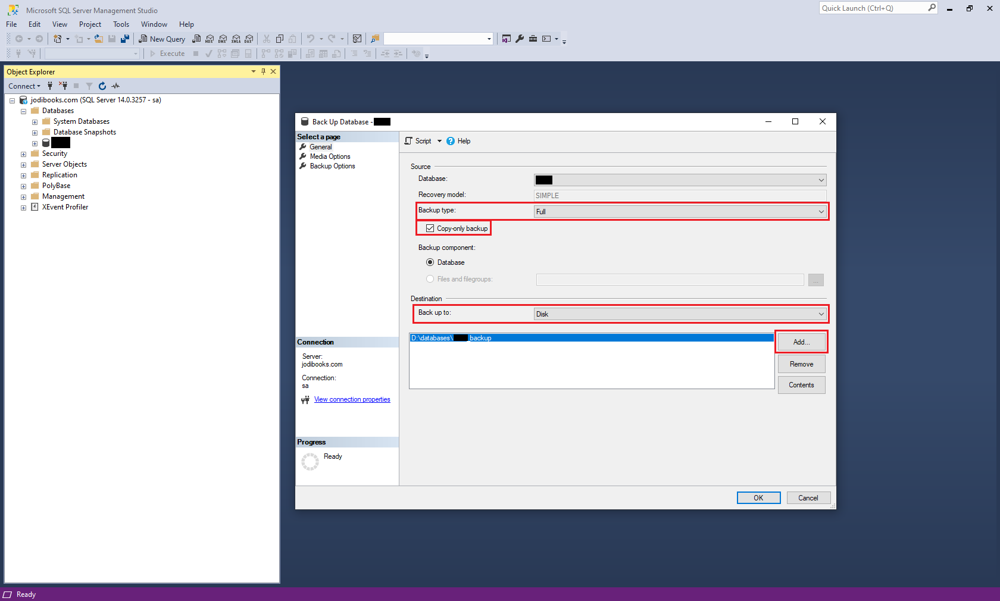
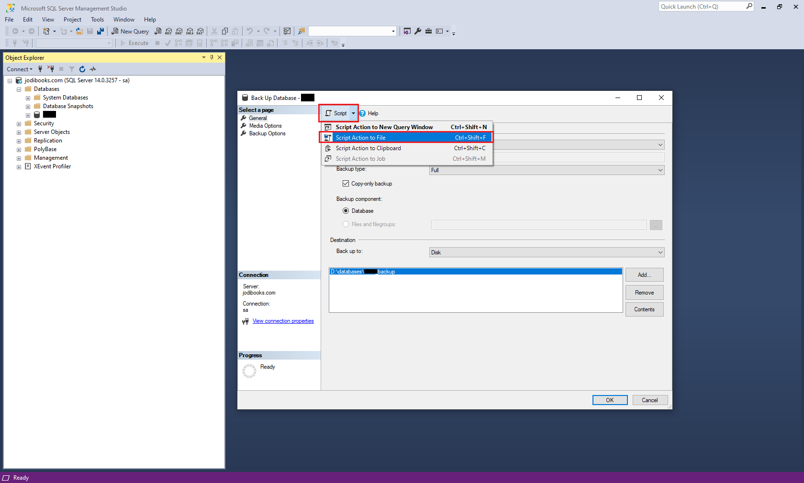
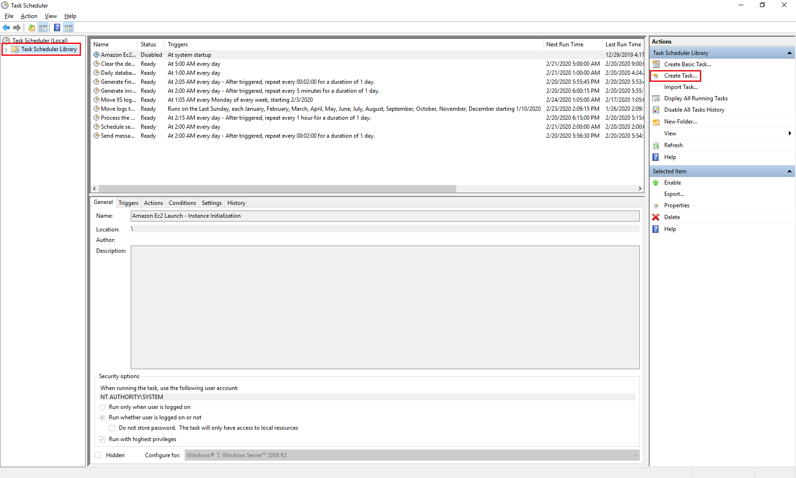
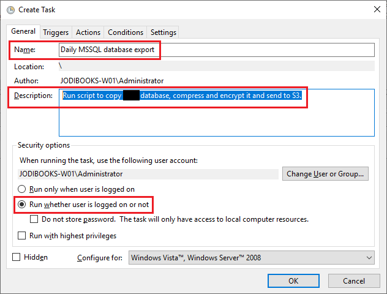
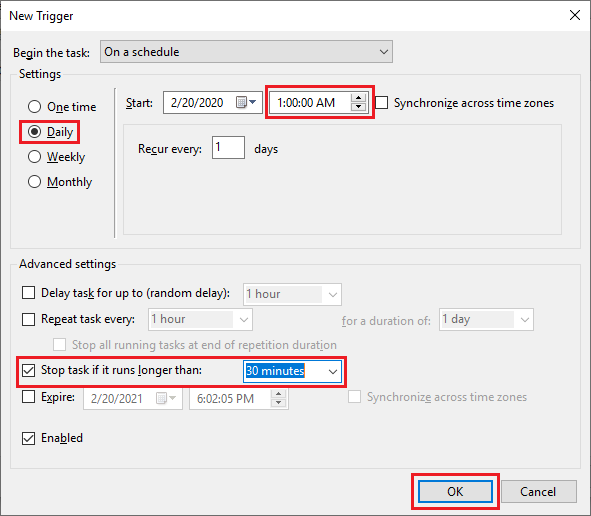
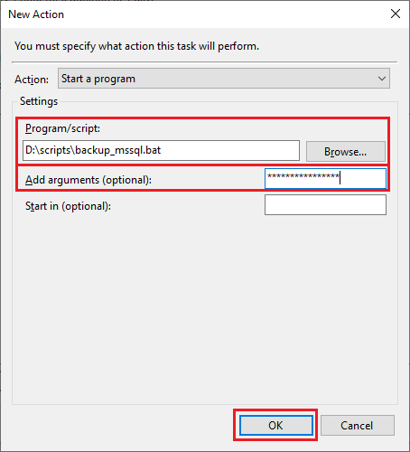
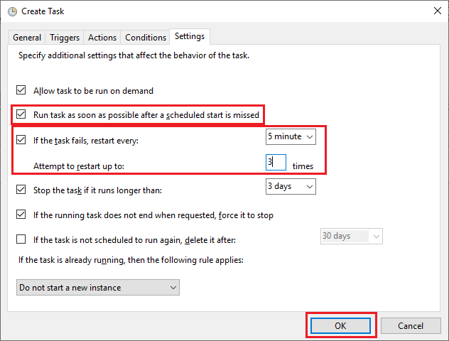

If we were using RDS, our databases would be backed up by AWS. That however is not the case. We are hosting the databases ourselves. As we're responsible for the data, we better have a recent backup to limit damage and data loss.

Obviously we don't want to be continually be logging in and making backups. We have better things to do, especially as it is easy to automate. In this part we'll make a script to dump, encrypt and store our databases to S3. While we're at it, we'll also add a script to backup our log files.

## 1. Install AWS CLI

To send files to S3 we are going to use the AWS CLI. This tool allows us to script the transfer of files to and from S3.

> <https://docs.aws.amazon.com/cli/latest/userguide/install-cliv2.html>

### 1.1 Install Windows

1. Download the installer and run it: <https://awscli.amazonaws.com/AWSCLIV2.msi>

### 1.2 Install Ubuntu

1. Open a PuTTY terminal and enter the following commands one at a time.

    ```shellsession
    sudo curl "https://awscli.amazonaws.com/awscli-exe-linux-x86_64.zip" -o "awscliv2.zip"
    sudo unzip awscliv2.zip
    sudo ./aws/install
    ```

2. Confirm if the installation was successful.

    ```shellsession
    aws --version
    ```

3. Remove the install file.

    ```shellsession
    sudo rm "awscliv2.zip"
    ```

* * *

## 2. Create an IAM policy

The EC2 that will make the backup needs to have access to our S3 backup bucket.

1. Go to the IAM dashboard, go to **Policies** and click **Create policy**.

    

2. Click the **JSON** tab and add the following code. Do change your bucket name.

    ```json
    {
        "Version": "2012-10-17",
        "Statement": [
            {
                "Sid": "VisualEditor0",
                "Effect": "Allow",
                "Action": [
                    "s3:PutObject",
                    "s3:GetObject",
                    "s3:ListBucket"
                ],
                "Resource": [
                    "arn:aws:s3:::jodibooks-backups/*",
                    "arn:aws:s3:::jodibooks-backups"
                ]
            }
        ]
    }
    ```

    

3. Once the policy is created attach it to roles `EC2-jodibooks-dotnetapp` and `EC2-jodibooks-WordPress`.

* * *

## 3. Create the MSSQL backup script

### 3.1 Create dump database script

1. Open SSMS on your local computer and connect to the database. **Right-click** and click on **Tasks** and **Back Up...**

    

2. Set _Backup type_ to `Full`, select **Copy-only backup**, _Back up to_ `Disk` and add the location to store the backup (see [part 11](../hosting-asp-net-apps-aws-part-11-database-in-ms-sql/#export-database) for more details).

    

3. Click **Script** and **Script Action to File**. Save the file to `<database>_backup.sql` and close SSMS.

    

### 3.2 Add 7-zip to encrypt and compress

1. Download 7-zip: <https://www.7-zip.org/download.html>
2. Open the server instance and copy the installer.
3. Run the installer.

### 3.3 Create the batch file

1. Open Notepad or preferably [Notepad++](https://notepad-plus-plus.org/).
2. Copy the script below.

    ```batch
    @echo off
    REM prerequisites: 7zip, sqlserver and awscli need to be installed
    REM prerequisites: server needs IAM role with bucket policy (put/list) for S3

    REM variables
    SET backup=<database>_backup
    SET folder=D:\databases
    SET server=jodibooks-W01
    SET SQLscript=d:\scripts\%backup%.sql
    SET S3bucket=jodibooks-backups/databases/
    SET today=%date:~-4,4%%date:~-10,2%%date:~-7,2%
    SET backupfile=%folder%\%today%-%backup%.7z
    SET logfile=D:\logs\%today%-database-backups.txt

    REM parameters
    SET PASS=%1
    IF "%PASS%" == "" (
    GOTO passworderror
    )

    call :sub >%logfile%
    :done
    REM copy log to S3 bucket
    ECHO === Copy log to S3 bucket ===
    AWS s3 cp %logfile% s3://%S3bucket%

    EXIT /b

    :sub
    REM Create database backup using script
    ECHO === Database dumps %today% ===
    SQLCMD -S %server% -i %SQLscript%

    REM compress (7z) and encrypt the database backup with password
    ECHO === Compress and encrypt ===
    "C:\Program Files\7-Zip\7z.exe" a %backupfile% %folder%\%backup% -mhc -mhe -p%PASS%

    REM copy encrypted backup to S3 bucket
    ECHO === Copy database archive to S3 bucket ===
    AWS s3 cp %backupfile% s3://%S3bucket%

    REM delete local copy of (un)encrypted database backup
    ECHO === Delete database copy and backup ===
    ECHO Delete database dumps
    DEL %folder%\%backup%
    ECHO Done
    ECHO Delete database backups
    DEL %backupfile%
    ECHO Done

    GOTO done

    :passworderror
    ECHO no encryption password available
    ```

3. Save the file as `backup_mssql.bat`.

### 3.4 Understanding the script

1. In the first part `REM variables` we set the variables for the script. Adapt them to your environment.

    ```batch
    SET backup=<database>_backup   #Name of your backup and SQL script
    SET folder=D:\databases   #Folder to store the export
    SET server=jodibooks-W01   #Computer name
    SET SQLscript=d:\scripts\%backup%.sql   #Location of SQL script
    SET S3bucket=jodibooks-backups/databases/   #S3 bucket and folder
    SET today=%date:~-4,4%%date:~-10,2%%date:~-7,2%   #Date YYYYMMDD
    SET backupfile=%folder%\%today%-%backup%.7z   #7zip file name
    SET logfile=D:\logs\%today%-database-backups.txt   #Folder and name script log file
    ```

2. Check for password. When running the task we'll give it a password to encrypt the zip-file. If no password is entered the script is aborted.

    ```batch
    REM parameters
    SET PASS=%1
    IF "%PASS%" == "" (
    GOTO passworderror
    )
    ```

3. We want to know what happened, so we create a log file and record everything in the "sub" part. When the sub part is completed, we'll return, close the log file, copy `cp` it to S3 and end the script.

    ```batch
    call :sub >%logfile%
    :done
    REM copy log to S3 bucket
    ECHO === Copy log to S3 bucket ===
    AWS s3 cp %logfile% s3://%S3bucket%

    EXIT /b
    ```

4. First thing in "sub" is to create the database copy. We call the script using the sql command line tool `SQLCMD`.

    ```batch
    :sub
    REM Create database backup using script
    ECHO === Database dumps %today% ===
    SQLCMD -S %server% -i %SQLscript%
    ```

5. Now we have a database copy, but it's big and unencrypted. That's not okay. We call the 7zip executable to compress `-mhc` and encrypt `-mhe` the file `%backupfile% %folder%\%backup%` with a password `p%PASS%`. `%PASS%` being the actual password.

    ```batch
    REM compress (7z) and encrypt the database backup with password
    ECHO === Compress and encrypt ===
    "C:\Program Files\7-Zip\7z.exe" a %backupfile% %folder%\%backup% -mhc -mhe -p%PASS%
    ```

6. Next we copy `cp` the encrypted archive `%backupfile%` to our S3 bucket `s3://%S3bucket%` using the aws cli.

    ```batch
    REM copy encrypted backup to S3 bucket
    ECHO === Copy database archive to S3 bucket ===
    AWS s3 cp %backupfile% s3://%S3bucket%
    ```

7. Almost there, we just need to clean things up. We delete the database copy `DEL %folder%\%backup%` and the archive `DEL %backupfile%`. Once done we go to the code in step 3 and finish the script.

    ```batch
    REM delete local copy of (un)encrypted database backup
    ECHO === Delete database copy and backup ===
    ECHO Delete database dumps
    DEL %folder%\%backup%
    ECHO Done
    ECHO Delete database backups
    DEL %backupfile%
    ECHO Done

    GOTO done
    ```

> Note: in step 6 we could have moved `mv` the archive to S3 instead of copy it. That would make the delete step of the archive unnecessary. However, in the current script the steps are better to read.

* * *

## 4. Create the Windows log backup script

### 4.1 Creating the script

1. Open Notepad or preferably [Notepad++](https://notepad-plus-plus.org/).
2. Copy the script below.

    ```batch
    @echo off
    REM prerequisites: 7zip, sqlserver and awscli need to be installed
    REM prerequisites: server needs IAM role with bucket policy (put/list) for S3

    REM variables
    SET server=jodibooks-server-w01
    SET folderiis=C:\inetpub\logs\LogFiles\
    SET folderhttp=C:\Windows\System32\LogFiles\HTTPERR\
    SET S3bucket=jodibooks-backups/logs/
    SET today=%date:~-4,4%%date:~-10,2%%date:~-7,2%
    SET logfile=D:\logs\%today%-logs_backup_log.txt

    call :sub >%logfile%
    :done
    REM move log to S3 bucket
    ECHO === Move logs to S3 bucket ===
    AWS s3 mv D:\logs s3://%S3bucket%system --recursive

    EXIT /b

    :sub
    REM move logs to S3 bucket
    ECHO === move logs to S3 bucket ===
    aws s3 mv %folderiis% s3://%S3bucket%%server%/ --recursive
    aws s3 mv %folderhttp% s3://%S3bucket%%server%/ --recursive

    GOTO done
    ```

3. Save the file as `backup_logs_iis.bat`.

### 4.2 Understanding the script

1. In the first part `REM variables` we set the variables for the script. Adapt them to your environment.

    ```batch
    SET server=jodibooks-server-w01   #Server instance name
    SET folderiis=C:\inetpub\logs\LogFiles\   #IIS log folder
    SET folderhttp=C:\Windows\System32\LogFiles\HTTPERR\   #HTTP error folder
    SET S3bucket=jodibooks-backups/logs/   #S3 log bucket and folder
    SET today=%date:~-4,4%%date:~-10,2%%date:~-7,2%   #Date YYYYMMDD
    SET logfile=D:\logs\%today%-logs_backup_log.txt   #log file
    ```

2. We want to know what happened, so we create a log file and record everything in the "sub" part. When the sub part is completed, we'll return, close the log file, move `mv` it to S3 and end the script.

    ```batch
    call :sub >%logfile%
    :done
    REM move log to S3 bucket
    ECHO === Move logs to S3 bucket ===
    AWS s3 mv D:\logs s3://%S3bucket%system --recursive

    EXIT /b
    ```

3. Move the logs to the S3 bucket `s3://%S3bucket%%server%/`. We want to move all files and folder within the main folders `%folderiis%` and `%folderhttp%`, which is done by adding `--recursive`.

    ```batch
    :sub
    REM move logs to S3 bucket
    ECHO === move logs to S3 bucket ===
    aws s3 mv %folderiis% s3://%S3bucket%%server%/ --recursive
    aws s3 mv %folderhttp% s3://%S3bucket%%server%/ --recursive

    GOTO done
    ```

* * *

## 5. Create the MySQL backup script

### 5.1 Create the shell script

1. Open Notepad or preferably [Notepad++](https://notepad-plus-plus.org/).
2. Copy the script below.

    ```bash
    #!/bin/bash
    # Database credentials
    USER="jodibooksWP"
    PASSWORD="CHOOSEASTRONGPASSWORD"
    HOST="localhost"
    DB_NAME="wordpress"

    #Backup_Directory_Locations
    BACKUPROOT="/tmp"
    TSTAMP=$(date +"%Y%m%d")
    S3BUCKET="jodibooks-backups/databases"

    #Create the database backup, compressed and encrypted
    mysqldump -h$HOST -u$USER $DB_NAME -p$PASSWORD | gzip -9 | openssl enc -aes-256-cbc -md sha512 -pbkdf2 -iter 100000 -k 'L&h&yM96*Um#dfg7YfGT9j^N' > $BACKUPROOT/$TSTAMP-$DB_NAME.sql.gz.enc

    # Move file from server to your S3 bucket
    /usr/local/bin/aws s3 mv $BACKUPROOT/$TSTAMP-$DB_NAME.sql.gz.enc s3://$S3BUCKET/
    ```

3. Save the file as `backup_mysql.sh`.

### 5.2 Understanding the script

1. Enter your database credentials. We created this database and user in part 13.

    ```bash
    # Database credentials
    USER="jodibooksWP"
    PASSWORD="CHOOSEASTRONGPASSWORD"
    HOST="localhost"
    DB_NAME="wordpress"
    ```

2. In the next part we set the variables for the script. Adapt them to your environment.

    ```bash
    #Backup_Directory_Locations
    BACKUPROOT="/tmp"   #Folder for database export
    TSTAMP=$(date +"%Y%m%d")   #Date YYYYMMDD
    S3BUCKET="jodibooks-backups/databases"   #S3 bucket and folder
    ```

3. Call `mysqldump` and enter database name and credentials `-h$HOST -u$USER $DB_NAME -p$PASSWORD`. Set the compression level `gzip -9` and add encryption `openssl enc -aes-256-cbc -md sha512 -pbkdf2 -iter 100000 -k '****************'`. Change the encryption key to something more save than 16 asterisks ;). Finally set the backup location and name `> $BACKUPROOT/$TSTAMP-$DB_NAME.sql.gz.enc`.

    ```bash
    #Create the database backup, compressed and encrypted
    mysqldump -h$HOST -u$USER $DB_NAME -p$PASSWORD | gzip -9 | openssl enc -aes-256-cbc -md sha512 -pbkdf2 -iter 100000 -k '****************' > $BACKUPROOT/$TSTAMP-$DB_NAME.sql.gz.enc
    ```

    > Note: I know this is not the best, cleanest, safest way to enter an encryption key. I'm still looking for a better way to do this.

4. Next we copy `mv` the encrypted archive `$BACKUPROOT/$TSTAMP-$DB_NAME.sql.gz.enc` to our S3 bucket `s3://$S3BUCKET/` using the aws cli. In Ubuntu we have to point to the folder where the aws cli is installed `/usr/local/bin/aws`.

    ```bash
    # Move file from server to your S3 bucket
    /usr/local/bin/aws s3 mv $BACKUPROOT/$TSTAMP-$DB_NAME.sql.gz.enc s3://$S3BUCKET/
    ```

* * *

## 6. Create the Linux log backup script

### 6.1 Create the script

1. Open Notepad or preferably [Notepad++](https://notepad-plus-plus.org/).
2. Copy the script below.

    ```bash
    #!/bin/bash

    #Backup_Directory_Locations
    LOGFOLDER="/var/log"
    BACKUPFOLDER="/home/ubuntu/logs"
    TSTAMP=$(date +"%Y%m%d")
    S3BUCKET="jodibooks-backups/logs/jodibooks-server-u01/$TSTAMP"

    # Move file from server to your S3 bucket
    /usr/local/bin/aws s3 mv $LOGFOLDER s3://$S3BUCKET --recursive
    /usr/local/bin/aws s3 mv $BACKUPFOLDER s3://$S3BUCKET --recursive
    ```

3. Save the file as `backup_logs.sh`.

### 6.2 Understand the script

1. Set the variables for the script. Adapt them to your environment.

    ```bash
    #Backup_Directory_Locations
    LOGFOLDER="/var/log"   #Main log folder
    BACKUPFOLDER="/home/ubuntu/logs"   #User log folder (scripts)
    TSTAMP=$(date +"%Y%m%d")   #Date YYYYMMDD
    S3BUCKET="jodibooks-backups/logs/jodibooks-server-u01/$TSTAMP"   #S3 bucket + folder
    ```

2. Move `mv` all the files and folders `--recursive` within the main folders `$LOGFOLDER` and `$BACKUPFOLDER` to the S3 bucket `s3://$S3BUCKET`. In Ubuntu we have to point to the folder where the aws cli is installed `/usr/local/bin/aws`.

    ```bash
    # Move file from server to your S3 bucket
    /usr/local/bin/aws s3 mv $LOGFOLDER s3://$S3BUCKET --recursive
    /usr/local/bin/aws s3 mv $BACKUPFOLDER s3://$S3BUCKET --recursive
    ```

* * *

## 7. Run the Windows scripts

1. Open a remote desktop connection to the Windows instance.
2. Copy the script files `backup_logs_iis.bat`, `backup_mssql.bat` and `Backup_<database>.sql` to the Windows instance. I placed them in a folder `D:\scripts`.
3. Make the (temp) database folder `D:\database`.
4. Open _Task Scheduler_, click **Task Scheduler Library** and **Create Task...**

    

5. Enter a name `Daily MSSQL database export`, description `Run script to copy <database> database, compress and encrypt it and send to S3.` and select **Run whether user is logged on or not**.

    

6. Go to the **Triggers** tab and click **New**. We want to run it **Daily** at `1:00:00 AM`. The task should not run very long, so we stop it when it exceeds `30 minutes`.

    

7. Click the **Actions** tab and click **New**. Browse to the script and add your encryption password as argument.

    

8. In the **Settings** tab select **Run task as soon as possible after a scheduled start is missed**, **If the task fails, restart every** `5 minutes`, `3` times.

    

9. Click **OK** and enter the admin password.
10. Repeat for the log script, but once every 1-2 weeks should be enough.

* * *

## 8. Run the Linux scripts

1. Open a PuTTY terminal to the Ubuntu instance. Create the `scripts` folder.

    ```shellsession
    mkdir scripts
    ```

2. Create the database shell file.

    ```shellsession
    sudo nano /scripts/backup_mysql.sh
    ```

3. Copy-paste the contents and save the file: `ctrl+x`, `y`, `enter`.
4. Create the log export shell file.

    ```shellsession
    sudo nano /scripts/backup_logs.sh
    ```

5. Copy-paste the contents and save the file: `ctrl+x`, `y`, `enter`.
6. Make both files executable.

    ```shellsession
    sudo chmod +x backup_mysql.sh
    sudo chmod +x backup_logs.sh
    ```

7. Open `crontab`.

    ```shellsession
    sudo crontab -e
    ```

8. In the file there should be an entry for `# Renew SSL certificates`. Paste the following snippet below that. Close and save `ctrl+x`, `y`, `enter`.

    ```bash
    # Run the database backup script every day at 2.30 AM
    30 2 * * * /home/ubuntu/scripts/backup_mysql.sh > /home/ubuntu/logs/backup_mysql.log

    # Move logs to S3 every Monday at 3.00 AM
    0 3 * * 1 /home/ubuntu/scripts/backup_logs.sh > /home/ubuntu/logs/backup_logs.log
    ```

Should you want to have a different schedule, try this site to generate it: <https://crontab-generator.org/>

## 9. Next...

Well that's it. Congratulation, you're done!!!

I hope this guide will help you setup your ASP.NET applications and WordPress in AWS. I wrote it, because I couldn't find a complete guide that showed me how to do it in a way I could also understand. This is in effect the guide I hoped to have had when I started.

If you have any questions or comments, let us know in the comments below.
