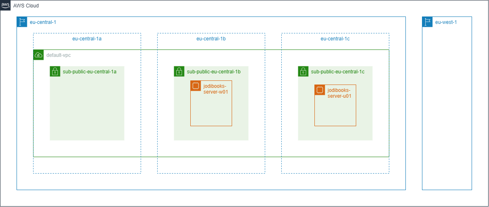
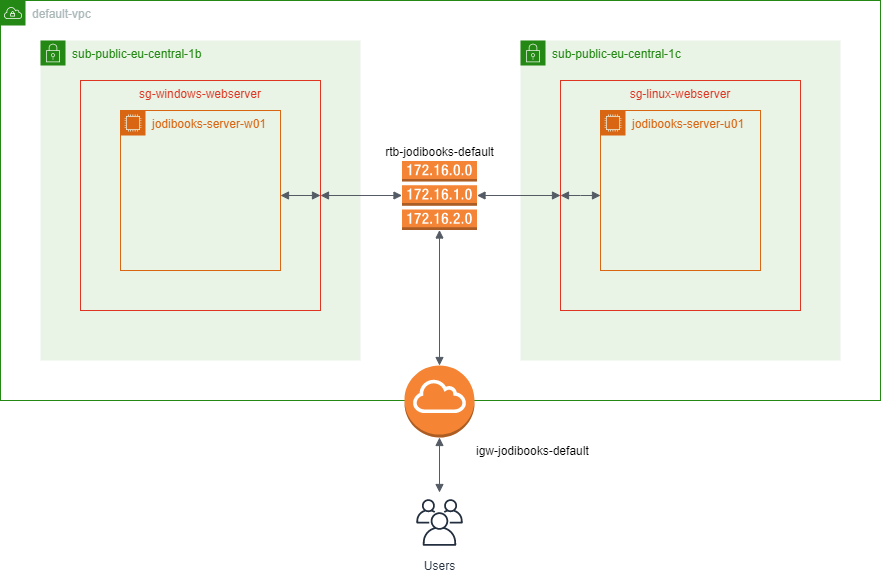
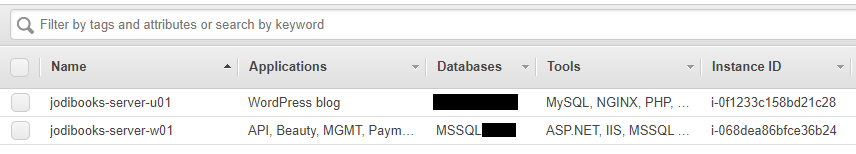
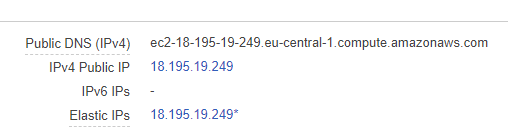

To run your applications you need hardware in some form. You can buy and maintain your own server, rent a physical server in a data center or run virtual private servers. You can also build your environment in the cloud. In this case the cloud basically is a collection of servers that you can use for a variety of use cases. Be it to run a VPS or use one of it's shared services.

There are just a few major players in this space like Microsoft Azure ($3.4B), Google Cloud ($2.3B) or a size smaller ($250M) DigitalOcean. We're building our architecture in the biggest one ($7.8B): the AWS cloud.

> Sources:
> - [https://medium.com/@jaychapel/aws-vs-azure-vs-google-cloud-market-share-2019-what-the-latest-data-shows-dc21f137ff1c](https://medium.com/@jaychapel/aws-vs-azure-vs-google-cloud-market-share-2019-what-the-latest-data-shows-dc21f137ff1c)
> - [https://www.digitalocean.com/press/releases/digitalocean-named-to-forbes-2019-cloud-100-list/](https://www.digitalocean.com/press/releases/digitalocean-named-to-forbes-2019-cloud-100-list/)

## AWS basics

To understand which parts to use when building your environment in AWS and how to use them, we need to start with learning some basic concepts. I used the free [training courses](https://www.aws.training/), which I can recommend, to get a basic understanding. Check out [appendix C](../hosting-asp-net-apps-aws-appendix-c-aws-training/) for more info on training and which ones to start with.

The main disadvantage of all these courses and videos is that they only show the basic building blocks and how to use them in a very simple example. They all lack videos and information on how to integrate them all into a full architecture. So, we'll try to do that in this series.

### Regions, availability zones and network

#### Regions

The first choice we'll have to make is in what location we want to build our cloud environment. AWS (black) has multiple physical locations around the world and we want our application to be as fast as possible for our users. That means we want them to be hosted as close to the user as possible.

In our case we chose `eu-central-1` (blue), which is Frankfurt, Germany. This is the closest location to our customers in The Netherlands. We also use a second region, `eu-west-1`, in Ireland, because that's the only region in Europe that has the WorkMail service. We'll ignore that for now.

The basic AWS architecture we're going to use

#### Availability zones

Every region has at least 2 availability zones, AZ's (dashed blue). An AZ is a separate data center on a separate physical location, with it's own internet connection, power supply, etc. This means that if one zone fails, the other should be unaffected. The Frankfurt region has three zones: `a`, `b` and `c`.

#### Network (VPC)

Every user of AWS gets his own virtual network, a virtual private cloud (VPC). You can add multiple VPC to separate applications or business within the same account. We use the `default-vpc` that AWS generates automatically when you open an account.

Within a VPC you can create subnets. A subnet can be private or public (with internet access) and they can span multiple AZ's. We went with the basic setup; one subnet per AZ. For the environment we're building that's good enough, but you can for example add a separate database instance in a private subnet. This can effectively shield your data from direct internet access.

### Security groups

Now that we have a basic understanding of the basic architecture, we can zoom in to fill in some more detail. Within each subnet, we will put our private instances. For us that will be a Windows instance, `jodibooks-server-w01`, and a Linux instance, `jodibooks-server-u01`.

These instances are placed inside a security group. A security group is a virtual firewall which enables you to open ports to your instances. All ports are closed by default, but we will allow web traffic and remote management later.

In AWS you place all your instances within a security group

Our initial setup is really basic, so we don't use the AZ's to their full potential. If one of the zones (b or c) fails, some of our applications will be unavailable. Now, we will run one EC2 instance in zone `1b` and the other in zone `1c`. They could just as well have been placed in the same zone, but I didn't pay close enough attention when starting the Ubuntu (u01) instance.

In the image above you can also see an internet gateway and a route table. We use the default ones that AWS already configured for us, the only thing we do is name them. In part 4 of this series we will configure all the security groups we need.

### Naming

There is one more thing before we move on to a description of all the additional AWS building blocks we need to run our applications. All parts of AWS that you use can be named. I strongly suggest you do that as AWS uses ID's which are just a (random) sequence of alpha-numeric characters.

To make it easier to identify them we have to use a consistent naming scheme. I don't know if mine makes sense, and I definitely wasn't consistent enough, but this is what I basically used:

1. Use a prefix that describes what it is: `sg` = security group, `vol` = volume, etc.
2. Use the suffix `default` when using auto-generated parts (VPC, route table).
3. Use the product/application name that the part is used for.
4. Add the OS somehow: `w` = Windows, `u` = Ubuntu.
5. Number if duplicates are possible: `01` = first instance, `02` = second instance, etc.
6. Add additional information if needed. This can also be done with additional tags.

Example of naming and tags for applications, databases and tools

## AWS building blocks

### Compute

Your applications need to be run somewhere. In the AWS cloud, almost every compute action is based on EC2 (Elastic Compute Cloud). Whether you configure EC2 instances yourselves or let AWS do it. AWS also offers Lambda, a serverless compute service, but we will not use that in this series.

#### EC2 instances

The basic compute units are called EC2 instances. An instance is somewhat similar to a virtual machine, as it consists of virtual CPU's and memory. I don't fully understand the difference between VM's and instances apart from the flexibility.

When you need more computing power or more memory, you can "just" change the [instance type](https://aws.amazon.com/ec2/instance-types/) or [duplicate an instance](https://aws.amazon.com/ec2/autoscaling/). When using a VM, you have to add vCPU's or RAM to the VM.

We tested the memory and CPU requirements for our applications and found a t3.small instance with 2 vCPU's and 2GB of RAM would be good enough. For our blog we are using a t3.micro instance with 2vCPU's and 1GB of RAM.

#### EBS volumes

Most instance doesn't have any storage though. To install your OS you need to connect an [EBS](https://aws.amazon.com/ebs/) volume. These volumes will persist when you shut down or terminate an EC2 instance.

EBS storage are virtual disks (SSD or magnetic) that are connected through a network to your instances. That might sound slow, but EBS is mostly fast enough. If, however, you need really fast storage, there are instance types that allow you to use the local SSD. This storage is ephemeral, meaning your data is gone as soon as the instance is shut down.

We will use a 50 GB EBS volume for our Windows OS. On the Windows machine we also add a small 4 GB volume to store the application files and logs. The Ubuntu instance will get a 8 GB volume. All static data for the blog will be stored in [S3](https://aws.amazon.com/s3/).

#### Elastic IP

The last part we're going to use for our setup is an [Elastic IP](https://aws.amazon.com/ec2/pricing/on-demand/#Elastic_IP_Addresses). Every EC2 instance gets a public IP by default (through the VPC). This should allow you to link a domain name to your instance directly. But, if you have to change your instance for whatever reason, it gets a new IP address and you have to change your DNS. This might interrupt connections to your site.

An elastic IP is like a switch that makes it possible to instantly switch between end points. You point your domain to the elastic IP and than connect that eIP to your production instance. When you have to switch to a new instance (more RAM, updated OS, new application version), you can just change to end point of the eIP.

### Storage

We will be storing our static data in [S3](https://aws.amazon.com/s3/). These are files like images for our homepage, logs of our applications and backups. The S3 service is divided into [multiple classes](https://aws.amazon.com/s3/storage-classes/). Each class differs in [price](https://aws.amazon.com/s3/pricing) and [access speed](https://aws.amazon.com/s3/storage-classes/#Performance_across_the_S3_Storage_Classes).

- For storage of (frequently) accessed files AWS has the regular **S3 Standard** class. We use this to store almost everything, like images for our homepage and blog, but also logs and backups.
- Then you cascade down through several IA (infrequent access) classes. We use the **S3 Standard-IA** for backups of the past ~6 months. It's ~45% cheaper than the standard tier.
- All the way down is **S3 Glacier**. This is really cheap (~82% cheaper vs standard), but you also might have to wait up to half a day before you get your files (at a fee). This is what we use for backups of old versions of our applications. It's an archive more than it's a backup store really.

#### Objects and buckets

Files are stored as objects in S3 buckets. Buckets are a way of grouping objects, but also allow you to set specific permissions. We for example have five buckets:

1. A private application bucket that can be accessed by the application only
2. A private test bucket for development of the application
3. A private log bucket for application logging
4. A private backup bucket for, well, backups
5. A public CDN bucket for public files (homepage, blog). This bucket can be read by anyone

### DNS and domain

To reach our application we need a public IP. An EC2 instance gets a public IP but also a DNS name by default. These names are really long and ugly though and as they contain the IP, they are notoriously hard to remember.

Our Public DNS name is way too long

#### Route 53 domains

First thing we need to do is get a domain name. You can use any registrar, but you can also do it through [Amazon Route 53](https://aws.amazon.com/route53/). We already had our domain names, and as we weren't happy with our current registrar we transferred them to AWS.

#### Route 53 hosted zones

Once you have your domain names in AWS, you can set up hosted zones (one per domain). A hosted zone holds all your DNS records that translate a request to one of your domain names to the right server or service IP. That doesn't have to be a server at AWS. We for example use it to also point to our office test server.

### Email

We will send email in three ways:

1. Automated to customers
2. Manually
3. Automated internally (notifications)

For each of these applications AWS has a matching service. If you want to also receive emails, you can use [SES](https://aws.amazon.com/ses/) to route them to your email server, or use the [WorkMail](https://aws.amazon.com/workmail/) service.

#### SES

We will be using [SES](https://aws.amazon.com/ses/) to send auto-generated emails to our customers. These can be welcome mails, invoices, password change, etc. SES offers an SMTP address we will use in our application.

You can also receive emails with SES, but there is no mailbox like Outlook or Gmail. You can create rules to store emails in an S3 bucket for example and have your application scan them.

SES can also store mail-templates. Your application only needs to send the parameters and SES will send a full html mail to your recipients. We don't use that in this series.

#### WorkMail

We don't want to build our own mail application, so we are going to use [WorkMail](https://aws.amazon.com/workmail/). This is AWS' mail client that allows you to set up mailboxes, email addresses and users. It uses SES to send and receive mail, but it is abstracted away from us.

With WorkMail you pay per mailbox, so we'll start with setting up a single mailbox with multiple aliases.

#### SNS

[This service](https://aws.amazon.com/sns/) allows you to send all kinds of messages internally. You can send messages between applications, but we'll use it to send notification and warning emails to ourselves. These will be plain text messages, but that's enough to know a backup went well or not.

## Monitoring

Last one, monitoring. This is a nice bonus when using AWS (maybe others too). When you're running a business critical application, you have to know its state. Is it running or not? Within your AWS console you can do some cool things to make this work for you.

#### CloudWatch

First we have [CloudWatch](https://aws.amazon.com/cloudwatch/). This is the main service that collects logs and metrics. We will send log files from our Windows and Ubuntu instance and configure some metrics like the number of times a service has run or how many 404 errors are logged.

These metrics can be used to set of alarms, which will send a message through the SNS service. You get 10 of these alarms for free.

#### Route 53 health checks

We also want to know if our customers can actually open our website. To check that, we use health checks in Route53. They will ping the server and check if it responds. When in error and message is send through SNS.

## Let's build

This was a long read with much information and yet we still haven't built anything. Let's start with actually configuring something in the [next part](../hosting-asp-net-apps-aws-part-4-iam-users-and-roles/).
