## 1. Linux EC2

### 1.1 Launch instance

1. Click the big orange button on the dashboard that says **Launch instance** and choose **Launch instance** or go to **Instances** through the menu on the left and click a blue **Launch instance** button on the top of the page.

    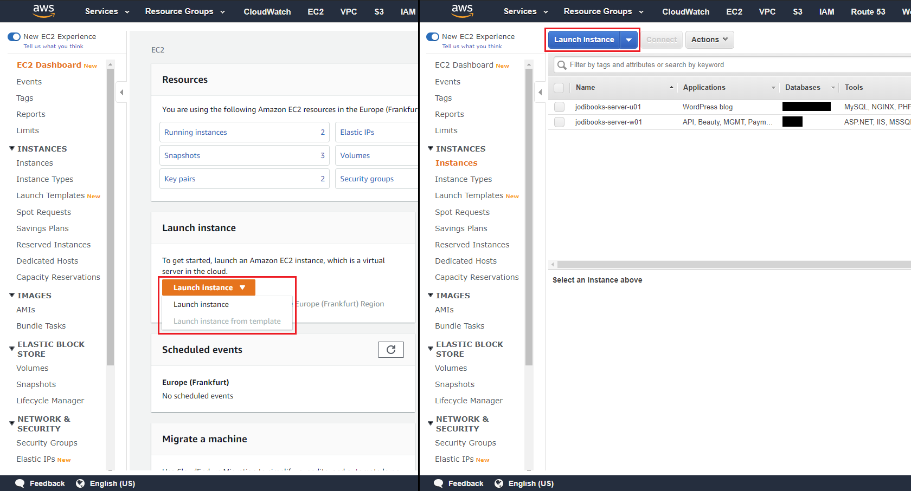

2. **Step 1:** Type `ubuntu 18.04` in the search bar, select **AWS Marketplace** and now select search result **Ubuntu 18.04 LTS - Bionic**.

    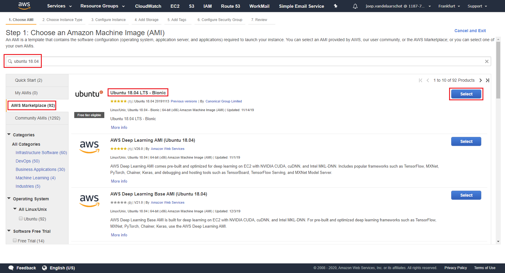

3. Read the product details and optionally check pricing per instance type and click **Continue**.

    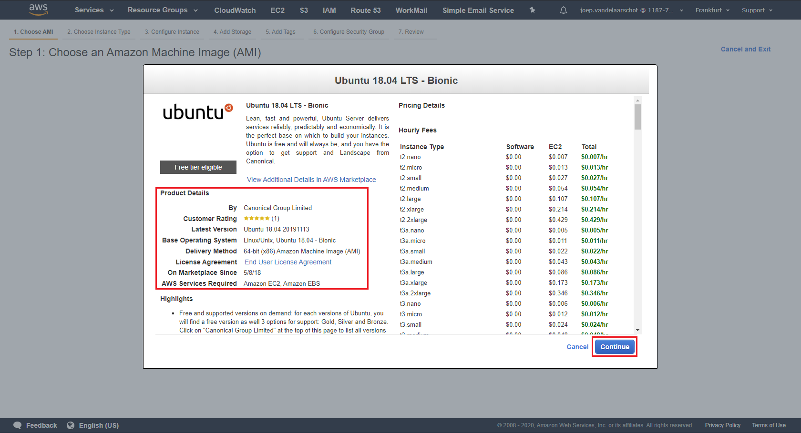

4. **Step 2:** Choose the instance type. We've taken a `t3.micro` for our WordPress blog. More on this choice in [Appendix D](../hosting-asp-net-apps-aws-appendix-d-ec2-instance-type-selection/). Click **Next...** and resist the inviting blue button.

    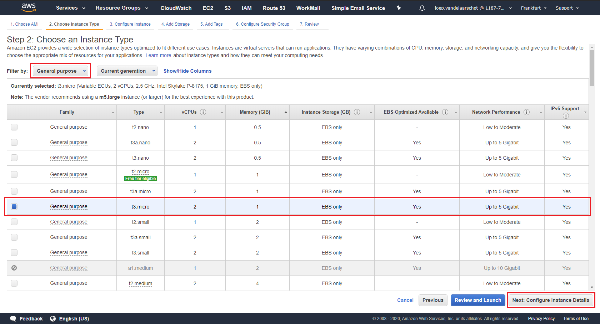

5. **Step 3:** you can basically ignore all settings again, except the subnet and T2/T3 Unlimited.

    1. **Subnet:** As shown we have 3 availability zones and each has it's own subnet. We can let AWS decide where to create this instance, but we can also select a specific zone here. In the architecture we had this one in zone `c`.
    2. **T2/T3 Unlimited:** `Disable` this option. With a t-type instance you get a certain amount of CPU credits per day. When you need more, you pay an additional fee. This option enables you to use an unlimited amount of addition credits.

    > Source CPU credits: <https://docs.aws.amazon.com/AWSEC2/latest/UserGuide/burstable-performance-instances-unlimited-mode-concepts.html#when-to-use-unlimited-mode>

    

6. **Step 4:** the default volume is fine. Just disable **Delete on Termination** and enable **Encryption** `(default) aws/ebs`. Again resist the blue button and click **Next...** instead.  

    **Update Feb 27:** I had to increase the size, as the logging and WordPress folders were consuming more than I expected. I now increased it to 16 GB, which can be done without restarting Ubuntu and the instance, cool.

    > Increasing the volume size: <https://docs.aws.amazon.com/AWSEC2/latest/UserGuide/recognize-expanded-volume-linux.html>

    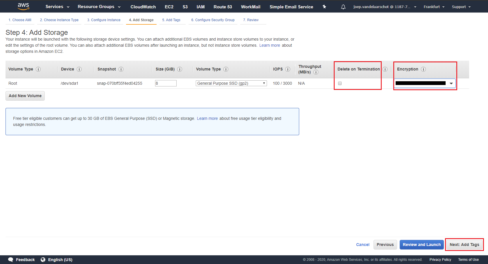

7. **Step 5:** add some tags (optional). Resist the blue button again when you're done. I added 4 tags:

    1. Name: `jodibooks-server-u01`
    2. Applications: `WordPress blog`
    3. Database: _database name_
    4. Tools: `MySQL, NGINX, PHP, PostFix, Redis, WordPress`

    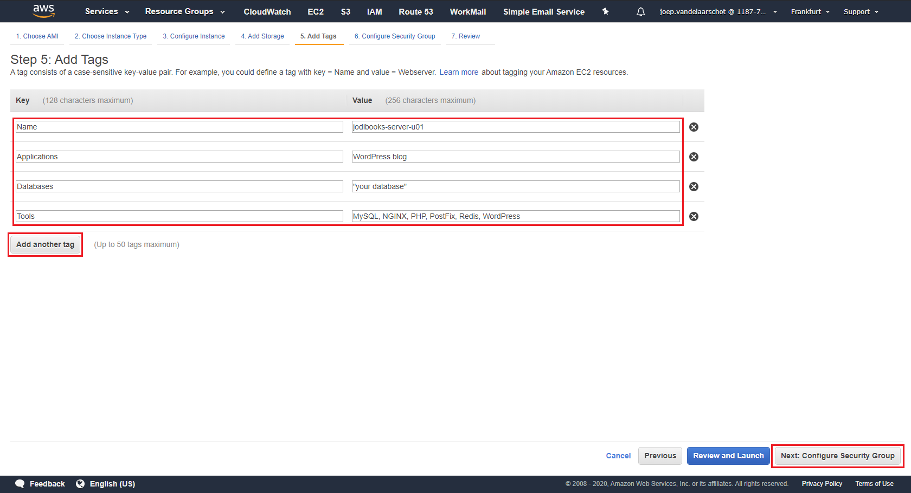

8. **Step 6:** add or configure your security group. As we already made one earlier, we can select the `Webserver` and `Remote server management` security group. And finally we can click the blue **Review** button.

    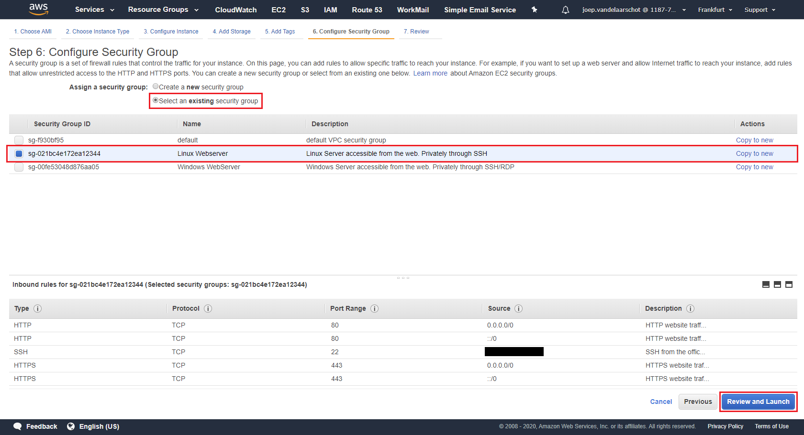

9. **Step 7:** review all the details and click **Launch**. You can ignore the "Your instance configuration is not eligible for the free usage tier" remark.

    1. AMI Details: `Ubuntu 18.04 LTS - Bionic`
    2. Instance Type: `t3.micro`
    3. Security Group: `Webserver` and `Remote server management`
    4. Instance details: `T2/T3 Unlimited Disabled`
    5. Storage: `Encrypted` and `Delete on Termination: No`
    6. Tags: `Name, apps, databases and tools`

    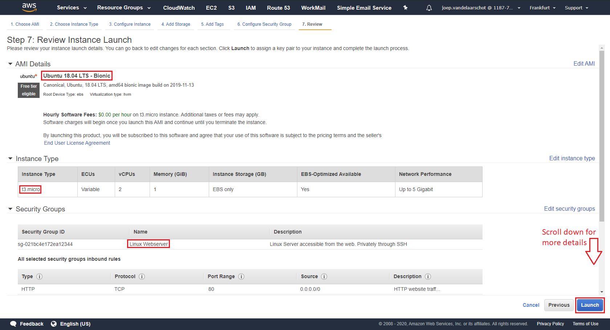

10. After pressing **Launch** you have to select a key pair. We already made one for our _Linux instance_, so let's select that one, **acknowledge** that you have the private key and press **Launch Instance**.

    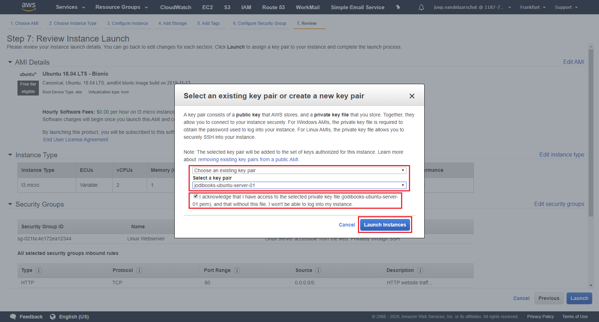

### 1.2 Attach IAM role

An IAM role allows the EC2 to communicate with other AWS services on your behalf. Our Linux instance will send log data to CloudWatch, static files for our blog (mostly images) to an S3 bucket and backups of our database to another S3 bucket.

1. Select the Windows instance, click **Actions**, **Instance Settings** and **Attach/Replace IAM Role**.

    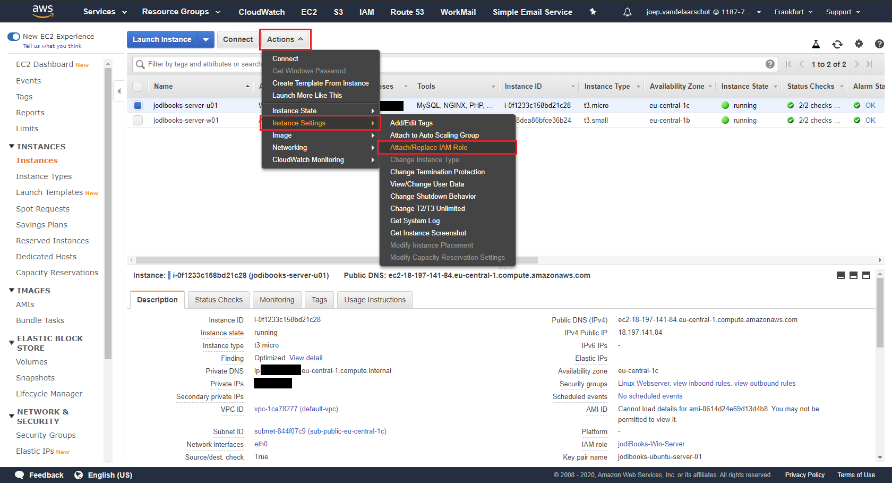

2. Select the IAM role we made for _WordPress_ and click **Apply**.

    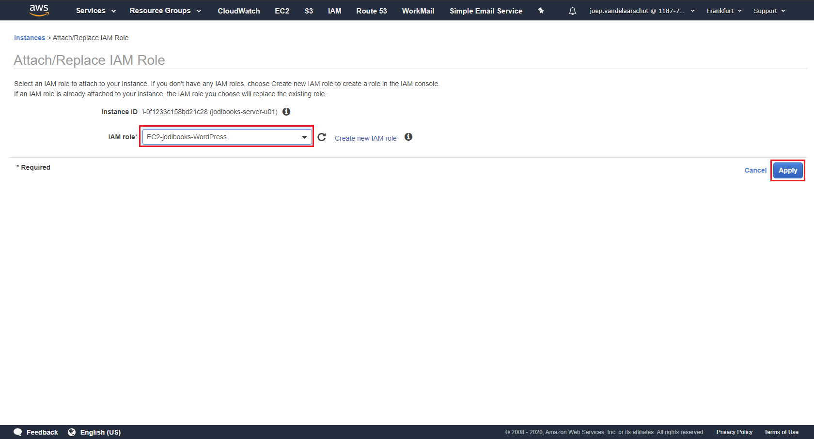

### 1.3 Logging into Ubuntu

The Ubuntu instance is up an running, so we can connect to it through SSH. This will all be command line, so no GUI like the Windows instance.

1. Download [PuTTY](https://www.putty.org/) and install.
2. Follow the excellent guide from the AWS docs. It would basically be copy-pasting and a waste of time if I redid it here.

> <https://docs.aws.amazon.com/AWSEC2/latest/UserGuide/putty.html>

3. Once you're connected start with updating the OS:

    ```shellsession
    sudo apt update && sudo apt upgrade -y
    ```

### 1.4 Firewall settings

I'm not a firewall guru. To be honest, I know very little about firewalls, especially how to configure them in Linux. I used the sources below to setup mine.

> 1. <https://www.digitalocean.com/community/tutorials/how-to-set-up-a-firewall-with-ufw-on-ubuntu-16-04>
> 2. <https://www.digitalocean.com/community/tutorials/ufw-essentials-common-firewall-rules-and-commands>
> 3. <https://linuxize.com/post/how-to-setup-a-firewall-with-ufw-on-ubuntu-18-04/>
> 4. <https://www.linode.com/docs/security/firewalls/configure-firewall-with-ufw/>

1. We start with installing the firewall. In Ubuntu this is UFW, **U**ncomplicated**F**ire**W**all.

    ```shellsession
    sudo apt update
    sudo apt install ufw
    ```

2. Now the first thing we do is configure the default settings. We want to **allow** all outgoing traffic and **deny** all incoming traffic.

    ```shellsession
    sudo ufw default allow outgoing
    sudo ufw default deny incoming
    ```

3. All incoming ports are closed now, but we want to be able to SSH (PuTTY) into the instance. To do that we need to configure that in the firewall. We do that by **allowing port 22** to accept traffic. Remember that we only allow SSH from our IP through the [security group rules](../hosting-asp-net-apps-aws-part-5-ec2-instances/#Security-Groups).

    ```shellsession
    sudo ufw allow ssh
    ```

4. We also want our WordPress page to be accessible. To do that we have to **allow traffic on port 80 and 443**. There are multiple ways to do that, but we'll take the easy route.

    ```shellsession
    sudo ufw allow 'Nginx Full'
    ```

5. Lastly we enable the firewall. You will be warned that enabling the firewall may disrupt existing ssh connections, just type `y` and hit `Enter`.

    ```shellsession
    sudo ufw enable
    ```

6. Check with the following command:

    ```shellsession
    sudo ufw status verbose
    ```

    

### 1.5 Enable Swap

This one has bothered me for weeks. After I setup the instance and installed all the software, I had a blazingly fast blog. But every night the instance would freeze up and would be unreachable. I tweaked memory settings of MySQL, PHP and Redis, but nothing worked. Eventually I figured out that the instance had no reserved swap space. After configuring that, it runs beautifully.

Now, preferably you only use the RAM of your instance, because that is the fastest option. As we only have 1 GB, this is not enough. So the second option would be to create swap space on the local SSD, ephemeral storage in AWS terms. A t3 instance however doesn't have that, so we are forced to forgo on best-practices and use an EBS volume.

> AWS best practices regarding swap space: <https://aws.amazon.com/premiumsupport/knowledge-center/ec2-memory-swap-file/>

AWS recommends creating swap space that is "_2x the amount of RAM but never less than 32 MB_". You can create a new volume specifically for swap, but I've added it to the main volume.

1. We will create a 2 GB swap space (**64** blocks of **32 M**B). In the command line type:

    ```shellsession
    sudo dd if=/dev/zero of=/swapfile bs=32M count=64
    ```

2. Update the **read and write** permissions for the swap file:

    ```shellsession
    sudo chmod 600 /swapfile
    ```

3. Set up a Linux swap area:

    ```shellsession
    sudo mkswap /swapfile
    ```

4. Make the swap file available for immediate use by adding the swap file to swap space:

    ```shellsession
    sudo swapon /swapfile
    ```

5. Verify that the procedure was successful:

    ```shellsession
    sudo swapon -s
    ```

6. Enable the swap file at boot time by editing the `/etc/fstab` file. Open the file in the editor:

    ```shellsession
    sudo nano /etc/fstab
    ```

7. Add the following new line at the end of the file (use arrow keys and paste the line with right-mouse button), save the file (`ctrl+x`), and then exit (`y` and hit `Enter`):

    ```shellsession
    /swapfile swap swap defaults 0 0
    ```

    

8. When starting a new SSH session, Ubuntu will display the amount of used memory, but you can also see it by using top or htop. These can be opened by simply typing `top` or `htop` in the command line.

    

    : `shift+M`")

* * *

## 2. Data storage

With that we have our two instances up and running. Before we continue we're going to make a backup and discuss the link between volumes, snapshots and AMI's.

### 2.1 Volumes

A volume is the actual data (virtual drive) connected to the instance. In the **Volumes** screen you can see a list of your volumes and their state. We first have to give them a name, so we know to which server they belong. What's further interesting to see in this screen:

* **State:** is the volume in-use? Every volume costs money, so you might want to delete non-used volumes.
* **Attachment information:** to which instance is this volume attached?
* **Snapshot:** on which AWS snapshot is it based? This is not your snapshot.


### 2.2 Snapshots

A snapshot is a recording of the volume at a certain point in time. You can use them as backups to go back to that point in time when something goes wrong. You can make as many snapshots as you want, but as with volumes you pay for storage.

At least you should create a snapshot before and after each reconfiguration of you OS or applications, for example when you release a new application, install new software or update the OS. I have to admit that I often forget to make a snapshot before the last two. In the end I only keep a snapshot of the latest known working configuration.

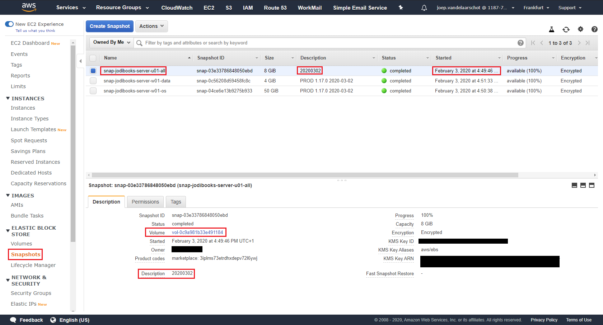

### 2.3 Create a snapshot

1. You can start creating a snapshot in two ways:

    1. Click on **Volumes** in the menu on the left, select the volume you want a snapshot of and click **Actions** followed by **Create Snapshot**.
    2. Click on **Snapshots** in the menu and click **Create Snapshot**.

    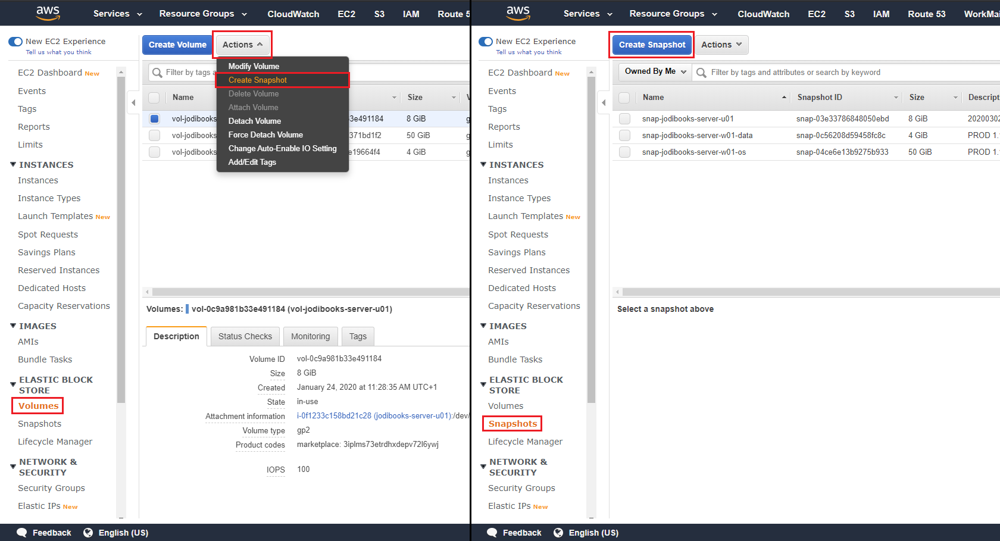

2. Select the volume you want to take a snapshot of. If an instance has multiple volumes, you can also select the instance and AWS will make a snapshot for all attached volumes. Enter a description for example the data or the specific configuration (application version, OS update, etc.) and add tags; `Name`:`snap-jodibooks-server-u01`.

    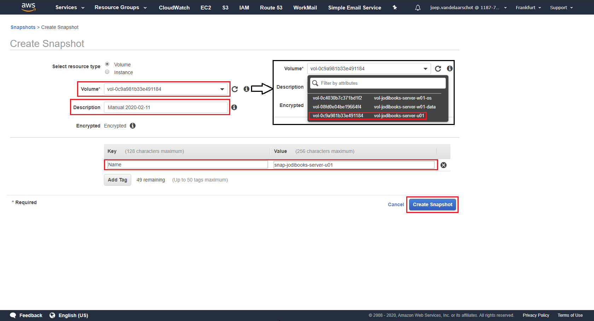

3. Click **Create Snapshot** and you'll see a screen which shows the snapshot ID. Click **Close**.

    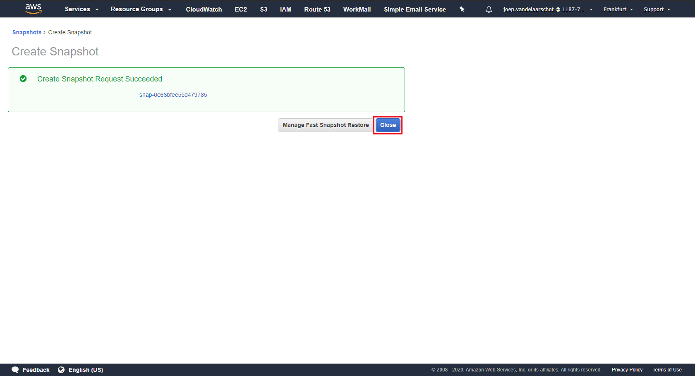

4. The snapshot is being created: Status is **pending**. Depending on the amount of changes since the last snapshot and the size of the volume this can take some time.

    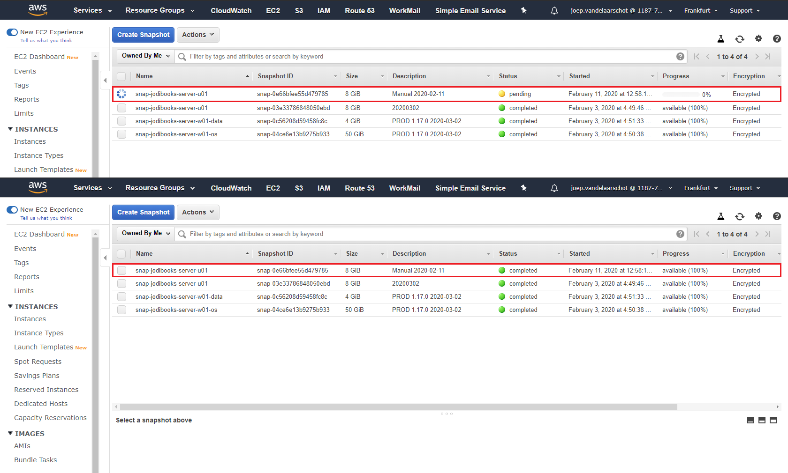

### 2.4 AMI

To restore your instance from a snapshot, we need to make an image or AMI.

1. In the Snapshots screen select the snapshot, click **Actions** followed by **Create Image**.

    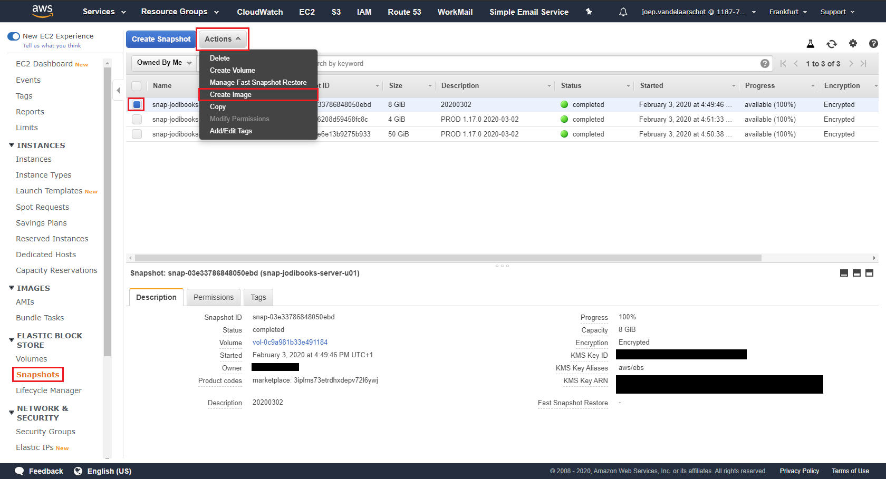

2. Add a _name_ and a _description_. Leave everything else as is and click **Create**.

    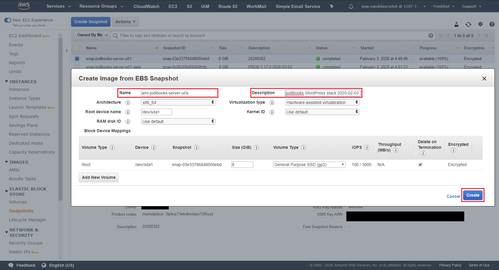

3. When we now go to the AMI screen, we can see our image. The AMI doesn't need any storage as it links to the snapshot.

    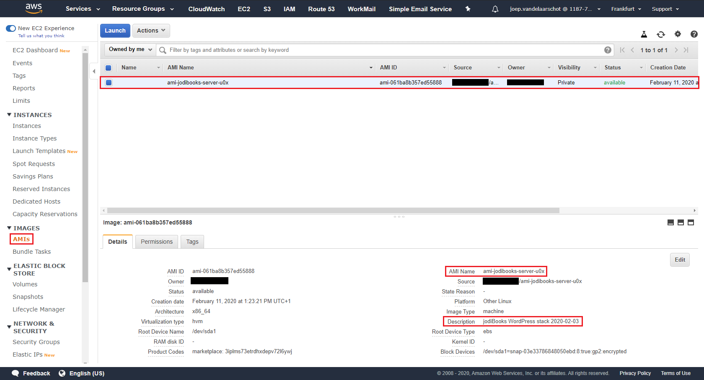

4. The image can be used to _Launch_ an instance. This can be a replacement instance for an unhealthy one or a second instance in an auto-scaling group. Simply press **Launch** and you will see the familiar EC2 launch steps as discussed earlier.

    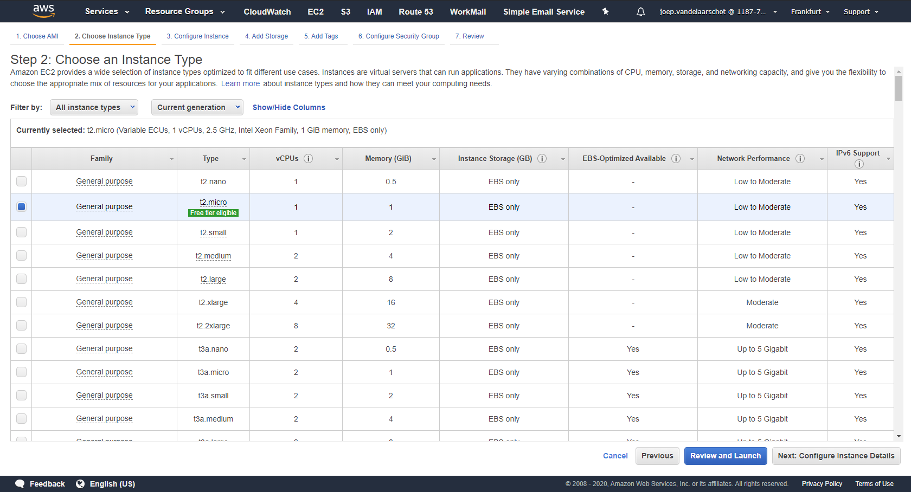

* * *

## 2.5 Change instance type

Should you ever want to change the instance type, you want a smaller and cheaper one, you need a bigger one or a completely [different type](../hosting-asp-net-apps-aws-appendix-d-ec2-instance-type-selection/), you could use an image to setup the new instance.

1. Create a snapshot of the current state
2. Create an image of that snapshot
3. Launch the image and choose a different instance type
4. Change the Elastic IP or DNS record
5. Stop and terminate the old instance

This seems like a lot of steps and it is. If your database and user data is not stored on the instance, this however is the best way to do it. It minimizes or even eliminates downtime for your users or visitors.

If however you have a database or user data on your instance (not recommended, but I'm guilty too), you have to prevent your users from entering new data while you move the data(base).

> Source: <https://docs.aws.amazon.com/AWSEC2/latest/UserGuide/ec2-instance-resize.html>

Anyway, if you're OK with a few minutes of downtime, you don't have to go through the 5 steps mentioned above, but can do the following:

1. Select the instance in the **Instances** screen and stop it. Click **Actions**, **Instance State** and **Stop**.

    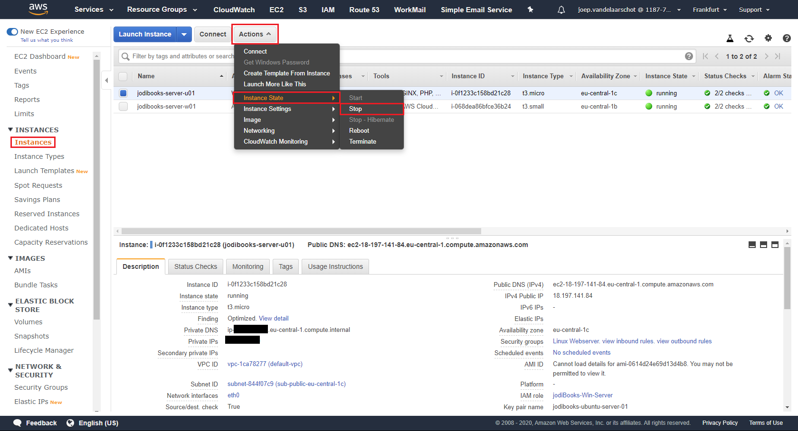

2. When the "Instance state" is _stopped_ click **Actions**, **Instance Settings** and **Change Instance Type**.

    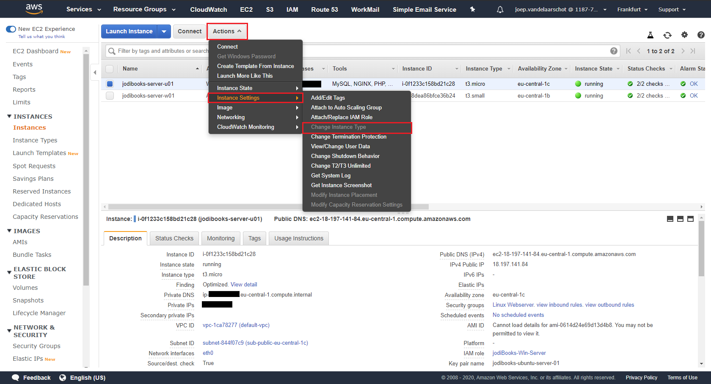

3. Select the new instance type and _restart_ the instance and that's it.

## 2.6 Future improvements (optional)

It would be safe to say that a lot could be improved, but as I don't know what I don't know, for now we're done configuring our EC2 instances. There are however two things I do know that I want to use in the future.

The first thing will be auto scaling and load balancing to be prepared for peaks in user demand. More on that in Appendix E. The second thing is to use the lifecycle manager to automatically make snapshots and remove old ones.

## 3. Next: Route53

In the [next part](../hosting-asp-net-apps-aws-part-7-domains-and-dns-with-route-53/) we're going to setup our domain names and DNS settings. For that we will use the AWS Route 53 service.
