To "find" and access the instances through the internet, we use the IP address or the Public DNS that AWS provides. In the case of our Windows instance these are: `18.195.19.249` and `ec2-18-195-19-249.eu-central-1.compute.amazonaws.com`. Not very friendly for our users to find our website.

To make it easier, the internet uses DNS to translate domain names into the IP addresses of servers. The service that AWS has build to do this is [Route 53](https://aws.amazon.com/route53/).

## 1. Domain registration

To route a domain name to your server you obviously need to own one. You can buy domain names from your own favorite registrar, but we assume you do it through AWS. There are two ways to get your domain name into Route 53:

1. Register a new domain
2. Transfer an existing domain

### 1. New domain

1. On the Route 53 Dashboard type the domain name you want to register or go to **Registered Domains** through the menu and click the **Register Domain** button.

    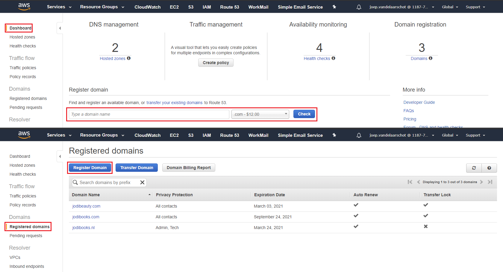

2. Route 53 will check if the domain name is available and shows some alternatives. If it is available **Add to cart** and scroll down to click the **Continue** button.

    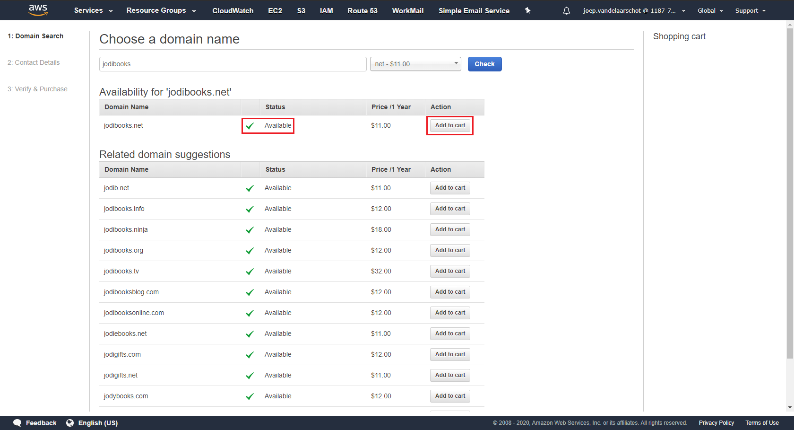

3. In the next screen enter all your contact details and press **Continue** again on the bottom of the page. Optionally you can enter different data for Registrant, Administrative and Technical Contacts.

    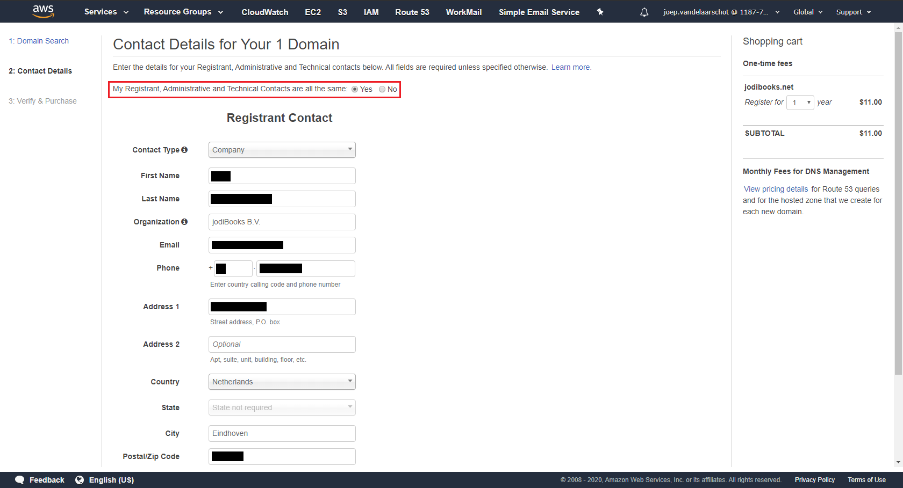

4. Check all the details, disable automatic renewal if you don't want that and **accept** the terms and conditions. Now you can click **Complete Order**.

    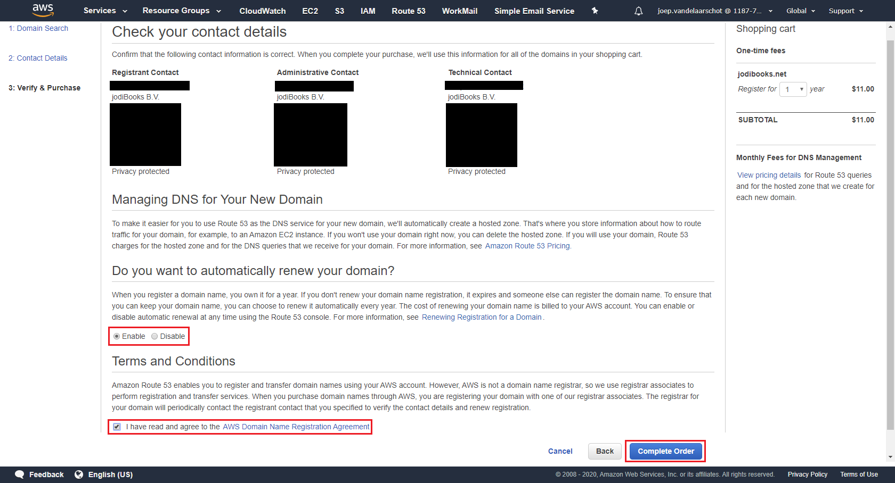

### 1.2 Transfer domain

We already owned our domain names, but we wanted to transfer them to Route 53. Instead of registering a domain name, we transferred it.

1. To do that, you can click a link on the Route 53 dashboard or go to **Registered domains** through the menu and click the **Transfer Domain** button.

    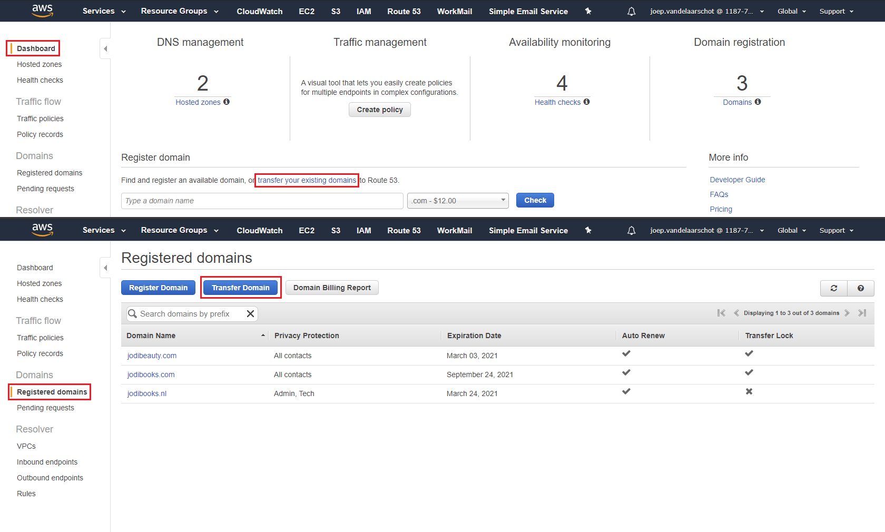

2. Type the domain name you want to transfer and click the **Check** button. If the domain is transferable, you can **continue**.

    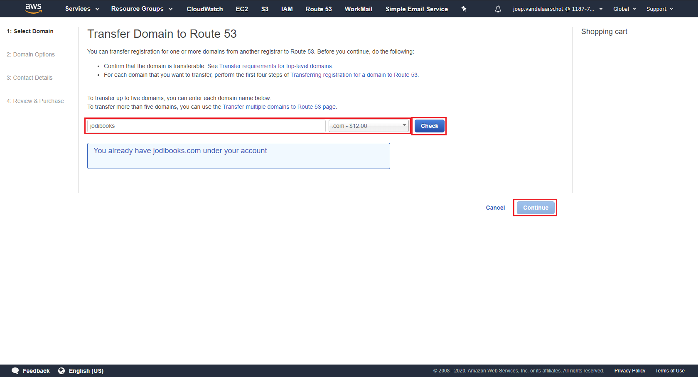

3. Route 53 will ask for the **transfer code** that your previous registrar will share with you when you cancel the subscription.
4. **Enter contact details** as step 3 in the new registration.
5. Verify details, disable automatic renewal if you don't want that and **accept** the terms and conditions. Now you can click **Complete Order**.
6. You will receive an email that will ask if you agree with the domain transfer. If you confirm the domain is transferred within a few minutes/hours.

    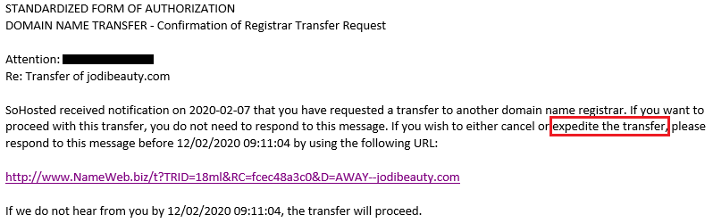

## 2. DNS management

With the domains in Route 53 we can do the DNS management in Route 53 too. To do that we have to create a hosted zone (1 per domain).

1. Go to **Hosted zones** through the menu and click the blue **Create Hosted Zone** button.

    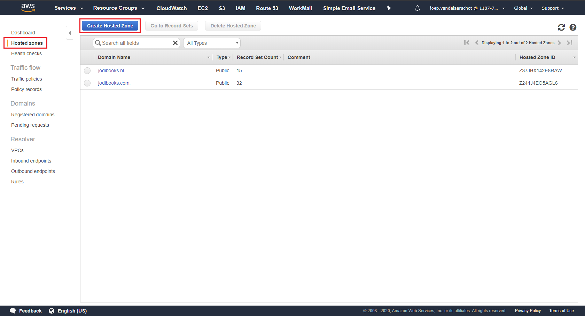

2. Enter the domain name for which you want to create the hosted zone and click the **Create** button.

    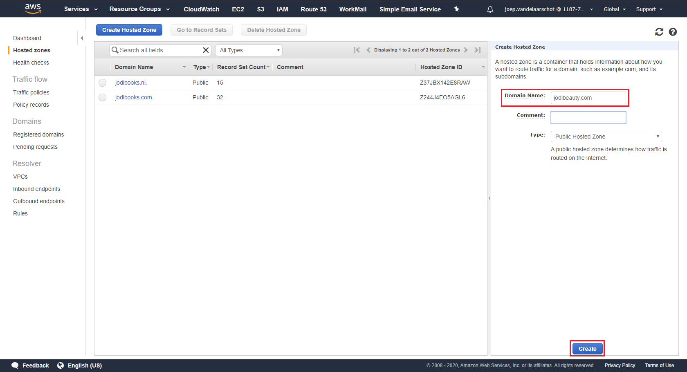

3. AWS will create the records necessary for the AWS name servers. We need to add an A-type record to our server. **Create a Record Set** and set type to `A`. Enter the **_IP address_** of the server as value.

    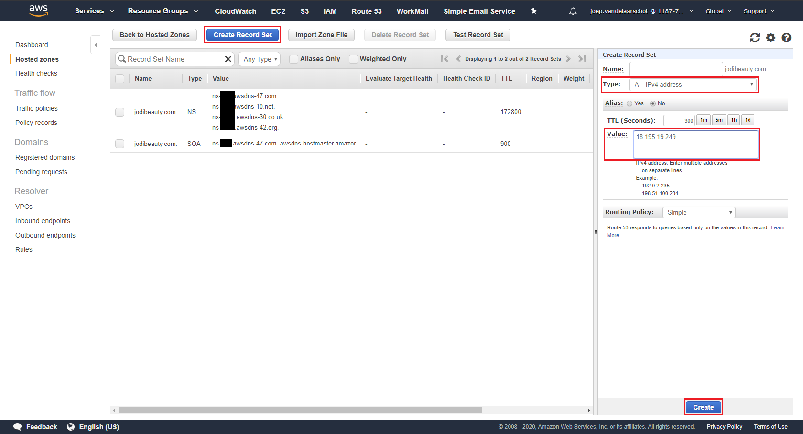

4. Now create another record with name `www`, type `CNAME` and value `jodibeauty.com` (or your domain obviously). This will route _www.jodibeauty.com_ to the IP address of _jodibeauty.com_. If the IP address would need to change for whatever reason, you only have to change it in one record.

    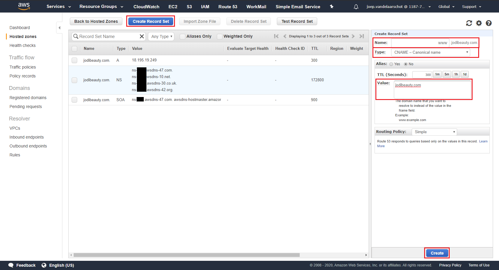

5. If you need _subdomains_, you can enter an A-type record for each of them. We for example also have `blog.jodibooks.com` which routes to our Linux instance and `beauty.jodibooks.com` which routes directly to the application on the same instance as the homepage (and various API's).

    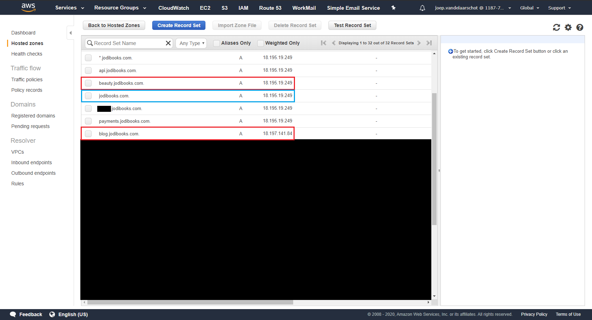

## 3. Health checks

Route 53 has another neat feature: _Health checks_. A health check basically is just a ping to a destination you choose. If it gets an answer it'll assume the destination is healthy.

1. Through the menu go to **Health checks** and click the blue button: **Create health check**.

    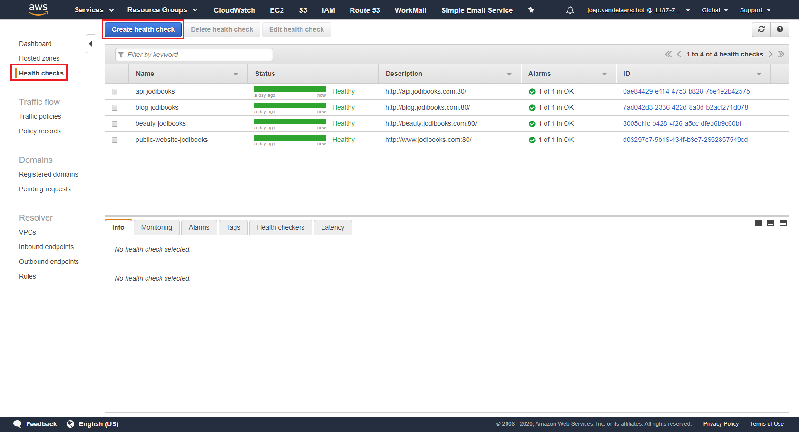

2. Enter a name, select **Endpoint** and **Domain name** and enter the domain you want to check: `blog.jodibooks.com`. We do a check on port 80, because that check is free.

    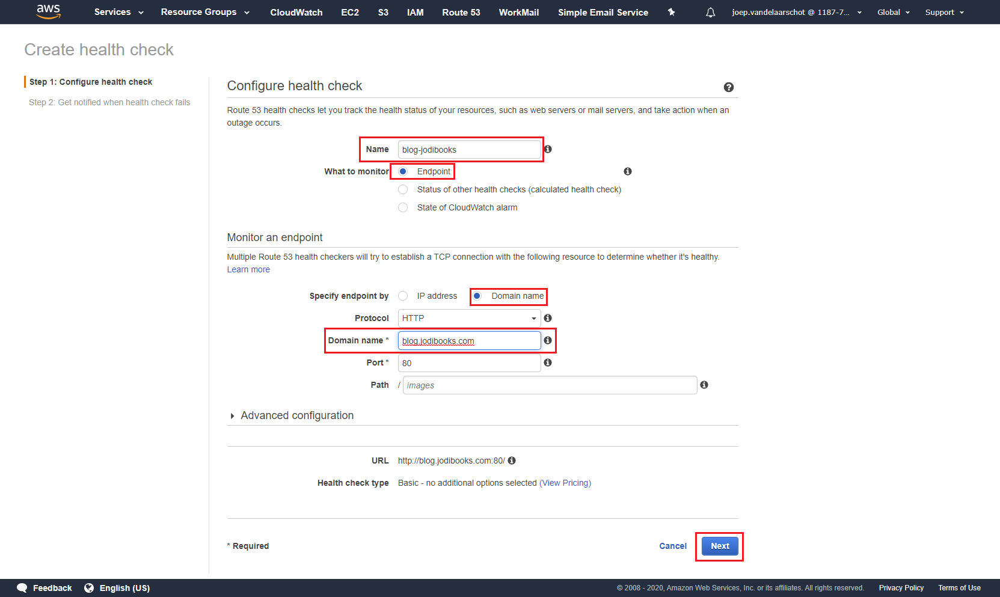

3. After we click the **Next** button, we can add an alarm. What's the point if you get no notification...? Route 53 will send a message to an SNS topic and will subscribe at least one email address to that topic.  
    Select **Create alarm: Yes** and send the alarm to **New SNS topic.** Choose a **Topic name** and enter at least one **Recipient email address.**

    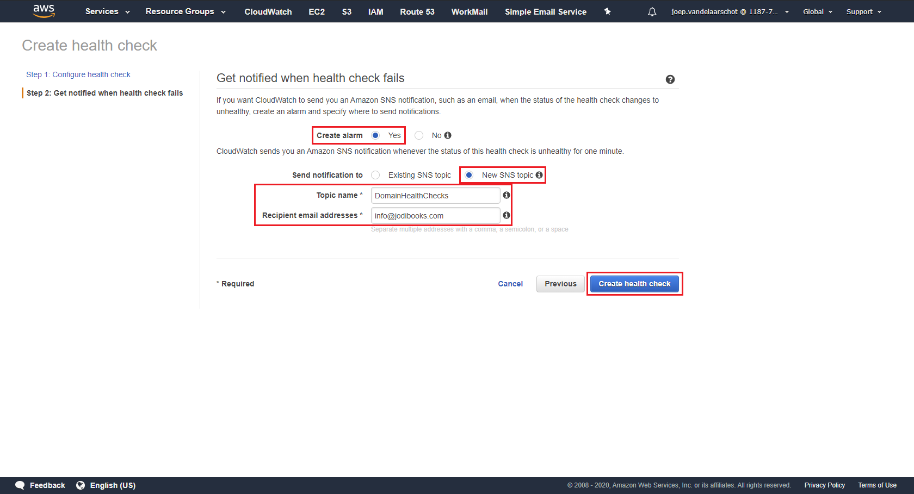

4. Create alarms for all (sub)-domains you want to monitor. You can create 50 free health checks and alarms as long as the resource your monitoring is an AWS resource (EC2 instance, load balancer, etc.).

## 4. Next: Email

During the creation of the health check alarm we touched the SNS service. [SNS](https://aws.amazon.com/sns/) stands for Simple Notification Service and can only send simple, plain text messages. We'll return to SNS in more detail in [part 14](../hosting-asp-net-apps-aws-part-14-monitoring-with-cloudwatch/).

To our customers however we want to send styled emails and we want to receive email in a user-friendly manner. This is configured in the [next part](../hosting-asp-net-apps-aws-part-8-email-with-workmail-and-ses/).
