## 1. Storage types

AWS has three storage options: [EBS](https://aws.amazon.com/ebs/) (block storage), [EFS](https://aws.amazon.com/efs/) (file storage) and [S3](https://aws.amazon.com/s3/) (object storage). I don't know the exact differences and don't know when you should use one over the other. Please read their comparison and use Google for more information on your specific use case.

> <https://aws.amazon.com/efs/when-to-choose-efs/>

For me, I use EBS as the storage for the OS'es. I don't use EFS, but can image this to be perfect for sharing files between instances or containers. For example two WordPress instances who share the same settings files. _Or maybe even my application files which I now put on a second EBS volume (not sure if that works though)._

S3 is the option we use for bulk storing data that goes out into the world. Objects like images, documents, videos that are send to your user or site visitor.

We already discussed the EBS for the instance OS'es in [part 5](../hosting-asp-net-apps-aws-part-5-ec2-instances/) and [6](../hosting-asp-net-apps-aws-part-6-servers-in-ec2-part-2/). In this part we'll focus on configuring S3.

## 2. S3 basics

### 2.1 Classes

Choosing to use S3 is not the end though. S3 is subdivided into multiple classes. From the standard S3 class through cheaper Infrequent Access classes to the very cheap archive classs, Glacier.

> <https://aws.amazon.com/s3/storage-classes>

As explained in [part 3 about the architecture](../hosting-asp-net-apps-aws-part-3-architecture/), we will be using three classes:

1. **S3 Standard** for user and website files. And for recent backups.
2. **S3 Standard-IA** for backups that are older than 6 months or 2 application versions.
3. **S3 Glacier** for backups older than 1 year.

### 2.2 Object principles


To understand S3 and object storage let's consider an image, for example the jodiBooks logo. An object is the collection of a globally unique key, object data and metadata.

The object data is the actual file you store in S3; the bits that describe that data. Metadata is the description of the file type, tags, size, creation date, version and access rights.

#### Unique key

Every object needs to have a globally unique key. This is a string containing the bucket, folder and filename + extension.

```xml
<bucket>/<key>
```

The last two parts are the key for the object. This does not need to be globally unique. The bucket will do that part. In this example we put the file in a subfolder of the bucket, so the key is not `logo.png` but `logo.png`.

```xml
<bucket>/<folder>/<filename>
```

#### Bucket

A bucket is a globally unique, [DNS friendly name](https://docs.aws.amazon.com/AmazonS3/latest/dev/UsingMetadata.html), for a collection of objects. I compare it with files (objects) in a folder (bucket). It's not completely correct, but good enough. You can set different access credentials to every bucket you make, not to individual objects. E.g. our image bucket is publicly available, while the user data bucket is only accessible by our application.

We want to put the logo in our emails, so for the recipients to download and see it, it has to be the former: publicly accessible. We called our public bucket `jodibooks-public-cdn`. It's all in the name...

#### Region

When creating a bucket you have to choose the region. The region closest to our customers is `eu-central-1`. Choosing a region close to your users, customers or visitors minimizes latency. When you have customers in multiple regions, consider using [CloudFront](https://aws.amazon.com/cloudfront/). This service will cache files close to your customers.

When creating the link to your objects you don't have to specify the region. You can do it if, for example, you would have a different logo in Asia, Europe and the Americas. But I'd think you would use other techniques to achieve that.

#### Version

If you enable versioning, S3 will also add a version ID to the object metadata. Every version is in effect a new object. If you didn't enable versioning, or always want to retrieve the latest, you can ignore this. S3 will send the latest (or only) version by default.

#### Object link

Now that we have all the object data we can make a hyperlink that let's you retrieve the file or object data directly. There are unfortunately multiple ways to format this link. We just have to choose which for us is easiest I guess.

- `http://s3-<region>.amazonaws.com/<bucket>/<key>`
- `https://s3-<region>.amazonaws.com/<bucket>/<key>`
- `http://s3.<region>.amazonaws.com/<bucket>/<key>`
- `https://s3.<region>.amazonaws.com/<bucket>/<key>`
- `http://<bucket>.s3.amazonaws.com/<key>`
- `http://<bucket>.s3-<region>.amazonaws.com/<key>`
- `http://<bucket>.s3.<region>.amazonaws.com/<key>`

In our logo example this is the link using the last format: `https://jodibooks-public-cdn.s3.eu-central-1.amazonaws.com/logo.png`. (Since writing this how-to switched to hosting the files through CloudFront, so the direct S3 link is not functional anymore.)

### 2.3 Security

Obviously an important part about data storage anywhere is security. We don't want unauthorized access to our users private data. And nobody needs to see our backups. The S3 service has multiple features that allow us to control this.

#### Public access

1. If you want to have a publicly available bucket, images on your homepage and blog, you can set a bucket to _allow public access_. The default value is to block _all_ public access.

    

2. If you disable some "blocks", thus enabling public access, AWS will show you warnings in multiple of their "advisory" services (Trusted Advisor, Access analyzer).

    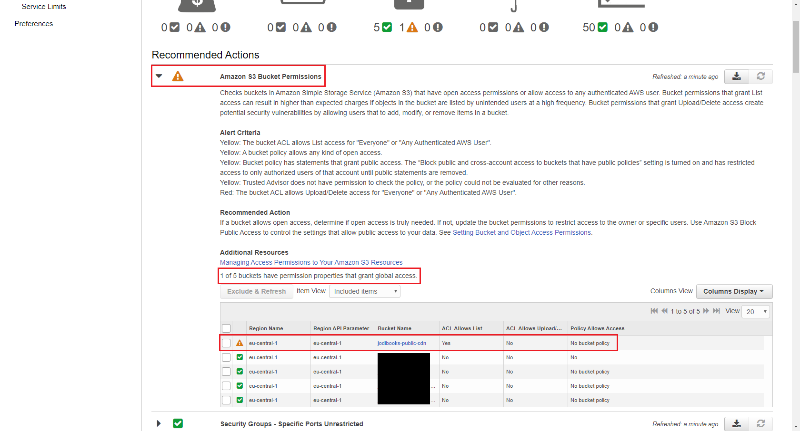

3. Public bucket warning in Trusted Advisor

    

> <https://docs.aws.amazon.com/AmazonS3/latest/dev/WebsiteAccessPermissionsReqd.html>

#### ACL

Allowing access to a bucket can be done through **Access Control Lists**. This is done really easy through the console. The downside is you don't have much settings. Granting public read access is doable (see picture below), but if you want to restrict access to certain users or roles, it's not possible.

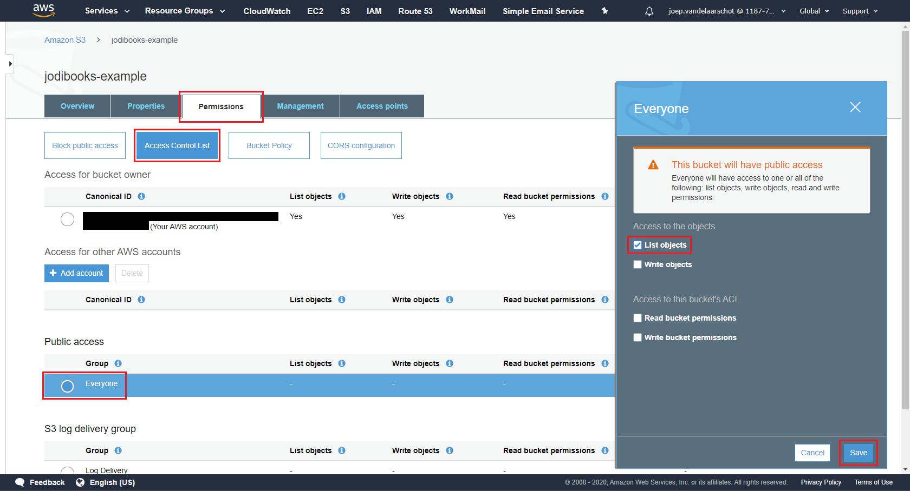

#### Policies

That's where **bucket policies** come in. Through a bucket policy you can deny or allow certain users, roles or services to access (read, write, delete, list, etc.) the bucket or its subfolders.

> * <https://docs.aws.amazon.com/AmazonS3/latest/dev/using-iam-policies.html>
> * <https://docs.aws.amazon.com/AmazonS3/latest/dev/access-policy-language-overview.html>
> * <https://docs.aws.amazon.com/AmazonS3/latest/dev/using-with-s3-actions.html>

#### Encryption

Nothing will be 100% secure, so if someone might get a copy of your data it better be encrypted. We send our data over https to the bucket, so it is encrypted during transfer. Amazon offers a service to encrypt it when it is stored. If someone makes a copy or steal some physical servers, he can't access the actual data.

If you want even more protection you can set your own keys through KMS or encrypt all your data yourself (client-side).

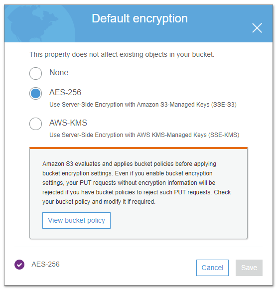

#### Versioning

Although this is not security per se, it does help. S3 will not overwrite an object, but version it when it is modified or deleted. In effect it will only change the metadata, not the object data. If you make a mistake, you can go back.

Once enable you cannot disable it. You have to delete and recreate the bucket or delete versions manually.

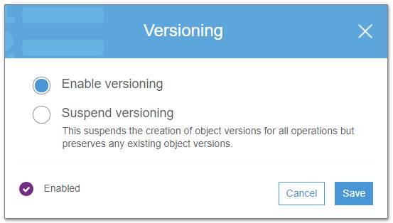

## 3. Create a bucket

Now that we covered the S3 basics, let's create a public bucket and then turn it private.

1. Go to the S3 console. It will show a list of all your buckets. Obviously none if you haven't created one. Click **Create bucket**.

    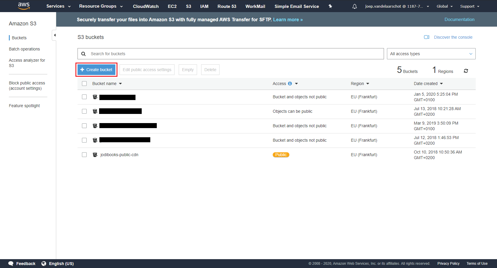

2. Enter a **Bucket name**. This should be _globally unique_ and _DNS-compliant_. What that means can be found in the AWS docs (see section _Rules for Bucket Naming_ in the link below). Choose a **Region** close to your users and click **Next**.

    > <https://docs.aws.amazon.com/AmazonS3/latest/dev/BucketRestrictions.html>

    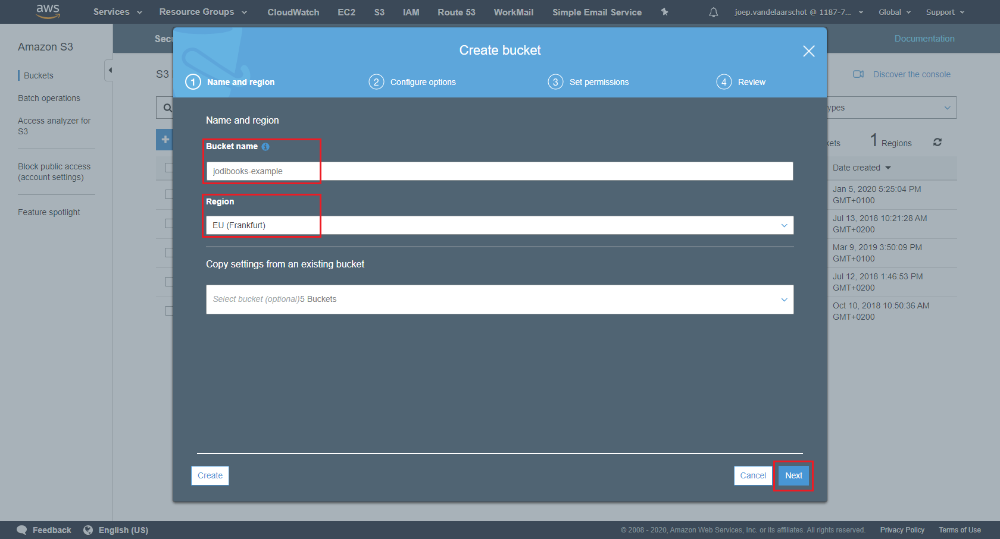

3. We want to **enable Versioning** and **enable Default encryption** using **AES-256**. Click **Next**.

    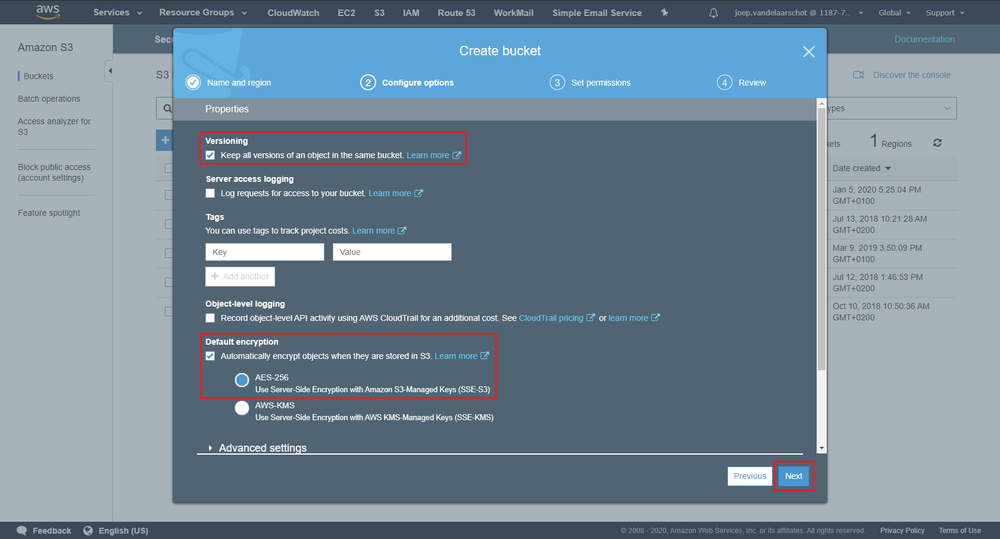

4. We are making a public bucket, we **uncheck** _Block all public access_ and **Acknowledge** that we understand the implications.

    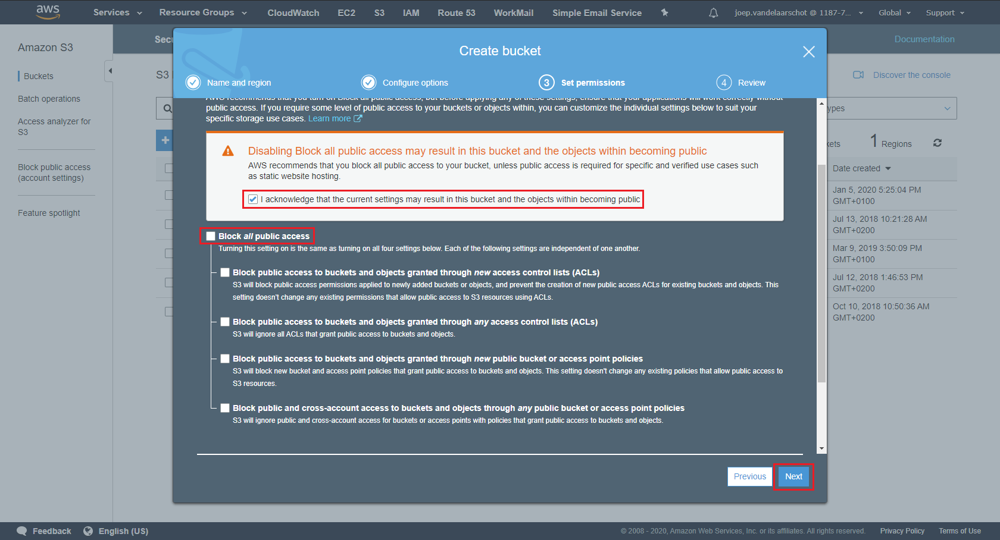

5. In the next screen we can review our settings and **Create** the bucket.

    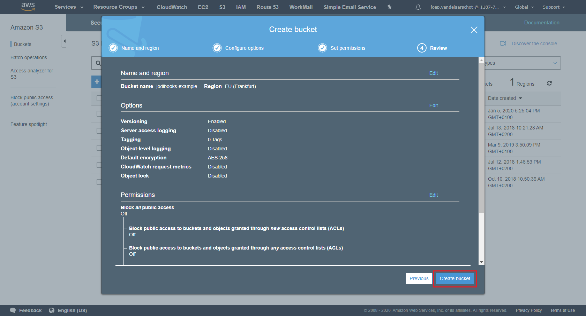

6. Out bucket shows up in the list and we can click the bucket to open it.

    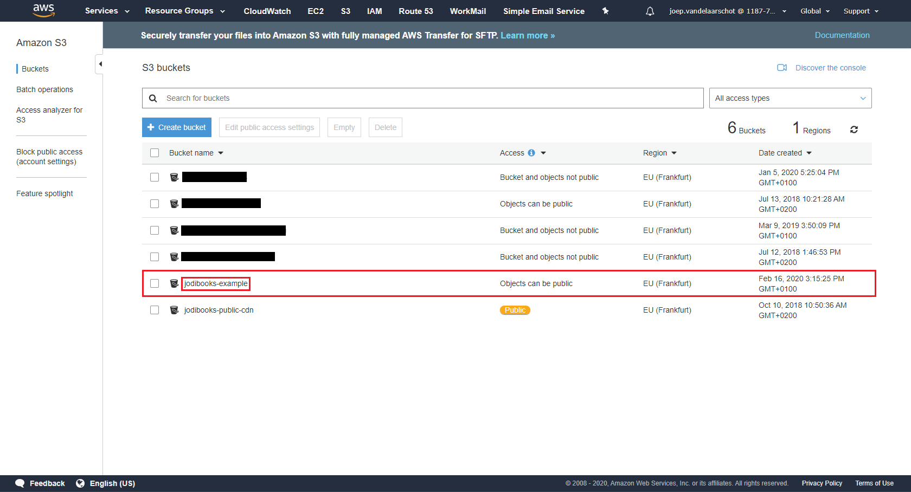

7. Now we go to the **Permissions** tab, click on **Access Control List**, select group **Everyone** under the _Public access_ header and select **List objects**. Once we've pressed **Save** everyone can download (Get) objects from this bucket.

    

## 4. Make bucket private

We can make a new bucket, but let's just turn the one we just made into a private bucket. You can see the bucket is currently public by the yellow tag that's visible everywhere. This also shows where the bucket is made public, in our case through the Access Control List.

1. Open the bucket and go to the **Permissions** tab. **Block public access** is selected by default. Click **Edit** and **check** _Block all public access_. Press **Save.**

    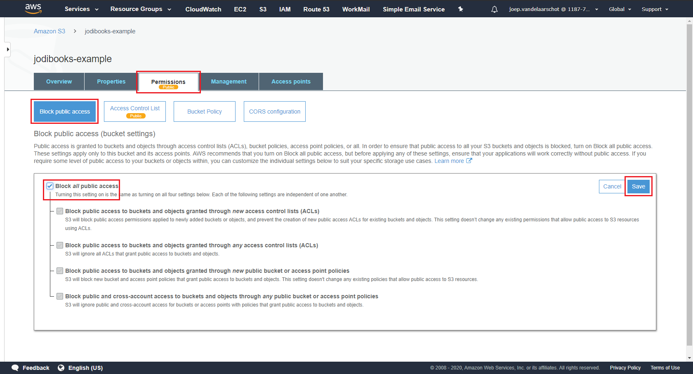

2. Type `confirm` in the text field as requested and click **Confirm**. You don't want to do this accidentally when users need access to the bucket.

    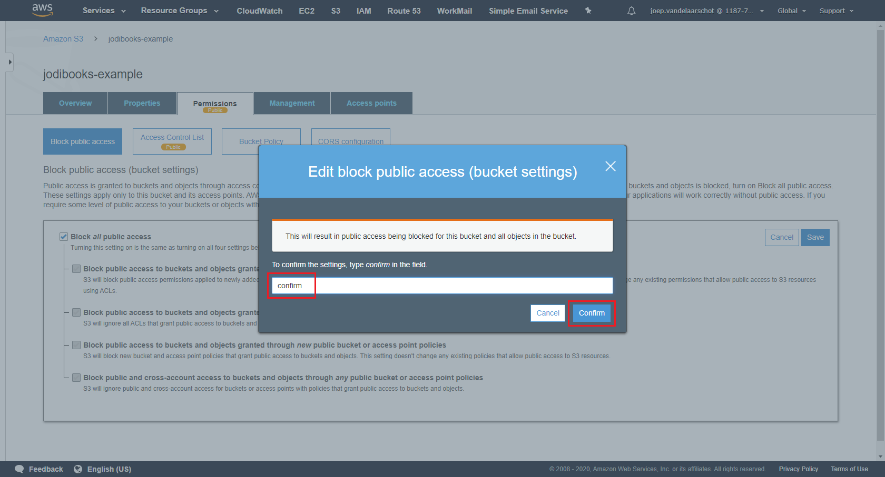

3. The only way to get into the bucket now, is through a user or role with sufficient credentials. As we configured ourselves as admins in part 4, we have full access. Our EC2 instances however have no S3 permissions through their Roles and thus cannot access any bucket. We'll configure that in part 14 and 15.
4. For our applications we need 5 buckets. Let's create them using the steps above, all in the region `eu-central-1`:

<div class='col-md-10 col-lg-8 mx-auto'>
    <table class="table table-striped table-responsive">
        <thead>
            <tr>
                <th scope="col">Name</th>
                <th scope="col">Versioning</th>
                <th scope="col">Encryption</th>
                <th scope="col">Public</th>
            </tr>
        </thead>
        <tbody>
            <tr>
                <td><code>&lt;backups&gt;</code></td>
                <td>Yes</td>
                <td>Yes</td>
                <td>No</td>
            </tr>
            <tr>
                <td><code>&lt;application-prod&gt;</code></td>
                <td>Yes</td>
                <td>Yes</td>
                <td>No</td>
            </tr>
            <tr>
                <td><code>&lt;application-logging&gt;</code></td>
                <td>No</td>
                <td>Yes</td>
                <td>No</td>
            </tr>
            <tr>
                <td><code>&lt;application-test&gt;</code></td>
                <td>Yes</td>
                <td>Yes</td>
                <td>No</td>
            </tr>
            <tr>
                <td><code>jodibooks-public-cdn</code></td>
                <td>Yes</td>
                <td>Yes</td>
                <td>Yes</td>
            </tr>
        </tbody>
    </table>
</div>

## 5. End of AWS part

With that we have configured our AWS environment. We will need to add and edit some small things, like specific policies and roles, but we'll get to that when configuring the software that needs it.

In the [next part](../hosting-asp-net-apps-aws-part-10-asp-net-sites-in-iis/), we'll be setting up the tools and applications needed to run our ASP.NET apps and our WordPress blog. We'll also make sure the apps are actually running.
