## Intro

When I started the previous version of my blog site ([joeplaa.com WordPress blog](/portfolio)), I didn't knew how to host WordPress myself. So I took a subscription to a webhosting service at [TransIP](https://www.transip.nl/). They not only offered hosting, but also a one button WordPress installation. This is not something special, but a great way for people to get started.

Although the speed and the price were good, something was missing. I didn't need it, but I wanted more control. With more control I mean setting up advanced caching (Redis and Nginx) and installing the latest MySQL version (8.0).

That meant getting my own VPS. As I already researched and [implemented this for jodiBooks](/how-to-host-asp-net-websites-on-aws/), it was a logical choice to also use AWS for my blog. And as I couldn't find a proper guide I created this "How to host WordPress in AWS Lightsail" tutorial. One that is not based on the standard Bitnami image.

## AWS Lightsail

As far as I know AWS has two services that are suitable for hosting WordPress: EC2 and Lightsail. EC2 is the advanced option which comes with a lot of additional options. For a simple blog Lightsail is good enough, much simpler and cheaper.

Looking at pricing comparing Lightsail with a hosting solution is fairer as it isn't a full VPS. It doesn't have dedicated vCPU cores and network connections are shared. It does include data traffic and dns management. If you choose to use an EC2 instance, bare in mind that it needs to be extended with a Route 53 hosted zone ($0,50 per month) and you pay for data transfer.

In this guide I'll show you how to setup WordPress on a Lightsail instance. I will do that in 3 parts. The first 2 are essential, the last one optional but recommended.

1. [Prepare AWS](#prepare-aws)
2. [Install LEMP stack](#install-lemp-linux-nginx-mariadb-php-stack)
3. [Backups](#backups)

<div class='col-md-10 col-lg-8'>
    <table class="table table-striped table-responsive">
        <thead>
            <tr>
                <th scope="col">Option</th>
                <th scope="col">vCPU</th>
                <th scope="col">MEM</th>
                <th scope="col">Cost/month*</th>
            </tr>
        </thead>
        <tbody>
            <tr>
                <td><a href='https://www.transip.nl/webhosting/wordpress/' target='_blank' rel='noopener noreferrer'>Webhosting TransIP</a></td>
                <td>-</td>
                <td>-</td>
                <td>€ 5.99</td>
            </tr>
            <tr>
                <td><a href='https://www.transip.nl/vps/' target='_blank' rel='noopener noreferrer'>VPS TransIP</a></td>
                <td>1</td>
                <td>1 GB</td>
                <td>€ 10.00</td>
            </tr>
            <tr>
                <td><a href='https://aws.amazon.com/lightsail/pricing/' target='_blank' rel='noopener noreferrer'>AWS Lightsail 1GB</a></td>
                <td>1 (10%)</td>
                <td>1 GB</td>
                <td>$ 5.00</td>
            </tr>
            <tr>
                <td><a href='https://calculator.aws/#/estimate?id=e0e44e0ac530355b8999ff8586cf58e8fa7f193e' target='_blank' rel='noopener noreferrer'>AWS EC2 t3a.micro</a></td>
                <td>2 (10%)</td>
                <td>1 GB</td>
                <td>$ 8.31</td>
            </tr>
        </tbody>
    </table>
</div>

**Pricing as of 21 September 2020*
* * *

## Prepare AWS

### 1. Setup AWS account

Before we can start with Lightsail, we have to get an account. You don't need to be a business to register with AWS, but you do need a credit card. When you successfully registered the account, you have to secure it.

Using the root account needs to be avoided and instead a daily admin account should be made. I have described how to do that here: [Hosting ASP.NET apps on AWS part 4](/how-to-host-asp-net-websites-on-aws/part-4-iam-users-and-roles/).

### 2. Setup Lightsail instance

1. Now that we have our account and have logged in with our admin user, we can go to the [Lightsail dashboard](https://lightsail.aws.amazon.com/). Here we click on the **Create instance** button. I already had an instance running, but otherwise the dashboard would show a big **Create** button.

    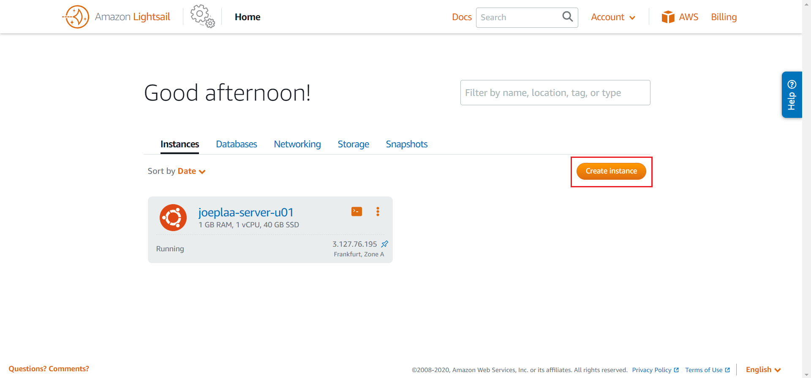

2. After clicking that button select the region closest to you or your intended visitors to make the latency of your website as low as possible. For me that is `Frankfurt`. Optionally you can also select the availability zone, but for a single instance that doesn't matter.

    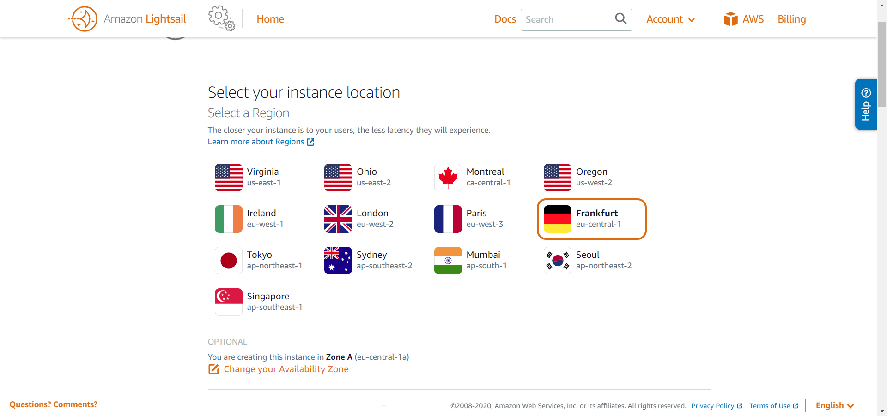

3. Next we can select the OS (platform), `Linux/Unix`, and the OS type, `Ubuntu 18.04`. If you want an easy installation and your application is listed, you can also select `Apps + OS`. This will use a [Bitnami](https://bitnami.com/) image with everything preinstalled en configured.

    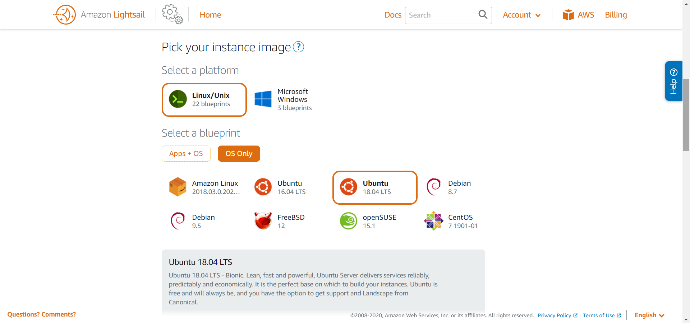

4. Scrolling down further, we can select some optional items. For now we leave all of these settings on the default values.<br /><br />Further down, we can also select the instance size. WordPress will run fine on all of them. Our intended setup uses a little more memory, so we need at least the second (1 GB) option.

    

5. As the last step we enter the instance name. I chose `joeplaa-server-u01` for my server. It hosts the `joeplaa` website, it is a web `server` and is a `U`buntu instance with number `01` (`02` for this how-to).

    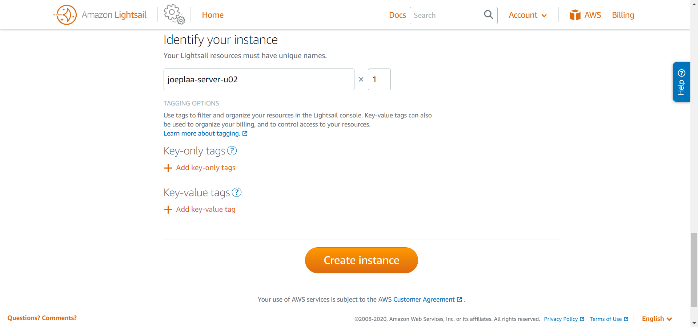

6. After we click the **Create instance** button the instance will be initiated. This can take a few minutes. After that the instance will be accessible through the dashboard as shown in the first picture ('Good afternoon').

### 3. Setup Route 53

I wanted to move my domain to AWS. This is not necessary. You can also use any other registrar, as long as you can configure your DNS and nameserver settings. In the first part of [Hosting ASP.NET apps on AWS part 7](/how-to-host-asp-net-websites-on-aws/hosting-asp-net-apps-aws-part-7-domains-and-dns-with-route-53/) I describe how to register and/or transfer a domain to Route 53. You can stop when you arrive at the "DNS management" heading. We'll do that in Lightsail.

### 4. Setup Lightsail networking

1. In the Lightsail dashboard go to the **Networking** tab. Now click the **Create static IP** button.

    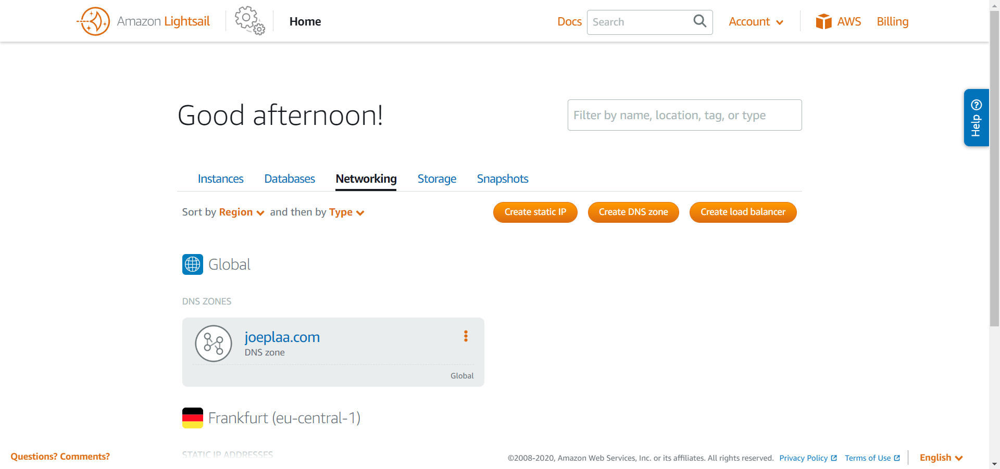

2. Select the region. Use the same as your instance. I choose `Frankfurt`.

    

3. Next we select the instance (I can't as all my instances already have a static IP attached). And we give it a name. I named mine `joeplaa-static-ip1`. **Create** the IP.

    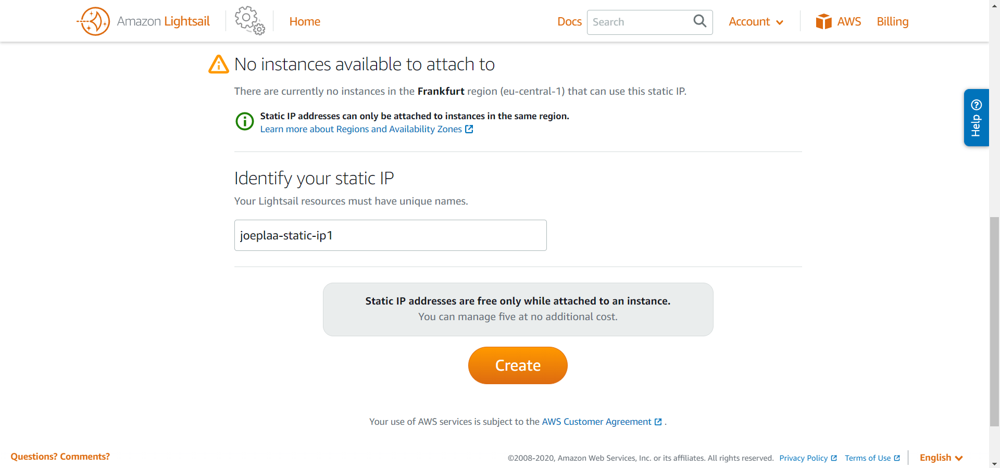

4. With the IP address created and the nameservers of the domain accessible, we now click **Create DNS zone**.

    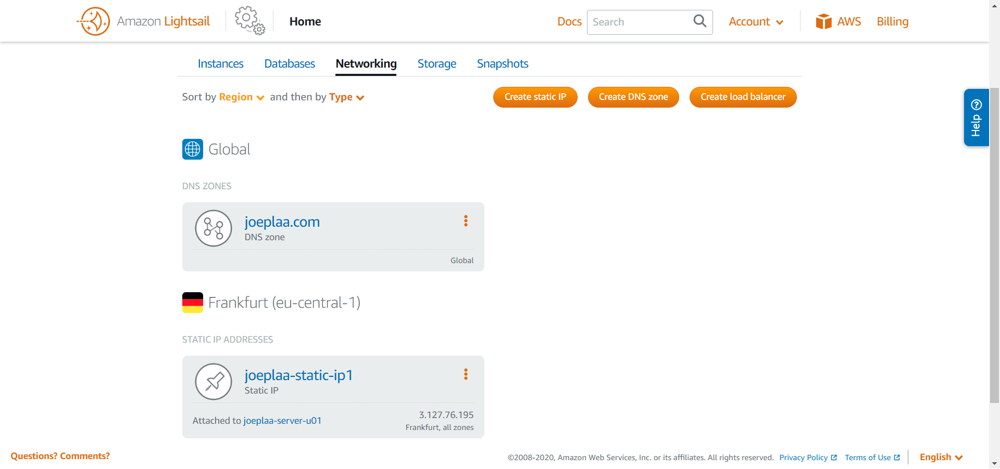

5. Enter the domain, for me that's `joeplaa.com` and click **Create DNS zone** at the bottom of the page.

    

6. Enter the following records one by one:

<div class='col-md-10 col-lg-8 mx-auto'>
    <table class="table table-striped table-responsive">
        <thead>
            <tr>
                <th scope="col">Type</th>
                <th scope="col">Subdomain</th>
                <th scope="col">Resolves to</th>
            </tr>
        </thead>
        <tbody>
            <tr>
                <td><code>A</code></td>
                <td><code>@</code></td>
                <td><code>&lt;your static ip address&gt;</code></td>
            </tr>
            <tr>
                <td><code>CNAME</code></td>
                <td><code>www</code></td>
                <td><code>&lt;your main domain&gt;</code></td>
            </tr>
        </tbody>
    </table>
</div>

7. Now scroll down. You'll find a list with the 4 nameservers for your DNS zone. Go to your domain registrar and change their nameservers to the Lightsail ones.

    

8. Something I didn't understand at first is that you had to configure these servers with your registrar, in my case Route 53. Once I knew, I still had to find out where and how to configure the nameservers in Route 53. Go to your "[Registered domains](https://console.aws.amazon.com/route53/home#DomainListing:)" in the Route 53 dashboard and open the domain for the DNS zone we are configuring in Lightsail.

    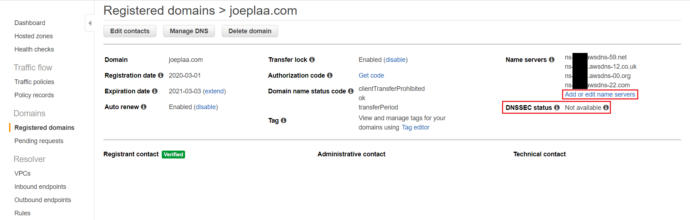

9. Make sure DNSSEC is disabled. If not click **Add or edit name servers** and disable it (Route 53 currently doesn't support it). When DNSSEC is disabled you can change the nameservers by clicking **Add or edit name servers** again.
* * *

## Install LEMP (Linux, Nginx, MariaDB, PHP) stack

### 1. Login and update

Now that the instance is running, we can connect to it through SSH. This will all be command line, so no nice GUI.

1. If you use Windows, download [PuTTY](https://www.putty.org/) and install. On Mac or Linux you can use the terminal.
2. Follow [this excellent guide](https://lightsail.aws.amazon.com/ls/docs/en_us/articles/lightsail-how-to-set-up-putty-to-connect-using-ssh) from the AWS docs to connect to your instance. It would basically be copy-pasting and a waste of time if I redid it here. I just want to add one thing: instead of using the IP address, you can also use your domain if set up correctly.

    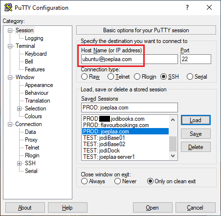

3. Once you're connected start with updating the OS:

    ```terminal
    sudo apt update && sudo apt upgrade -y
    ```

### 2. Setup firewall

I'm not a firewall guru. To be honest, I know very little about firewalls, especially how to configure them in Linux. I used the sources below to setup mine.

<Alert type='info'>
<h3 class='mt-1'>Sources:</h3>

* <https://www.digitalocean.com/community/tutorials/how-to-set-up-a-firewall-with-ufw-on-ubuntu-16-04>
* <https://www.digitalocean.com/community/tutorials/ufw-essentials-common-firewall-rules-and-commands>
* <https://linuxize.com/post/how-to-setup-a-firewall-with-ufw-on-ubuntu-18-04/>
* <https://www.linode.com/docs/security/firewalls/configure-firewall-with-ufw/>

</Alert>

1. We start with installing the firewall. In Ubuntu this is UFW, **U**ncomplicated**F**ire**W**all.

    ```shellsession
    sudo apt update
    sudo apt install ufw
    ```

2. Now the first thing we do is configure the default settings. We want to **allow** all outgoing traffic and **deny** all incoming traffic.

    ```shellsession
    sudo ufw default allow outgoing
    sudo ufw default deny incoming
    ```

3. All incoming ports are closed now, but we want to be able to SSH (PuTTY) into the instance. To do that we need to configure that in the firewall. We do that by **allowing port 22** to accept traffic. With this setting anyone can enter your server. Don't worry though, we'll fix that in a minute.

    ```shellsession
    sudo ufw allow ssh
    ```

4. We also want our WordPress page to be accessible. To do that we have to **allow traffic on port 80 and 443**. There are multiple ways to do that, but we'll take the easy route.

    ```shellsession
    sudo ufw allow 'Nginx Full'
    ```

5. Lastly we enable the firewall. You will be warned that enabling the firewall may disrupt existing ssh connections. We've opened that port, so we can type `y` and hit `Enter`.

    ```shellsession
    sudo ufw enable
    ```

6. Check the firewall settings with the following command:

    ```shellsession
    sudo ufw status verbose
    ```

    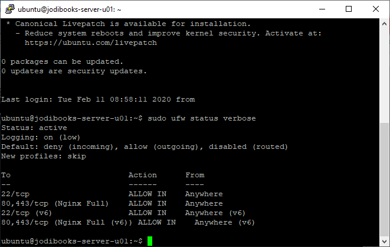

7. Now go to the Lightsail dashboard, click on your instance and select the **Networking** tab. Here you'll see another firewall. This is the firewall AWS provides. It sounds like doing the firewall in Linux is double the work and unnecessary, but better be safe and enable both. Again the ports `22`, `80` and `443` need to be open. For port 22 we enable the "Restrict to IP address" option and add our home/office address (<https://whatsmyip.com/>).

    

### 3. Enable Swap

Preferably you only use the RAM of your instance, because that is the fastest option to store temporary data. As we only have 1 GB, this is quite tight. So the second option would be to create swap space on the local SSD, ephemeral storage in AWS terms. A Lightsail instance however doesn't have that, so we are forced to forgo on best-practices and use the attached network volume.

<Alert type='info'>
AWS best practices regarding swap space:

<https://aws.amazon.com/premiumsupport/knowledge-center/ec2-memory-swap-file/>

</Alert>

AWS recommends creating swap space that is "_2x the amount of RAM but never less than 32 MB_". You can create a new volume (disk) specifically for swap, but I've added it to the main volume.

1. We will create a 2 GB swap space (**64** blocks of **32 M**B). In the command line type:

    ```shellsession
    sudo dd if=/dev/zero of=/swapfile bs=32M count=64
    ```

2. Update the **read and write** permissions for the swap file:

    ```shellsession
    sudo chmod 600 /swapfile
    ```

3. Set up a Linux swap area:

    ```shellsession
    sudo mkswap /swapfile
    ```

4. Make the swap file available for immediate use by adding the swap file to swap space:

    ```shellsession
    sudo swapon /swapfile
    ```

5. Verify that the procedure was successful:

    ```shellsession
    sudo swapon -s
    ```

6. Enable the swap file at boot time by editing the `/etc/fstab` file. Open the file in the editor:

    ```shellsession
    sudo nano /etc/fstab
    ```

7. Add the following new line at the end of the file (use arrow keys and paste the line with right-mouse button), save the file (`ctrl+x`), and then exit (`y` and hit `Enter`):

    ```shellsession
    /swapfile swap swap defaults 0 0
    ```

    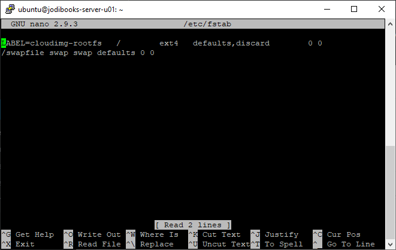

8. When starting a new SSH session, Ubuntu will display the amount of used memory, but you can also see it by using top or htop. These can be opened by simply typing `top` or `htop` in the terminal.

    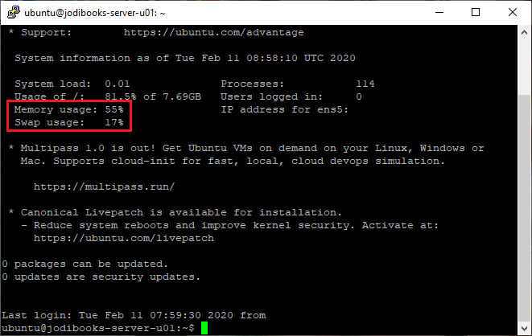

    : `shift+M`")

### 4. Install Redis, Nginx, PHP, MySQL

For [jodiBooks](https://jodibooks.com) I configured the exact same stack. The only difference is that it was done on an EC2 instance instead of Lightsail. The process however is (almost) exactly the same (I used [that guide](/how-to-host-asp-net-websites-on-aws/hosting-asp-net-apps-aws-part-13-wordpress-hosting-on-lemp-ssl-s3/) to install this blog). The only difference is the S3 plugin, which I'll discuss below.

### 5. Set file and folder permissions

Instead of using the Duplicator plugin, I had to manually copy my files from the old hoster to my Lightsail instance. After I copied the files from my computer to the correct folder on my instance, the Autoptimize plugin gave an error. It couldn't access the cache folder.

This was due to incorrect folder and file credential settings on the instance. If you get an error, working settings are listed in the table below. To achieve this, follow the steps below.

<div class='col-md-10 col-lg-8 mx-auto'>
    <table class="table table-striped table-responsive">
        <thead>
            <tr>
                <th scope="col">Folder</th>
                <th scope="col">chown</th>
                <th scope="col">chmod</th>
            </tr>
        </thead>
        <tbody>
            <tr>
                <td><code>/var/www/&lt;website&gt;</code></td>
                <td><code>ubuntu:ubuntu</code></td>
                <td><code>644</code></td>
            </tr>
            <tr>
                <td><code>/var/www/&lt;website&gt;/wp-content/</code></td>
                <td><code>www-data:www-data</code></td>
                <td><code>755</code></td>
            </tr>
            <tr>
                <td><code>/var/www/&lt;website&gt;/wp-config.php</code></td>
                <td><code>ubuntu:ubuntu</code></td>
                <td><code>600</code></td>
            </tr>
            <tr>
                <td><code>/var/www/&lt;website&gt;/index.php</code></td>
                <td><code>ubuntu:ubuntu</code></td>
                <td><code>444</code></td>
            </tr>
        </tbody>
    </table>
</div>

```shellsession
sudo chown ubuntu:ubuntu -R /var/www/<website>
sudo chown www-data:www-data -R /var/www/<website>/wp-content
cd /var/www/<website>
sudo find -type d -exec chmod 755 {} \;
sudo find -type f -exec chmod 644 {} \;
sudo chmod 600 wp-config.php
sudo chmod 444 index.php
```

Be aware that the opinions on the "correct" folder settings vary. The settings I use are generally not considered safe (enough). But, if I use the safe settings, I cannot upload files through plugins, I can't edit the theme or add plugins.  

In the end it's your choice between safety (it's very hard to modify your files) and usability (I don't want to change files manually through the terminal, I prefer the WordPress admin panel). As I make regular backups, I chose usability.

<Alert type='info'>
Source:

<https://stackoverflow.com/questions/18352682/correct-file-permissions-for-wordpress#comment82099892_23755604>

</Alert>

* * *

## Backups

### 1. Lightsail snapshot

Now that we have a working WordPress website, it'a good idea to make a backup of all the work we did. If anything goes wrong in the future, be it a hack or you yourself (accidentally) screwing something up, you can go back to this state.

When running a virtual machine, or in our case an instance, you can make snapshots. A snapshot is a description of the state of the machine at that given moment. In effect it's an exact copy of all the data on the volume (SSD, hard disk, network drive) of that machine.

In Lightsail snapshots can be made automatically every day (last 7 days are stored), but as you pay for the storage of each snapshot ($0.05 per GB per month), we only make a single snapshot of the current state. You can always make a new one later if you updated software or added a lot of data.

1. In Lightsail go to your dashboard and click on the instance for which you want to make a snapshot. Do not go to the snapshot tab, as that is only a list of your snapshots.

    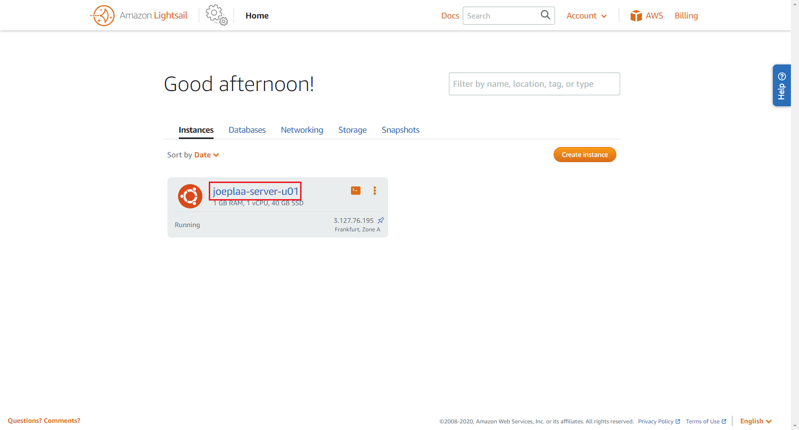

2. Now go to the **Snapshots** tab. On this page you'll see a list of snapshots you already made (or were made automatically). I made one on March 2, which was after I finished setting up this site. Click on **\+ Create snapshot** to make a new one.

    

3. Enter a name for your snapshot. Personally I want to know what instance this snapshot belongs to `joeplaa-server-u01`, the date `20200503` and why `initial setup` or `OS update` or something. I forgot that with my first snapshot though. Press **Create**.

    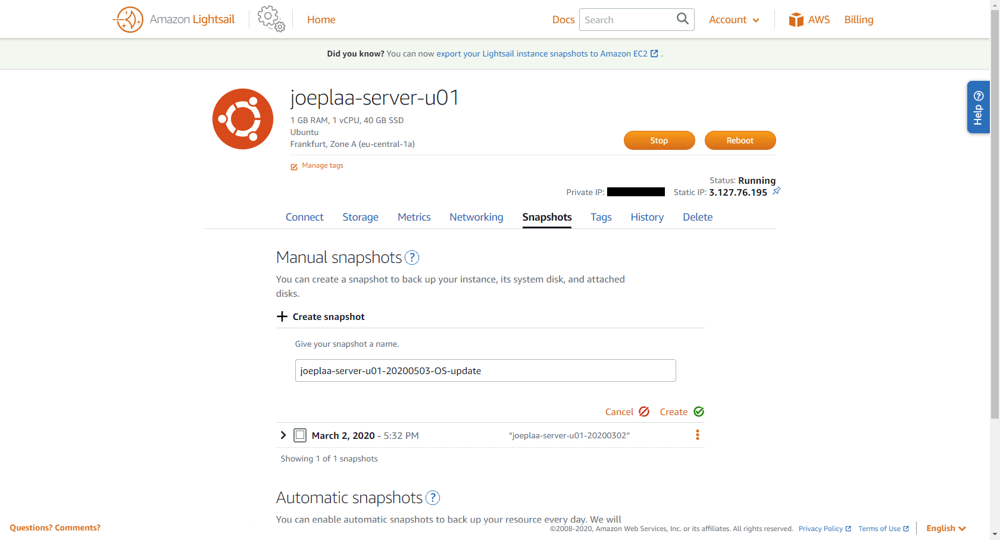

* * *

### 2. Backup to S3 plugin

We could have used snapshots to make backups of our posts, images and WP settings, but it's cheaper to store data in S3. A GB of snapshot storage costs 5 cents per month, where data storage in S3 costs 2.45 cents (Frankfurt).

S3 is known as object storage. I wrote about that in more detail in [this post](../hosting-asp-net-apps-aws-part-9-file-storage-on-s3/). For now it's enough to know all objects (files) are stored in buckets. Every bucket can be configured to be accessible by certain users that have been given certain credentials (read, write, delete, etc.).

I found a plugin, UpdraftPlus, which makes a backup of the database, plugins, themes, uploads (images) and other files. To do that, we have to create an S3 bucket for these objects and a user with access to this bucket.

1. Go to the [S3 dashboard](https://s3.console.aws.amazon.com/s3/home). It will list all your current buckets.

    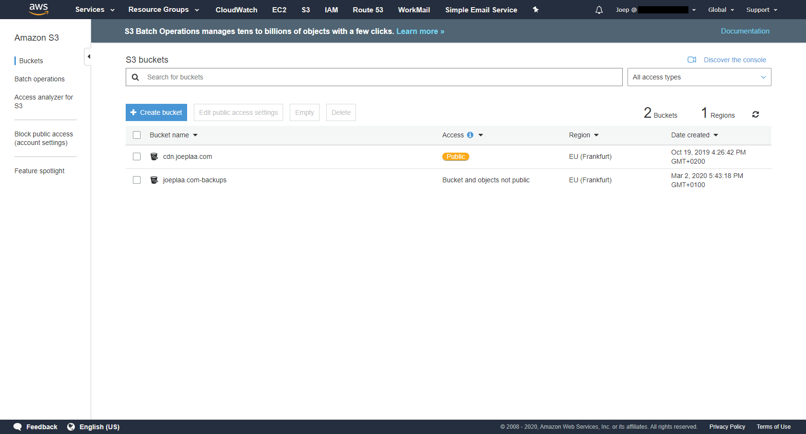

2. Click the **\+ Create bucket** button and enter the name of your bucket. Let's call this one `joeplaa-backup-example`. Change the **Region** to your region if needed. The correct one is probably already selected, in my case `EU (Frankfurt)`.

    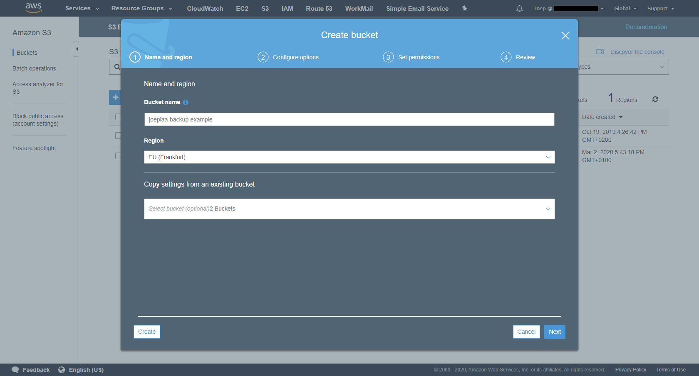

3. Click **Next** and select _Versioning_ and _Default encryption_: **AES-256**.

    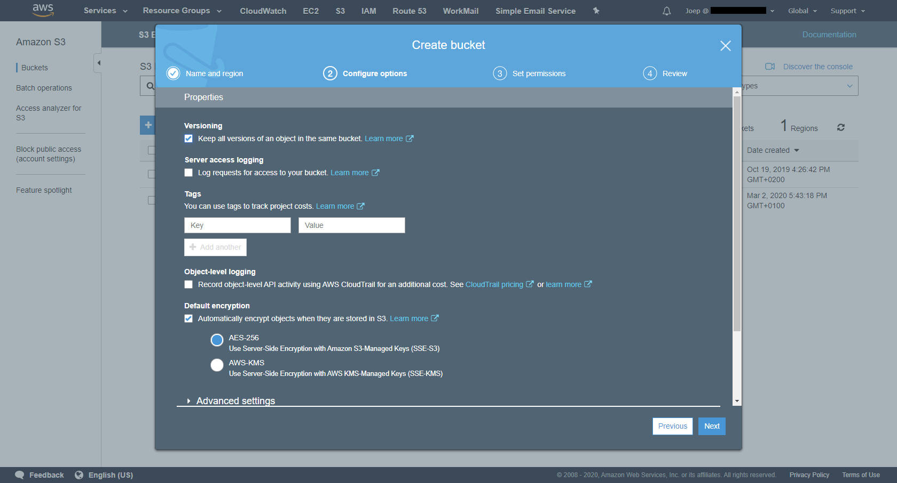

4. In the next screen keep the setting: **Block _all_ public access** and click **Next**.

    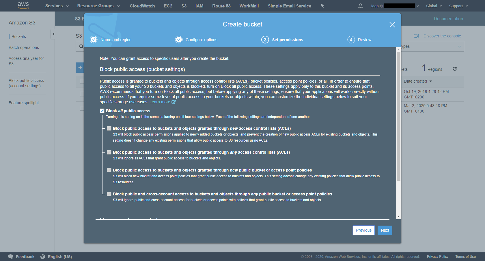

5. In the last screen check your settings and click **Create bucket**. The bucket will be added to the list and we can open it by clicking the name.
6. To allow the plugin (Updraft) to access this bucket, we have to create an IAM user with a policy that allows that. Go to the [IAM dashboard](https://console.aws.amazon.com/iam/home) and click **Users**. In the [user screen](https://console.aws.amazon.com/iam/home#/users), we'll click the **Add user** button.

    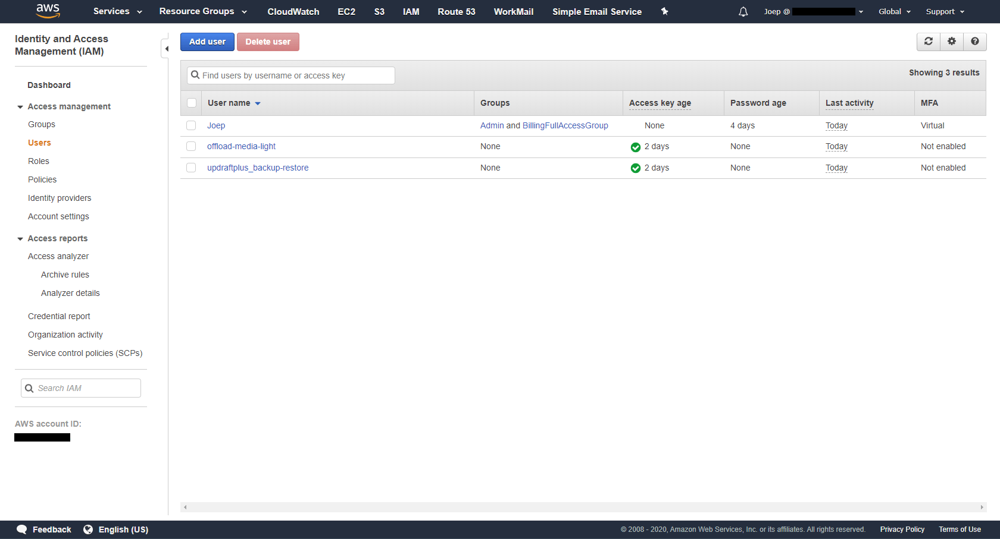

7. Enter the user name and try to use a name that explains who the user is. I often make the mistake of giving users names the future-me has no idea who or what they are. Let's try `wp-updraft-backup-restore` (please remember future-me). Select **Programmatic access**.

    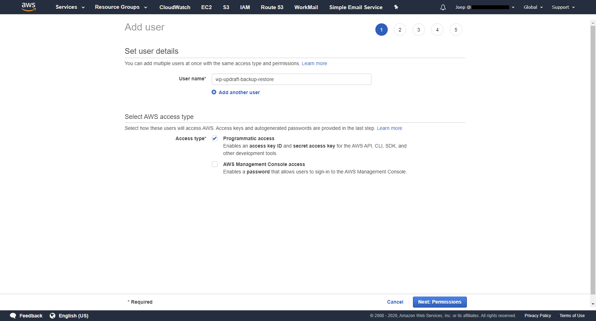

8. In the next screen click **Attach existing policies directly** and then click the **Create policy** button.

    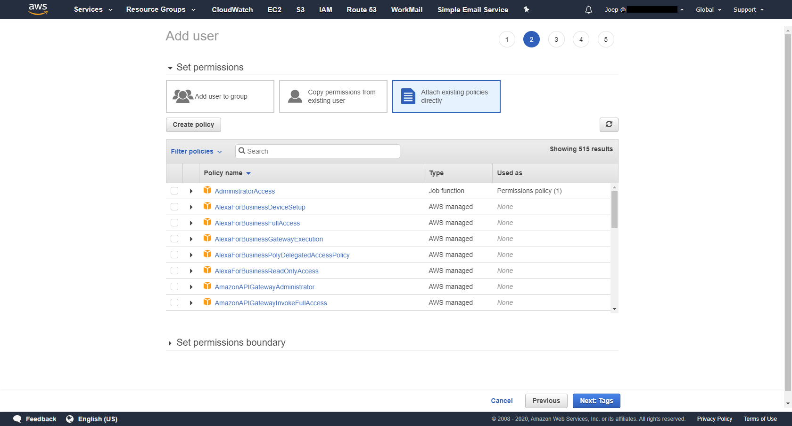

9. A new browser tab or windows will open with a Create policy screen. Click on the **JSON** tab and paste the policy below.

    ```json
    {
        "Version": "2012-10-17",
        "Statement": [
            {
                "Sid": "VisualEditor0",
                "Effect": "Allow",
                "Action": [
                    "s3:ListBucketMultipartUploads",
                    "s3:ListBucket",
                    "s3:GetBucketLocation"
                ],
                "Resource": "arn:aws:s3:::joeplaa.com-backups"
            },
            {
                "Sid": "VisualEditor1",
                "Effect": "Allow",
                "Action": [
                    "s3:PutObject",
                    "s3:GetObjectAcl",
                    "s3:GetObject",
                    "s3:AbortMultipartUpload",
                    "s3:DeleteObjectVersion",
                    "s3:PutObjectVersionAcl",
                    "s3:GetObjectVersionAcl",
                    "s3:DeleteObject",
                    "s3:PutObjectAcl",
                    "s3:GetObjectVersion"
                ],
                "Resource": "arn:aws:s3:::joeplaa.com-backups/*"
            }
        ]
    }
    ```

    

10. Give the policy a name in the last screen. Again choose something you can identify later. `S3-joeplaa.com-backups-updraft`. I'll take the service `S3`, the bucket `joeplaa.com-backups` and the user `updraft`. In the _Description_ I write that down with more words.

    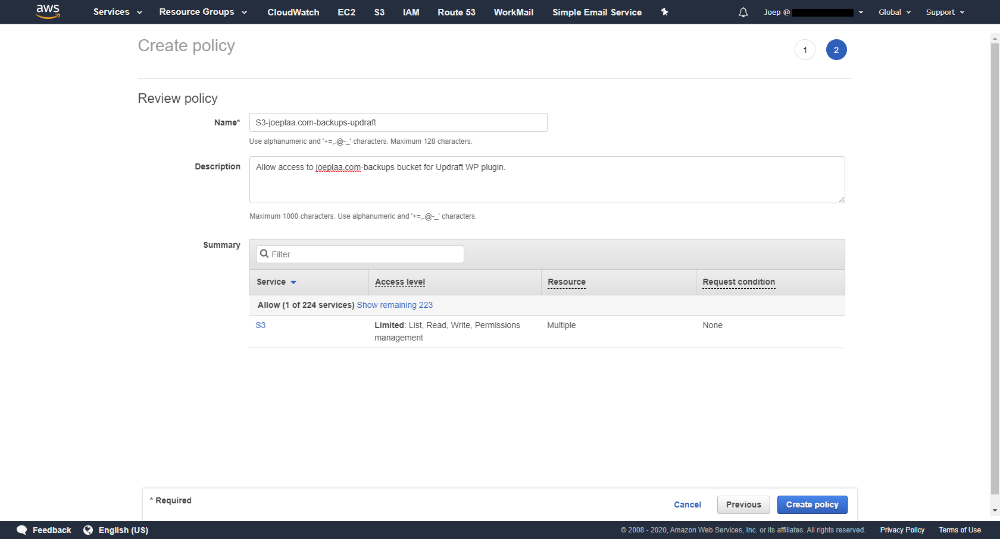

11. After you created the policy, go back to the browser tab with the create user screen. Click the **Refresh** button and search for the policy you just created and select it.

    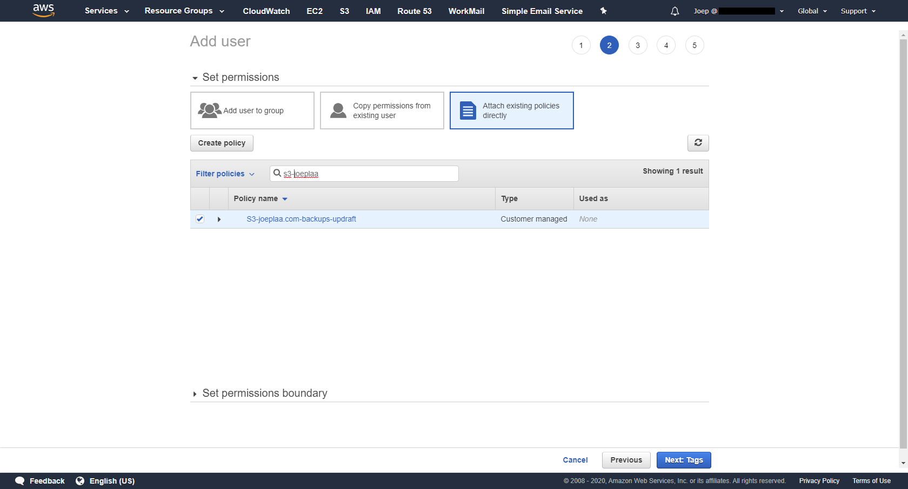

12. Click **Next** twice and **Create user**. Now save the credentials somewhere safe.
13. Open the Updraft plugin settings in WordPress. Plugins can be found in the **Settings** part of the main menu.
14. First we can select how often we want backups and how many to keep. For example `Daily` and `14` (two weeks). Next we can select the storage provider. `S3` obviously.

    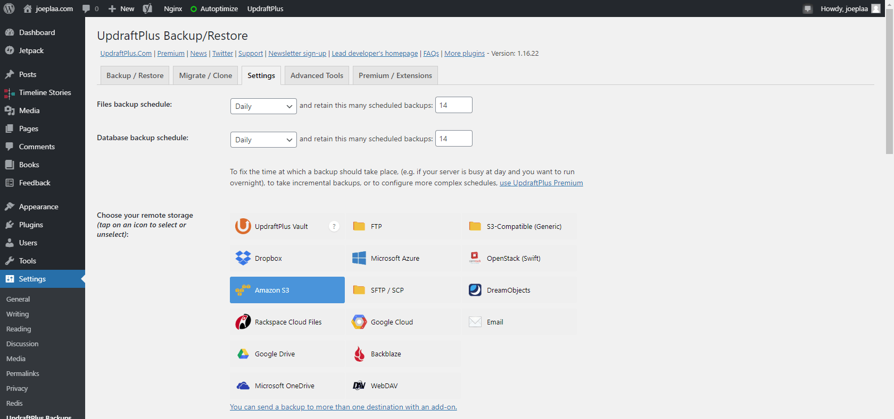

15. Almost there. When we scroll down a little, we can enter the _user credentials_ and the _bucket name_. Below that we can select the parts we want to backup and add any exclusions (e.g. cache folders). Scroll all the way down and press **Save Changes**.

    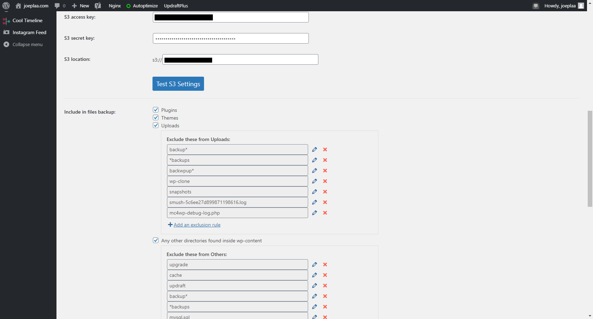

* * *

## Wrapping up

That's it. Now you have a super fast WordPress site on Lightsail which is regularly backed up to S3. If however your traffic grows and you're running into limitations, just make a snapshot, spin up a bigger instance and deploy your snapshot.

If you're really getting serious traffic, you probably want to look into a separate database instance and multiple Lightsail or EC2 instances coupled with a load balancer. That however is a [very different use case](https://aws.amazon.com/blogs/architecture/wordpress-best-practices-on-aws/).

Thanks for reading and I hope my guide helped you setup your WordPress site. If you have any questions or remarks send me an email or hit me up on one of the social platforms below.
