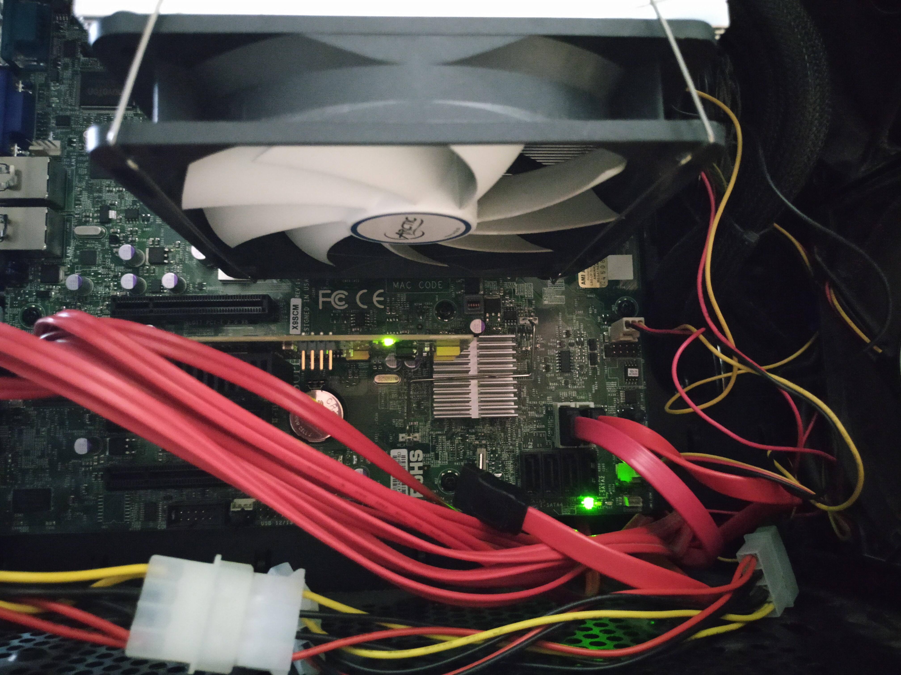
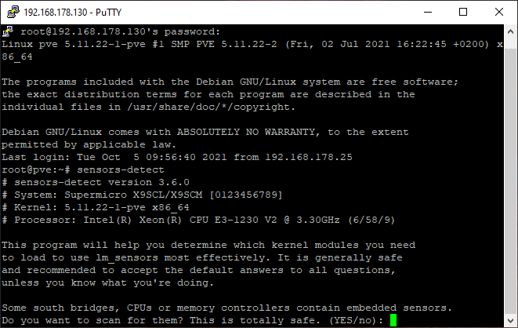
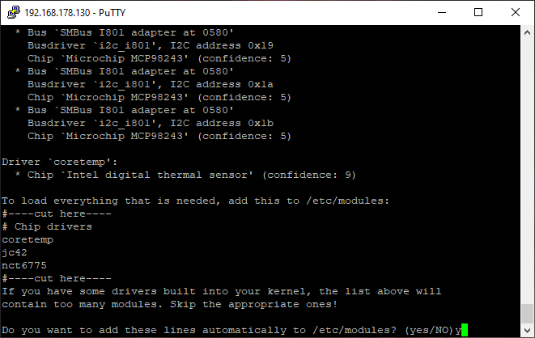
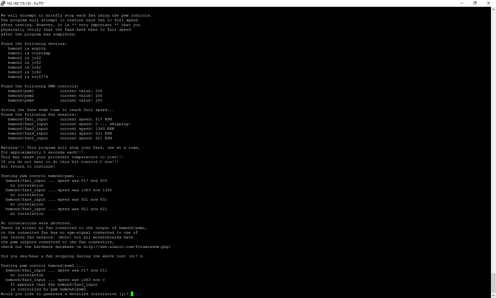
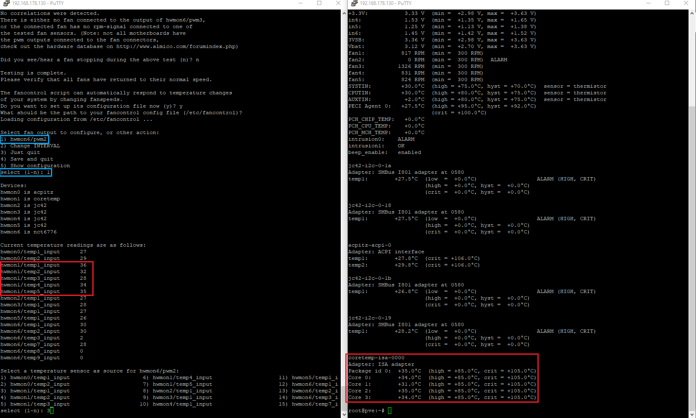
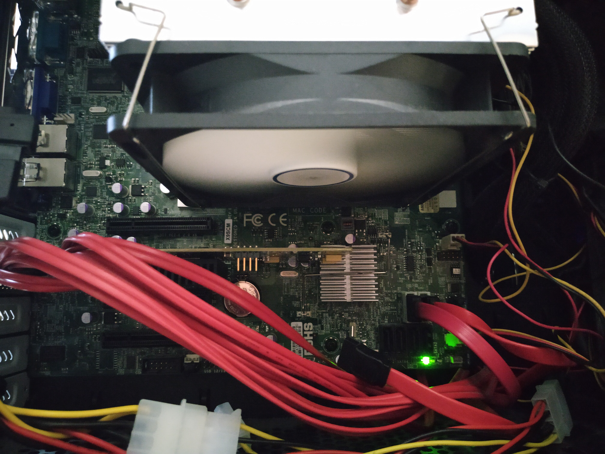

## Introduction

What [started as a project](https://blog.joeplaa.com/building-a-proxmox-cluster/) to run "some crypto applications" grew into something much bigger, but also more useful. I learned a tremendous amount about virtual machines, lxc containers and Proxmox. And although I'm just scratching the surface and I don't actually understand it, I know how to do some things. I'll write them down here, partly for myself, but also for you in hopes it will save one of us a lot of time and frustration.

## The problem

The [Supermicro X9SCM](https://www.supermicro.com/products/motherboard/xeon/c202_c204/x9scm-f.cfm) mainboard used in my first server has 4 PWM fan connections that are normally controlled through the BIOS. This works perfectly with the case fans I installed in the front of the chassis. However, the fan on the [Artic Freezer i32](https://www.amazon.com/ARCTIC-Freezer-i32-Controller-Technology/dp/B0119SJ3L8) CPU cooler I installed doesn't rotate when the mainboard (BIOS) decides the fan speed should be "low" ("*a PWM fan that starts up at a higher load (40% PWM)*").

This makes the CPU temperatures rise unnecessarily high, but can be fixed by letting the OS control the fan speed instead of the mainboard. On Ubuntu/Debian (Proxmox) this can be achieved by installing the `lm-sensors` package to read the CPU temperature data and `fancontrol` to control the fan speeds.



## Installation

1. Open a shell session to the server and login.

2. Install the `lm-sensors` and `fancontrol` packages.

    ```shellsession
    apt update
    apt install lm-sensors fancontrol
    ```

3. Configure lm-sensors as follows:

    ```shellsession
    sensors-detect
    ```

    Answer YES (`y`) to all YES/no questions. Be careful if you have a different mainboard. I read that it might give problems if non-existing sensors are being read.

    

4. At the end of sensors-detect, a list of modules that need to be loaded will be displayed. Type `yes` or `y` to have sensors-detect insert those modules into /etc/modules.

    

5. Load the added modules. This will read the changes you made to /etc/modules in the previous step, and insert the new modules into the kernel.

    ```shellsession
    service kmod start
    ```

6. Now configure fancontrol.

    ```shellsession
    pwmconfig
    ```

    This script will stop each fan for a few seconds to find out which fans can be controlled by which PWM handle. For me only one channel was found as the case fans do not use PWM.

    

    <Alert type='error'>
        If you get an error <code>/usr/sbin/pwmconfig: There are no pwm-capable sensor modules installed</code>, first try to reboot your machine (that solved it for me). If that doesn't work, look at the last 3 sources at the bottom of this post.
    </Alert>

7. You will have to specify what sensors to use to link the fanspeed to temperature changes. For the CPU fan make sure to use a sensor that measures your core CPU temperature to base the fan speed on.

    This is a bit tricky as the sensor is named differently in fancontrol and lm-sensors. I ran `sensors` in another shell to help me find the right sensor. In my case the CPU temperature sensor `coretemp-isa-0000` was named at `hwmon1` in fancontrol, so I took `hwmon1/temp1_input` to correlate the fanspeed to the temperature.

    

    Now run through the prompts and save the changes to the default location. Optionally you can make adjustments to fine-tune `/etc/fancontrol`, but I took all the default values. Apply your changes by restarting the fancontrol service.

    ```shellsession
    service fancontrol restart
    ```

8. To make the fancontrol service run automatically at system startup run:

    ```shellsession
    service fancontrol start
    ```

    

<Alert type='info'>
    <h3 class='mt-1'>Sources:</h3>

* <https://www.tomshardware.com/reviews/arctic-freezer-i32-cooler,5004.html>
* <https://manpages.debian.org/stretch/fancontrol/fancontrol.8.en.html>
* <https://manpages.debian.org/stretch/lm-sensors/sensors.1.en.html>
* <https://iandw.net/2014/10/12/fancontrol-under-ubuntu-14-04-resolving-usrsbinpwmconfig-there-are-no-pwm-capable-sensor-modules-installed/>
* <https://askubuntu.com/questions/22108/how-to-control-fan-speed/46135#46135>
* <https://stackoverflow.com/questions/49377334/usr-sbin-pwmconfig-there-are-no-pwm-capable-sensor-modules-installed-msi-ubun>

</Alert>
