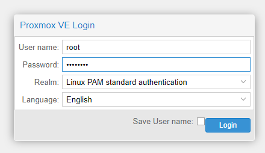
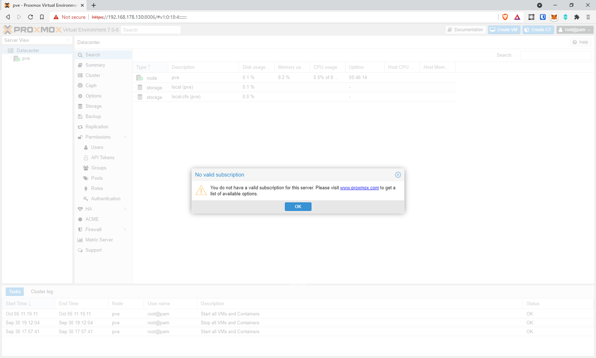

## Introduction

What [started as a project](https://blog.joeplaa.com/building-a-proxmox-cluster/) to run "some crypto applications" grew into something much bigger, but also more useful. I learned a tremendous amount about virtual machines, lxc containers and Proxmox. And although I'm just scratching the surface and I don't actually understand it, I know how to do some things. I'll write them down here, partly for myself, but also for you in hopes it will save one of us a lot of time and frustration.

## Proxmox installation

Proxmox supplies an [ISO file](https://www.proxmox.com/en/downloads/category/iso-images-pve) that installs Debian with Proxmox preinstalled and configured. This machine is known in Proxmox as a **node**. 

<Alert type='warning'>
    If you install Proxmox using BIOS or UEFI mode the OS should be booted in the same mode as well. So <strong>do not change boot option in the BIOS after installation!</strong>
</Alert>

1. Choose "Install Proxmox VE" in the boot screen (currently version 7.0)

2. Accept the EULA

3. Select the options and as filesystem choose `zfs (RAID1)`. As the harddisks choose your two boot drives. If you have a hardware RAID card and configured your boot drives into a single logical drive, choose that one.

    

4. Set country, timezone and Keyboard Layout. You cannot choose "UTC" here, we'll correct that later

5. Enter the root password

6. Select the management NIC and set the address of the host (see host table above for hostname and IP address).

7. Press the Install button and wait for installation to finish

8. Reboot

9. Press enter or wait for a few seconds to boot Proxmox from the boot loader

10. You should now be able to enter the CLI with the password created during install (user: `root`)

11. You should now also be able to enter the web interface at the address entered during installation, with the password created during install (user: `root`)

    

<Alert type='info'>
The "official" tutorial, with all the <a href='https://imgur.com/a/lSg9Lzt'>images</a> and a <a href='https://youtu.be/I-e1_CTa4s0'>Youtube video</a> on how to install and configure Proxmox can be found here:

<https://forum.proxmox.com/threads/proxmox-beginner-tutorial-how-to-set-up-your-first-virtual-machine-on-a-secondary-hard-disk.59559/>

</Alert>

<Alert type='warning'>
    If you get an error during boot:

```command
Command: /sbin/zpool import -N "rpool"
Message: cannot import 'rpool' : no such pool available
Error: 1
Failed to import pool 'rpool'.
Manually import the pool and exit.
```

You have to set a timeout of 20-30 seconds in grub. I can't remember how I did that, but at least here are the sources I could recover.

<h3 class='mt-1'>Sources:</h3>

* <https://www.servethehome.com/fixing-proxmox-ve-cannot-import-rpool-zfs-boot-issue/>
* <https://forum.proxmox.com/threads/zfs-cannot-import-rpool-after-reboot.37611/>

</Alert>

### Configuration

Proxmox has a lot of configuration options. Obviously many of them are dependent on what you want to achieve. I'll describe some of those in other posts. Here I'll focus on some basic, general configuration settings.

<Alert type='warning'>
    Proxmox config is very delicate. Almost all settings can be configured through the GUI, but sometimes you might have to dig into config files with the CLI. <strong>ALWAYS make a backup before doing so!</strong> I learned the hard way that messing up only one file (especially related to the cluster) can mean a full reinstall of that cluster!
</Alert>

#### Hide "no subscription" splash screen



1. Open a SSH shell to the Proxmox node.
2. Browse to folder:

    ```shell
    cd /usr/share/javascript/proxmox-widget-toolkit
    ```

3. Make a backup:

    ```shell
    cp proxmoxlib.js proxmoxlib.js.bak
    ```

4. Open file with `nano` and edit:

    ```shell
    nano proxmoxlib.js
    ```

5. Find the line (`ctrl` + `w`, enter `No valid subscription`, press `enter`):

    ```ini
    Ext.Msg.show({
        title: gettext('No valid subscription'),
    ```

6. Change line to:

    ```ini
    void({ //Ext.Msg.show({
        title: gettext('No valid subscription'),
    ```

7. Restart the Proxmox web service:

    ```shell
    systemctl restart pveproxy.service
    ```

8. This needs to be repeated after every update of the `proxmox-widget-toolkit`. I.e. after every update of Proxmox. Or get a subscription of course.

<Alert type='info'>
    Source:

<https://johnscs.com/remove-proxmox51-subscription-notice/>

</Alert>

#### Non-subscription repository

By default the subscription repository for Proxmox package updates is set. If you don't have a subscription (you don't need to) you can use the "no-subscription" repository.

1. Browse to folder:

    ```shell
    cd /etc/apt/sources.list.d/
    ```

2. Backup current file:

    ```shell
    mv pve-enterprise.list pve-enterprise.list.backup
    ```

3. Create new files:

    ```shell
    echo "#deb https://enterprise.proxmox.com/debian/pve bullseye pve-enterprise" > /etc/apt/sources.list.d/pve-enterprise.list
    echo "deb http://download.proxmox.com/debian/pve bullseye pve-no-subscription" > /etc/apt/sources.list.d/pve-no-subscription.list
    ```

4. Get update and install them:

    ```shell
    apt update
    apt dist-upgrade
    ```

<Alert type='warning'>

It seems to be important to do `apt dist-upgrade` instead of `apt upgrade`. This does some things behind the scenes like some cleanup, not sure what exactly. Read my source for more: <https://www.caretech.io/2018/06/08/how-to-update-proxmox-without-buying-a-subscription/>

</Alert>

#### Nested hypervisor

If you want to run nested hypervisors -a hypervisor in a VM-, you have to enable that. If your VM uses snap, this needs to be enabled.

1. Check if nested hypervisor is enabled (`kvm_intel` for Intel CPU, `kvm_amd` for AMD)

    ```shell
    cat /sys/module/kvm_intel/parameters/nested
    ```

2. If `N`, activate it. The first line is for Intel:

    ```shell
    echo "options kvm-intel nested=Y" > /etc/modprobe.d/kvm-intel.conf
    ```

    The second for AMD:

    ```shell
    echo "options kvm-amd nested=1" > /etc/modprobe.d/kvm-amd.conf
    ```

3. Reboot or reload the kernel module (`kvm_intel` for Intel CPU, `kvm_amd` for AMD):

    ```shell
    modprobe -r kvm_intel
    modprobe kvm_intel
    ```

4. check again:

    ```shell
    cat /sys/module/kvm_intel/parameters/nested
    ```

<Alert type='info'>
    Source:

<https://pve.proxmox.com/wiki/Nested_Virtualization>

</Alert>

#### Set timezone

I want to have my servers run in UTC timezone.

1. Run command and follow the GUI

    ```shell
    dpkg-reconfigure tzdata
    ```

#### Optional: Cluster setup

When you want to link multiple Proxmox nodes together it's called a cluster (shown as datacenter in the GUI). CLusters have a lot of quirks, I find, especially if you enabled 2FA and created users. You have to be logged in as `root` if I remember correctly. At least try it if something doesn't seem to work. When you have created a cluster, you can:

* Use a single login
    * Single username-password
    * Single private-public key
* Control the nodes, VM's and containers from a single GUI
* Share configuration (files) between nodes
* Migrate VM's and containers between nodes

So it's definitely worth your time and effort.

1. Choose the master node and create a cluster through the GUI. Make sure the IP of the host machine is set correctly as you **cannot change it later** without having to recreate the whole cluster.

2. Add the other nodes to the cluster by clicking the "Join Cluster" button.

That should be it, but in my experience it never works that easily. These are some things I encountered:

* When you already have 2FA enabled, this will not work. You have to join the cluster through the command line:

    ```shell
    pvecm add IP-ADDRESS-MASTER-NODE -link0 LOCAL-IP-ADDRESS-LINK0 --use_ssh
    ```

    If you have setup multiple links, you have to specify them all. So use `-link0`, `-link1` etc.

* You cannot change the ip address through which the cluster communicates. Not on the master and not on the slave.
* Never remove a node, reinstall and try to add it back with the same hostname/ip-address. You can add it back as a different node, but not as the same.
* Also properly remove a node. If you don't no all changes are blocked because the cluster cannot reach consensus as the amount of "votes" are not as expected. I don't understand how all of this works, just trust me if your time is valuable.

<Alert type='info'>
    <h3 class='mt-1'>Sources:</h3>

* <https://pve.proxmox.com/wiki/Cluster_Manager>
* <https://pve.proxmox.com/pve-docs/pvecm.1.html>

</Alert>

## Conclusion

That's it. You now have a basic Proxmox setup and can run your first virtual machines and LXC containers. In [part 2](/how-to-configure-proxmox-part-2) I'll explain how you link Proxmox to a NFS share for backups and how to mount external storage in general. For more articles on [Proxmox](/tags/proxmox), click the link.