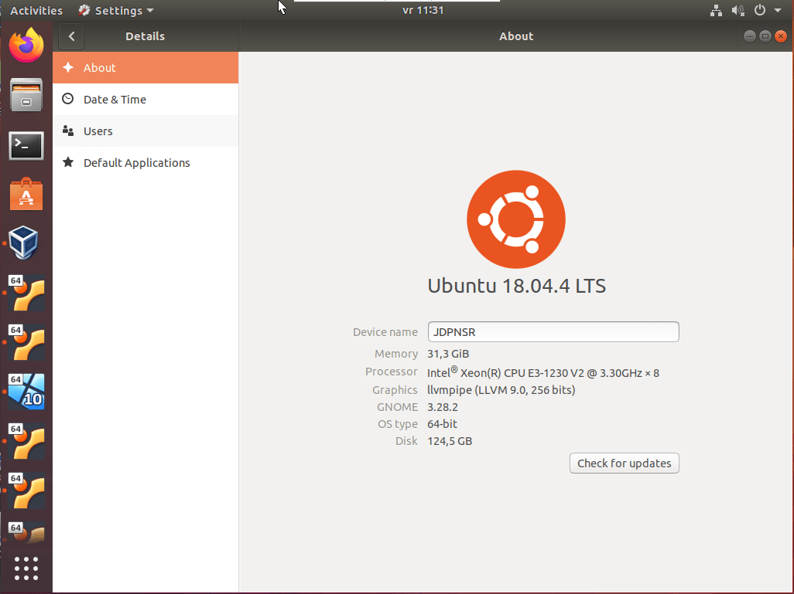
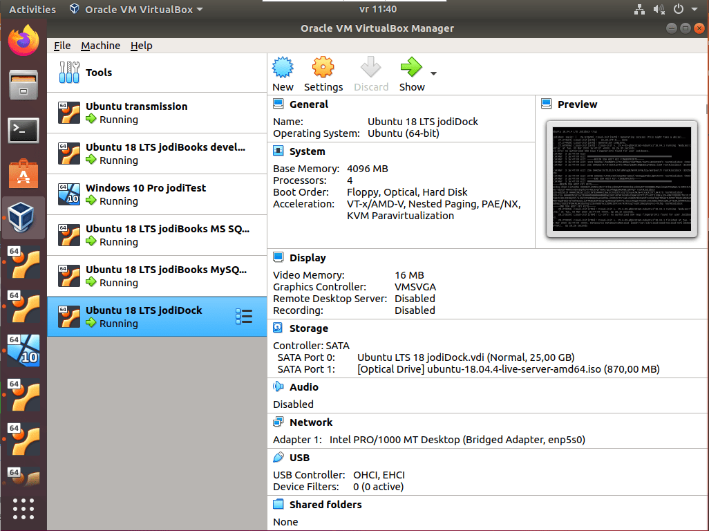
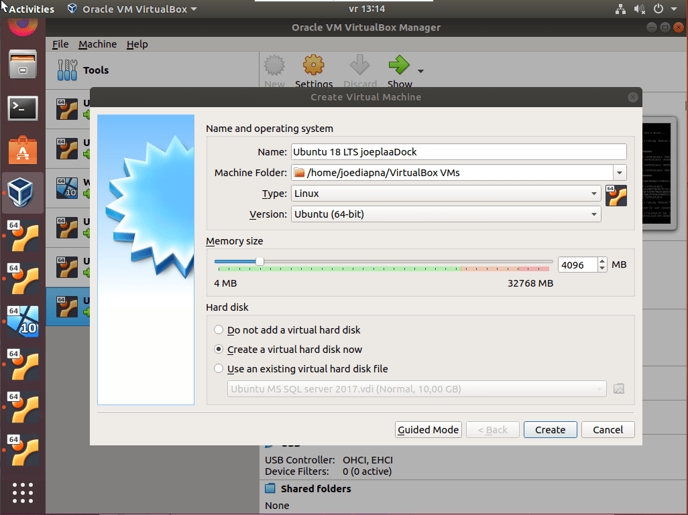
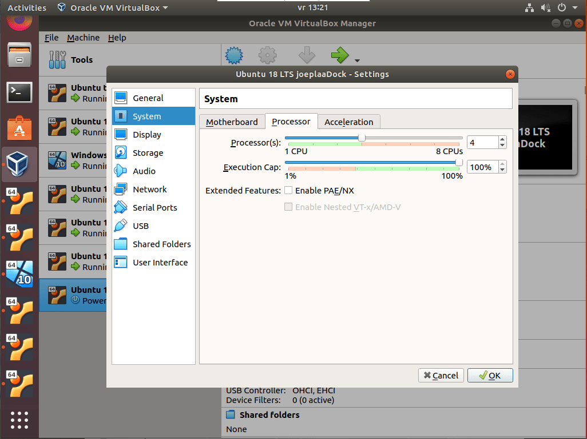
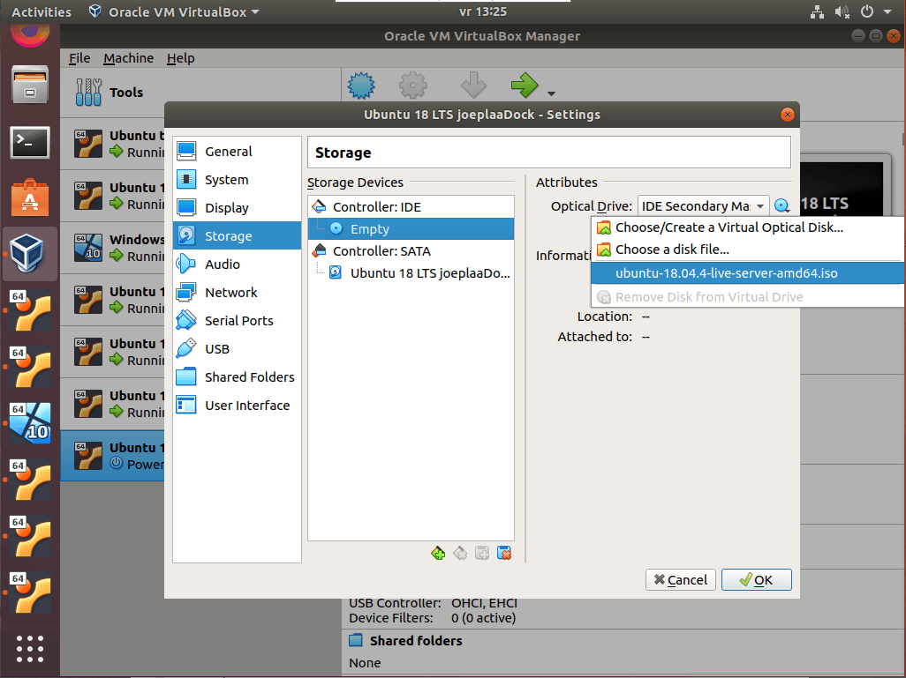
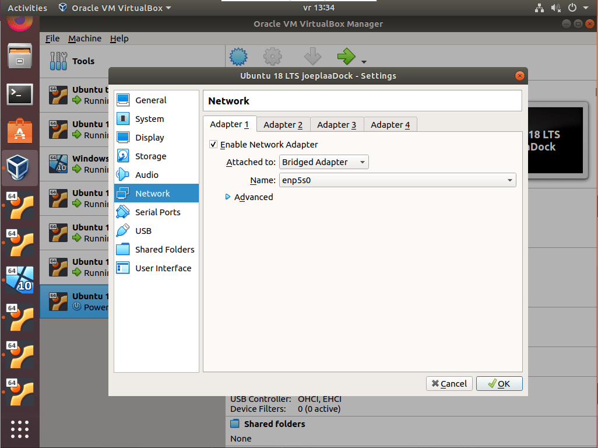
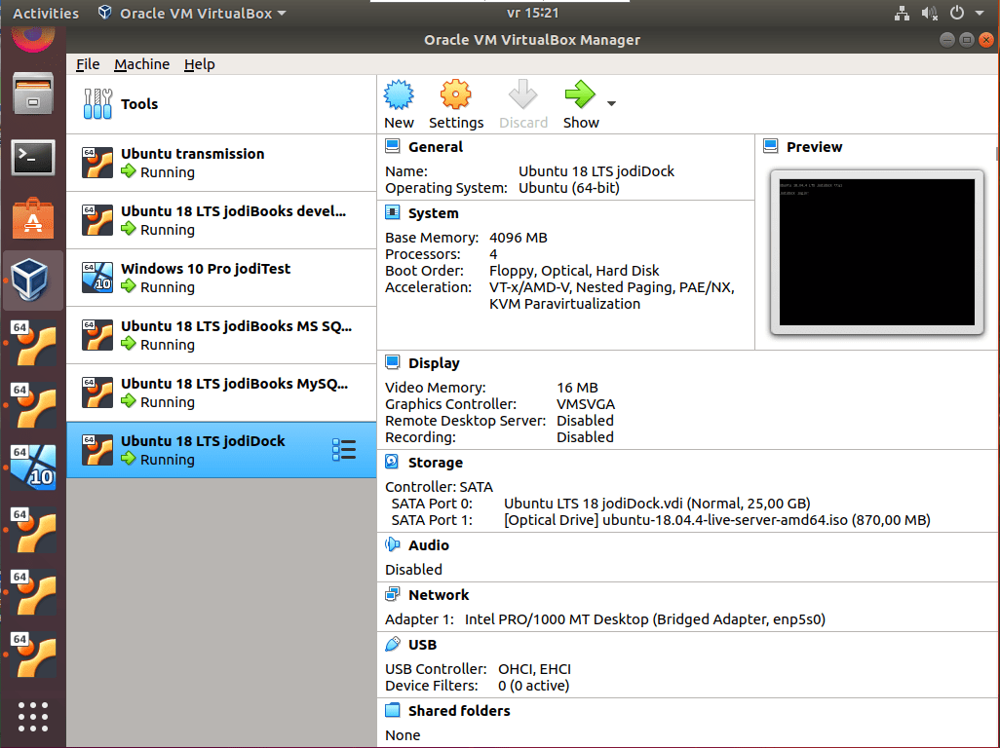

I'm experimenting with containers lately, Docker containers to be precise. The goal was to be able to quickly run test and development environments and to run jodiBooks services in separate containers. I want to use [AWS ECS](https://aws.amazon.com/ecs/) as the container service in production, but for experimentation and testing I want to use our own server. Therefor I am going to [spin up a VM](https://www.joeplaa.com/install-ubuntu-18-04-lts-server-in-virtualbox/) in which I'll install Docker on Ubuntu 18.04.

From the time this was all hobby, I have a server with a quad core Intel Xeon CPU (E3-1230 V2 @ 3.30GHz) and 32 GB of memory. Plenty to have serious fun with. I installed a bare version of Ubuntu 18.04 with the default GUI (I need that). On that base I [shared the data volumes through Samba](/how-to-enable-samba-sharing-in-ubuntu/), [enable screen sharing](/how-to-enable-screen-sharing-between-ubuntu-and-realvnc/) and installed VirtualBox 6.1.



## 1. Setup VM

1. I assume you have installed VirtualBox. This is pretty straightforward through the Ubuntu Software dashboard. Search for VirtualBox and press install. When installed, open VirtualBox. Not much will be visible as you haven't configured any virtual machines (VM's) yet. Let's create one: click **New**.

    

    As you might see, I already have 6 VM's running.

2. Give the VM a name, for example `Ubuntu 18 LTS joeplaaDock` as this will be an Ubuntu VM for Docker. Choose `Linux` as *Type* and `Ubuntu` as *Version*. These are probably already selected by VirtualBox based on your VM name.

    Give the VM at least 2 GB (`2048 MB`) of memory. This can be increased later if needed. Now select **Create a virtual hard disk now** and click **Create.**

    

3. Click **Settings** to open the VM's settings. On the left select **System** and in the **Motherboard** tab deselect **Floppy** (really?). On the **Processor** tab increase the number of *Processors* to `4`. You might want to use a different amount, but I have a quad core CPU and want to allow Docker to use all.

    

4. In the **Storage** screen we select the *Empty* disc drive and browse to the [Ubuntu server iso-file](https://ubuntu.com/download/server). You can download it directly from the server (visually through your [VNC connection](/how-to-enable-screen-sharing-between-ubuntu-and-realvnc/)) or save it to a Samba share as I did. Don't forget to select **Live CD/DVD**, so it will be used as initial boot-drive. Also click the virtual hard drive and increase the size to at least `16 GB`.

    

5. Next I disable audio, but you don't have to. In the **Network** settings I select a dedicated Network Adapter. That gives me the possibility to have my router assign a fixed IP address to this VM later. To do that, select **Bridged Adapter** and select the *Adapter*.

    

6. All other settings are optional and can be left at the defaults. Click **OK** to close the settings and press the **Start** button to launch the VM.

## 2. Install Ubuntu

The VM will use the iso to boot into the Ubuntu installer. Follow this guide to [install Ubuntu server as a VM](/how-to-install-ubuntu-18-04-lts-server-in-virtualbox/). When Ubuntu is installed we'll continue with installing everything we need to run Docker containers.

## 3. Install Docker

1. To install Docker we have to open a terminal to the VM. We did that at the end of the installation.
2. Once in the terminal type and execute the following commands:

    ```console
    sudo apt update
    sudo apt install apt-transport-https ca-certificates curl software-properties-common
    curl -fsSL https://download.docker.com/linux/ubuntu/gpg | sudo apt-key add -
    sudo add-apt-repository "deb [arch=amd64] https://download.docker.com/linux/ubuntu bionic stable"
    sudo apt update
    sudo apt install docker-ce
    sudo usermod -aG docker ${USER}
    su - ${USER}
    ```

3. That's it. Check if Docker has been installed and if you are able to run it:

    ```console
    docker -v
    ```

    
