## Introduction

What [started as a project](https://blog.joeplaa.com/building-a-proxmox-cluster/) to run "some crypto applications" grew into something much bigger, but also more useful. I learned a tremendous amount about virtual machines, lxc containers and Proxmox. And although I'm just scratching the surface and I don't actually understand it, I know how to do some things. I'll write them down here, partly for myself, but also for you in hopes it will save one of us a lot of time and frustration.

## Create a VM for TrueNas

1. Click on "local (pve)" on the left. Select "ISO Images" and click "Upload". Upload the TrueNas image.

2. In the top of the screen click the "Create VM" button.

    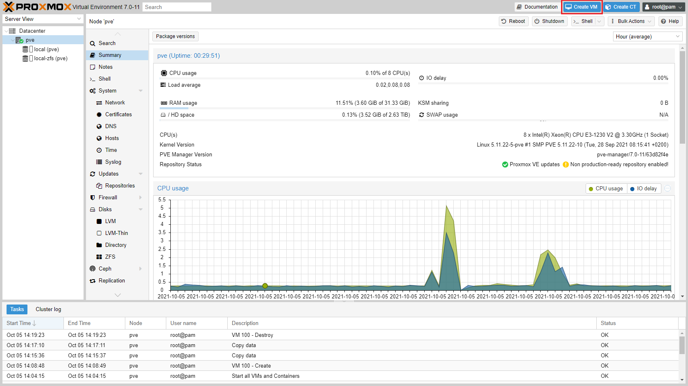

3. Select *Start at boot* and optionally *Start/Shutdown order*.

    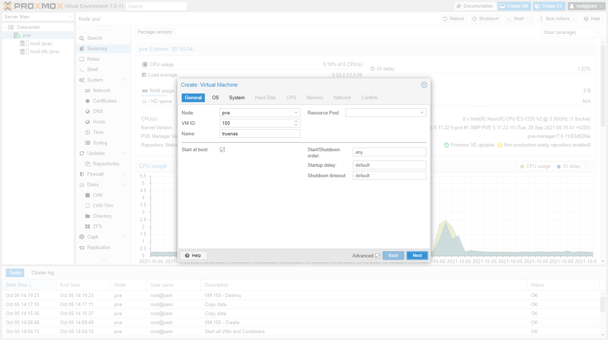

4. Set the *Guest OS* to "Other". Proxmox will select the best defaults and lower level settings. Especially important when installing a Windows guest.

    

5. Set *Machine* to `q35`.

    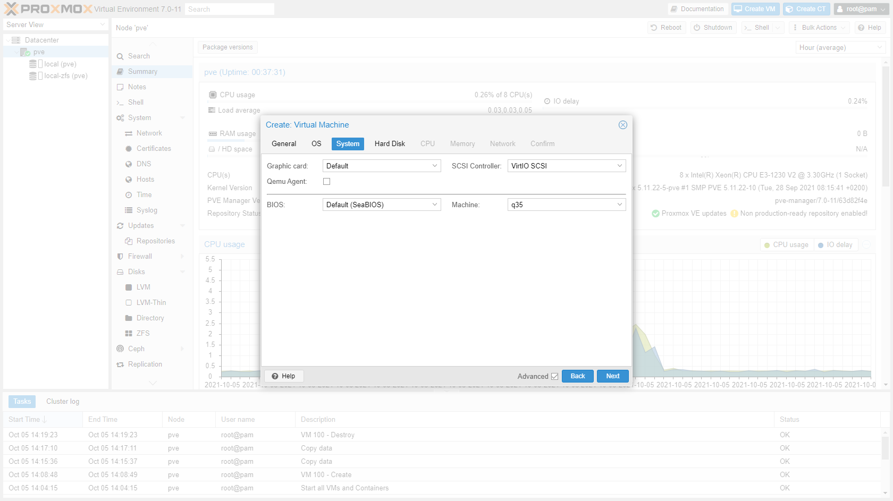

6. Select *SCSI* as Bus/Device and set the *Disk size* to 8-16 GB. Select the *Discard* option and *SSD emulation* (if installing on SSD). The discard option will free up disk space on the host when files are deleted in the guest.

    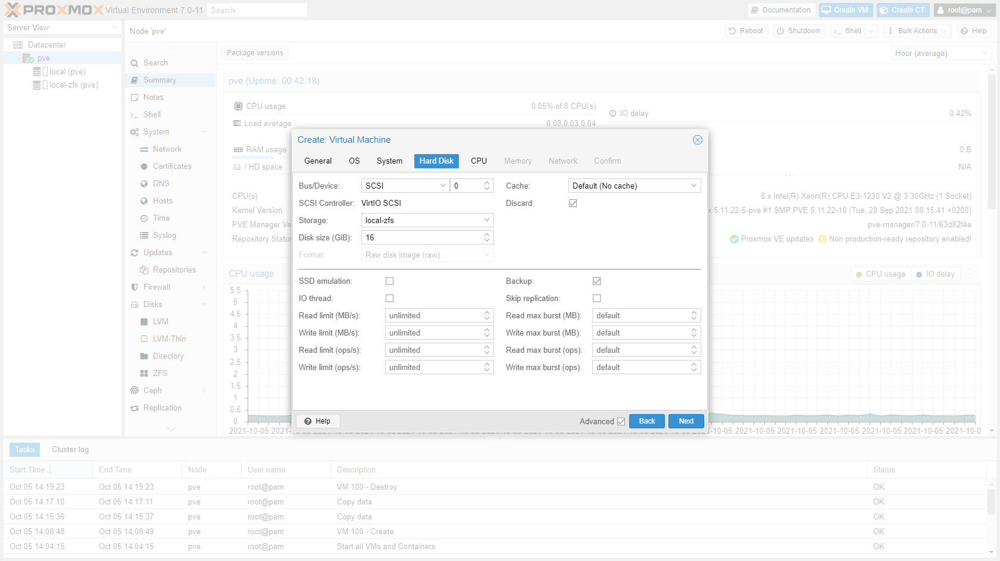

7. First set the number of *Sockets*, *Cores* and *VCPUs*. The number of vCPU's = *Sockets* x *Cores*. Only use multiple sockets if the host has multiple too. Set *Type* to `host` and select *Enable NUMA* if the host machine has multiple sockets. Also scroll all the way down and enable "aes".

    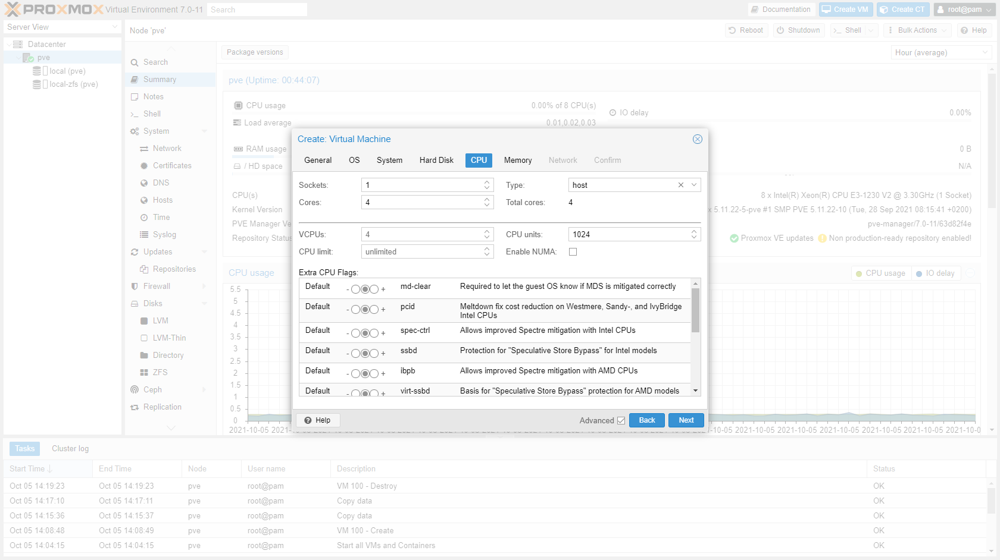

8. Set the amount of RAM. TrueNas with ZFS loves RAM so set is as high as possible. Setting a minimum is of no use here as TrueNas will take everything it can (you can disable "Ballooning Device").

    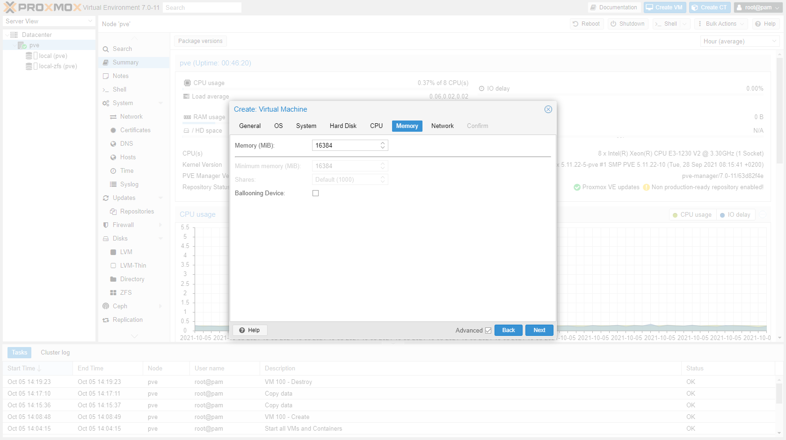

9. Select the network *Bridge* that should be used by the guest and select "VirtIO" as model.

    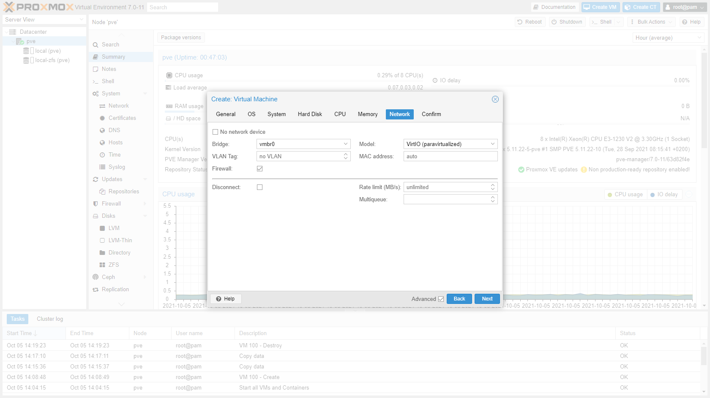

10. Confirm and finish.

    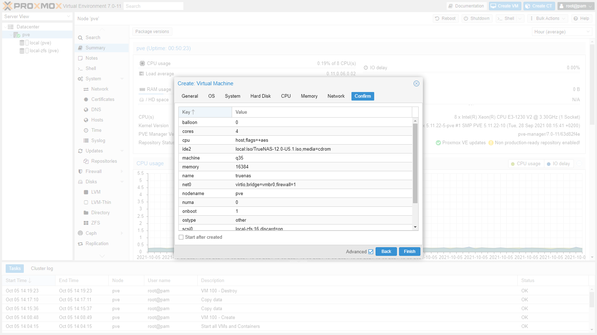

11. Wait a few moments for the VM to be initialized.

## Install TrueNas

1. Go to the VM and start it.

    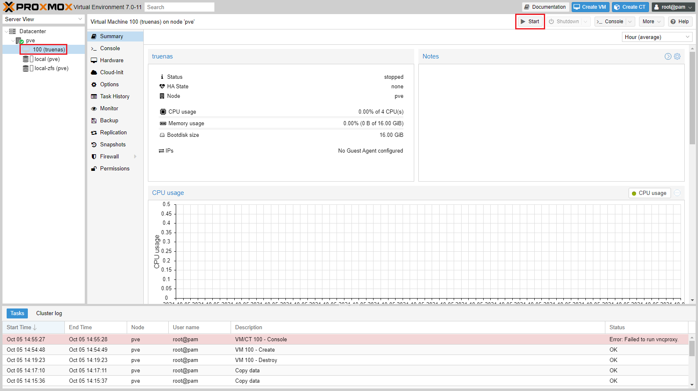

2. Open the console and the installer should be started. (I'll open a windowed console (button above the VM screen) to make the next screenshots.)

    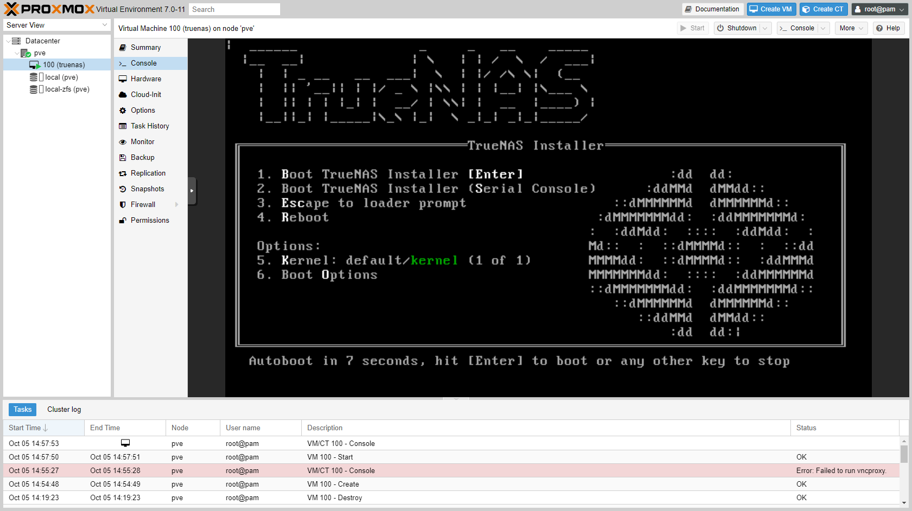

3. Select "Install/Upgrade" and press 'enter' to continue.

    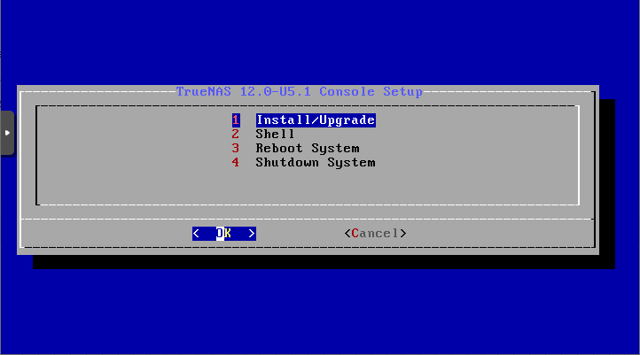

4. Press 'space' to select the virtual harddisk and 'enter' to continue.

    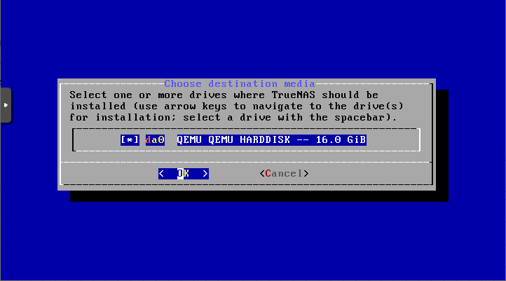

5. You will get a warning. Press 'enter' to continue.

    

6. Enter a password.

    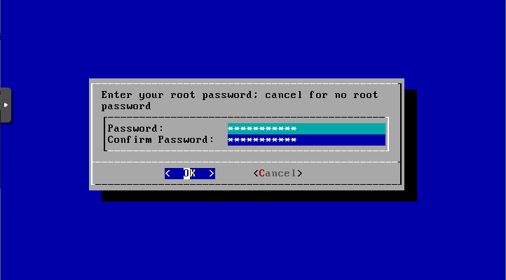

7. Choose to boot via BIOS.

    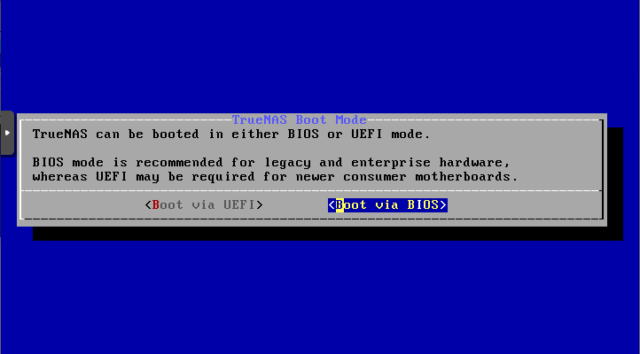

8. Installation will start. Depending on the underlying harddisk type this can take a few minutes.

    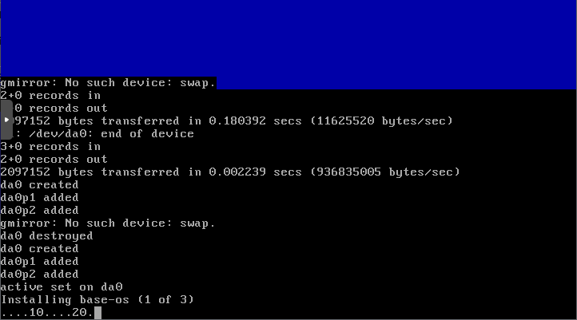

9. When installation is done reboot the system.

    

    :::caution
    Although the installer asks to remove the installation medium, do not do this. After removing, the reboot "button" does not work anymore. You can always remove it later using the Proxmox GUI.
    :::

    

10. After reboot you can login using the WebGUI. The address will be displayed in the console.

    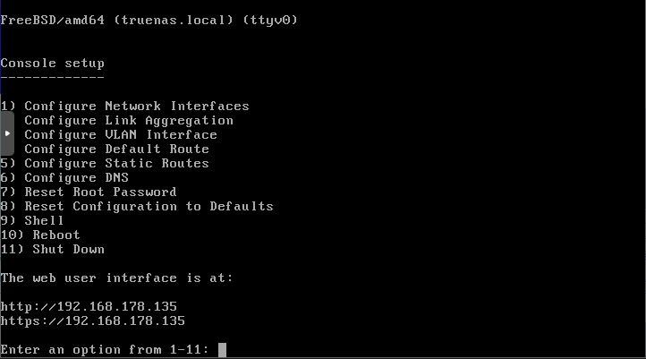

## Add storage disks

The best way to add storage disks to TrueNas is by passing a HBA straight to the VM. In [How to enable PCIe passthrough in Proxmox](/how-to-enable-pcie-passthrough-in-proxmox) you can read how to enable this in Proxmox. If you have enabled passthrough, you can continue.

1. Shutdown the VM.

2. Add the HBA as a PCI Device to the VM. Select the correct device and select "All functions".

    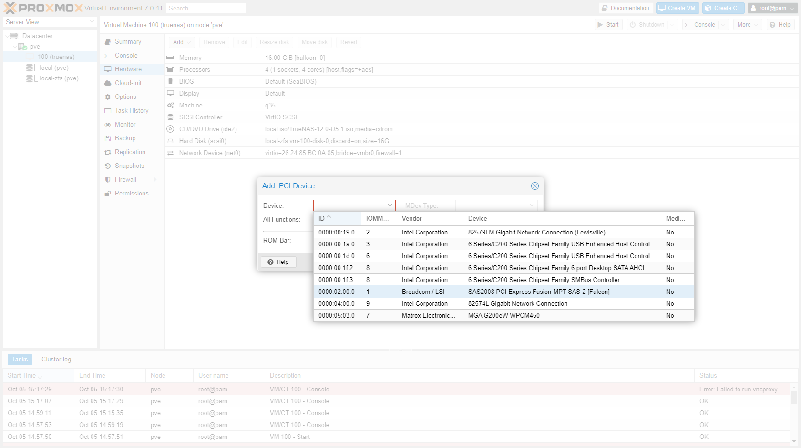

3. Start the VM. The HBA will be booted inside the VM.

    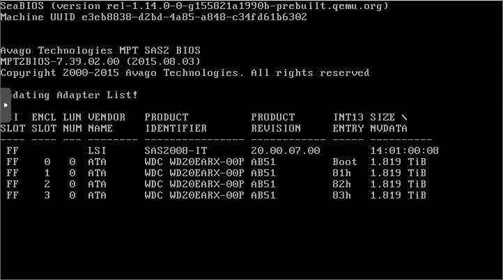

    :::caution
    Initially when I added the PCIe HBA, TrueNas inserted the drives attached to the HBA in front of the OS disk. During boot the VM wanted to boot from a HBA drive instead of the virtual OS drive. After disabling the boot option of the HBA TrueNas booted fine. To disable the boot option on a LSI card, you have to erase the BIOS, see [How to flash an IBM M1115 HBA card](/how-to-flash-an-ibm-m1115-hba-to-it-mode).
    :::

## Configuration

Configuration of TrueNas in Proxmox is not different from configuring a stand alone instance. In [How to do basic TrueNas configuration](/how-to-do-basic-truenas-configuration) I go into the details.

:::note Sources
* <https://www.truenas.com/community/threads/freenas-on-proxmox-whats-the-current-state-of-play.84287/page-3>
* <https://forum.proxmox.com/threads/undestrand-discard-option.37018/>
* <https://forum.proxmox.com/threads/vm-refuses-to-boot-from-virtual-disk-when-pci-passthrough-is-enabled.38146/>
* <https://www.truenas.com/community/threads/lsi-9207-8i-can-i-erase-just-the-bios-leave-the-fw.60861/>
:::