In production I would normally use an EC2 or Lightsail instance on AWS to run Ubuntu, but for testing I install Ubuntu 18.04 LTS server in VirtualBox. This guide show you (and me) how to do that.

## 1. Setup a VM

1. I assume you have installed VirtualBox. This is pretty straightforward through the Ubuntu Software dashboard. Search for VirtualBox and press install. When installed, open VirtualBox. Not much will be visible as you haven't configured any virtual machines (VM's) yet. Let's create one: click **New**.

    

    You can see in the screenshot I already have 6 VM's running.

2. Give the VM a name, for example `Ubuntu 18 LTS joeplaaDock` (I reused the image from the Docker installation manual). Choose `Linux` as _Type_ and `Ubuntu` as _Version_. These are probably already selected by VirtualBox based on your VM name.  
    Depending on what you want to do, give the VM at least 1 GB (`1024 MB`) of memory. This can be increased or decreased later if needed. Now select **Create a virtual hard disk now** and click **Create.**

    

3. Click **Settings** to open the VM's settings. On the left select **System** and in the **Motherboard** tab deselect **Floppy** (who needs that nowadays?). On the **Processor** tab increase the number of _Processors_ if needed.

    

4. In the **Storage** screen we select the _Empty_ disc drive and browse to the [Ubuntu server iso-file](https://ubuntu.com/download/server). You can download it directly from the server (visually through your [VNC connection](/how-to-enable-screen-sharing-between-ubuntu-and-realvnc/)) or save it to a Samba share as I did. Don't forget to select **Live CD/DVD**, so it will be used as initial boot-drive. Also click the virtual hard drive and increase the size to at least `16 GB`.

    

5. Next I disable audio, but you don't have to. In the **Network** settings I select a dedicated Network Adapter. That gives me the possibility to have my router assign a fixed IP address to this VM later. To do that, select **Bridged Adapter** and select the _Adapter_. Just for testing you can leave it at **NAT**.

    

6. All other settings are optional and can be left at the defaults. Click **OK** to close the settings and press the **Start** button to launch the VM.

## 2. Install Ubuntu

1. VirtualBox will boot the VM from the attached .iso file and the Ubuntu installer will start. The first question to answer is what _language_ you want.

    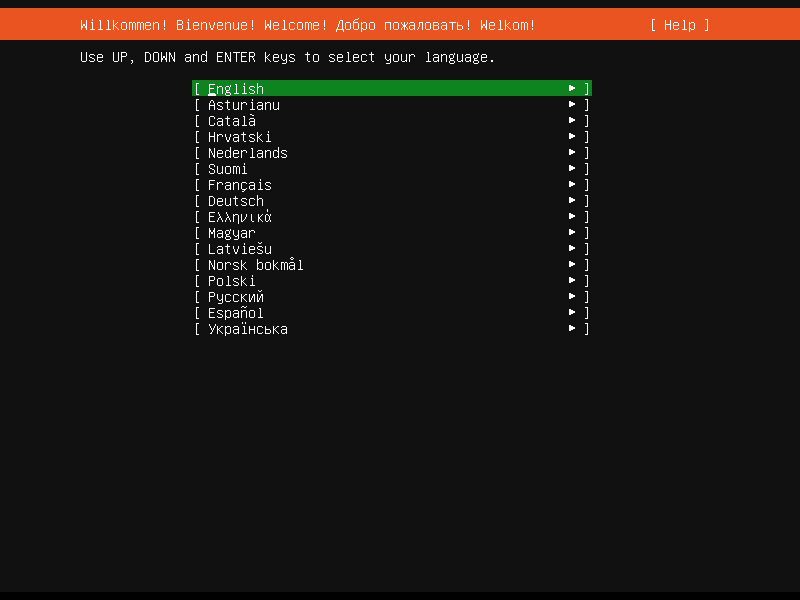

2. Next we can select the _Keyboard configuration_. You can have the installer _Identify your keyboard_ or select it yourself. I know I have the `English (US)` _layout_ and the `...euro on 5...` _variant_.

    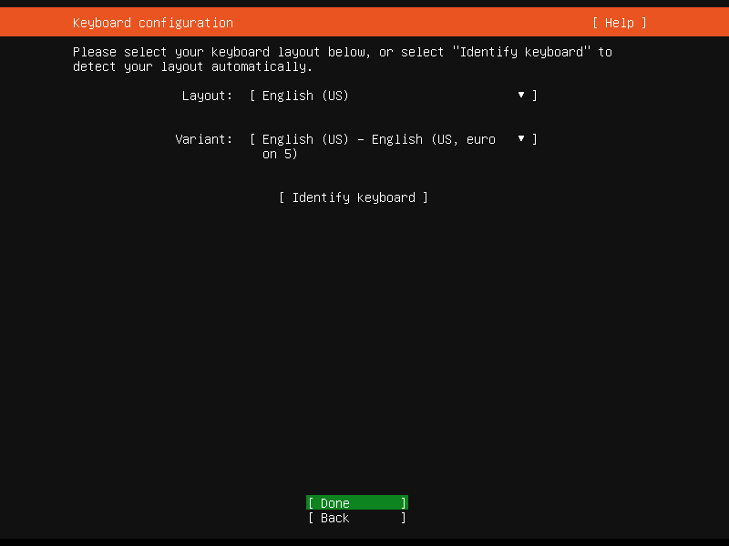

3. Now select the _Network connection_. As I want to use a fixed IP address, I'll go into the router now and link this mac-address to a fixed IP. You can accept the defaults if you only want to setup a VM for testing.

    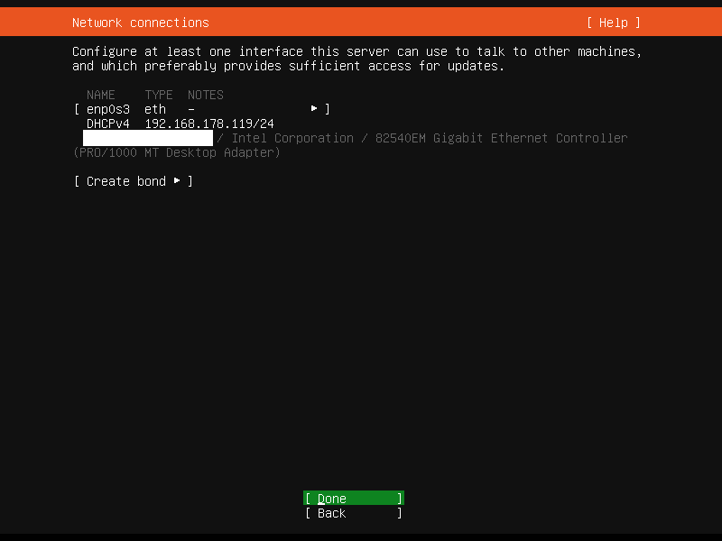

4. In the next screen you can set your proxy settings. I have never done that, so I'll skip this and continue.
5. Ubuntu then asks you if you want to add a mirror for downloading software. I never did it, but you can if you know there is a fast one nearby. Like on the same network.
6. Next we come to the _Filesytem setup_ screen. Here we select **Use An Entire Disk**.

    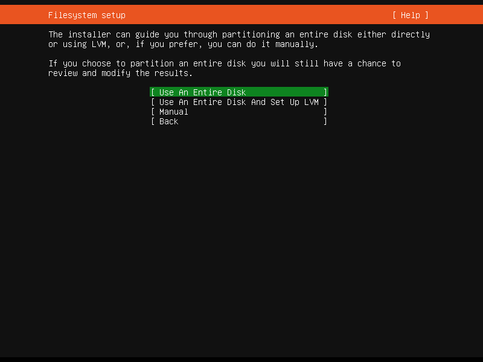

7. Now we can choose the disk to use. We only have the virtual disk we created earlier, so not much to choose from.

    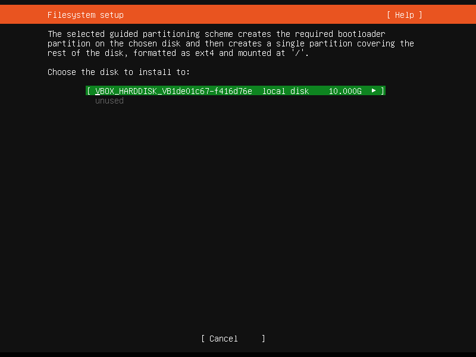

    Yes, I forgot to increase the disk size to at least 16 GB. That's going to hurt later.

8. The installer will show you an overview of the changes it's going to make to the volume. Which is fine for us, so let's do it.

    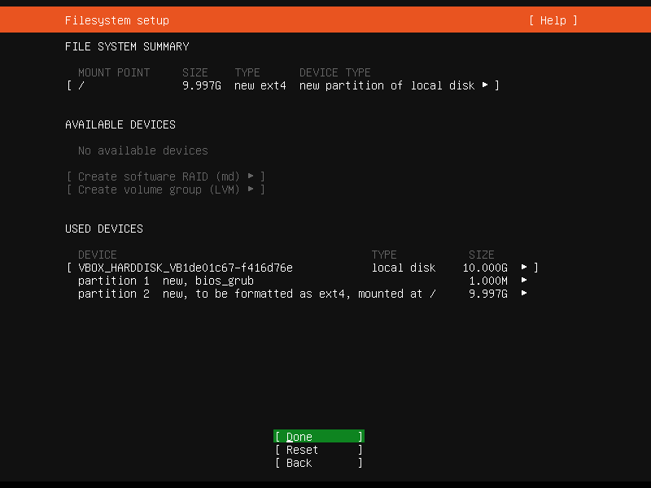

9. Enter your _Profile setup_: name, server name, username and password.

    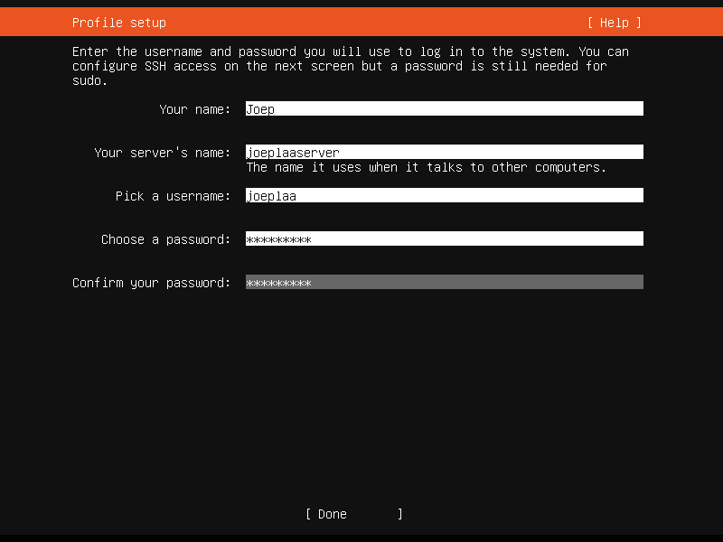

10. We definitely want to use SSH to log into the server through a terminal later, so we want to select **Install OpenSSH server**.

    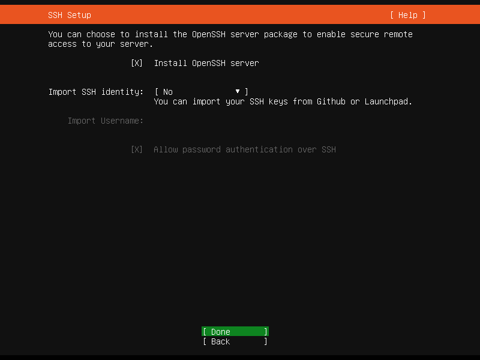

11. Now we can select some _Featured Server Snaps_. These are pieces of software that will be installed with Ubuntu. We don't want any, so select none of them. You can however select **docker** if you only want to use basic functionality, as most documentation isn't written for snaps yet.

    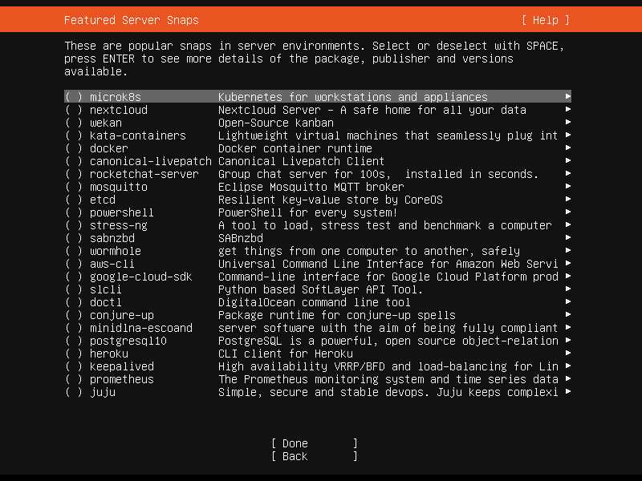

12. The installation will now start.

    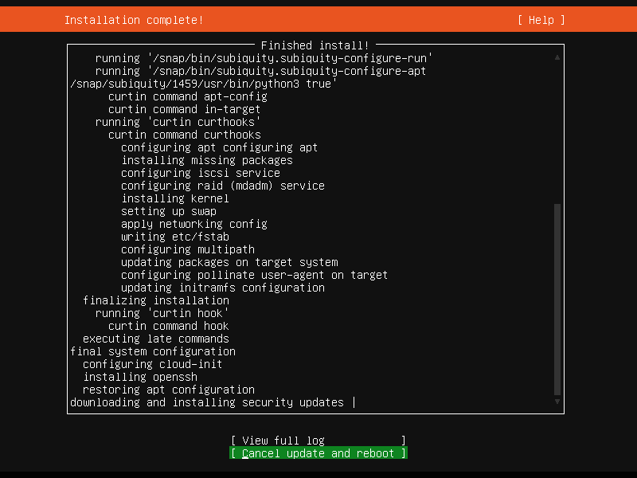

13. When the installation is done, the bottom "button" will now say **Reboot**. That is what we'll do.

    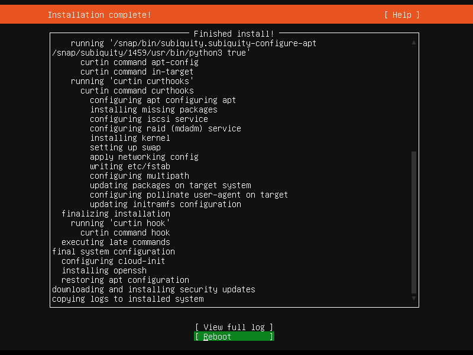

14. The snext creen will now say "Please remove the installation medium, then press ENTER:". Remove the image from the virtual drive by clicking on the cd icon in the bottom bar below the virtual screen. Now press **ENTER**.

    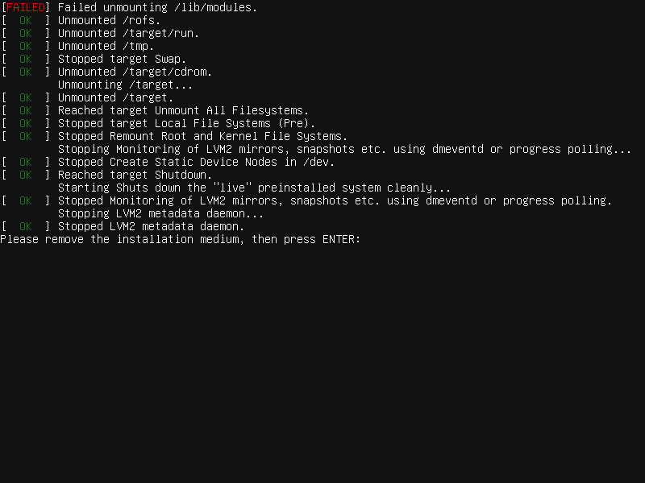

15. After reboot, the VM will show the machines SSH keys. We can ignore them, but obviously copy and store them if you need to secure your VM.

    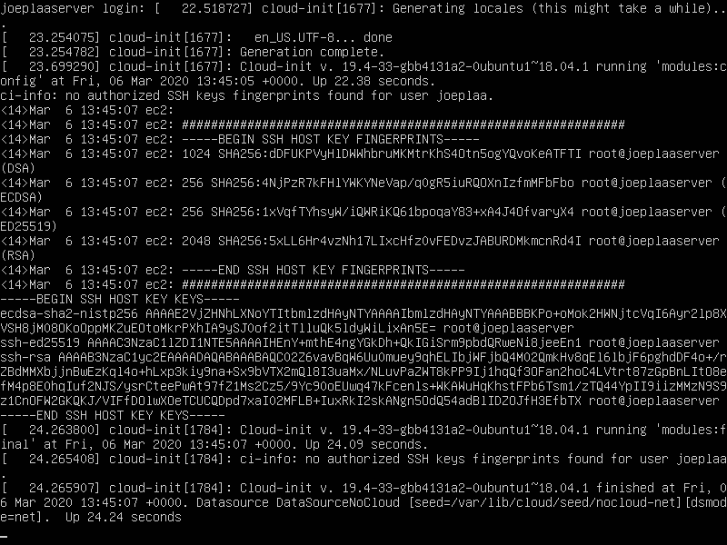

    Normally you'd never share these keys in a screen or otherwise, but this VM will be destroyed anyway.

16. Open a terminal (PuTTY in Windows) to the VM. It will show a warning that the server and terminal key don't match. Somehow you can do something here to make sure the keys in the image above match the keys in PuTTY. I don't know how, but as I'm confident I'm connecting to my own VM, and not a hacked server, I'll press **Yes** to continue.

    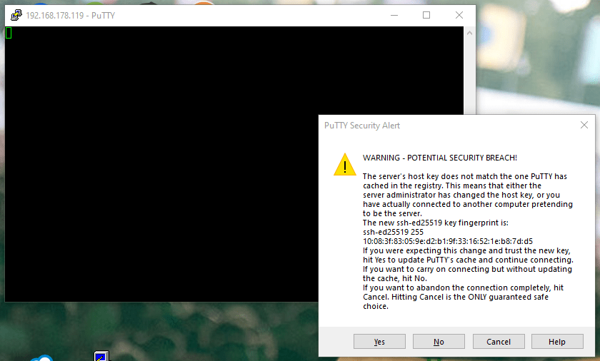

17. Ubuntu will ask for my password and after entering it successfully I'm connected.

    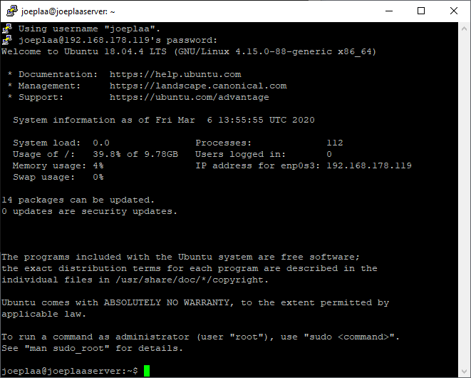

18. Run the update commands after which the installation is finished. To do that either enter:

    ```console
    sudo apt update && sudo apt upgrade
    ```

    or

    ```console
    sudo -i
    apt update && apt upgrade
    ```

    Both will ask for your password again, but be very aware that with the second option you can easily do a lot of damage to your system. Only use when you know what you are doing.
