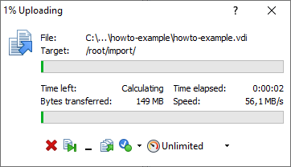
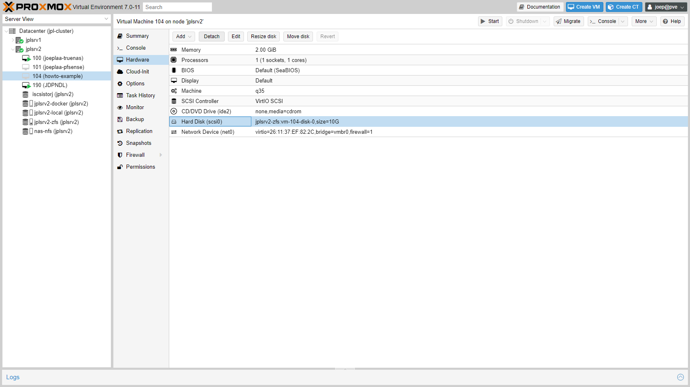
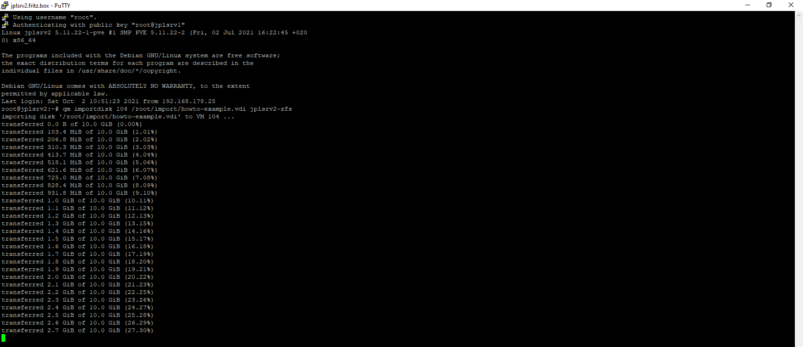
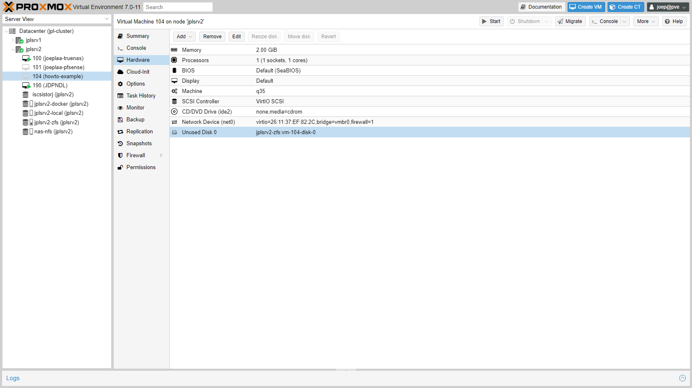
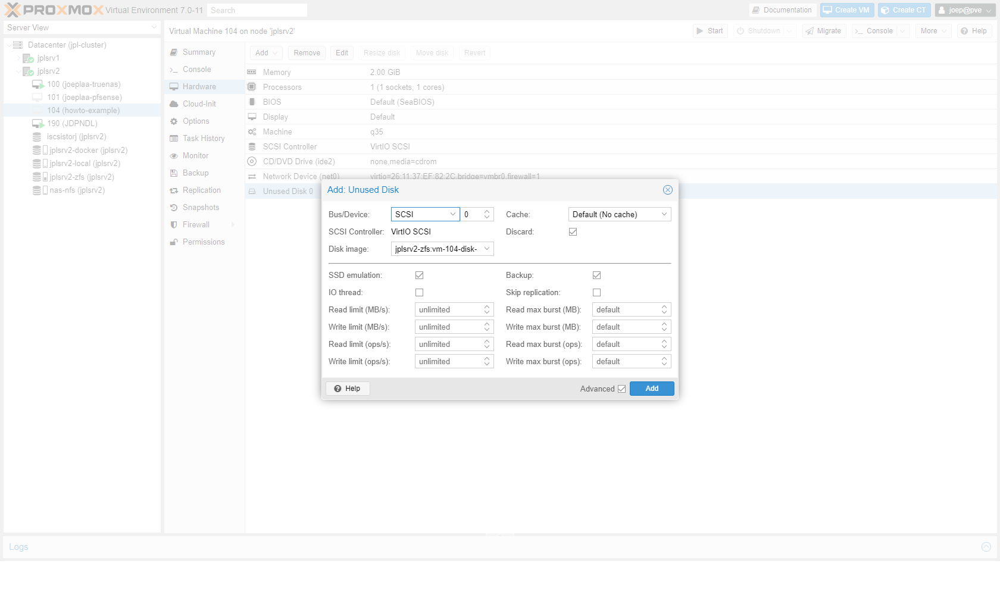
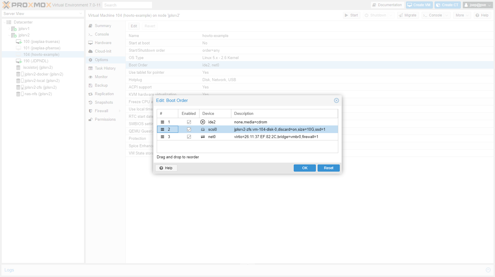

## Introduction

What [started as a project](https://blog.joeplaa.com/building-a-proxmox-cluster/) to run "some crypto applications" grew into something much bigger, but also more useful. I learned a tremendous amount about virtual machines, lxc containers and Proxmox. And although I'm just scratching the surface and I don't actually understand it, I know how to do some things. I'll write them down here, partly for myself, but also for you in hopes it will save one of us a lot of time and frustration.

## Migrate from VirtualBox to Proxmox

1. Copy the `.vdi` file to the Proxmox host. I copied them to the root user folder `/root/import`. Because I have created the example on Windows, I will use [WinSCP](https://winscp.net/eng/index.php) to do that.

    

2. In Proxmox create a VM as usual. Note the VM ID, 104 in my case.

3. Go to the Hardware tab, select the hard disk and click "Detach".

    

4. Select the now unused disk and click "Remove".

    

5. Open a console to the Proxmox host and import the VirtualBox image. Change the name of the storage if needed.

    ```shellsession
    qm importdisk 104 /root/import/howto-example.vdi jplsrv2-zfs
    ```

    

6. Back in the Hardware tab of the VM a new unused disk has appeared. Select it and click "Edit".

    

7. Add the disk. (I also always check "Discard" and "SSD", but that isn't necessary).

    

8. Go to the Options tab and open "Boot Order". Enable the disk.

    

9. Start the virtual machine.

    

:::caution NO VNC
If you don't get visual VNC output, you might need to change the graphics adapter or increase the graphics memory amount. I had to set the device to `VIRTIO-GPU` for an Ubuntu Desktop VM.
<https://forum.proxmox.com/threads/ubuntu-vm-installation-problems.51770/>
:::

:::note Sources
* <https://www.yinfor.com/2019/03/another-way-to-move-virtualbox-vdi-to-proxmox-ve.html>
* <http://www.aitek.ch/migrating-virtualbox-vdi-to-proxmox-ve-proxmox-support-forum/>
* <https://lucanuscervus-notes.readthedocs.io/en/latest/Virtualization/Virsh/Convert%20VBox%20disks%20to%20qcow2/>
* <https://mangolassi.it/topic/21751/import-a-qcow2-into-proxmox>
:::