## Introduction

What [started as a project](https://blog.joeplaa.com/building-a-proxmox-cluster/) to run "some crypto applications" grew into something much bigger, but also more useful. I learned a tremendous amount about virtual machines, lxc containers and Proxmox. And although I'm just scratching the surface and I don't actually understand it, I know how to do some things. I'll write them down here, partly for myself, but also for you in hopes it will save one of us a lot of time and frustration.

## ZFS and docker

Currently it doesn't seem possible to get Docker to work on ZFS. Well [you can](https://www.servethehome.com/setup-docker-on-proxmox-ve-using-zfs-storage/) with a lot of [manual work](https://docs.docker.com/storage/storagedriver/zfs-driver/), but my experience was really poor. I wanted to run docker inside an LXC container, which might sound weird, but alas, I wanted it. However, running docker in LXC with a ZFS mount was really slow. So I changed the setup a bit.

### Create dedicated docker storage

1. In Proxmox GUI go to "Datacenter" -> "Storage" and click "Add" and choose "Directory"

    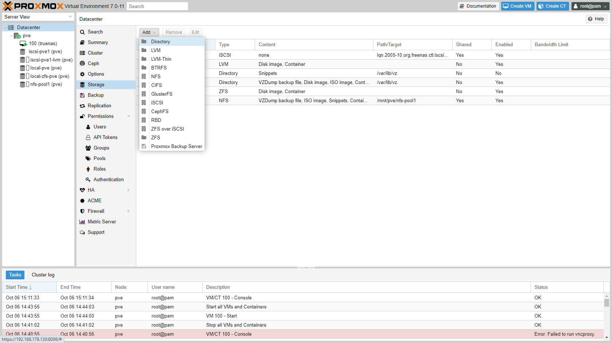

2. Create the directory:
    * ID: `docker-pve`
    * Directory: `/mnt/docker`
    * Content: `Container`

    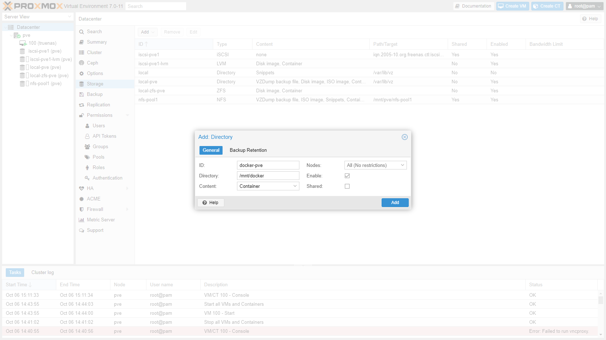

### Create an LXC container

1. Go to "nfs-pool1" -> "CT Templates" and click "Templates". Download Ubuntu 20.

    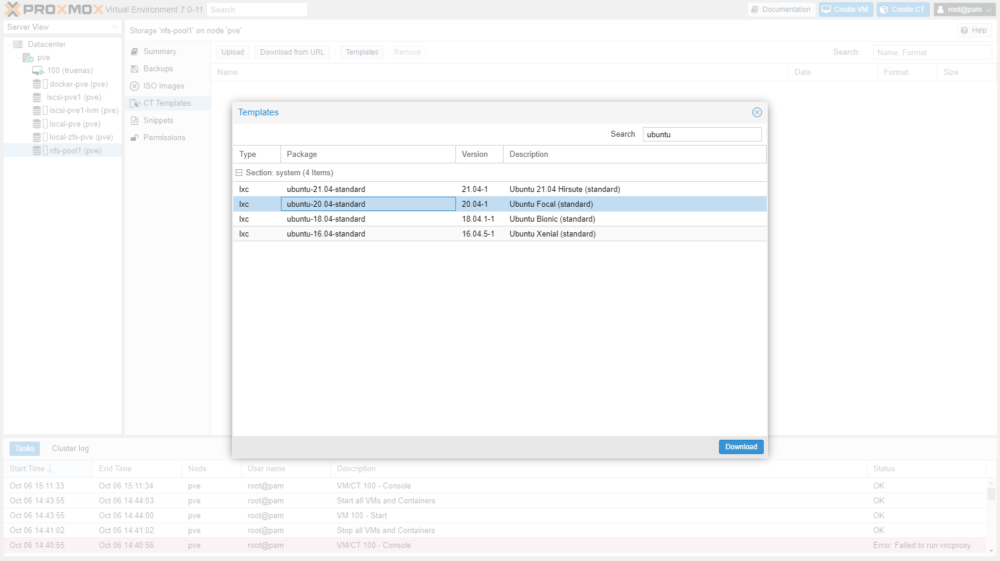

2. Click "Create CT":
    * Hostname: `docker-example`
    * Check "Unprivileged container" and "Nesting"
    * Add a password

    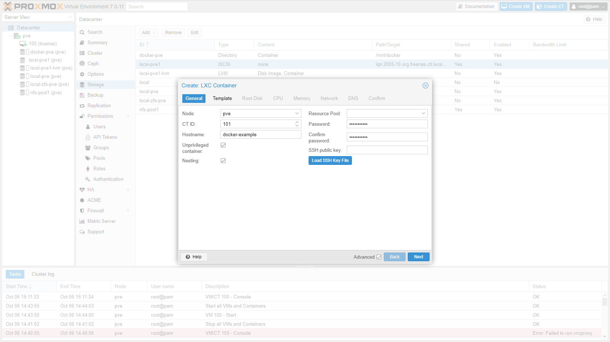

3. Select a container template:
    * Storage: `nfs-pool1`
    * Template: `ubuntu-20.04-standard_20.04-1_amd64.tar.gz`

    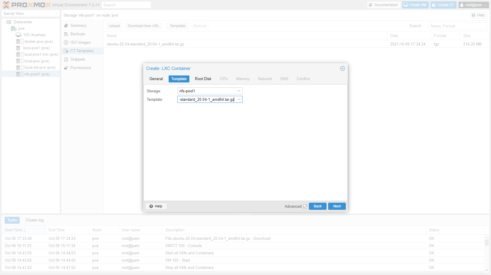

4. Select storage:
    * Storage: `local-zfs-pve`
    * Disk size (GiB): `8`

    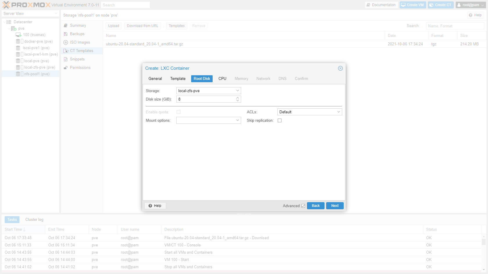

5. Enter amount of cores:
    * Cores: `2`

    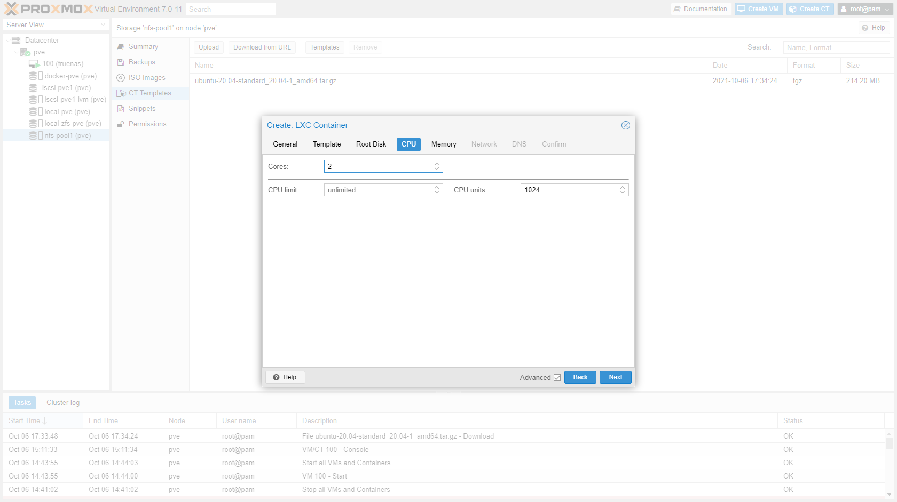

6. Enter amount of memory:
    * Memory (MiB): `1024`

    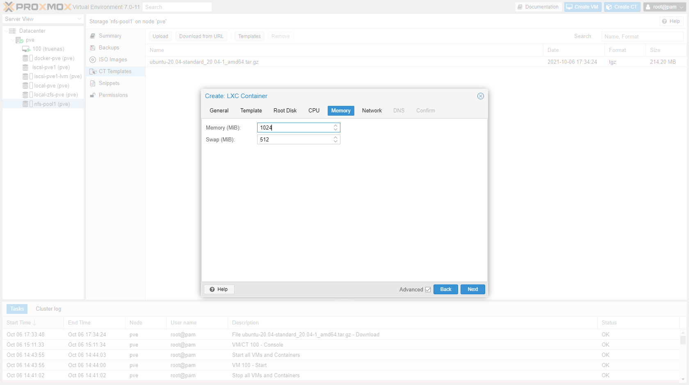

7. Configure network

    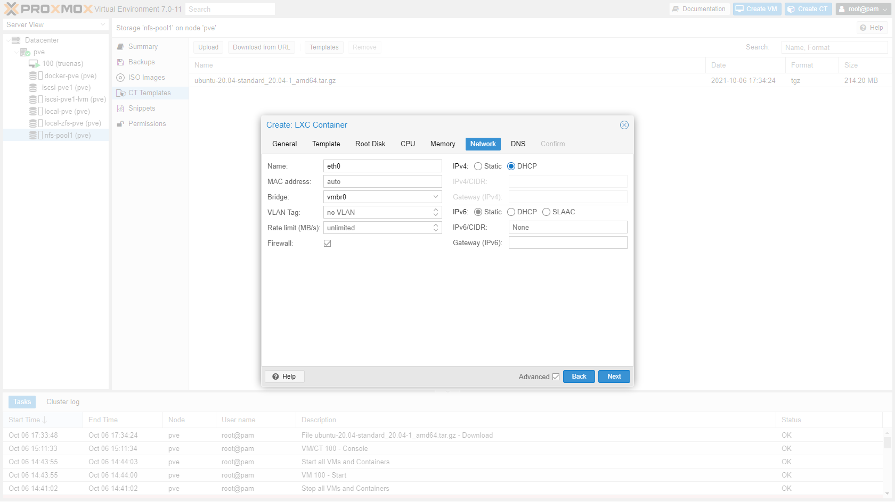

8. Confirm next two screens.

9. Click on the container and go to "Resources". Click "Add" -> "Mount point"
    * Storage: `docker-pve`
    * Disk size (GiB): `8`
    * Path: `/var/lib/docker`
    * Uncheck "Backup"
    * Check "Skip replication"

    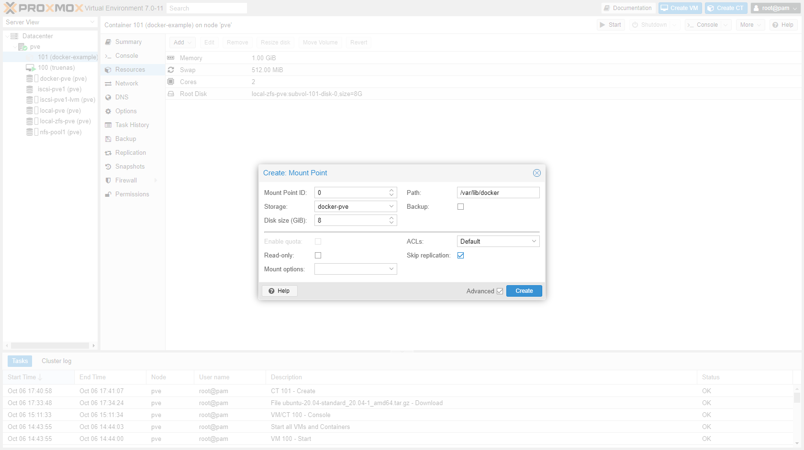

### Install docker

1. Start the container and open a shellsession. 
    * You can open a shellsession directly to the IP or hostname of the container.
    * Or you can open a shellsession to the host and enter the container `pct enter <id>`

2. Add supporting package

    ```shellsession
    apt update
    apt upgrade
    apt install apt-transport-https ca-certificates curl gnupg lsb-release
    ```

3. Add Docker’s official GPG key:

    ```shellsession
    curl -fsSL https://download.docker.com/linux/ubuntu/gpg | gpg --dearmor -o /usr/share/keyrings/docker-archive-keyring.gpg
    ```

4. Add Apt repository:

    ```shellsession
    echo "deb [arch=$(dpkg --print-architecture) signed-by=/usr/share/keyrings/docker-archive-keyring.gpg] https://download.docker.com/linux/ubuntu $(lsb_release -cs) stable" | tee /etc/apt/sources.list.d/docker.list > /dev/null
    ```

5. Install Docker:

    ```shellsession
    apt update
    apt install docker-ce docker-ce-cli containerd.io docker-compose
    ```

6. Run Docker:

    ```shellsession
    docker run hello-world
    ```

    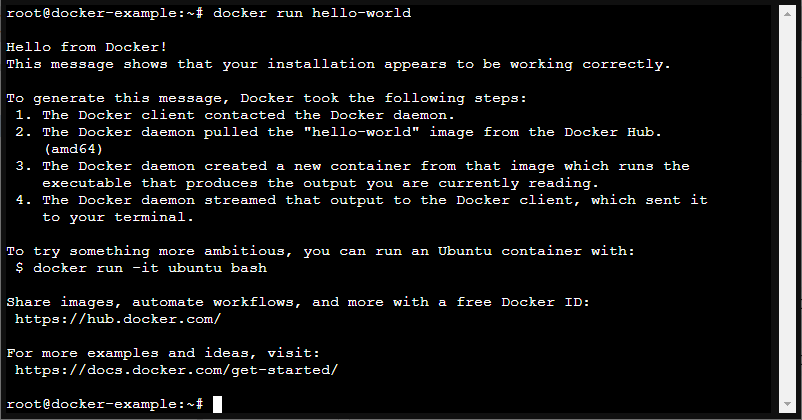

<Alert type='info'>
    <h3 class='mt-1'>Sources:</h3>

* <https://github.com/alexpdp7/ansible-create-proxmox-host>
* <https://discuss.linuxcontainers.org/t/mounting-zvol-securely-in-container/4422>
* <https://www.servethehome.com/setup-docker-on-proxmox-ve-using-zfs-storage/>
* <https://danthesalmon.com/running-docker-on-proxmox/>
* <https://docs.docker.com/storage/storagedriver/zfs-driver/>
* <https://www.reddit.com/r/Proxmox/comments/lsrt28/easy_way_to_run_docker_in_an_unprivileged_lxc_on/>
* <https://forum.proxmox.com/threads/5-3-docker-on-lxc-on-zfs.49473/>
* <https://docs.docker.com/engine/install/ubuntu/>

</Alert>