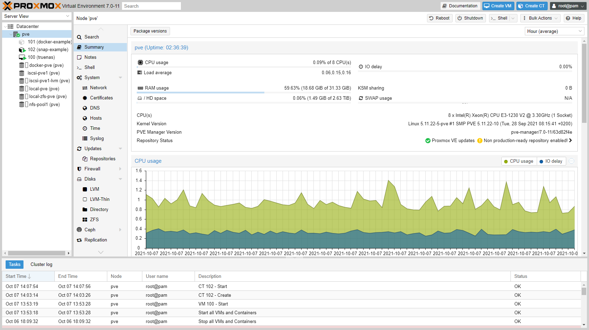
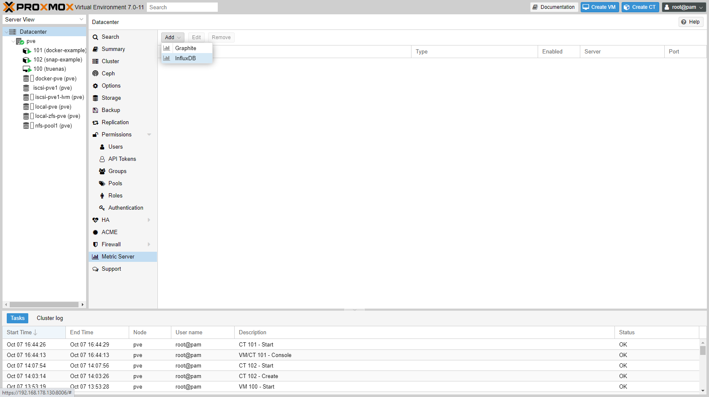
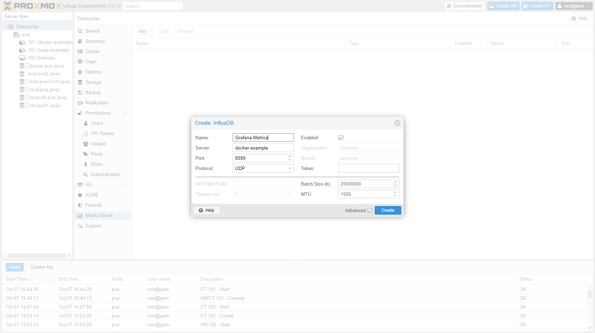
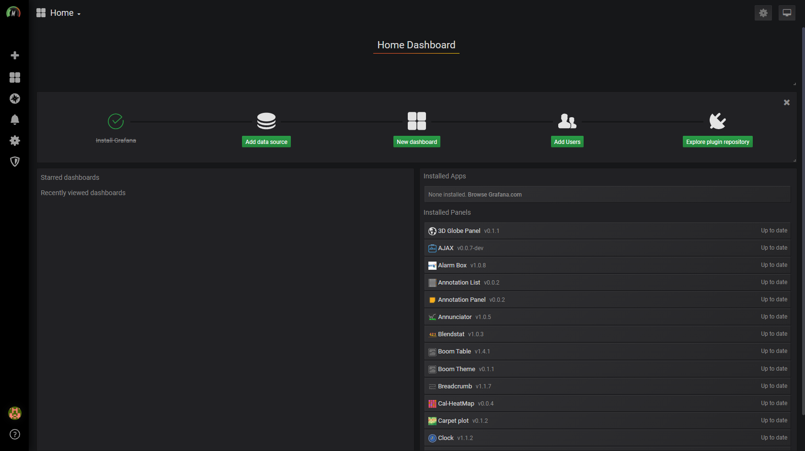
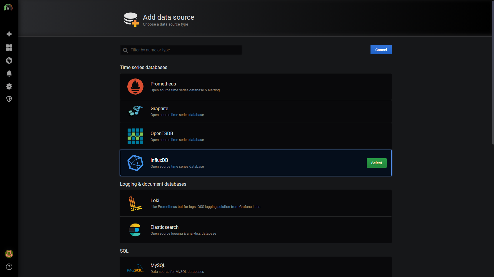
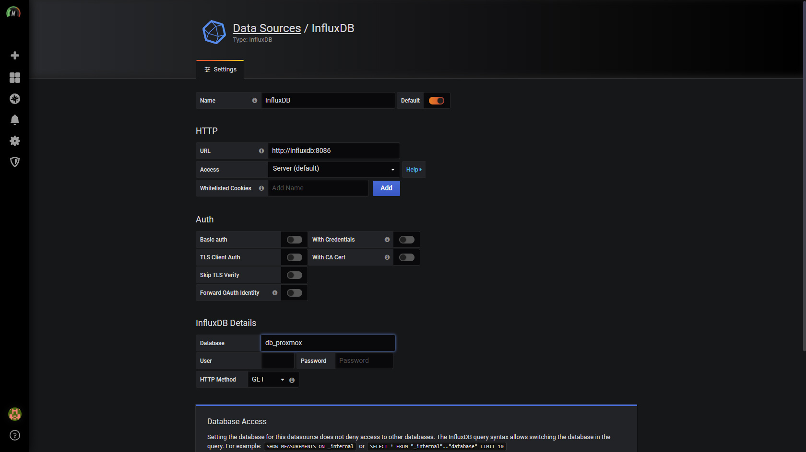
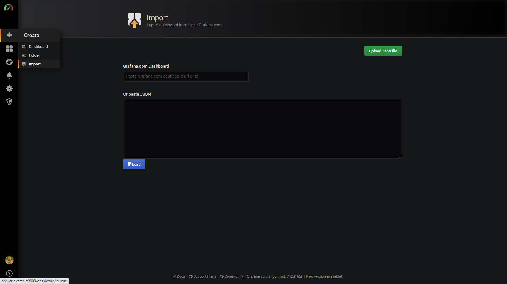
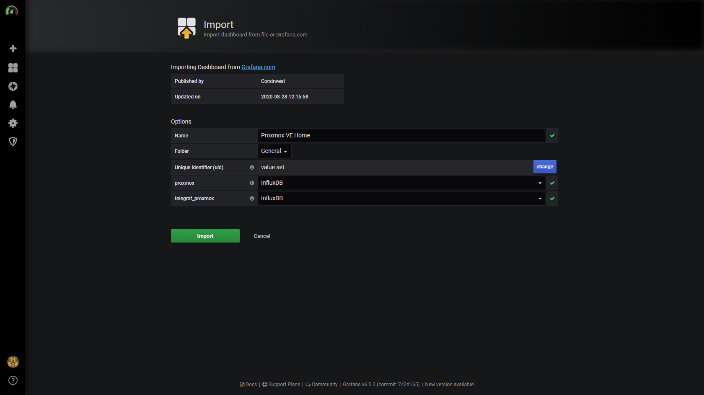

## Introduction

What [started as a project](https://blog.joeplaa.com/building-a-proxmox-cluster/) to run "some crypto applications" grew into something much bigger, but also more useful. I learned a tremendous amount about virtual machines, lxc containers and Proxmox. And although I'm just scratching the surface and I don't actually understand it, I know how to do some things. I'll write them down here, partly for myself, but also for you in hopes it will save one of us a lot of time and frustration.

## Metrics in Proxmox

The Proxmox GUI show some basic metric about CPU usage, RAM usage, network traffic and Disk IO. You can view them on node level and per guest. The biggest drawback for me was that you can not properly zoom or "go back in time". This is where [Grafana](https://grafana.com/) comes in.



Proxmox has build in support for InfluxDB or Graphite data collection. It's almost just a click of a button. However, data collection is one thing. That data needs to be displayed in an understandable way. That can be done with Grafana dashboards.

## Installing Grafana

As I try to do with all my services, I also wanted to run these as Docker containers in LXC. I found a great source and example by [Corsinvest](https://github.com/Corsinvest/cv4pve-metrics) on Github. I used that as a base for my own implementation. To be fair, I don't understand InfluxDB or Grafana, so here is how to install their implementation.

1. Create a [Docker LXC container](/how-to-run-docker-in-lxc-on-zfs-on-proxmox) or VM or just install Docker.

2. Open a shellsession to the guest (`docker-example`) and download / clone the source:

    ```shellsession
    git clone https://github.com/Corsinvest/cv4pve-metrics.git
    ```

3. Browse to docker folder and change .env file

    ```shellsession
    cd ~/cv4pve-metrics/src/docker
    nano .env
    ```

    Change it to:

    ```ini
    # This file is part of the cv4pve-metrics https://github.com/Corsinvest/cv4pve-metrics,
    #
    # This source file is available under two different licenses:
    # - GNU General Public License version 3 (GPLv3)
    # - Corsinvest Enterprise License (CEL)
    # Full copyright and license information is available in
    # LICENSE.md which is distributed with this source code.
    #
    # Copyright (C) 2016 Corsinvest Srl	GPLv3 and CEL

    DATA_STORE=.
    ```

4. Set proper permissions for Grafana data folder

    ```shellsession
    mkdir -p ~/cv4pve-metrics/src/docker/grafana/data/
    chown 472:472 -R ~/cv4pve-metrics/src/docker/grafana/data/
    ```

4. start docker-compose:

    ```shellsession
    docker-compose up -d
    ```

5. In Proxmox go to "Datacenter" -> "Metric Server" and click "Add" -> "InfluxDB"

    

6. Enter as name `influxdb` and as Server type the hostname of the guest (`docker-example`) or the IP address. Make sure Protocol is `UDP` and Port is `8089`.

    

7. Open a shellsession to the host, install Git and download / clone the source:

    ```shellsession
    apt install git
    git clone https://github.com/Corsinvest/cv4pve-metrics.git
    ```

8. Browse to telegraf folder and run install script:

    ```shellsession
    cd ~/cv4pve-metrics/src/telegraf-pve-node
    chmod +x install.sh
    ./install.sh
    ```

9. Edit Telegraf settings:

    ```shellsession
    nano /etc/telegraf/telegraf.conf
    ```

    Find `[[outputs.influxdb]]` and change the urls to `["udp://<hostname-of-docker-server>:8089"]`.

    ```ini
    ...
    # Configuration for sending metrics to InfluxDB
    [[outputs.influxdb]]
      ## The full HTTP or UDP URL for your InfluxDB instance.
      ##
      ## Multiple URLs can be specified for a single cluster, only ONE of the
      ## urls will be written to each interval.
      # urls = ["unix:///var/run/influxdb.sock"]
      # urls = ["udp://127.0.0.1:8089"]
      # urls = ["http://server_influxdb:8086"]
      urls = ["udp://docker-example:8089"]

      ## The target database for metrics; will be created as needed.
      ## For UDP url endpoint database needs to be configured on server side.
      database = "db_telegraf_proxmox"
    ...
    ```

10. Restart Telegraf:

    ```shellsession
    service telegraf restart
    ```

## Configure Grafana

1. Open a browser and go to `http://docker-example:3000 and login; user 'admin', password 'admin'. Grafana will ask to change your password.
2. Click "Add data source":

    

2. Choose "InfluxDB":

    

3. Enter URL: `http://influxdb:8086` and Database: `db_proxmox` and click "Save & Test"

    

4. Go to "+" -> "Import" and import [dashboards](https://github.com/Corsinvest/cv4pve-metrics/tree/master/src/docker#configure-grafana) one by one.

    

    Choose InfluxDB for both databases:

    

5. You now have a beautiful metrics dashboards.

    

:::note Sources
* <https://github.com/Corsinvest/cv4pve-metrics>
* <https://www.howtoforge.com/tutorial/how-to-install-tig-stack-telegraf-influxdb-and-grafana-on-ubuntu-1804/>
:::