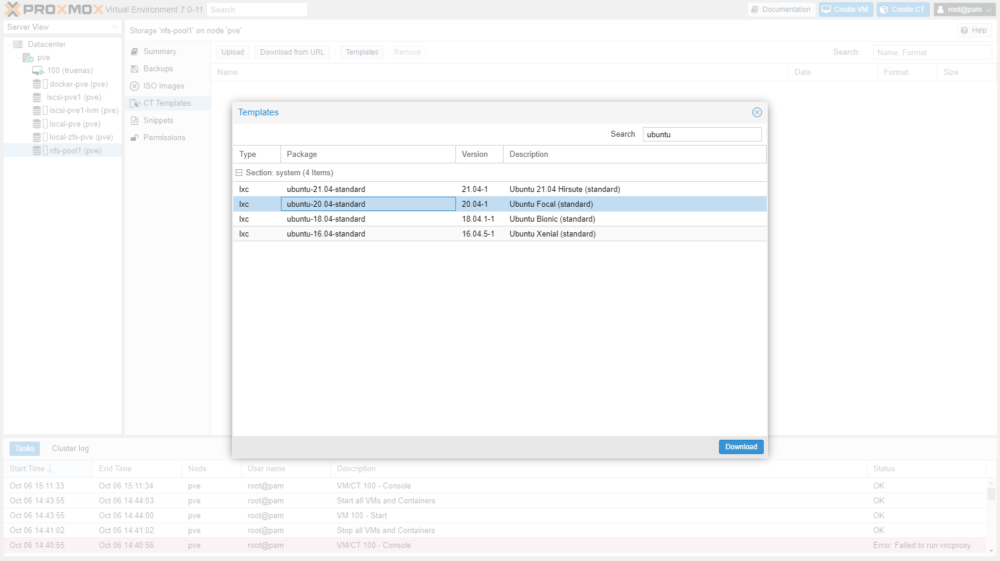
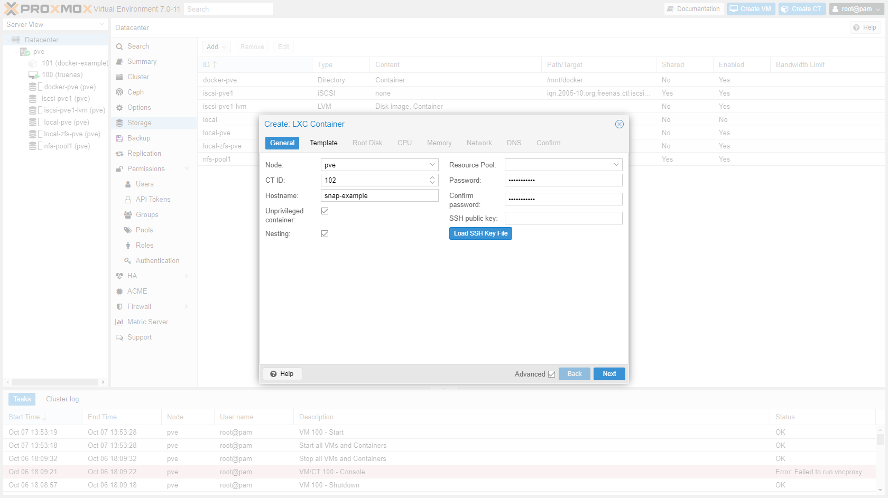
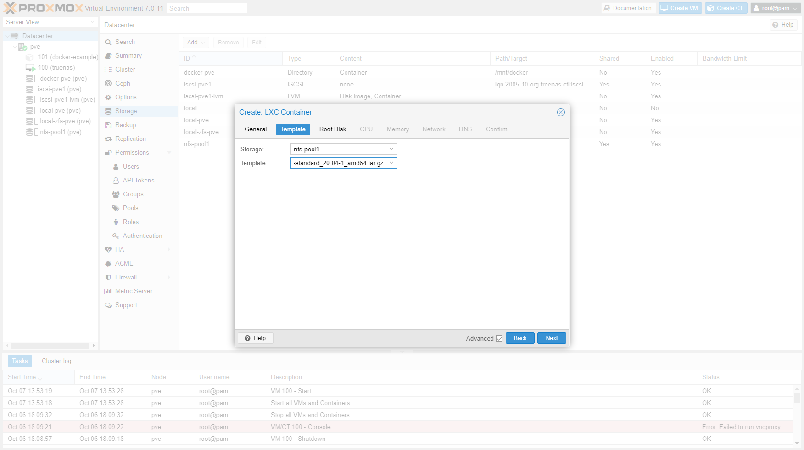
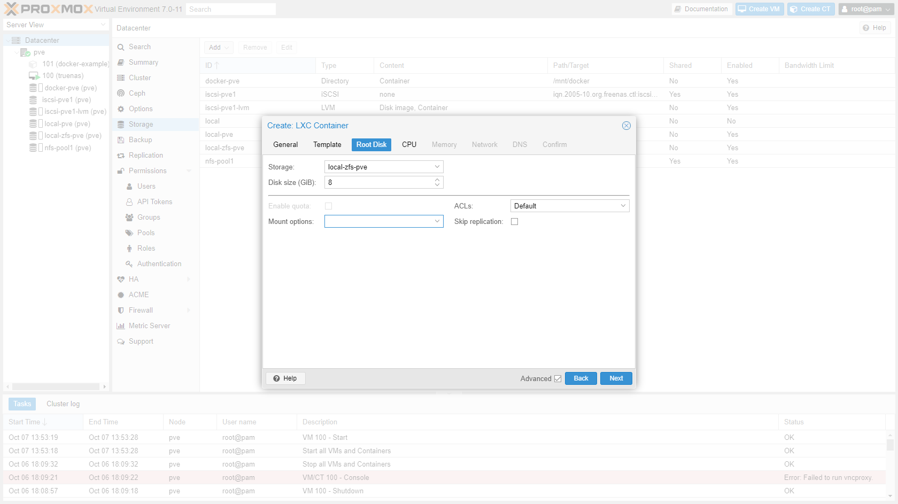
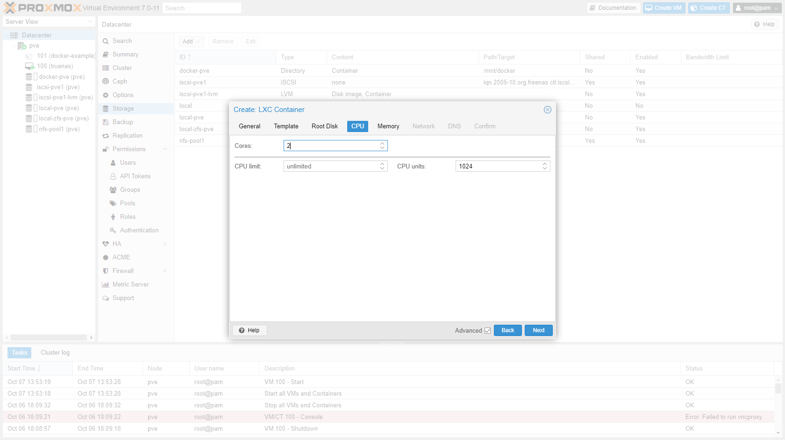
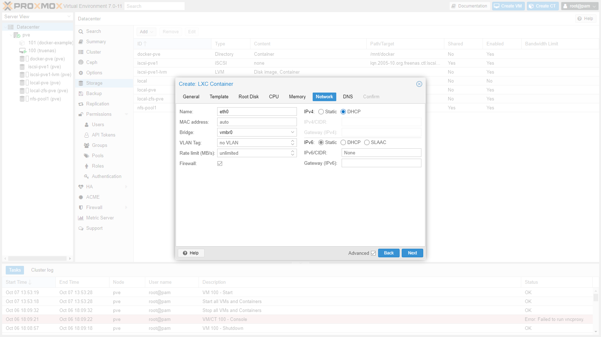
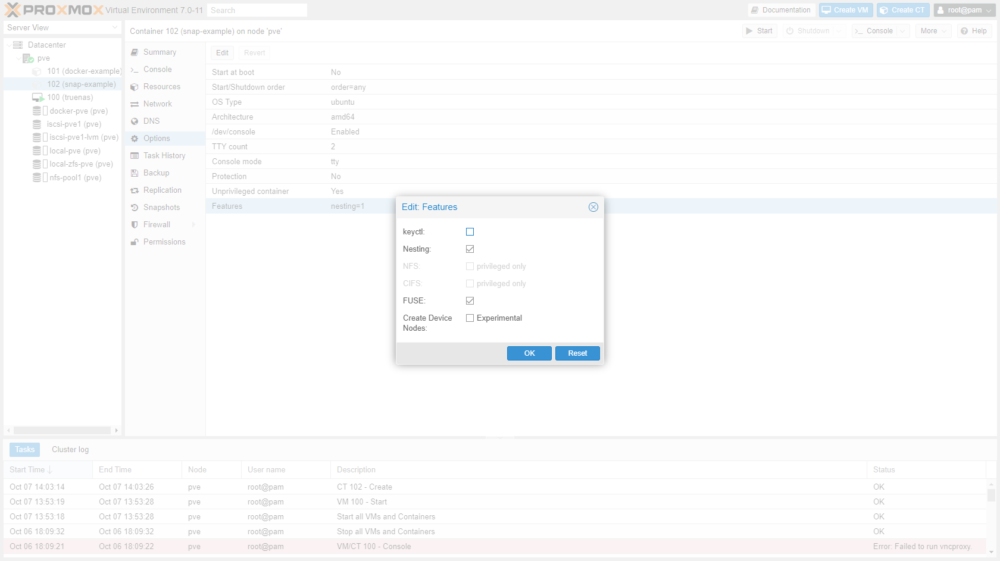
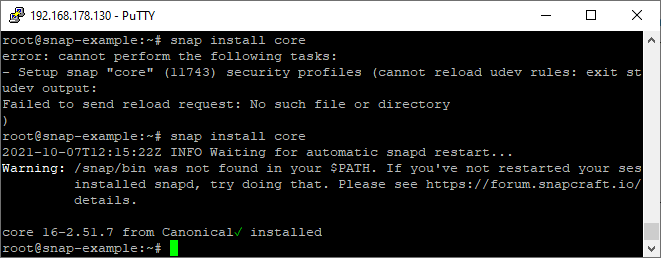

## Introduction

What [started as a project](https://blog.joeplaa.com/building-a-proxmox-cluster/) to run "some crypto applications" grew into something much bigger, but also more useful. I learned a tremendous amount about virtual machines, lxc containers and Proxmox. And although I'm just scratching the surface and I don't actually understand it, I know how to do some things. I'll write them down here, partly for myself, but also for you in hopes it will save one of us a lot of time and frustration.

## Snap in LXC

I wanted to run Nginx in an LXC container. However at first I couldn't install the `certbot` snap, so I couldn't create and update my SSL certificates. You have to enable "FUSE" in LXC options to make this work.

### Create an LXC container

1. Go to "nfs-pool1" -> "CT Templates" and click "Templates". Download Ubuntu 20.

    

2. Click "Create CT":
    * Hostname: `snap-example`
    * Check "Unprivileged container" and "Nesting"
    * Add a password

    

3. Select a container template:
    * Storage: `nfs-pool1`
    * Template: `ubuntu-20.04-standard_20.04-1_amd64.tar.gz`

    

4. Select storage:
    * Storage: `local-zfs-pve`
    * Disk size (GiB): `8`

    

5. Enter amount of cores:
    * Cores: `2`

    

6. Enter amount of memory:
    * Memory (MiB): `1024`

    

7. Configure network

    

8. Confirm next two screens.

9. Click on the container and go to "Options". Select "Features" and click "Edit". Enable "FUSE".

    

### Install snap

1. Start the container and open a shellsession.
    * You can open a shellsession directly to the IP or hostname of the container.
    * Or you can open a shellsession to the host and enter the container `pct enter <id>`

2. Add snap apt package.

    ```shellsession
    apt update
    apt upgrade
    apt install snapd
    ```

3. Install snap core.

    ```shellsession
    snap install core
    ```

    If this command fails, just try again. It worked the second time for me.

    

4. Install the snap you want.

<Alert type='info'>
    <h3 class='mt-1'>Sources:</h3>

* <https://forum.proxmox.com/threads/ubuntu-snaps-inside-lxc-container-on-proxmox.36463/>
* <https://snapcraft.io/docs/installing-snap-on-debian>

</Alert>