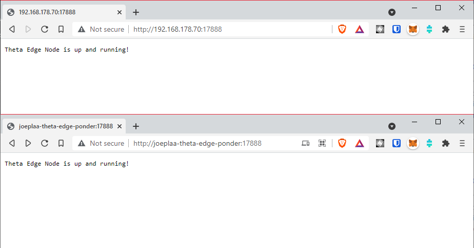
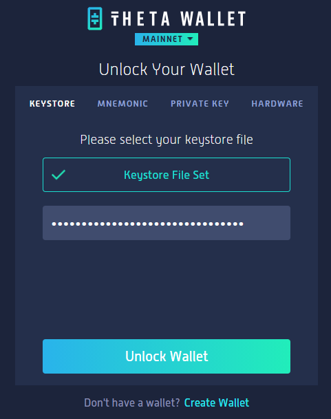
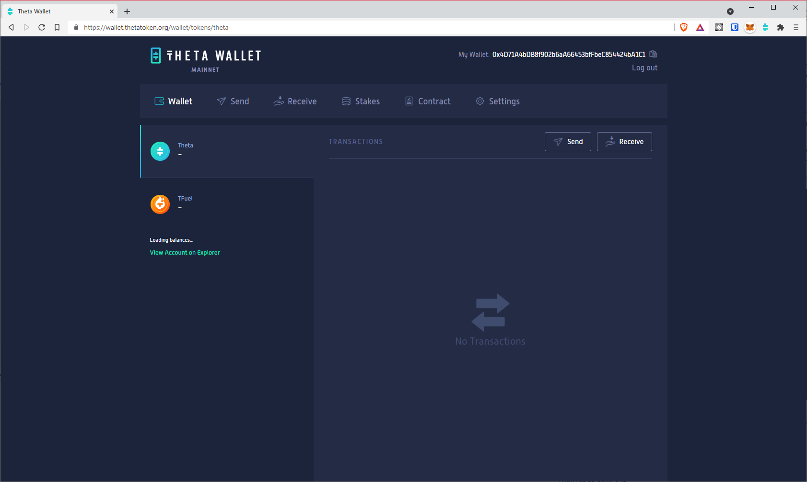

## Introduction

What [started as a project](https://blog.joeplaa.com/building-a-proxmox-cluster/) to run "some crypto applications" grew into something much bigger, but also more useful. I learned a tremendous amount about virtual machines, lxc containers and Proxmox. And although I'm just scratching the surface and I don't actually understand it, I know how to do some things. I'll write them down here, partly for myself, but also for you in hopes it will save one of us a lot of time and frustration.

## Theta Edge Node

"[Theta Network](https://www.thetatoken.org/) is the leading video delivery network powered by blockchain technology." You can read more about in [their docs](https://docs.thetatoken.org/docs/what-is-theta-network).

The easiest way to support the network, and earning tokens, is by installing the [Edge Node software](https://docs.thetatoken.org/docs/setup-theta-edge-node) on you Windows or Mac computer. It will run in the background and you won't even notice it. To increase your earnings, you will have to leave your computer on at night too. As I have a server that is running 24/7 anyway, I wanted to run this node on a VM on Linux. On June 24, 2021 they released a Docker image that promises to do just that.

## Running Edge Node in Docker

The documentation on how to run this container is very minimal. It's mostly trial and error to get it to run, so here is how I did it.

1. Create a VM or [LXC container with Docker](/how-to-run-docker-in-lxc-on-zfs-on-proxmox), or just install Docker directly.

2. Create a `docker-compose.yml` file:

    ```yml
    # docker-compose.yml
    version: "3"
    services:
        theta-edge-node:
            container_name: theta-edge-node
            image: thetalabsorg/edgelauncher_mainnet:v1.0.0
            restart: unless-stopped
            environment:
            EDGELAUNCHER_CONFIG_PATH: /edgelauncher/data/mainnet
            PASSWORD: ${PASSWORD}
            ports:
                - '15888:15888'
                - '17888:17888'
            volumes: 
                - ~/.edgelauncher:/edgelauncher/data/mainnet
    ```

3. Create a `.env` file:

    ```ini
    # .env
    PASSWORD=strong password here
    ```

4. Run `docker-compose up -d`.

5. Check that the node is running. In a browser open `http://<ip of vm>:17888/` or `http://<hostname of vm>:17888/`

    

5. Browse to the generated keystore and copy it to a safe location (I opened it and copied the JSON content):

    ```shellsession
    cd ~/.edgelauncher/edgecore/key/encrypted
    nano <keyname-which-is-your-wallet-address>
    ````

6. Install the [Theta wallet](https://docs.thetatoken.org/docs/theta-web-wallet) as an extension in Chrome, download the app or open it in your browser. Now you can unlock your wallet by using the keystore you just copied and the password entered in step 3.

    
    

## Earnings

I have been running this node for a few months now and so far have earned nothing. Which is obvious now, because I also haven't staked any TFUEL. The Windows node, however, earns automatically as it also does compute tasks, which are rewarded with TFUEL. You live and you learn...


:::note Sources
* <https://docs.thetatoken.org/docs/what-is-theta-network>
* <https://docs.thetatoken.org/docs/setup-theta-edge-node>
* <https://docs.thetatoken.org/docs/theta-edge-node-run-with-docker>
* <https://www.reddit.com/r/theta_network/comments/oamtiu/edge_node_linux_docker_only/>
:::